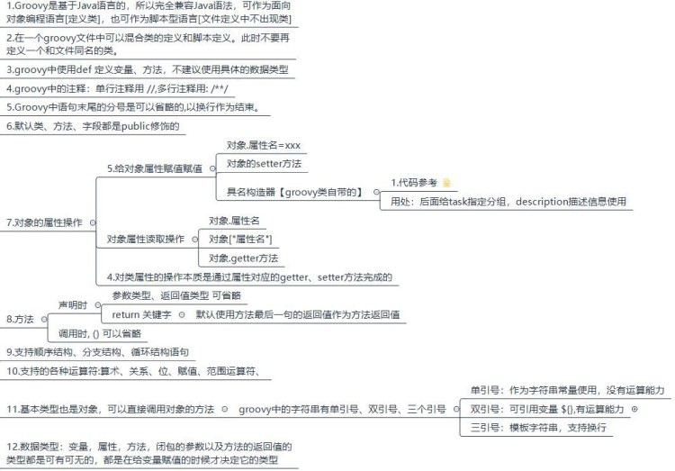
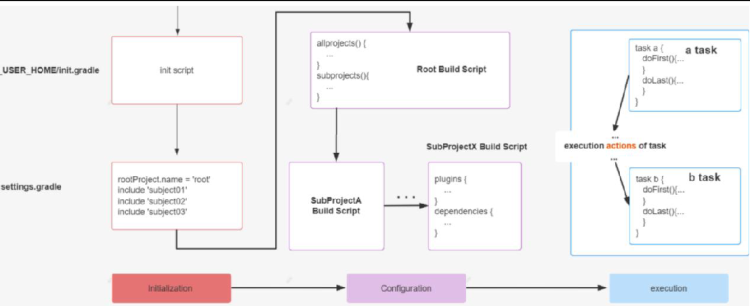
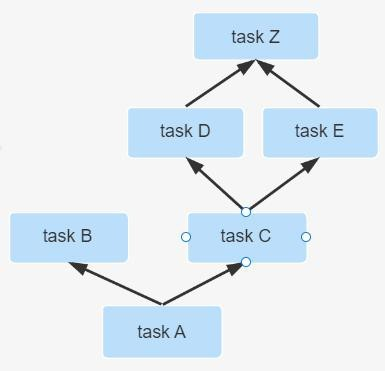

# Groovy


## 1、Groovy 简介

在某种程度上，Groovy 可以被视为Java 的一种脚本化改良版，Groovy 也是运行在 JVM 上，它可以很好地与 Java 代码及其相关库进行交互操作。它是一种成熟的面向对象编程语言，既可以面向对象编程，又可以用作纯粹的脚本语言。大多数有效的 Java 代码也可以转换为有效的 Groovy 代码，Groovy 和 Java 语言的主要区别是：完成同样的任务所需的Groovy 代码比 Java 代码更少。其特点为：

- 功能强大，例如提供了动态类型转换、**闭包**和元编程（metaprogramming）支持
- 支持函数式编程，不需要main 函数
- 默认导入常用的包
- 类不支持 default 作用域，且默认作用域为public。
- Groovy 中基本类型也是对象，可以直接调用对象的方法。
- 支持DSL（Domain Specific Languages 领域特定语言）和其它简洁的语法，让代码变得易于阅读和维护。
- Groovy 是基于Java 语言的，所以完全兼容Java 语法，所以对于java 程序员学习成本较低。详细了解请参考：http://www.groovy-lang.org/documentation.html


## 2、Groovy 安装

下载地址: https://groovy.apache.org/download.html

配置 bin 环境


## 3、Groovy 基本语法




> 类型转换:当需要时，类型之间会自动发生类型转换: 字符串（String）、基本类型(如int) 和类型的包装类 (如Integer)
>
> 类说明：如果在一个groovy 文件中没有任何类定义，它将被当做 script 来处理，也就意味着这个文件将被透明的转换为一个 Script 类型的类，这个自动转换得到的类将使用原始的 groovy 文件名作为类的名字。groovy 文件的内容被打包进run 方法，另外在新产生的类中被加入一个main 方法以进行外部执行该脚本。

```Groovy
def num1=1; 
def num2=2;
def str1="1d"; //双引号
def str2='dsd'; //单引号
//双引号运算能力，单引号用于常量字符串，三引号相当于模板字符串，可以支持换行
println "$num1 + $num2 = ${num1 + num2}"
//基本数据类型也可以作为对象使用，可以调用对象的方法
println(num1.getClass().toString()) 
println(str1.getClass().toString()) 
println(str2.getClass().toString())
```

**类型及权限修饰符**

1. boolean	  Boolean
   char		Character
   short	       Short
   int		   lnteger
   long		Long
   float		Float
   double	    Double
2. 类、内部类、抽象类、接口
3. 注解
4. Trait：可以看成是带有方法实现的接口

**权限修饰符**: public、protected、private

> 拓展：Groovy 类与 Java 类之间的主要区别是:
>
> 1. 没有可见性修饰符的类或方法自动是公共的(可以使用一个特殊的注释来实现包的私有可见性)。
> 2. 没有可见性修饰符的字段将自动转换为属性，不需要显式的 getter 和 setter 方法。
> 3. 如果属性声明为 final，则不会生成 setter。
> 4. 一个源文件可能包含一个或多个类(但是如果一个文件不包含类定义的代码，则将其视为脚本)。脚本只是具有一些特殊约定的类，它们的名称与源文件相同(所以不要在脚本中包含与脚本源文件名相同的类定义)。
>
> **提 示 :** 有 关 Groovy 中 各 种 各 样 的 数 据 类 型 和 权 限 修 饰 符 及 Goovy 与 Java 区 别 请 参 考 ：
>
> [http://www.groovy-lang.org/objectorientation.html#_modifiers_on_a_property](http://www.groovy-lang.org/objectorientation.html)

## 4、集合操作

Groovy 支持List、Map 集合操作，并且拓展了 Java 中的API，具体参考如下方法：

`List`:

- `add()`:添加某个元素plus():添加某个list 集合
- `remove():`删除指定下标的元素removeElement():删除某个指定的元素removeAll(): 移除某个集合中的元素
- `pop()`:弹出list 集合中最后一个元素putAt():修改指定下标的元素
- `each()`:遍历
- `size()`: 获取list 列表中元素的个数
- `contains()`: 判断列表中是否包含指定的值，则返回 true 

`Map`:

- `put()`:向map 中添加元素
- `remove()`:根据某个键做移除，或者移除某个键值对
- `+、-`：支持 map 集合的加减操作
- `each()`:遍历map 集合

请参考官网:[http://www.groovy-lang.org/syntax.html#_number_type_suffixes](http://www.groovy-lang.org/syntax.html)

**提示**:可以把不同的基本类型添加到同一集合中。

**Groovy 遵循 Java 允许 import 语句解析类引用的概念。**

```groovy
import groovy.xml.MarkupBuilder 
def xml = new MarkupBuilder() 
assert xml != null

import java.lang.* 
import java.util.* 
import java.io.* 
import java.net.* 
import groovy.lang.* 
import groovy.util.*
import java.math.BigInteger
import java.math.BigDecimal
```

这样做是因为这些包中的类最常用。通过导入这些样板代码减少了。

参考官网地址：http://www.groovy-lang.org/structure.html#_imports

Groovy 中的异常处理和 java 中的异常处理是一样的。

```groovy
def z 
try {
    def i = 7， j = 0 
    try {
        def k = i / j 
        assert false
    } finally {
        z = 'reached here'
    }
} catch ( e ) {
    assert e in ArithmeticException 
    assert z == 'reached here'
}
```


## 5、闭包

闭包：Groovy 中的闭包是一个开放的、匿名的代码块，它可以接受参数、也可以有返回值。闭包可以引用其周围作用域中声明的变量。

语法：`{ [closureParameters -> ] statements }`

其中`[ closureParameters-> ]`是一个可选的逗号分隔的参数列表，参数后面是  Groovy 语句。参数类似于方法参数列表， 这些参数可以是类型化的，也可以是非类型化的。当指定参数列表时，需要使用`->` 字符，用于将参数与闭包体分离。

参考：http://www.groovy-lang.org/closures.html

```groovy
//闭包体完成变量自增操作
{ item++ }
//闭包使用 空参数列表 明确规定这是无参的
{ -> item++ }
//闭包中有一个默认的参数[it]，写不写无所谓
{ println it }
{ it -> println it }
//如果不想使用默认的闭包参数it，那需要显示自定义参数的名称
{ name -> println name }
//闭包也可以接受多个参数
{ String x， int y ->
    println "hey ${x} the value is ${y}"
}
//闭包参数也可是一个对象
{ reader ->
    def line = reader.readLine() 
    line.trim()
}

// 闭包是 groovy.lang.Closure 的实例。它可以像任何其他变量一样分配给一个变量或字段。
def isOdd = { int i -> i%2 != 0 } 
assert isOdd(3) == true
assert isOdd.call(2) == false

def isEven = { it%2 == 0 } 
assert isEven(3) == false 
assert isEven.call(2) == true

//无参闭包
def run(Closure closure){ 
    println("run start...")
    closure() println("run end...")
}

run {
    println "running......"
}

//有参闭包
def caculate(Closure closure){
    def num1=1;
    def num2=3; 
    println("caculate start...")
    closure(num1，num2) 
    println("caculate end...")
}
caculate {x，y -> println "计算结果为：$x+$y=${x+y}"} //在build.gradle文件中我们见到的很多都是闭包格式的。
```


## 6、Gretty 部署

Gretty 是一个功能丰富的 gradle 插件，用于在嵌入的 servlet 容器上运行 web 应用程序让项目开发和部署更加简单。目前Gretty 插件已经作为 gradle 的核心库使用了，Gretty 其核心功能为：

1. 底层支持 jetty，tomcat 等Servlet 容器
2. 支持项目热部署、HTTPS、调试

Gretty 官网地址：http://akhikhl.github.io/gretty-doc/index.html

```groovy
// 引入 Gretty 插件
plugins {
    id 'war'
    id 'org.gretty' version '2.2.0'
}
// 指定 maven 仓库
repositories {
    //指定jcenter仓库，一定要放在前面
    jcenter() 
    mavenCentral()
}
// 针对 Gretty 插件的设置
gretty {
    httpPort = 8888
    contextPath = "/web"
    debugPort = 5005	// default 
    debugSuspend = true // default 
    httpsEnabled = true
    managedClassReload=true // 修改了类之后重新加载
    //servletContainer = 'tomcat8' //如果不指定默认的servlet容器，支持tomcat7/8，默认是使用的是Jetty服务器
    httpsPort = 4431
}
// 执行Gretty 插件
gradle appRun
// http://akhikhl.github.io/gretty-doc/Gretty-configuration.html
```

### Junit

```groovy
dependencies {
    testImplementation 'org.junit.jupiter:junit-jupiter-api:5.8.1' 
    testRuntimeOnly 'org.junit.jupiter:junit-jupiter-engine:5.8.1'
}
test {
    useJUnitPlatform()
}

// 包含和排除特定测试
test {
    enabled true 
    useJUnit() 
    include 'com/**'
    exclude 'com/abc/**'
}
```

只需在 build.gradle 目录下执行gradle test 指令，gradle 就会帮我们执行所有的加了@Test 注解的测试，并生成测试报告


## 7、项目的生命周期

Gradle 项目的生命周期分为三大阶段: Initialization -> Configuration -> Execution. 每个阶段都有自己的职责，具体如下图所示:



- **Initialization 阶段**主要目的是初始化构建， 它又分为两个子过程，一个是执行 Init Script，另一个是执行 Setting Script。
- init.gradle 文件会在每个项目 build 之前被调用，用于做一些初始化的操作，它主要有如下作用：

- 配置内部的仓库信息（如公司的 maven  仓库信息）； 
- 配置一些全局属性；
- 配置用户名及密码信息（如公司仓库的用户名和密码信息）。

- Setting Script 则更重要， 它初始化了一次构建所参与的所有模块。

- **Configuration 阶段**：这个阶段开始加载项目中所有模块的 Build Script。所谓 "加载" 就是执行 build.gradle 中的语句， 根据脚本代码创建对应的 task， 最终根据所有 task 生成由 **Task 组成的有向无环图**(Directed Acyclic Graphs)，如下:

  从而构成如下**有向无环树**：

- **Execution 阶段**：这个阶段会根据上个阶段构建好的有向无环图，按着顺序执行 Task【Action 动作】


### settings 文件

首先对 settings 文件的几点说明：

1、作用：主要是在项目初始化阶段确定一下引入哪些工程需要加入到项目构建中，为构建项目工程树做准备。

2、工程树：gradle 中有工程树的概念，类似于 maven 中的project 与module。

3、内容：里面主要定义了当前 gradle 项目及子 project 的项目名称

4、位置：必须放在根工程目录下。

5、名字：为`settings.gradle` 文件，不能发生变化

6、对应实例：与 org.gradle.api.initialization.Settings 实例是一一对应的关系。每个项目只有一个settings 文件。

7、关注：作为开发者我们只需要关注该文件中的include 方法即可。使用相对路径【 :  】引入子工程。

8、一个子工程只有在setting 文件中配置了才会被 gradle 识别，这样在构建的时候才会被包含进去。案例如下所示：

```groovy
//根工程项目名
rootProject.name = 'root'
//包含的子工程名称
include 'subject01' 
include 'subject02' 
include 'subject03'
//包含的子工程下的子工程名称
include 'subject01:subproject011' 
include 'subject01:subproject012'
```

项目名称中 **":" 代表项目的分隔符**， 类似路径中的 "/". 如果**以 ":" 开头则表示相对于 root project** 。然后 Gradle 会为每个带有 build.gradle 脚本文件的工程构建一个与之对应的 Project 对象。

### Task

项目实质上是 Task 对象的集合。一个 Task 表示一个逻辑上较为独立的执行过程，比如编译Java 源代码，拷贝文件， 打包Jar 文件，甚至可以是执行一个系统命令。另外，一个 Task 可以读取和设置Project 的Property 以完成特定的操作。

可参考官方文档：[https://docs.gradle.org/current/userguide/tutorial_using_tasks.html ](https://docs.gradle.org/current/userguide/tutorial_using_tasks.html)

```groovy
task A {
    println "root taskA" 
    doFirst(){
        println "root taskA doFirst"
    }
    doLast(){
        println "root taskA doLast"
    }
}
```

在文件所在的目录执行命令: gradle A

**提示 1** :task 的配置段是在配置阶段完成

**提示 2** :task 的doFirst、doLast 方法是执行阶段完成，并且doFirst 在doLast 执行之前执行。

**提示 3:**区分任务的配置段和任务的行为，任务的配置段在配置阶段执行，任务的行为在执行阶段执行

**任务的行为**

案例如下：doFirst、doLast 两个方法可以在任务内部定义，也可以在任务外部定义

```groovy
def map=new HashMap<String，Object>();
//action属性可以设置为闭包，设置task自身的行为
map.put("action"，{println "taskD.."})
task(map，"a"){
    description   'taskA description	'
    group "atguigu"
    //在task内部定义doFirst、doLast行为
    doFirst {
        def name = 'doFirst..' 
        println name
    }
    doLast {
        def name = 'doLast..' 
        println name
    }
}
//在task外部定义doFirst、doLast行为
a.doFirst {
    println it.description
}
a.doLast {
    println it.group
}
```

> **底层原理分析**：无论是定义任务自身的 action，还是添加的doLast、doFirst 方法，其实底层都被放入到一个Action 的List 中了，最初这个 action List 是空的，当我们设置了 action【任务自身的行为】，它先将action 添加到列表中，此时列表中只有一个action，后续执行doFirst 的时候doFirst 在action 前面添加，执行 doLast 的时候doLast 在action 后面添加。doFirst 永远添加在actions List 的第一位，保证添加的Action 在现有的 action List 元素的最前面；doLast 永远都是在action List 末尾添加，保证其添加的Action 在现有的action List 元素的最后面。一个往前面添加，一个往后面添加，最后这个action List 就按顺序形成了doFirst、doSelf、doLast 三部分的 Actions，就达到 doFirst、doSelf、doLast 三部分的 Actions 顺序执行的目的。

**任务的依赖方式**

Task 之间的依赖关系可以在以下几部分设置：

1. 参数依赖

   ```groovy
   task A {
       doLast {
           println "TaskA.."
       }
   }
   task 'B' {
       doLast {
           println "TaskB.."
       }
   }
   //参数方式依赖: dependsOn后面用冒号
   task 'C'(dependsOn: ['A'， 'B']) {
       doLast {
           println "TaskC.."
       }
   }}
   ```

2. 内部依赖

   ```groovy
   //参数方式依赖
   task 'C' {
       //内部依赖：dependsOn后面用 = 号
       dependsOn= [A，B] 
       doLast {
           println "TaskC.."
       }
   }
   ```

   

3. 外部依赖

   ```groovy
   // 在 subproject01 工程的 build.gradle 文件中定义
   task A {
       doLast {
           println "TaskA.."
       }
   }
   // 在 subproject02 工程的 build.gradle 文件中定义
   task B{
       dependsOn(":subproject01:A") //依赖根工程下的subject01中的任务A ：跨项目依赖。
       doLast {
           println "TaskB.."
       }
   }
   ```

   当一个 Task 依赖多个Task 的时候，被依赖的Task 之间如果没有依赖关系，那么它们的执行顺序是随机的，并无影响。