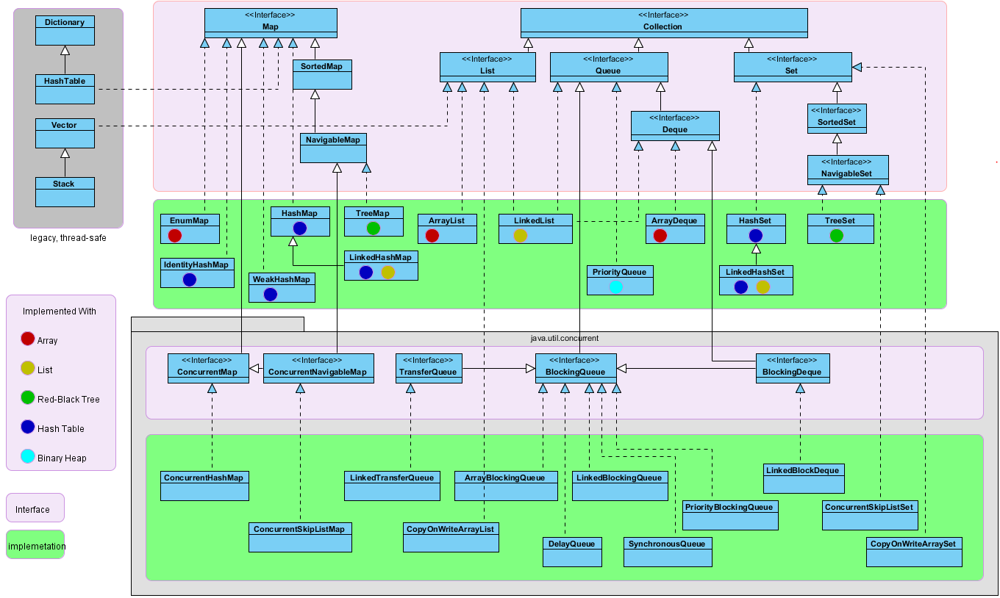
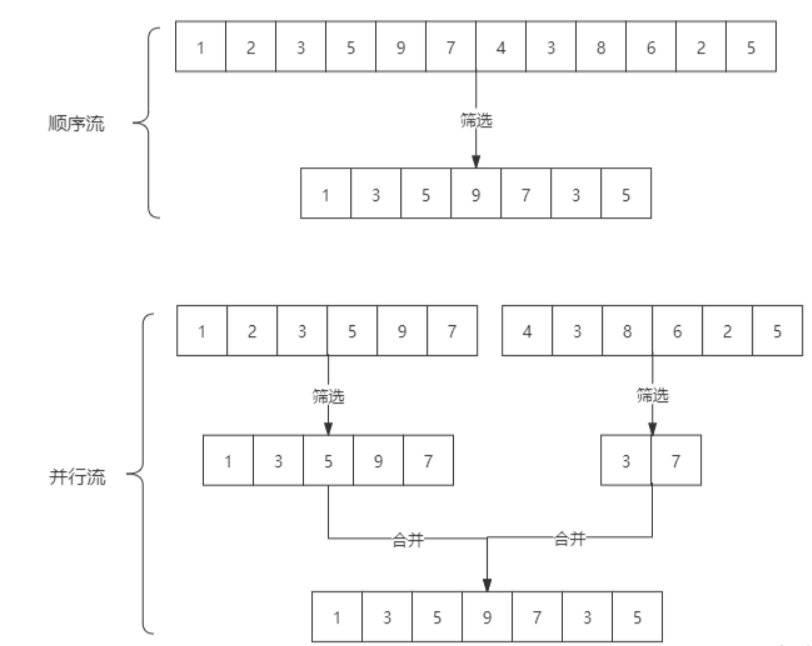

# Collections


> ### **底层以数组的形式实现**
>
> - **`ArrayList`**
> - **`ArrayDeque`**（双端队列，循环数组）
> - **`EnumMap`**（根据枚举序数索引的数组）
> - **`Vector`**（线程安全版 ArrayList，已不推荐使用）
> - **`Stack`**（继承 Vector，已不推荐使用）
> - **`CopyOnWriteArrayList`**（写时复制数组，并发安全）
> - **`ArrayBlockingQueue`**（固定容量阻塞队列，数组实现）
>
> ------
>
> ### **底层以链表的形式实现**
>
> - **`LinkedList`**（双向链表）
> - **`LinkedHashMap`**（哈希表 + 双向链表维护插入/访问顺序）
> - **`LinkedHashSet`**（基于 LinkedHashMap 实现）
> - **`ConcurrentLinkedQueue`**（无锁并发队列，CAS + 链表）
> - **`LinkedBlockingQueue`**（可选容量的阻塞队列，链表实现）
>
> ------
>
> ### **底层以哈希表（散列表）的形式实现**
>
> - **`HashMap`**（数组 + 链表/红黑树，Java 8+ 优化冲突）
> - **`HashSet`**（基于 HashMap 实现）
> - **`Hashtable`**（线程安全版哈希表，已不推荐使用）
> - **`WeakHashMap`**（弱引用键的哈希表）
> - **`IdentityHashMap`**（使用 `==` 比较键的哈希表）
> - **`ConcurrentHashMap`**（分段锁或 CAS 实现的并发哈希表）
> - **`LinkedHashMap`**/**`LinkedHashSet`**（结合哈希表和链表）
>
> ------
>
> ### **底层以红黑树（平衡二叉搜索树）的形式实现**
>
> - **`TreeMap`**
> - **`TreeSet`**（基于 TreeMap 实现）
> - **`ConcurrentSkipListMap`**（跳表实现，类似树结构，并发安全）
> - **`ConcurrentSkipListSet`**（基于 ConcurrentSkipListMap 实现）
>
> ------
>
> ### **底层以二叉堆的形式实现**
>
> - **`PriorityQueue`**（小顶堆）
> - **`DelayQueue`**（基于 PriorityQueue 实现的阻塞队列）
>
> ------
>
> ### **其他特殊实现**
>
> - **`EnumSet`**（位向量或数组实现，依赖枚举类型）
> - **`CopyOnWriteArraySet`**（基于 CopyOnWriteArrayList 实现）
> - **`BitSet`**（位向量实现，严格来说不属于集合框架，但类似集合操作）





## CopyOnWriteXXX

​	CopyOnWrite，也被称为写时复制（Copy-On-Write，简称COW），是程序设计领域中的一种优化策略。这种策略的核心思想是，当多个调用者（或线程）同时访问同一份资源时，会共同获取一个指向该资源的指针。只要没有调用者尝试修改这份资源，所有的调用者都可以继续访问同一个资源。但是，一旦有调用者尝试修改资源，系统就会复制一份该资源的副本给这个调用者，而其他调用者所见到的仍然是原来的资源。这个过程对其他的调用者都是透明的，他们并不知道资源已经被复制。

​	在Java中，`CopyOnWriteArrayList` 和 `CopyOnWriteArraySet` 就是使用了这种策略的两个类。这两个类都位于java.util.concurrent包下，是线程安全的集合类。当需要修改集合中的元素时，它们不会直接在原集合上进行修改，而是复制一份新的集合，然后在新的集合上进行修改。修改完成后，再将指向原集合的引用指向新的集合。这种设计使得读操作可以在不加锁的情况下进行，从而提高了并发性能。

​	`CopyOnWriteArrayList` 在遍历时不会对列表进行任何修改，因此它不会抛出ConcurrentModificationException的异常。它在修改操作（如add、set等）时，会**复制一份底层数组**，然后在新的数组上进行修改，修改完成后再将指向底层数组的引用切换到新的数组。这种设计使得读操作可以在不加锁的情况下进行，从而提高了并发性能，这个特性使得它在多线程环境下进行遍历操作时更为安全。

​	CopyOnWriteArrayList 并没有“扩容”的概念。每次写操作（如add或remove）都需要复制一个全新的数组，这在写操作较为频繁时可能会导致性能问题，因为复制整个数组的操作是相当耗时的。因此，在使用CopyOnWriteArrayList时，需要特别注意其适用场景，一般来说，它更适合于**读多写少**的场景。


# Stream

​	`Stream`将要处理的元素集合看作一种流，在流的过程中，借助`Stream API`对流中的元素进行操作，比如：筛选、排序、聚合等。

​	Stream可以由数组或集合创建，对流的操作分为两种：

​	中间操作，每次返回一个新的流，可以有多个。（筛选filter、映射map、排序sorted、去重组合skip—limit）
终端操作，每个流只能进行一次终端操作，终端操作结束后流无法再次使用。终端操作会产生一个新的集合或值。（遍历foreach、匹配find–match、规约reduce、聚合max–min–count、收集collect）

特性：

1. stream 不存储数据，而是按照特定的规则对数据进行计算，一般会输出结果。
2. stream 不会改变数据源，通常情况下会产生一个新的集合或一个值。
3. stream 具有延迟执行特性，只有调用终端操作时，中间操作才会执行。


### Stream 创建

1. 通过 `java.util.Collection.stream()` 方法用集合创建流

```java
List<String> list = Arrays.asList("a", "b", "c");
// 创建一个顺序流
Stream<String> stream = list.stream();
// 创建一个并行流
Stream<String> parallelStream = list.parallelStream();
```

2. 使用`java.util.Arrays.stream(T[] array)`方法用数组创建流

```java
int[] array={1,3,5,6,8};
IntStream stream = Arrays.stream(array);
```

3. Stream 静态方法：`of()、iterate()、generate()`

```java
Stream<Integer> stream = Stream.of(1, 2, 3, 4, 5, 6);

Stream<Integer> stream2 = Stream.iterate(0, (x) -> x + 3).limit(4);
stream2.forEach(System.out::println);

Stream<Double> stream3 = Stream.generate(Math::random).limit(3);
stream3.forEach(System.out::println);
```

**stream 和 parallelStream 的简单区分：** `stream`是顺序流，由主线程按顺序对流执行操作，而`parallelStream`是并行流，内部以多线程并行执行的方式对流进行操作，但前提是流中的数据处理没有顺序要求。例如筛选集合中的奇数，两者的处理不同之处：



```java
// 通过parallel() 把顺序流转换成并行流
Optional<Integer> findFirst = list.stream().parallel().filter(x->x>6).findFirst();
List<Integer> list = Arrays.asList(1, 3, 6, 8, 12, 4);
       Optional<Integer> findFirst = list.stream().parallel().filter(x->x>6).findFirst();
       System.out.println("使用Stream的静态方法generate：" + findFirst.get());
```

### Stream 使用

1. #### 遍历/匹配 `（foreach、find、match）`

`Stream`也是支持类似集合的遍历和匹配元素的，只是`Stream`中的元素是以`Optional`类型存在的。

```java
// import已省略，请自行添加，后面代码亦是

public class StreamTest {
	public static void main(String[] args) {
       List<Integer> list = Arrays.asList(7, 6, 9, 3, 8, 2, 1);

       // 遍历输出符合条件的元素
       list.stream().filter(x -> x > 6).forEach(System.out::println);
       // 匹配第一个
       Optional<Integer> findFirst = list.stream().filter(x -> x > 6).findFirst();
       // 匹配任意（适用于并行流）
       Optional<Integer> findAny = list.parallelStream().filter(x -> x > 6).findAny();
       // 是否包含符合特定条件的元素
       boolean anyMatch = list.stream().anyMatch(x -> x > 6);
       System.out.println("匹配第一个值：" + findFirst.get());
       System.out.println("匹配任意一个值：" + findAny.get());
       System.out.println("是否存在大于6的值：" + anyMatch);
   }
}
```

2. #### 筛选`（filter）`

   按照一定的规则校验流中的元素，将符合条件的元素提取到新的流中的操作。

```java
Stream<T> filter(Predicate<? super T> predicate);

public class StreamTest {
	public static void main(String[] args) {
		List<Integer> list = Arrays.asList(6, 7, 3, 8, 1, 2, 9);
		Stream<Integer> stream = list.stream();
		stream.filter(x -> x > 7).forEach(System.out::println);
	}
}

List<String> fiterList = personList.stream().filter(x -> x.getSalary() > 8000).map(Person::getName)
    .collect(Collectors.toList());
System.out.print("高于8000的员工姓名：" + fiterList);
```

3. #### 聚合`（max、min、count）`

```java
// 获取String集合中最长的元素
List<String> list = Arrays.asList("adnm", "admmt", "pot", "xbangd", "weoujgsd");
Optional<String> max = list.stream().max(Comparator.comparing(String::length));
System.out.println("最长的字符串：" + max.get());

// 获取Integer集合中的最大值
List<Integer> list = Arrays.asList(7, 6, 9, 4, 11, 6);
// 自然排序
Optional<Integer> max = list.stream().max(Integer::compareTo);
// 自定义排序
Optional<Integer> max2 = list.stream().max(new Comparator<Integer>() {
  @Override
  public int compare(Integer o1, Integer o2) {
    return o1.compareTo(o2);
  }
});
System.out.println("自然排序的最大值：" + max.get());
System.out.println("自定义排序的最大值：" + max2.get());

// 获取员工工资最高的人
List<Person> personList = new ArrayList<Person>();
personList.add(new Person("Tom", 8900, 23, "male", "New York"));
personList.add(new Person("Jack", 7000, 25, "male", "Washington"));
personList.add(new Person("Lily", 7800, 21, "female", "Washington"));
personList.add(new Person("Anni", 8200, 24, "female", "New York"));
personList.add(new Person("Owen", 9500, 25, "male", "New York"));
personList.add(new Person("Alisa", 7900, 26, "female", "New York"));
Optional<Person> max = personList.stream().max(Comparator.comparingInt(Person::getSalary));
System.out.println("员工工资最大值：" + max.get().getSalary());
```

4. #### 映射`（map、flatMap）`

将一个流的元素按照一定的映射规则映射到另一个流中。分为`map`和`flatMap`：

- `map`：接收一个函数作为参数，该函数会被应用到每个元素上，并将其映射成一个新的元素。
- `flatMap`：接收一个函数作为参数，将流中的每个值都换成另一个流，然后把所有流连接成一个流。

```java
<R> Stream<R> map(Function<? super T, ? extends R> mapper);
<R> Stream<R> flatMap(Function<? super T, ? extends Stream<? extends R>> mapper);

// 英文字符串数组的元素全部改为大写。整数数组每个元素 +3
String[] strArr = { "abcd", "bcdd", "defde", "fTr" };
List<String> strList = Arrays.stream(strArr).map(String::toUpperCase).collect(Collectors.toList());
List<Integer> intList = Arrays.asList(1, 3, 5, 7, 9, 11);
List<Integer> intListNew = intList.stream().map(x -> x + 3).collect(Collectors.toList());
System.out.println("每个元素大写：" + strList);
System.out.println("每个元素+3：" + intListNew);

// 将员工的薪资全部增加 1000
List<Person> personList = new ArrayList<Person>();
personList.add(new Person("Tom", 8900, 23, "male", "New York"));
personList.add(new Person("Jack", 7000, 25, "male", "Washington"));
personList.add(new Person("Lily", 7800, 21, "female", "Washington"));
personList.add(new Person("Anni", 8200, 24, "female", "New York"));
personList.add(new Person("Owen", 9500, 25, "male", "New York"));
personList.add(new Person("Alisa", 7900, 26, "female", "New York"));

// 不改变原来员工集合的方式
List<Person> personListNew = personList.stream().map(person -> {
  Person personNew = new Person(person.getName(), 0, 0, null, null);
  personNew.setSalary(person.getSalary() + 10000);
  return personNew;
}).collect(Collectors.toList());
System.out.println("一次改动前：" + personList.get(0).getName() + "-->" + personList.get(0).getSalary());
System.out.println("一次改动后：" + personListNew.get(0).getName() + "-->" + personListNew.get(0).getSalary());

// 改变原来员工集合的方式
List<Person> personListNew2 = personList.stream().map(person -> {
  person.setSalary(person.getSalary() + 10000);
  return person;
}).collect(Collectors.toList());
System.out.println("二次改动前：" + personList.get(0).getName() + "-->" + personListNew.get(0).getSalary());
System.out.println("二次改动后：" + personListNew2.get(0).getName() + "-->" + personListNew.get(0).getSalary());
```

```java
// 将两个字符数组合并成一个新的字符数组
List<String> list = Arrays.asList("m,k,l,a", "1,3,5,7");
List<String> listNew = list.stream().flatMap(s -> {
  // 将每个元素转换成一个stream
  String[] split = s.split(",");
  Stream<String> s2 = Arrays.stream(split);
  return s2;
}).collect(Collectors.toList());

System.out.println("处理前的集合：" + list);
System.out.println("处理后的集合：" + listNew);
```

5. #### 规约`（reduce）`

   一个流缩减成一个值，实现对集合求和、求乘积和求最值操作。

```java
// 求Integer集合的元素之和、乘积和最大值
List<Integer> list = Arrays.asList(1, 3, 2, 8, 11, 4);
// 求和方式1
Optional<Integer> sum = list.stream().reduce((x, y) -> x + y);
// 求和方式2
Optional<Integer> sum2 = list.stream().reduce(Integer::sum);
// 求和方式3
Integer sum3 = list.stream().reduce(0, Integer::sum);

// 求乘积
Optional<Integer> product = list.stream().reduce((x, y) -> x * y);

// 求最大值方式1
Optional<Integer> max = list.stream().reduce((x, y) -> x > y ? x : y);
// 求最大值写法2
Integer max2 = list.stream().reduce(1, Integer::max);

System.out.println("list求和：" + sum.get() + "," + sum2.get() + "," + sum3);
System.out.println("list求积：" + product.get());
System.out.println("list求和：" + max.get() + "," + max2);

// 所有员工的工资之和和最高工资
List<Person> personList = new ArrayList<Person>();
personList.add(new Person("Tom", 8900, 23, "male", "New York"));
personList.add(new Person("Jack", 7000, 25, "male", "Washington"));
personList.add(new Person("Lily", 7800, 21, "female", "Washington"));
personList.add(new Person("Anni", 8200, 24, "female", "New York"));
personList.add(new Person("Owen", 9500, 25, "male", "New York"));
personList.add(new Person("Alisa", 7900, 26, "female", "New York"));
// 求工资之和方式 Map
Optional<Integer> sumSalary = personList.stream().map(Person::getSalary).reduce(Integer::sum);
// 求工资之和方式 Custom Function
Integer sumSalary2 = personList.stream().reduce(0, (sum, p) -> sum += p.getSalary(), (sum1, sum2) -> sum1 + sum2);
// 求工资之和方式 Sum
Integer sumSalary3 = personList.stream().reduce(0, (sum, p) -> sum += p.getSalary(), Integer::sum);

// 求最高工资方式1：
Integer maxSalary = personList.stream().reduce(0, (max, p) -> max > p.getSalary() ? max : p.getSalary(), Integer::max);
// 求最高工资方式2：
Integer maxSalary2 = personList.stream().reduce(0, (max, p) -> max > p.getSalary() ? max : p.getSalary(),
    (max1, max2) -> max1 > max2 ? max1 : max2);
System.out.println("工资之和：" + sumSalary.get() + "," + sumSalary2 + "," + sumSalary3);
System.out.println("最高工资：" + maxSalary + "," + maxSalary2);
```

6. #### 收集`（collect）`

   `collect`主要依赖`java.util.stream.Collectors`类内置的静态方法。

7. ##### 归集`（toList、toSet、toMap）`

   因为流不存储数据，那么在流中的数据完成处理后，需要将流中的数据重新归集到新的集合里。toList、toSet和toMap比较常用，另外还有toCollection、toConcurrentMap等复杂一些的用法。

```java
List<Integer> list = Arrays.asList(1, 6, 3, 4, 6, 7, 9, 6, 20);
List<Integer> listNew = list.stream().filter(x -> x % 2 == 0).collect(Collectors.toList());
Set<Integer> set = list.stream().filter(x -> x % 2 == 0).collect(Collectors.toSet());

List<Person> personList = new ArrayList<Person>();
personList.add(new Person("Tom", 8900, 23, "male", "New York"));
personList.add(new Person("Jack", 7000, 25, "male", "Washington"));
personList.add(new Person("Lily", 7800, 21, "female", "Washington"));
personList.add(new Person("Anni", 8200, 24, "female", "New York"));

Map<?, Person> map = personList.stream().filter(p -> p.getSalary() > 8000)
    .collect(Collectors.toMap(Person::getName, p -> p));
System.out.println("toList:" + listNew);
System.out.println("toSet:" + set);
System.out.println("toMap:" + map);
```

8. ##### 统计`（count、averaging）`

   计数：count
   平均值：averagingInt、averagingLong、averagingDouble
   最值：maxBy、minBy
   求和：summingInt、summingLong、summingDouble
   统计以上所有：summarizingInt、summarizingLong、summarizingDouble

```java
// 统计员工人数、平均工资、工资总额、最高工资
List<Person> personList = new ArrayList<Person>();
personList.add(new Person("Tom", 8900, 23, "male", "New York"));
personList.add(new Person("Jack", 7000, 25, "male", "Washington"));
personList.add(new Person("Lily", 7800, 21, "female", "Washington"));

// 求总数
Long count = personList.stream().collect(Collectors.counting());
// 求平均工资
Double average = personList.stream().collect(Collectors.averagingDouble(Person::getSalary));
// 求最高工资
Optional<Integer> max = personList.stream().map(Person::getSalary).collect(Collectors.maxBy(Integer::compare));
// 求工资之和
Integer sum = personList.stream().collect(Collectors.summingInt(Person::getSalary));
// 一次性统计所有信息
DoubleSummaryStatistics collect = personList.stream().collect(Collectors.summarizingDouble(Person::getSalary));
System.out.println("员工总数：" + count);
System.out.println("员工平均工资：" + average);
System.out.println("员工工资总和：" + sum);
System.out.println("员工工资所有统计：" + collect);
```

9. ##### 分组`（partitioningBy、groupingBy）`

   分区：将stream按条件分为两个Map，比如员工按薪资是否高于8000分为两部分。

   分组：将集合分为多个Map，比如员工按性别分组。有单级分组和多级分组。

```java
public static <T> Collector<T, ?, Map<Boolean, List<T>>> partitioningBy(Predicate<? super T> predicate) {
     return partitioningBy(predicate, toList());
}

public static <T, K> Collector<T, ?, Map<K, List<T>>> groupingBy(Function<? super T, ? extends K> classifier) {
   return groupingBy(classifier, toList());
}
```

```java
// 将员工按薪资是否高于8000分为两部分；将员工按性别和地区分组
List<Person> personList = new ArrayList<Person>();
personList.add(new Person("Tom", 8900, "male", "New York"));
personList.add(new Person("Jack", 7000, "male", "Washington"));
personList.add(new Person("Lily", 7800, "female", "Washington"));
personList.add(new Person("Anni", 8200, "female", "New York"));
personList.add(new Person("Owen", 9500, "male", "New York"));
personList.add(new Person("Alisa", 7900, "female", "New York"));

// 将员工按薪资是否高于8000分组
Map<Boolean, List<Person>> part = personList.stream().collect(Collectors.partitioningBy(x -> x.getSalary() > 8000));
// 将员工按性别分组
Map<String, List<Person>> group = personList.stream().collect(Collectors.groupingBy(Person::getSex));
// 将员工先按性别分组，再按地区分组
Map<String, Map<String, List<Person>>> group2 = personList.stream().collect(Collectors.groupingBy(Person::getSex, Collectors.groupingBy(Person::getArea)));
System.out.println("员工按薪资是否大于8000分组情况：" + part);
System.out.println("员工按性别分组情况：" + group);
System.out.println("员工按性别、地区：" + group2);
```

10. ##### 接合`（joining）`

    将stream中的元素用特定的连接符（没有的话，则直接连接）连接成一个字符串

```java
public static Collector<CharSequence, ?, String> joining(CharSequence delimiter) {
   return joining(delimiter, "", "");
}
```

```java
List<Person> personList = new ArrayList<Person>();
personList.add(new Person("Tom", 8900, 23, "male", "New York"));
personList.add(new Person("Jack", 7000, 25, "male", "Washington"));
personList.add(new Person("Lily", 7800, 21, "female", "Washington"));

String names = personList.stream().map(p -> p.getName()).collect(Collectors.joining(","));
System.out.println("所有员工的姓名：" + names);
List<String> list = Arrays.asList("A", "B", "C");
String string = list.stream().collect(Collectors.joining("-"));
System.out.println("拼接后的字符串：" + string);
```

11. ##### 规约`（reducing）`

```java
List<Person> personList = new ArrayList<Person>();
personList.add(new Person("Tom", 8900, 23, "male", "New York"));
personList.add(new Person("Jack", 7000, 25, "male", "Washington"));
personList.add(new Person("Lily", 7800, 21, "female", "Washington"));

// 每个员工减去起征点后的薪资之和
Integer sum = personList.stream().collect(Collectors.reducing(0, Person::getSalary, (i, j) -> (i + j - 5000)));
System.out.println("员工扣税薪资总和：" + sum);

// stream的reduce
Optional<Integer> sum2 = personList.stream().map(Person::getSalary).reduce(Integer::sum);
System.out.println("员工薪资总和：" + sum2.get());
```

12. #### 排序`（sorted）`

    sorted()：自然排序，流中元素需实现 Comparable 接口
    sorted(Comparator com)：Comparator 排序器自定义排序

```java
Stream<T> sorted();
@Override
public final Stream<P_OUT> sorted() {
   return SortedOps.makeRef(this);
}

Stream<T> sorted(Comparator<? super T> comparator);
@Override
public final Stream<P_OUT> sorted(Comparator<? super P_OUT> comparator) {
   return SortedOps.makeRef(this, comparator);
}
```

```java
// 将员工按工资由高到低（工资一样则按年龄由大到小）排序
List<Person> personList = new ArrayList<Person>();
personList.add(new Person("Sherry", 9000, 24, "female", "New York"));
personList.add(new Person("Tom", 8900, 22, "male", "Washington"));
personList.add(new Person("Jack", 9000, 25, "male", "Washington"));
personList.add(new Person("Lily", 8800, 26, "male", "New York"));
personList.add(new Person("Alisa", 9000, 26, "female", "New York"));

// 按工资升序排序（自然排序）
List<String> newList = personList.stream().sorted(Comparator.comparing(Person::getSalary)).map(Person::getName)
    .collect(Collectors.toList());
// 按工资倒序排序
List<String> newList2 = personList.stream().sorted(Comparator.comparing(Person::getSalary).reversed())
    .map(Person::getName).collect(Collectors.toList());
// 先按工资再按年龄升序排序
List<String> newList3 = personList.stream()
    .sorted(Comparator.comparing(Person::getSalary).thenComparing(Person::getAge)).map(Person::getName)
    .collect(Collectors.toList());
// 先按工资再按年龄自定义排序（降序）
List<String> newList4 = personList.stream().sorted((p1, p2) -> {
  if (p1.getSalary() == p2.getSalary()) {
    return p2.getAge() - p1.getAge();
  } else {
    return p2.getSalary() - p1.getSalary();
  }
}).map(Person::getName).collect(Collectors.toList());
System.out.println("按工资升序排序：" + newList);
System.out.println("按工资降序排序：" + newList2);
System.out.println("先按工资再按年龄升序排序：" + newList3);
System.out.println("先按工资再按年龄自定义降序排序：" + newList4);
```

13. #### 去重、合并`（distinct、skip、limit）`

```java
String[] arr1 = { "a", "b", "c", "d" };
String[] arr2 = { "d", "e", "f", "g" };
Stream<String> stream1 = Stream.of(arr1);
Stream<String> stream2 = Stream.of(arr2);
// concat:合并两个流 distinct：去重
List<String> newList = Stream.concat(stream1, stream2).distinct().collect(Collectors.toList());
// limit：限制从流中获得前n个数据
List<Integer> collect = Stream.iterate(1, x -> x + 2).limit(10).collect(Collectors.toList());
// skip：跳过前n个数据  这里的1代表把1代入后边的计算表达式
List<Integer> collect2 = Stream.iterate(1, x -> x + 2).skip(1).limit(5).collect(Collectors.toList());
System.out.println("流合并：" + newList);
System.out.println("limit：" + collect);
System.out.println("skip：" + collect2);
```

