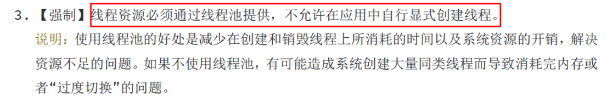
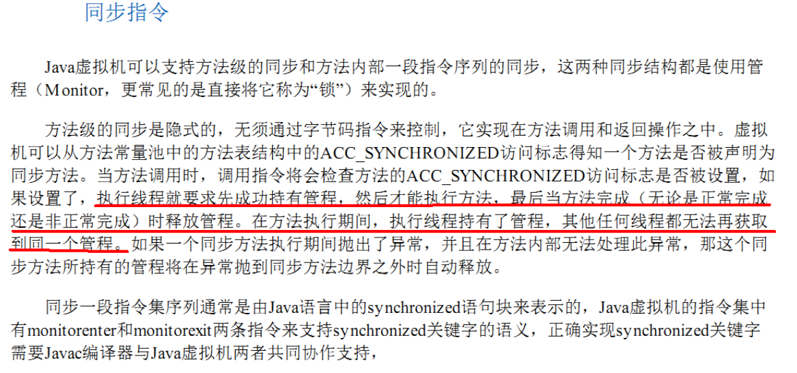

# 面试高频问点


# 线程池

## 生产如何设置合理参数

### ①. 线程池的拒绝策略请你谈谈

①. 等待队列也已经排满了,再也塞不下新的任务了。同时,线程池的maximumPoolSize也到达了,无法接续为新任务服务,这时我们需要拒绝策略机制合理的处理这个问题

②. JDK内置的拒绝策略

> AbortPolicy(默认):直接抛出RejectedException异常阻止系统正常运行
> CallerRunsPolicy:"调用者运行"一种调节机制,该策略既不会抛弃任务,也不会抛出异常,而是返回给调用者进行处理
> DiscardOldestPolicy:将最早进入队列的任务删除,之后再尝试加入队列
> DiscardPolicy:直接丢弃任务,不予任何处理也不抛出异常.如果允许任务丢失,这是最好的拒绝策略

③. 以上内置策略均实现了RejectExecutionHandler接口

### ②. 你在工作中单一的/固定数的/可变你的三种创建线程池的方法,你用哪个多?

> - ①. 答案是一个都不用,我们生产上只能使用自定义的
> - ②. Executors中JDK给你提供了为什么不用?

> 参考阿里巴巴java开发手册
> 【强制】线程资源必须通过线程池提供,不允许在应用中自行显式创建线程。 说明:使用线程池的好处是减少在创建和销毁线程上所消耗的时间以及系统资源的开销,解决资源不足的问题。如果不使用线程池,有可能造成系统创建大量同类线程而导致消耗完内存或者“过度切换”的问题。
> 【强制】线程池不允许使用Executors去创建,而是通过ThreadPoolExecutor的方式,这样的处理方式让写的同学更加明确线程池的运行规则,规避资源耗尽的风险。说明:Executors返回的线程池对象的弊端如下:
> (1). `FixedThreadPool`和`SingleThreadPool`:允许的请求队列长度为Integer.MAX_VALUE,可能会堆积大量的请求,从而导致OOM。
> (2). `CachedThreadPool`和`ScheduledThreadPool`:允许的创建线程数量为Integer.MAX_VALUE,可能会创建大量的线程,从而导致OOM
>
> 
>
> 

### ③. 你在工作中是如何创建线程池的,是否自定义过线程池使用

①. AbortPolicy: 最大不会抛出异常的值 `= maximumPoolSize + new LinkedBlockin gDeque<Runnable>(3) =8` 个。如果超过8个,默认的拒绝策略会抛出异常

②. CallerRunPolicy: 如果超过8个,不会抛出异常,会返回给调用者去

③. DiscardOldestPolicy:如果超过8个,将最早进入队列的任务删除,之后再尝试加入队列

④. DiscardPolicy:直接丢弃任务,不予任何处理也不抛出异常.如果允许任务丢失,这是最好的拒绝策略

```java
public class MyThreadPoolDemo {
    public static void main(String[] args) {
        ExecutorService threadPool = new ThreadPoolExecutor(
                2,
                5,
                1L,
                TimeUnit.SECONDS,
                new LinkedBlockingDeque<Runnable>(3),
                Executors.defaultThreadFactory(),
                //默认抛出异常
                //new ThreadPoolExecutor.AbortPolicy()
                //回退调用者
                //new ThreadPoolExecutor.CallerRunsPolicy()
                //处理不来的不处理,丢弃时间最长的
                //new ThreadPoolExecutor.DiscardOldestPolicy()
                //直接丢弃任务,不予任何处理也不抛出异常
                new ThreadPoolExecutor.DiscardPolicy()
        );
        //模拟10个用户来办理业务 没有用户就是来自外部的请求线程.
        try {
            for (int i = 1; i <= 10; i++) {
                threadPool.execute(() -> {
                    System.out.println(Thread.currentThread().getName() + "\t 办理业务");
                });
            }
        } catch (Exception e) {
            e.printStackTrace();
        } finally {
            threadPool.shutdown();
        }
        //threadPoolInit();
    }
}
```

### ④. 合理配置线程池你是如何考虑的?

​			①. CPU密集型


> CPU密集的意思是该任务需要大量的运算，而没有阻塞，CPU一直全速运行。
>
> CPU密集任务只有在真正的多核CPU上才可能得到加速(通过多线程)
> 而在单核CPU上，无论你开几个模拟的多线程该任务都不可能得到加速，因为CPU总的运算能力就那些。
>
> CPU密集型任务配置尽可能少的线程数量：一般公式          CPU核数+1个线程的线程池

​			②. IO密集型

> 由于IO密集型任务线程并不是一直在执行任务，则应配置尽可能多的线程，如`CPU核数*2`
>
> IO密集型，即该任务需要大量的IO，即大量的阻塞。
> 在单线程上运行IO密集型的任务会导致浪费大量的CPU运算能力浪费在等待。
> 所以在IO密集型任务中使用多线程可以大大的加速程序运行，即使在单核CPU上，这种加速主要就是利用了被浪费掉的阻塞时间。
>
> IO密集型时，大部分线程都阻塞，故需要多配置线程数:
> 																参考公式: $CPU核数/1 - 阻塞系数$
> 阻塞系数在  $0.8 \backsim 0.9$  之间
> 比如8核CPU    ：  $8/1-0.9 = 80$个线程数


# 多线程


## ①. 为什么使用多线程 及其 重要

1. 摩尔定律失效(硬件方面):
   (1). 集成电路上可以容纳的晶体管数目在大约每经过18个月便会增加一倍,可是从2003年开始CPU主频已经不再翻倍,而是采用多核而不是更快的主频
   (2). 在主频不再提高且核数不断增加的情况下,要想让程序更快就要用到并行或并发编程
2. 高并发系统,异步+回调的生产需求(软件方面)


## ②. 进程、线程、管程(monitor 监视器)

1. 线程就是程序执行的一条路径,一个进程中可以包含多条线程
2. 多线程并发执行可以提高程序的效率,可以同时完成多项工作
3. 举例:
   (你打开一个word就是一个进程开启了,这个时候你重启后在打开word,这个时候有一个点击恢复的按钮,这就是一个线程,可能这个线程你看不到,你打字的时候,单词打错了,word中会有一个波浪线,这也是一个线程)
4. 管程:Monitor(监视器),也就是我们平时所说的锁
   (1). Monitor其实是一种同步机制,它的义务是保证(在同一时间)只有一个线程可以访问被保护的数据和代码
   (2). JVM中同步时基于进入和退出的监视器对象(Monitor,管程),每个对象实例都有一个Monitor对象。
   (3). Monitor对象和JVM对象一起销毁,底层由C来实现




## ③. 多线程并行和并发的区别

1. 并行就是两个任务同时运行,就是甲任务进行的同时,乙任务也在进行(需要多核CPU)

2. 并发是指两个任务都请求运行,而处理器只能接收一个任务,就是把这两个任务安排轮流进行,由于时间间隔较短,使人感觉两个任务都在运行(12306抢票的案例)

   

## ④. wait | sleep的区别？功能都是当前线程暂停,有什么区别？

1. wait放开手去睡,放开手里的锁;wait是Object类中的方法
2. sleep握紧手去睡,醒了手里还有锁;sleep是Thread中的方法


## ⑤. synchronized 和 lock的区别？

(1). 原始构成

- a. synchronized是关键字属于JVM层面
   monitor对象,每个java对象都自带了一个monitor,需要拿到monitor对象才能做事情
   monitorenter(底层是通过monitor对象来完成,其实wait/notify等方法也依赖monitor对象,
   只能在同步块或方法中才能调用wait/notify等方法),进入
   monitorexit:退出

- lock是api层面的锁,主要使用ReentrantLock实现

  

  (2). 使用方法

   a. synchronized不需要用户手动释放锁,当synchronized代码完成后系统会自动让线程释放

  ​	对锁的占用

   b. ReentrantLock则需要用户手动释放锁若没有主动释放锁,就有可能会导致死锁的现象

  

  (3). 等待是否可中断?

   a. synchronized不可中断,除非抛出异常或者正常运行完成

   b. ReentrantLock可中断

  ​	 (设置超时时间tryLock(long timeout,TimeUnit unit),调用interrupt方法中断)

  

  (4). 加锁是否公平

  ​	 a. synchronized非公平锁

  ​	 b. ReentrantLock两者都可以,默认是非公平锁,构造方法可以传入boolean值,true为公平锁,

  ​		 false为非公平锁

  

  (5). 锁绑定多个Condition

  ​	 a.synchronized没有

  ​	 b.ReentrantLock用来实现分组唤醒需要唤醒线程们,可以精确唤醒,而不是像synchronized要么

  ​		 随机唤醒一个\要么多个


## Lock接口及 ReentrantLock 对象分析及应用

并发编程领域，有两大核心问题：一个是互斥，即同一时刻只允许一个线程访问共享资源；另一个是同步，即线程之间如何通信、协作。

这两大问题，在Java SDK 并发包可通过 Lock 和 Condition 两个接口来实现，其中Lock 用于解决互斥问题，Condition 用于解决同步问题。

Java SDK 并发包里的 Lock 接口中，不仅有支持类似 `synchronized `的隐式加锁方法，还支持超时、非阻塞、可中断的方式获取锁， 这三种方式为我们编写更加安全、健壮的并发程序提供了很大的便利。

我们来一起看看Lock接口常用方法，关键方法如下：

- 1)void lock() 获取锁对象，优先考虑是锁的获取，而非中断。
- 2)void lockInterruptibly() 获取锁，但优先响应中断而非锁的获取。
- 3)boolean tryLock() 试图获取锁。
- 4)boolean tryLock(long timeout, TimeUnit timeUnit) 试图获取锁，并设置等待时长。
- 5)void unlock()释放锁对象。

Java SDK 并发包里的`ReentrantLock`实现了`Lock`接口，是一个可重入的互斥锁(“独占锁”), 同时提供了”公平锁”和”非公平锁”的支持。所谓公平锁和非公平锁其含义如下：

- 1)公平锁：在多个线z程争用锁的情况下，公平策略倾向于将访问权授予等待时间最长的线程。也就是说，相当于有一个线程等待队列，先进入等待队列的线程后续会先获得锁

- 2)非公平锁：在多个线程争用锁的情况下，能够最终获得锁的线程是随机的（由底层OS调度）。
  `ReetrantLock`简易应用如下（默认为非公平策略）

  ```java
  class Counter{
    ReentrantLock lock = new ReentrantLock();
    int count = 0;
    void increment() {
      lock.lock();
      try {
        count++;
      } finally {
        lock.unlock();
      }
    }
  }
  ```

  其中，这里的锁通过`lock（）`方法获取锁,通过`unlock（）`方法释放锁。重要的是将代码包装成`try/finally`块，以确保在出现异常时解锁。

  这个方法和`synchronized`关键字修饰的方法一样是线程安全的。在任何给定的时间，只有一个线程可以持有锁。
  `ReetrantLock`对象在构建时，可以基于`ReentrantLock(boolean fair)`构造方法参数，设置对象的”公平锁”和”非公平锁”特性。

  其中`fair`的值`true`表示“公平锁”。这种公平锁，会影响其性能，但是在一些公平比效率更加重要的场合中公平锁特性就会显得尤为重要。关键代码示例如下：

  ```java
  public void performFairLock(){
  		  ReentrantLock lock = new ReentrantLock(true);
  		   try {
  		        //Critical section here
  		        } finally {
  		            lock.unlock();
  		        }
  		    //...
  }
  ```

  `ReetrantLock`对象在基于业务获取锁时，假如希望有等待时间，可以借助tryLock实现，关键代码示例如下：

  ```java
   public void performTryLock(){
  		    //...
  		    boolean isLockAcquired = lock.tryLock(1, TimeUnit.SECONDS);
  		     
  		    if(isLockAcquired) {
  		        try {
  		            //Critical section here
  		        } finally {
  		            lock.unlock();
  		        }
  		    }
  		    //...
  		}
  }
  ```

  

