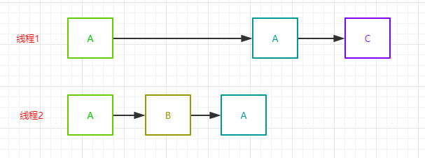

# AtomicXXX类


​	Java1.5的Atomic包名为java.util.concurrent.atomic。这个包提供了一系列原子类。这些类可以保证多线程环境下，当某个线程在执行 atomic 的方法时，不会被其他线程打断，而别的线程通过自旋锁（CAS），一直等到该方法执行完成，才由JVM从等待队列中选择一个线程执行。

​	Atomic类在软件层面上是非阻塞的，它的原子性其实是依靠底层的 CAS 来保障原子性的更新数据，在要添加或者减少的时候，会使用死循环不断地 CAS 到特定的值，从而达到更新数据的目的。


## AtomicStampedReference

> `AtomicStampedReference` 是 java 并发包下提供的一个原子类，它能解决其它原子类无法解决的 ABA 问题

### [ABA](https://blog.csdn.net/lki_suidongdong/article/details/106250381)

​	ABA 问题发生在多线程环境中，当某线程连续读取同一块内存地址两次，两次得到的值一样，它简单地认为“此内存地址的值并没有被修改过”，然而，同时可能存在另一个线程在这两次读取之间把这个内存地址的值从A修改成了B又修改回了A，这时还简单地认为“没有修改过”显然是错误的。

比如，两个线程按下面的顺序执行：

（1）线程1读取内存位置X的值为A；

（2）线程1阻塞了；

（3）线程2读取内存位置X的值为A；

（4）线程2修改内存位置X的值为B；

（5）线程2又修改内存位置X的值为A；

（6）线程1恢复，继续执行，比较发现还是A把内存位置X的值设置为C；



> 可以看到，针对线程1来说，第一次的A和第二次的A实际上并不是同一个A

ABA 问题通常发生在无锁结构中，用代码来表示上面的过程大概就是这样：

```java
public class ABATest {
 
    public static void main(String[] args) {
        AtomicInteger atomicInteger = new AtomicInteger(1);
 
        new Thread(()->{
            int value = atomicInteger.get();
            System.out.println("thread 1 read value: " + value);
 
            // 阻塞1s
            LockSupport.parkNanos(1000000000L);
 
            if (atomicInteger.compareAndSet(value, 3)) {
                System.out.println("thread 1 update from " + value + " to 3");
            } else {
                System.out.println("thread 1 update fail!");
            }
        }).start();
 
        new Thread(()->{
            int value = atomicInteger.get();
            System.out.println("thread 2 read value: " + value);
            if (atomicInteger.compareAndSet(value, 2)) {
                System.out.println("thread 2 update from " + value + " to 2");
 
                // do sth
 
                value = atomicInteger.get();
                System.out.println("thread 2 read value: " + value);
                if (atomicInteger.compareAndSet(value, 1)) {
                    System.out.println("thread 2 update from " + value + " to 1");
                }
            }
        }).start();
    }
}
```

> 打印结果为：
>
> thread 1 read value: 1
> thread 2 read value: 1
> thread 2 update from 1 to 2
> thread 2 read value: 2
> thread 2 update from 2 to 1
> thread 1 update from 1 to 3

### Solve ABA

大概有以下几种方式：

（1）版本号

​	比如，上面的栈结构增加一个版本号用于控制，每次CAS的同时检查版本号有没有变过

​	还有一些数据结构喜欢使用高位存储一个邮戳来保证CAS的安全

（2）不重复使用节点的引用

​	比如，上面的栈结构在线程2执行push()入栈操作的时候新建一个节点传入，而不是复用节点1的引用

（3）直接操作元素而不是节点

​	比如，上面的栈结构push()方法不应该传入一个节点（Node），而是传入元素值（int 的 value）

​	

**源码分析**

```java
// 内部类	将元素值和版本号绑定在一起，存储在Pair的reference和stamp（邮票、戳的意思）中
private static class Pair<T> {
    final T reference;
    final int stamp;
    private Pair(T reference, int stamp) {
        this.reference = reference;
        this.stamp = stamp;
    }
    static <T> Pair<T> of(T reference, int stamp) {
        return new Pair<T>(reference, stamp);
    }
}

// 属性	声明一个Pair类型的变量并使用Unsfae获取其偏移量，存储到pairOffset中
private volatile Pair<V> pair;
private static final sun.misc.Unsafe UNSAFE = sun.misc.Unsafe.getUnsafe();
private static final long pairOffset = objectFieldOffset(UNSAFE, "pair", AtomicStampedReference.class);

// 构造方法	构造方法需要传入初始值及初始版本号
public AtomicStampedReference(V initialRef, int initialStamp) {
    pair = Pair.of(initialRef, initialStamp);
}
```

**`CompareAndSet()`  方法**

```java
public boolean compareAndSet(V   expectedReference,
                             V   newReference,
                             int expectedStamp,
                             int newStamp) {
    // 获取当前的（元素值，版本号）对
    Pair<V> current = pair;
    return
        // 引用没变
        expectedReference == current.reference &&
        // 版本号没变
        expectedStamp == current.stamp &&
        // 新引用等于旧引用
        ((newReference == current.reference &&
        // 新版本号等于旧版本号
          newStamp == current.stamp) ||
          // 构造新的Pair对象并CAS更新
         casPair(current, Pair.of(newReference, newStamp)));
}
 
private boolean casPair(Pair<V> cmp, Pair<V> val) {
    // 调用Unsafe的compareAndSwapObject()方法CAS更新pair的引用为新引用
    return UNSAFE.compareAndSwapObject(this, pairOffset, cmp, val);
}
```

（1）如果元素值和版本号都没有变化，并且和新的也相同，返回 true；

（2）如果元素值和版本号都没有变化，并且和新的不完全相同，就构造一个新的Pair对象并执行CAS更新pair

可以看到，java中的实现跟上面讲的ABA的解决方法是一致的

- 首先，使用版本号控制；
- 其次，不重复使用节点（Pair）的引用，每次都新建一个新的Pair来作为CAS比较的对象，而不是复用旧的
- 最后，外部传入元素值及版本号，而不是节点（Pair）的引用


使用 `AtomicStampedReference` 解决开篇那个 `AtomicInteger` 带来的ABA问题：

```java
public class AtomicStampedReferenceTest {
 
    public static void main(String[] args) {
        testStamp();
    }
 
    private static void testStamp() {
        AtomicStampedReference<Integer> atomicStampedReference = new AtomicStampedReference<>(1, 1);
 
        new Thread(()->{
            int[] stampHolder = new int[1];
            int value = atomicStampedReference.get(stampHolder);
            int stamp = stampHolder[0];
            System.out.println("thread 1 read value: " + value + ", stamp: " + stamp);
 
            // 阻塞1s
            LockSupport.parkNanos(1000000000L);
 
            if (atomicStampedReference.compareAndSet(value, 3, stamp, stamp + 1)) {
                System.out.println("thread 1 update from " + value + " to 3");
            } else {
                System.out.println("thread 1 update fail!");
            }
        }).start();
 
        new Thread(()->{
            int[] stampHolder = new int[1];
            int value = atomicStampedReference.get(stampHolder);
            int stamp = stampHolder[0];
            System.out.println("thread 2 read value: " + value + ", stamp: " + stamp);
            if (atomicStampedReference.compareAndSet(value, 2, stamp, stamp + 1)) {
                System.out.println("thread 2 update from " + value + " to 2");
 
                // do sth
 
                value = atomicStampedReference.get(stampHolder);
                stamp = stampHolder[0];
                System.out.println("thread 2 read value: " + value + ", stamp: " + stamp);
                if (atomicStampedReference.compareAndSet(value, 1, stamp, stamp + 1)) {
                    System.out.println("thread 2 update from " + value + " to 1");
                }
            }
        }).start();
    }
}
```

> 运行结果为：
>
> thread 1 read value: 1, stamp: 1
> thread 2 read value: 1, stamp: 1
> thread 2 update from 1 to 2
> thread 2 read value: 2, stamp: 2
> thread 2 update from 2 to 1
> thread 1 update fail!
>
> 可以看到线程1最后更新1到3时失败了，因为这时版本号也变了，成功解决了ABA的问题。

### 总结

（1）在多线程环境下使用无锁结构要注意ABA问题；

（2）ABA的解决一般使用版本号来控制，并保证数据结构使用元素值来传递，且每次添加元素都新建节点承载元素值；

（3）AtomicStampedReference 内部使用Pair来存储元素值及其版本号.

> Java 中还有 `AtomicMarkableReference` 类可以解决ABA的问题
> 它不是维护一个版本号，而是维护一个boolean类型的标记，标记值有修改


## AtomicMarkableReference

​	原子更新引用类型，内部使用Pair承载引用对象及是否被更新过的标记，避免了ABA问题。


## **AtomicXxxArray**

原子更新数组中的元素，可以更新数组中指定索引位置的元素，这些类主要有：

（1）AtomicIntegerArray	原子更新int数组中的元素

（2）AtomicLongArray	原子更新long数组中的元素

（3）AtomicReferenceArray	原子更新Object数组中的元素

```java
private static void testAtomicReferenceArray() {
    AtomicIntegerArray atomicIntegerArray = new AtomicIntegerArray(10);
    atomicIntegerArray.getAndIncrement(0);
    atomicIntegerArray.getAndAdd(1, 666);
    atomicIntegerArray.incrementAndGet(2);
    atomicIntegerArray.addAndGet(3, 666);
    atomicIntegerArray.compareAndSet(4, 0, 666);
    
    System.out.println(atomicIntegerArray.get(0));
    System.out.println(atomicIntegerArray.get(1));
    System.out.println(atomicIntegerArray.get(2));
    System.out.println(atomicIntegerArray.get(3));
    System.out.println(atomicIntegerArray.get(4));
    System.out.println(atomicIntegerArray.get(5));
}
```


## AtomicXxxFieldUpdater


原子更新对象中的字段，可以更新对象中指定字段名称的字段，这些类主要有：

（1）AtomicIntegerFieldUpdater	原子更新对象中的int类型字段

（2）AtomicLongFieldUpdater	原子更新对象中的long类型字段

（3）AtomicReferenceFieldUpdater	原子更新对象中的引用类型字段

```java
private static void testAtomicReferenceField() {
    AtomicReferenceFieldUpdater<User, String> updateName = AtomicReferenceFieldUpdater.newUpdater(User.class, String.class,"name");
    AtomicIntegerFieldUpdater<User> updateAge = AtomicIntegerFieldUpdater.newUpdater(User.class, "age");
    User user = new User("tong ge", 21);
    updateName.compareAndSet(user, "tong ge", "read source code");
    updateAge.compareAndSet(user, 21, 25);
    updateAge.incrementAndGet(user);
    System.out.println(user);
}

private static class User {
    volatile String name;
    volatile int age;
    public User(String name, int age) {
        this.name = name;
        this.age = age;
    }
    @Override
    public String toString() {
        return "name: " + name + ", age: " + age;
    }
}
```


## 高性能原子类

​	Java 8 中增加的原子类，它们使用分段的思想，把不同的线程 `hash` 到不同的段上去更新，最后再把这些段的值相加得到最终的值，这些类主要有：

（1）Striped64		     下面四个类的父类

（2）LongAccumulator	long 类型的聚合器，需要传入一个 long 类型的二元操作，可以用来计算各种聚合操作，包括加乘等

（3）[LongAdder](https://blog.csdn.net/lki_suidongdong/article/details/106253269)		long 类型的累加器，LongAccumulator 的特例，只能用来计算加法，且从 0 开始计算

（4）DoubleAccumulator	double 类型的聚合器，需要传入一个 `double `类型的二元操作，可以用来计算各种聚合操作，包括加乘等

（5）DoubleAdder		double 类型的累加器，DoubleAccumulator 的特例，只能用来计算加法，且从 0 开始计算

```java
private static void testNewAtomic() {
    LongAdder longAdder = new LongAdder();
    longAdder.increment();
    longAdder.add(666);
    System.out.println(longAdder.sum());
 
    LongAccumulator longAccumulator = new LongAccumulator((left, right)->left + right * 2, 666);
    longAccumulator.accumulate(1);
    longAccumulator.accumulate(3);
    longAccumulator.accumulate(-4);
    System.out.println(longAccumulator.get());
}
```

