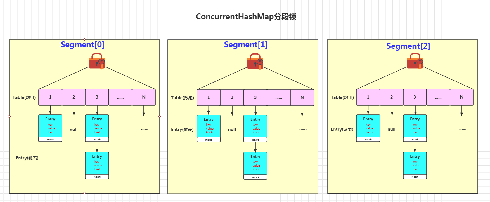

# ConcurrentXxx


> Concurrent 类型没有类似 CopyOnWrite 之类容器相对较重的修改开销。

​	Concurrent 往往提供了较低的遍历一致性。你可以这样理解所谓的弱一致性，例如，当利用迭代器遍历时，如果容器发生修改，迭代器仍然可以继续进行遍历。

> 弱一致性的另外一个体现是，size 等操作准确性是有限的，未必是 100% 准确。与此同时，读取的性能具有一定的不确定性。
>
> 同步容器常见的行为 `“fast-fail”` 是强一致性的提现，也就是检测到容器在遍历过程中发生了修改，则抛出 ConcurrentModificationException，不再继续遍历。


## ConcurrentLinkedQueue

> Concurrent 类型基于 lock-free，在常见的多线程访问场景，一般可以提供较高吞吐量
>
> LinkedBlockingQueue 内部则是基于锁，并提供了 BlockingQueue 的等待性方法


## ConcurrentHashMap

​	ConcurrentHashMap 在 JDK1.7 之前使用分段锁技术，1.7 之后采用了**CAS+自旋**的无锁编程的方式实现。

​	ConcurrentHashMap （ JDK1.7 ）是由 `Segment` 数组结构和 `HashEntry` 数组结构组成。 `Segment` 是一种可重入锁ReentrantLock，在 ConcurrentHashMap 里扮演锁的角色， `HashEntry` 则用于存储键值对数据。一个 ConcurrentHashMap 里包含一个 `Segment` 数组， `Segment` 的结构和 `HashMap` 类似，是一种数组和链表结构， 一个 `Segment` 里包含一个 `HashEntry` 数组，每个 `HashEntry` 是一个链表结构的元素， 每个 `Segment` 守护者一个 `HashEntry` 数组里的元素，当对 `HashEntry` 数组的数据进行修改时，必须首先获得它对应的 `Segment` 锁，modCount 用于记录修改次数，threshold 表示扩容的阈值，loadFactor 表示加载因子。

JDK 1.7 中 ConcurrentHashMap 实现机制：




​	在 JDK 1.8中，ConcurrentHashMap 进行了重大改进，采用了更加高效的并发控制机制来保证线程安全。相较于JDK 1.7的分段锁设计，JDK 1.8引入了基于**CAS**（Compare and Swap）操作和**链表 / 红黑树**结构的**锁机制**以及其他优化，大大提高了并发性能。

​	具体来说，它将整个哈希桶（Hash Bucket）划分为若干个节点（Node）。每个节点代表一个存储键值对的单元，可以是链表节点（普通节点）或红黑树节点（树节点），这取决于节点内的键值对数量是否达到阈值。**使用红黑树结构可以提高查找、插入、删除等操作的效率**。
```java
static final class Node<K, V> implements Map.Entry<K, V> {
    final int hash;
    final K key;
    volatile V value;
    volatile Node<K, V> next;
    Node(int hash, K key, V value, Node<K, V> next) {
        this.hash = hash;
        this.key = key;
        this.value = value;
        this.next = next;
    }
}
static final class TreeNode<K, V> extends Node<K, V> {
    TreeNode(int hash, K key, V value, Node<K, V> next) {
        super(hash, key, value, next);
    }
    // 省略了红黑树相关的操作代码
}
static final class ConcurrentHashMap<K, V> {
    transient volatile Node<K, V>[] table;
    transient volatile int sizeCtl;
    transient volatile int baseCount;
    transient volatile int modCount;
}
```

1. **插入操作**
   `put` 方法：当进行插入操作时，ConcurrentHashMap 首先计算键的散列值，然后根据散列值和数组长度计算出对应的桶位置。接着使用 CAS 操作尝试插入新节点，如果成功则插入完成；如果失败，则进入下一步。

   `resize` 方法：插入节点时，若发现链表中的节点数量已经达到阈值（默认为 8），则将链表转化为红黑树，提高查找、插入、删除等操作的效率。在转化过程中，利用 synchronized 锁住链表或红黑树所在的桶，并进行相应的操作。(当链表长度小于6时，红黑树会退化为单向链表)

   `forwardTable` 方法：若节点数量超过阈值（默认为64）且 table 未被初始化，则使用CAS操作将 table 指向扩容后的桶数组，并根据需要将链表或红黑树进行分割，以减小线程之间的冲突。

2. **查询操作**
   `get` 方法：当进行查询操作时，首先计算键的散列值，然后根据散列值和数组长度计算出对应的桶位置。接着从桶位置的链表或红黑树中查找对应的节点。

3. **其他操作**
   `remove` 方法：当进行删除操作时，首先计算键的散列值，然后根据散列值和数组长度计算出对应的桶位置。接着使用 synchronized 锁住桶，并进行相应的操作。

Reference
	https://blog.csdn.net/canot/article/details/51236114

