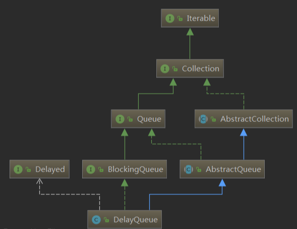

# ConcurrentCollections 并发 集合类


# LinkedTransferQueue

​	LinkedTransferQueue 是 `LinkedBlockingQueue` 、`SynchronousQueue` （公平模式）、`ConcurrentLinkedQueue` 三者的集合体，它综合了这三者的方法，并且提供了更加高效的实现方式。

​	LinkedTransferQueue 实现了 `TransferQueue` 接口，而 `TransferQueue` 接口是继承自 `BlockingQueue` 的，所以`LinkedTransferQueue` 也是一个阻塞队列。

​	TransferQueue 接口中定义了以下几个方法：主要是定义了三个移交元素的方法，有阻塞的，有不阻塞的，有超时的。

```java
// 尝试移交元素
boolean tryTransfer(E e);
// 移交元素
void transfer(E e) throws InterruptedException;
// 尝试移交元素（有超时时间）
boolean tryTransfer(E e, long timeout, TimeUnit unit)
    throws InterruptedException;
// 判断是否有消费者
boolean hasWaitingConsumer();
// 查看消费者的数量
int getWaitingConsumerCount();
```

## 存储结构

LinkedTransferQueue 使用了一个叫做`dual data structure`的数据结构，或者叫做`dual queue`，译为双重数据结构或者双重队列。

> 双重队列：
>
> 放取元素使用同一个队列，队列中的节点具有两种模式，一种是数据节点，一种是非数据节点。
>
> 放元素时先跟队列头节点对比，如果头节点是非数据节点，就让他们匹配，如果头节点是数据节点，就生成一个数据节点放在队列尾端（入队）。
>
> 取元素时也是先跟队列头节点对比，如果头节点是数据节点，就让他们匹配，如果头节点是非数据节点，就生成一个非数据节点放在队列尾端（入队）。
>
> 

## 主要属性

```java
// 头节点
transient volatile Node head;
// 尾节点
private transient volatile Node tail;
// 放取元素的几种方式：
// 立即返回，用于非超时的poll()和tryTransfer()方法中
private static final int NOW   = 0; // for untimed poll, tryTransfer
// 异步，不会阻塞，用于放元素时，因为内部使用无界单链表存储元素，不会阻塞放元素的过程
private static final int ASYNC = 1; // for offer, put, add
// 同步，调用的时候如果没有匹配到会阻塞直到匹配到为止
private static final int SYNC  = 2; // for transfer, take
// 超时，用于有超时的poll()和tryTransfer()方法中
private static final int TIMED = 3; // for timed poll, tryTransfer
```

## 主要内部类

```java
static final class Node {
    // 是否是数据节点（也就标识了是生产者还是消费者）
    final boolean isData;   // false if this is a request node
    // 元素的值
    volatile Object item;   // initially non-null if isData; CASed to match
    // 下一个节点
    volatile Node next;
    // 持有元素的线程
    volatile Thread waiter; // null until waiting
}
// 典型的单链表结构，内部除了存储元素的值和下一个节点的指针外，还包含了是否为数据节点和持有元素的线程
// 内部通过 isData 区分是生产者还是消费者
```

## 入队

四个方法都是一样的，使用异步的方式调用 `xfer()` 方法，传入的参数都一模一样。

```java
public void put(E e) {
    // 异步模式，不会阻塞，不会超时
    // 因为是放元素，单链表存储，会一直往后加
    xfer(e, true, ASYNC, 0);
}
 
public boolean offer(E e, long timeout, TimeUnit unit) {
    xfer(e, true, ASYNC, 0);
    return true;
}
 
public boolean offer(E e) {
    xfer(e, true, ASYNC, 0);
    return true;
}
 
public boolean add(E e) {
    xfer(e, true, ASYNC, 0);
    return true;
}
```


## 出队

出队的四个方法也是直接或间接的调用 `xfer()` 方法，放取元素的方式和超时规则略微不同，本质没有大的区别。

```java
public E remove() {
    E x = poll();
    if (x != null)
        return x;
    else
        throw new NoSuchElementException();
}
public E take() throws InterruptedException {
    // 同步模式，会阻塞直到取到元素
    E e = xfer(null, false, SYNC, 0);
    if (e != null)
        return e;
    Thread.interrupted();
    throw new InterruptedException();
}
 
public E poll(long timeout, TimeUnit unit) throws InterruptedException {
    // 有超时时间
    E e = xfer(null, false, TIMED, unit.toNanos(timeout));
    if (e != null || !Thread.interrupted())
        return e;
    throw new InterruptedException();
}
 
public E poll() {
    // 立即返回，没取到元素返回null
    return xfer(null, false, NOW, 0);
}
```

`xfer(E e, boolean haveData, int how, long nanos)` 的参数分别是：

（1）e 表示元素；

（2）haveData 表示是否是数据节点，

（3）how 表示放取元素的方式，上面提到的四种，NOW、ASYNC、SYNC、TIMED；

（4）nanos 表示超时时间；

```java
private E xfer(E e, boolean haveData, int how, long nanos) {
    // 不允许放入空元素
    if (haveData && (e == null))
        throw new NullPointerException();
    Node s = null;                        // the node to append, if needed
    // 外层循环，自旋，失败就重试
    retry:
    for (;;) {                            // restart on append race
 
        // 下面这个for循环用于控制匹配的过程
        // 同一时刻队列中只会存储一种类型的节点
        // 从头节点开始尝试匹配，如果头节点被其它线程先一步匹配了
        // 就再尝试其下一个，直到匹配到为止，或者到队列中没有元素为止
        
        for (Node h = head, p = h; p != null;) { // find & match first node
            // p节点的模式
            boolean isData = p.isData;
            // p节点的值
            Object item = p.item;
            // p没有被匹配到
            if (item != p && (item != null) == isData) { // unmatched
                // 如果两者模式一样，则不能匹配，跳出循环后尝试入队
                if (isData == haveData)   // can't match
                    break;
                // 如果两者模式不一样，则尝试匹配
                // 把p的值设置为e（如果是取元素则e是null，如果是放元素则e是元素值）
                if (p.casItem(item, e)) { // match
                    // 匹配成功
                    // for里面的逻辑比较复杂，用于控制多线程同时放取元素时出现竞争的情况的
                    // 看不懂可以直接跳过
                    for (Node q = p; q != h;) {
                        // 进入到这里可能是头节点已经被匹配，然后p会变成h的下一个节点 
                        Node n = q.next;  // update by 2 unless singleton
                        // 如果head还没变，就把它更新成新的节点
                        // 并把它删除（forgetNext()会把它的next设为自己，也就是从单链表中删除了）
                        // 这时为什么要把head设为n呢？因为到这里了，肯定head本身已经被匹配掉了
                        // 而上面的p.casItem()又成功了，说明p也被当前这个元素给匹配掉了
                        // 所以需要把它们俩都出队列，让其它线程可以从真正的头开始，不用重复检查了
                        if (head == h && casHead(h, n == null ? q : n)) {
                            h.forgetNext();
                            break;
                        }                 // advance and retry
                        // 如果新的头节点为空，或者其next为空，或者其next未匹配，就重试
                        if ((h = head)   == null ||
                            (q = h.next) == null || !q.isMatched())
                            break;        // unless slack < 2
                    }
                    // 唤醒p中等待的线程
                    LockSupport.unpark(p.waiter);
                    // 并返回匹配到的元素
                    return LinkedTransferQueue.<E>cast(item);
                }
            }
            // p已经被匹配了或者尝试匹配的时候失败了
            // 也就是其它线程先一步匹配了p
            // 这时候又分两种情况，p的next还没来得及修改，p的next指向了自己
            // 如果p的next已经指向了自己，就重新取head重试，否则就取其next重试
            Node n = p.next;
            p = (p != n) ? n : (h = head); // Use head if p offlist
        }
 
        // 到这里肯定是队列中存储的节点类型和自己一样
        // 或者队列中没有元素了
        // 就入队（不管放元素还是取元素都得入队）
        // 入队又分成四种情况：
        // NOW，立即返回，没有匹配到立即返回，不做入队操作
        // ASYNC，异步，元素入队但当前线程不会阻塞（相当于无界LinkedBlockingQueue的元素入队）
        // SYNC，同步，元素入队后当前线程阻塞，等待被匹配到
        // TIMED，有超时，元素入队后等待一段时间被匹配，时间到了还没匹配到就返回元素本身
 
        // 如果不是立即返回
        if (how != NOW) {                 // No matches available
            // 新建s节点
            if (s == null)
                s = new Node(e, haveData);
            // 尝试入队
            Node pred = tryAppend(s, haveData);
            // 入队失败，重试
            if (pred == null)
                continue retry;           // lost race vs opposite mode
            // 如果不是异步（同步或者有超时）
            // 就等待被匹配
            if (how != ASYNC)
                return awaitMatch(s, pred, e, (how == TIMED), nanos);
        }
        return e; // not waiting
    }
}
 
private Node tryAppend(Node s, boolean haveData) {
    // 从tail开始遍历，把s放到链表尾端
    for (Node t = tail, p = t;;) {        // move p to last node and append
        Node n, u;                        // temps for reads of next & tail
        // 如果首尾都是null，说明链表中还没有元素
        if (p == null && (p = head) == null) {
            // 就让首节点指向s
            // 注意，这里插入第一个元素的时候tail指针并没有指向s
            if (casHead(null, s))
                return s;                 // initialize
        }
        else if (p.cannotPrecede(haveData))
            // 如果p无法处理，则返回null
            // 这里无法处理的意思是，p和s节点的类型不一样，不允许s入队
            // 比如，其它线程先入队了一个数据节点，这时候要入队一个非数据节点，就不允许，
            // 队列中所有的元素都要保证是同一种类型的节点
            // 返回null后外面的方法会重新尝试匹配重新入队等
            return null;                  // lost race vs opposite mode
        else if ((n = p.next) != null)    // not last; keep traversing
            // 如果p的next不为空，说明不是最后一个节点
            // 则让p重新指向最后一个节点
            p = p != t && t != (u = tail) ? (t = u) : // stale tail
                (p != n) ? n : null;      // restart if off list
        else if (!p.casNext(null, s))
            // 如果CAS更新s为p的next失败
            // 则说明有其它线程先一步更新到p的next了
            // 就让p指向p的next，重新尝试让s入队
            p = p.next;                   // re-read on CAS failure
        else {
            // 到这里说明s成功入队了
            // 如果p不等于t，就更新tail指针
            // 还记得上面插入第一个元素时tail指针并没有指向新元素吗？
            // 这里就是用来更新tail指针的
            if (p != t) {                 // update if slack now >= 2
                while ((tail != t || !casTail(t, s)) &&
                       (t = tail)   != null &&
                       (s = t.next) != null && // advance and retry
                       (s = s.next) != null && s != t);
            }
            // 返回p，即s的前一个元素
            return p;
        }
    }
}
 
private E awaitMatch(Node s, Node pred, E e, boolean timed, long nanos) {
    // 如果是有超时的，计算其超时时间
    final long deadline = timed ? System.nanoTime() + nanos : 0L;
    // 当前线程
    Thread w = Thread.currentThread();
    // 自旋次数
    int spins = -1; // initialized after first item and cancel checks
    // 随机数，随机让一些自旋的线程让出CPU
    ThreadLocalRandom randomYields = null; // bound if needed
 
    for (;;) {
        Object item = s.item;
        // 如果s元素的值不等于e，说明它被匹配到了
        if (item != e) {                  // matched
            // assert item != s;
            // 把s的item更新为s本身
            // 并把s中的waiter置为空
            s.forgetContents();           // avoid garbage
            // 返回匹配到的元素
            return LinkedTransferQueue.<E>cast(item);
        }
        // 如果当前线程中断了，或者有超时的到期了
        // 就更新s的元素值指向s本身
        if ((w.isInterrupted() || (timed && nanos <= 0)) &&
                s.casItem(e, s)) {        // cancel
            // 尝试解除s与其前一个节点的关系
            // 也就是删除s节点
            unsplice(pred, s);
            // 返回元素的值本身，说明没匹配到
            return e;
        }
        
        // 如果自旋次数小于0，就计算自旋次数
        if (spins < 0) {                  // establish spins at/near front
            // spinsFor()计算自旋次数
            // 如果前面有节点未被匹配就返回0
            // 如果前面有节点且正在匹配中就返回一定的次数，等待
            if ((spins = spinsFor(pred, s.isData)) > 0)
                // 初始化随机数
                randomYields = ThreadLocalRandom.current();
        }
        else if (spins > 0) {             // spin
            // 还有自旋次数就减1
            --spins;
            // 并随机让出CPU
            if (randomYields.nextInt(CHAINED_SPINS) == 0)
                Thread.yield();           // occasionally yield
        }
        else if (s.waiter == null) {
            // 更新s的waiter为当前线程
            s.waiter = w;                 // request unpark then recheck
        }
        else if (timed) {
            // 如果有超时，计算超时时间，并阻塞一定时间
            nanos = deadline - System.nanoTime();
            if (nanos > 0L)
                LockSupport.parkNanos(this, nanos);
        }
        else {
            // 不是超时的，直接阻塞，等待被唤醒
            // 唤醒后进入下一次循环，走第一个if的逻辑就返回匹配的元素了
            LockSupport.park(this);
        }
    }
}
```

很大一部分代码都是在控制线程安全，各种 CAS，我们这里简单描述一下大致的逻辑：

（1）来了一个元素，我们先查看队列头的节点，是否与这个元素的模式一样；

（2）如果模式不一样，就尝试让他们匹配，如果头节点被别的线程先匹配走了，就尝试与头节点的下一个节点匹配，如此一直往后，直到匹配到或到链表尾为止；

（3）如果模式一样，或者到链表尾了，就尝试入队；

（4）入队的时候有可能链表尾修改了，那就尾指针后移，再重新尝试入队，依此往复；

（5）入队成功了，就自旋或阻塞，阻塞了就等待被其它线程匹配到并唤醒；

（6）唤醒之后进入下一次循环就匹配到元素了，返回匹配到的元素；

（7）是否需要入队及阻塞有四种情况：
```java
a）NOW，立即返回，没有匹配到立即返回，不做入队操作
 
    对应的方法有：poll()、tryTransfer(e)
 
b）ASYNC，异步，元素入队但当前线程不会阻塞（相当于无界LinkedBlockingQueue的元素入队）
 
    对应的方法有：add(e)、offer(e)、put(e)、offer(e, timeout, unit)
 
c）SYNC，同步，元素入队后当前线程阻塞，等待被匹配到
 
    对应的方法有：take()、transfer(e)
 
d）TIMED，有超时，元素入队后等待一段时间被匹配，时间到了还没匹配到就返回元素本身
 
    对应的方法有：poll(timeout, unit)、tryTransfer(e, timeout, unit)
```

## 总结
（1）LinkedTransferQueue 可以看作 LinkedBlockingQueue、SynchronousQueue（公平模式）、ConcurrentLinkedQueue 三者的集合体；

（2）LinkedTransferQueue 的实现方式是使用一种叫做双重队列的数据结构；

（3）不管是取元素还是放元素都会入队；

（4）先尝试跟头节点比较，如果二者模式不一样，就匹配它们，组成 CP，然后返回对方的值；

（5）如果二者模式一样，就入队，并自旋或阻塞等待被唤醒；

（6）至于是否入队及阻塞有四种模式，NOW、ASYNC、SYNC、TIMED；

（7）LinkedTransferQueue 全程都没有使用 `synchronized` 、重入锁等比较重的锁，基本是通过 **自旋+CAS** 实现；

（8）对于入队之后，先自旋一定次数后再调用 `LockSupport.park()` 或 `LockSupport.parkNanos` 阻塞.

# DelayQueue

​	DelayQueue 是 Java 并发包下的延时阻塞队列，常用于实现定时任务。




​	从继承体系可以看到，DelayQueue 实现了 BlockingQueue，所以它是一个阻塞队列。另外，DelayQueue 还组合了一个叫做Delayed 的接口，DelayQueue 中存储的所有元素必须实现 Delayed 接口。

```java
public interface Delayed extends Comparable<Delayed> {
    long getDelay(TimeUnit unit);
}
```

​	Delayed 是一个继承自 `Comparable` 的接口，并且定义了一个 `getDelay()` 方法，用于表示还有多少时间到期，到期了应返回小于等于 0 的数值。

## 主要属性

```java
// 用于控制并发的锁
private final transient ReentrantLock lock = new ReentrantLock();
// 优先级队列
private final PriorityQueue<E> q = new PriorityQueue<E>();
// 用于标记当前是否有线程在排队（仅用于取元素时）
private Thread leader = null;
// 条件，用于表示现在是否有可取的元素
private final Condition available = lock.newCondition();
```

延时队列主要使用优先级队列来实现，并辅以重入锁和条件来控制并发安全。因为优先级队列是无界的，所以这里只需要一个条件就可以了。

​	构造方法比较简单，一个默认构造方法，一个初始化添加集合中所有元素的构造方法。


## 入队

​	因为 DelayQueue 是阻塞队列，且优先级队列是无界的，所以入队不会阻塞不会超时，因此它的四个入队方法是一样的

```java
public boolean add(E e) {
    return offer(e);
}
public void put(E e) {
    offer(e);
}
public boolean offer(E e, long timeout, TimeUnit unit) {
    return offer(e);
}
public boolean offer(E e) {
    final ReentrantLock lock = this.lock;
    lock.lock();
    try {
        q.offer(e);
        if (q.peek() == e) {
            leader = null;
            available.signal();
        }
        return true;
    } finally {
        lock.unlock();
    }
}
```

入队方法比较简单：

（1）加锁；

（2）添加元素到优先级队列中；

（3）如果添加的元素是堆顶元素，就把leader置为空，并唤醒等待在条件available上的线程；

（4）解锁；


## 出队

​	DelayQueue 是阻塞队列，所以它的出队有四个不同的方法，有抛出异常的，有阻塞的，有不阻塞的，有超时的。主要分析两个， `poll()` 和 `take()` 方法

```java
public E poll() {
    final ReentrantLock lock = this.lock;
    lock.lock();
    try {
        E first = q.peek();
        if (first == null || first.getDelay(NANOSECONDS) > 0)
            return null;
        else
            return q.poll();
    } finally {
        lock.unlock();
    }
}
```

`poll()` 方法比较简单：

（1）加锁；

（2）检查第一个元素，如果为空或者还没到期，就返回null；

（3）如果第一个元素到期了就调用优先级队列的poll()弹出第一个元素；

（4）解锁。

```java
public E take() throws InterruptedException {
    final ReentrantLock lock = this.lock;
    lock.lockInterruptibly();
    try {
        for (;;) {
            // 堆顶元素
            E first = q.peek();
            // 如果堆顶元素为空，说明队列中还没有元素，直接阻塞等待
            if (first == null)
                available.await();
            else {
                // 堆顶元素的到期时间
                long delay = first.getDelay(NANOSECONDS);
                // 如果小于0说明已到期，直接调用poll()方法弹出堆顶元素
                if (delay <= 0)
                    return q.poll();
                
                // 如果delay大于0 ，则下面要阻塞了
                
                // 将first置为空方便gc，因为有可能其它元素弹出了这个元素
                // 这里还持有着引用不会被清理
                first = null; // don't retain ref while waiting
                // 如果前面有其它线程在等待，直接进入等待
                if (leader != null)
                    available.await();
                else {
                    // 如果leader为null，把当前线程赋值给它
                    Thread thisThread = Thread.currentThread();
                    leader = thisThread;
                    try {
                        // 等待delay时间后自动醒过来
                        // 醒过来后把leader置空并重新进入循环判断堆顶元素是否到期
                        // 这里即使醒过来后也不一定能获取到元素
                        // 因为有可能其它线程先一步获取了锁并弹出了堆顶元素
                        // 条件锁的唤醒分成两步，先从Condition的队列里出队
                        // 再入队到AQS的队列中，当其它线程调用LockSupport.unpark(t)的时候才会真正唤醒
                        // 关于AQS我们后面会讲的^^
                        available.awaitNanos(delay);
                    } finally {
                        // 如果leader还是当前线程就把它置为空，让其它线程有机会获取元素
                        if (leader == thisThread)
                            leader = null;
                    }
                }
            }
        }
    } finally {
        // 成功出队后，如果leader为空且堆顶还有元素，就唤醒下一个等待的线程
        if (leader == null && q.peek() != null)
            // signal()只是把等待的线程放到AQS的队列里面，并不是真正的唤醒
            available.signal();
        // 解锁，这才是真正的唤醒
        lock.unlock();
    }
}
```

`take()` 方法稍微要复杂一些：

（1）加锁；

（2）判断堆顶元素是否为空，为空的话直接阻塞等待；

（3）判断堆顶元素是否到期，到期了直接调用优先级队列的poll()弹出元素；

（4）没到期，再判断前面是否有其它线程在等待，有则直接等待；

（5）前面没有其它线程在等待，则把自己当作第一个线程等待delay时间后唤醒，再尝试获取元素；

（6）获取到元素之后再唤醒下一个等待的线程；

（7）解锁；


## 栗子

```java
public class DelayQueueTest {
    public static void main(String[] args) {
        DelayQueue<Message> queue = new DelayQueue<>();
 
        long now = System.currentTimeMillis();
 
        // 启动一个线程从队列中取元素
        new Thread(()->{
            while (true) {
                try {
                    // 将依次打印1000，2000，5000，7000，8000
                    System.out.println(queue.take().deadline - now);
                } catch (InterruptedException e) {
                    e.printStackTrace();
                }
            }
        }).start();
 
        // 添加5个元素到队列中
        queue.add(new Message(now + 5000));
        queue.add(new Message(now + 8000));
        queue.add(new Message(now + 2000));
        queue.add(new Message(now + 1000));
        queue.add(new Message(now + 7000));
    }
}
 
class Message implements Delayed {
    long deadline;
 
    public Message(long deadline) {
        this.deadline = deadline;
    }
 
    @Override
    public long getDelay(TimeUnit unit) {
        return deadline - System.currentTimeMillis();
    }
 
    @Override
    public int compareTo(Delayed o) {
        return (int) (getDelay(TimeUnit.MILLISECONDS) - o.getDelay(TimeUnit.MILLISECONDS));
    }
 
    @Override
    public String toString() {
        return String.valueOf(deadline);
    }
}
```


## 总结

（1）DelayQueue是阻塞队列；

（2）DelayQueue内部存储结构使用优先级队列；

（3）DelayQueue使用重入锁和条件来控制并发安全；

（4）DelayQueue常用于定时任务；