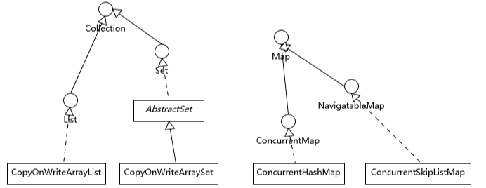

# CopyOnWriteXxx

> CopyOnWriteArraySet 是通过包装了 CopyOnWriteArrayList 来实现的
>
> 任何修改操作，如 add、set、remove，都会拷贝原数组，修改后替换原来的数组，通过这种防御性的方式，实现另类的线程安全

## Collections

> 如果应用侧重于 Map 放入或者获取的速度，而不在乎顺序，大多推荐使用 ConcurrentHashMap，反之则使用 ConcurrentSkipListMap；如果需要对大量数据进行非常频繁地修改，ConcurrentSkipListMap 也可能表现出优势。

