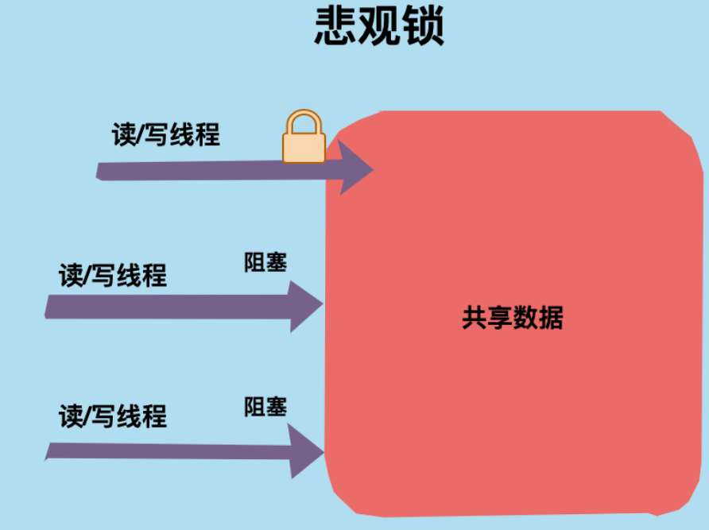
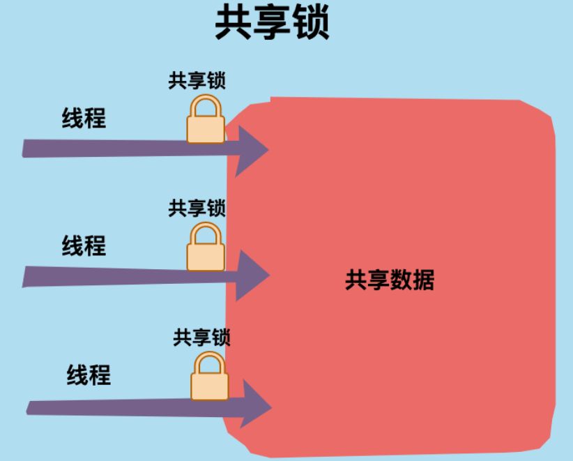
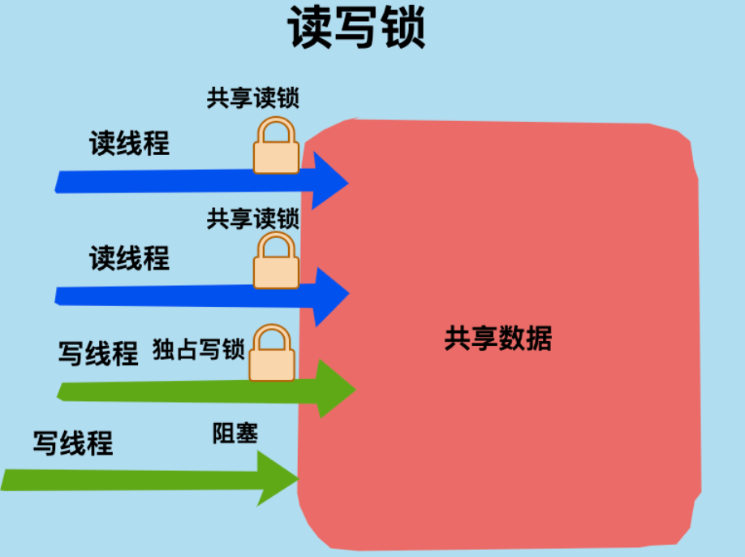
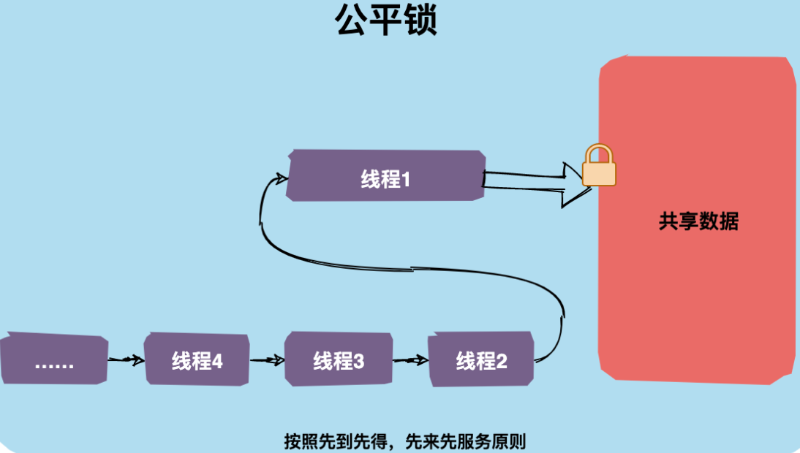
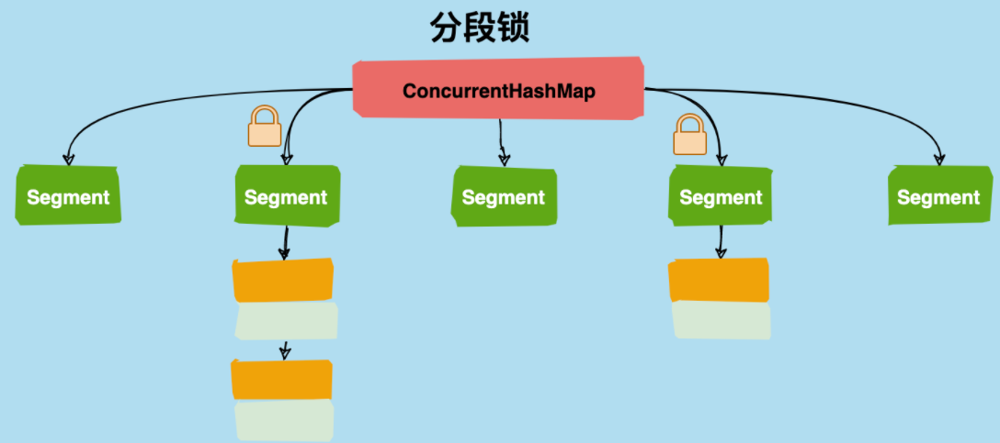

# Lock 锁

# 乐观锁 & 悲观锁

## 悲观锁

`悲观锁`对应于生活中悲观的人，悲观的人总是想着事情往坏的方向发展。

举个生活中的例子，假设厕所只有一个坑位了，悲观锁 上厕所会第一时间把门反锁上，这样其他人上厕所只能在门外等候，这种状态就是「阻塞」了。

回到代码世界中，一个共享数据加了悲观锁，那线程每次想操作这个数据前都会假设其他线程也可能会操作这个数据，所以每次操作前都会上锁，这样其他线程想操作这个数据拿不到锁只能阻塞了。




在 Java 语言中 `synchronized` 和 `ReentrantLock`等就是典型的悲观锁，还有一些使用了 synchronized 关键字的容器类如 `HashTable` 等也是悲观锁的应用。


## 乐观锁

`乐观锁` 对应于生活中乐观的人，乐观的人总是想着事情往好的方向发展。

举个生活中的例子，假设厕所只有一个坑位了，乐观锁认为：这荒郊野外的，又没有什么人，不会有人抢我坑位的，每次关门上锁多浪费时间，还是不加锁好了。你看乐观锁就是天生乐观！

回到代码世界中，乐观锁操作数据时不会上锁，在更新的时候会判断一下在此期间是否有其他线程去更新这个数据。


乐观锁可以使用`版本号机制`和`CAS算法`实现。在 Java 语言中 `java.util.concurrent.atomic`包下的原子类就是使用CAS 乐观锁实现的。

**两种锁的使用场景**

悲观锁和乐观锁没有孰优孰劣，有其各自适应的场景。

乐观锁适用于写比较少（冲突比较小）的场景，因为不用上锁、释放锁，省去了锁的开销，从而提升了吞吐量。

如果是写多读少的场景，即冲突比较严重，线程间竞争激励，使用乐观锁就是导致线程不断进行重试，这样可能还降低了性能，这种场景下使用悲观锁就比较合适。

# 独占锁和共享锁

## **独占锁**

`独占锁`是指锁一次只能被一个线程所持有。如果一个线程对数据加上排他锁后，那么其他线程不能再对该数据加任何类型的锁。获得独占锁的线程即能读数据又能修改数据。


JDK中的`synchronized`和`java.util.concurrent(JUC)`包中Lock的实现类就是独占锁。

## **共享锁**

`共享锁`是指锁可被多个线程所持有。如果一个线程对数据加上共享锁后，那么其他线程只能对数据再加共享锁，不能加独占锁。获得共享锁的线程只能读数据，不能修改数据。



在 JDK 中 `ReentrantReadWriteLock` 就是一种共享锁。


# 互斥锁和读写锁

## **互斥锁**

`互斥锁`是独占锁的一种常规实现，是指某一资源同时只允许一个访问者对其进行访问，具有唯一性和排它性。


互斥锁一次只能一个线程拥有互斥锁，其他线程只有等待。


## **读写锁**

​	`读写锁`是共享锁的一种具体实现。[读写锁](https://so.csdn.net/so/search?q=读写锁&spm=1001.2101.3001.7020)管理一组锁，一个是只读的锁，一个是写锁。

​	读锁可以在没有写锁的时候被多个线程同时持有，而写锁是独占的。写锁的优先级要高于读锁，一个获得了读锁的线程必须能看到前一个释放的写锁所更新的内容。

​	读写锁相比于互斥锁并发程度更高，每次只有一个写线程，但是同时可以有多个线程并发读。



### ReentrantReadWriteLock

在 JDK 中定义了一个读写锁的接口：`ReadWriteLock`。 `ReentrantReadWriteLock` 实现了`ReadWriteLock`接口。

（1）ReentrantReadWriteLock 本身实现了 `ReadWriteLock` 接口，这个接口只提供了两个方法`readLock()`和`writeLock（）`；

（2）同步器，包含一个继承了AQS的 Sync 内部类，以及其两个子类 `FairSync` 和 `NonfairSync` ；

（3）ReadLock和WriteLock 两个内部类实现了Lock接口，它们具有锁的一些特性。

默认构造方法使用的是非公平锁模式，在构造方法中初始化了读锁和写锁。

```java
public interface ReadWriteLock {
    /**
     * 获取读锁
     */
    Lock readLock();
 
    /**
     * 获取写锁
     */
    Lock writeLock();
}

import java.util.Random;
import java.util.concurrent.locks.Lock;
import java.util.concurrent.locks.ReadWriteLock;
import java.util.concurrent.locks.ReentrantLock;
import java.util.concurrent.locks.ReentrantReadWriteLock;
 
public class T10_TestReadWriteLock {
    static Lock lock = new ReentrantLock();
    private static int value;
 
    static ReadWriteLock readWriteLock = new ReentrantReadWriteLock();
    static Lock readLock = readWriteLock.readLock();
    static Lock writeLock = readWriteLock.writeLock();
 
    public static void read(Lock lock) {
        try {
            lock.lock();
            Thread.sleep(1000);
            System.out.println("read over!");
            //模拟读取操作
        } catch (InterruptedException e) {
            e.printStackTrace();
        } finally {
            lock.unlock();
        }
    }
    public static void write(Lock lock, int v) {
        try {
            lock.lock();
            Thread.sleep(1000);
            value = v;
            System.out.println("write over!");
            //模拟写操作
        } catch (InterruptedException e) {
            e.printStackTrace();
        } finally {
            lock.unlock();
        }
    }
    public static void main(String[] args) {
        //Runnable readR = ()-> read(lock);
        Runnable readR = ()-> read(readLock);
 
        //Runnable writeR = ()->write(lock, new Random().nextInt());
        Runnable writeR = ()->write(writeLock, new Random().nextInt());
 
        //通过观察执行时间
        for(int i=0; i<18; i++) new Thread(readR).start();
        for(int i=0; i<2; i++) new Thread(writeR).start();
    }
}
```


### StampedLock

​	`StampedLock` 是 Java 8 中新增的类，它是一个更加高效的读写锁的实现，而且它不是基于 AQS 来实现的，它的内部自成一片逻辑。`StampedLock` 具有三种模式：写模式、读模式、乐观读模式。

​	`ReentrantReadWriteLock` 中的读和写都是一种悲观锁的体现，`StampedLock` 加入了一种新的模式——乐观读，它是指当乐观读时假定没有其它线程修改数据，读取完成后再检查下版本号有没有变化，没有变化就读取成功了，这种模式更适用于读多写少的场景。

```java
class Point {
    private double x, y;
    private final StampedLock sl = new StampedLock();
 
    void move(double deltaX, double deltaY) {
        // 获取写锁，返回一个版本号（戳）
        long stamp = sl.writeLock();
        try {
            x += deltaX;
            y += deltaY;
        } finally {
            // 释放写锁，需要传入上面获取的版本号
            sl.unlockWrite(stamp);
        }
    }
 
    double distanceFromOrigin() {
        // 乐观读
        long stamp = sl.tryOptimisticRead();
        double currentX = x, currentY = y;
        // 验证版本号是否有变化
        if (!sl.validate(stamp)) {
            // 版本号变了，乐观读转悲观读
            stamp = sl.readLock();
            try {
                // 重新读取x、y的值
                currentX = x;
                currentY = y;
            } finally {
                // 释放读锁，需要传入上面获取的版本号
                sl.unlockRead(stamp);
            }
        }
        return Math.sqrt(currentX * currentX + currentY * currentY);
    }
 
    void moveIfAtOrigin(double newX, double newY) {
        // 获取悲观读锁
        long stamp = sl.readLock();
        try {
            while (x == 0.0 && y == 0.0) {
                // 转为写锁
                long ws = sl.tryConvertToWriteLock(stamp);
                // 转换成功
                if (ws != 0L) {
                    stamp = ws;
                    x = newX;
                    y = newY;
                    break;
                }
                else {
                    // 转换失败
                    sl.unlockRead(stamp);
                    // 获取写锁
                    stamp = sl.writeLock();
                }
            }
        } finally {
            // 释放锁
            sl.unlock(stamp);
        }
    }
}
```

​	乐观读锁是一种全新的方式，它假定数据没有改变，乐观读之后处理完业务逻辑再判断版本号是否有改变，如果没改变则乐观读成功，如果有改变则转化为悲观读锁重试.

> https://blog.csdn.net/lki_suidongdong/article/details/106326880

# 公平锁和非公平锁

## **公平锁**

`公平锁`是指多个线程按照申请锁的顺序来获取锁，这里类似排队买票，先来的人先买，后来的人在队尾排着，这是公平的。



在 java 中可以通过构造函数初始化公平锁

```java
/**
* 创建一个可重入锁，true 表示公平锁，false 表示非公平锁。默认非公平锁
*/
Lock lock = new ReentrantLock(true);
```

## **非公平锁**

`非公平锁`是指多个线程获取锁的顺序并不是按照申请锁的顺序，有可能后申请的线程比先申请的线程优先获取锁，在高并发环境下，有可能造成优先级翻转，或者饥饿的状态（某个线程一直得不到锁）。


在 java 中 synchronized 关键字是非公平锁，ReentrantLock默认也是非公平锁。

```java
/**
* 创建一个可重入锁，true 表示公平锁，false 表示非公平锁。默认非公平锁
*/
Lock lock = new ReentrantLock(false);
```


# 可重入锁

`可重入锁`又称之为`递归锁`，是指同一个线程在外层方法获取了锁，在进入内层方法会自动获取锁


| **特性**           | **描述**                                                     |
| ------------------ | ------------------------------------------------------------ |
| 尝试非阻塞地获取锁 | 当前线程尝试获取锁，如果这一时刻锁没有被其他线程获取到，则成功获取并持有锁 |
| 锁状态中断         | 获取到锁的线程能够响应中断，当获取到锁的线程被中断时，中断异常将会被抛出，同时锁会被释放 |
| 等待可中断         | 当持有锁的线程长期不释放锁的时候，正在等待的线程可以选择放弃等待，改为处理其他事情。<br />可中断特性对处理执行时间非常长的同步块很有帮助 |
| 设置公平锁         | 默认非公平锁。但是可以进行设置                               |

## ReentrantLock 

​	对于 Java ReentrantLock 而言, 名字就可以看出是一个可重入锁。对于 Synchronized 而言，也是一个可重入锁。ReentrantLock 是唯一实现了 Lock 接口的类.

敲黑板：可重入锁的一个好处是可一定程度避免死锁

以 synchronized 为例，看一下下面的代码：

```java
public synchronized void mehtodA() throws Exception{
 // Do some magic tings
 mehtodB();
}
 
public synchronized void mehtodB() throws Exception{
 // Do some magic tings
}
```

上面的代码中 methodA 调用 methodB，如果一个线程调用methodA 已经获取了锁再去调用 methodB 就不需要再次获取锁了，这就是可重入锁的特性。如果不是可重入锁的话，mehtodB 可能不会被当前线程执行，可能造成死锁

1. **锁状态中断与可重入**

​	`ReentrantLock` 作为可重入锁，首先要具备可重入性，同时作为 `Lock` 的实现类，和 `Lock` 一样必须主动去释放锁，并且在发生异常时，不会自动释放锁。因此一般来说，使用 `Lock` 必须在 `try{}catch{}` 块中进行，并且将释放锁的操作放在 `finally` 块中进行，以保证锁一定被被释放，防止死锁的发生。下面通过代码对比`ReentrantLock` 用于替代synchronized时的区别，以及观察能自动中断锁这一特性：

```JAVA
/**
 * Reentrantlock用于替代synchronized
 * 本例中由于m1锁定this,只有m1执行完毕的时候,m2才能执行
 * 这里是复习synchronized最原始的语义
 * 可以看到synchronized的可重入性
 */
import java.util.concurrent.TimeUnit;

public class T01_ReentrantLock1 {
	synchronized void m1() {
		for(int i=0; i<10; i++) {
			try {
				TimeUnit.SECONDS.sleep(1);
			} catch (InterruptedException e) {
				e.printStackTrace();
			}
			System.out.println(i);
			if(i == 2) m2();
		}
	}
	synchronized void m2() {
		System.out.println("m2 start");
	}
	public static void main(String[] args) {
		T01_ReentrantLock1 rl = new T01_ReentrantLock1();
		new Thread(rl::m1).start();
		try {
			TimeUnit.SECONDS.sleep(1);
		} catch (InterruptedException e) {
			e.printStackTrace();
		}
		new Thread(rl::m2).start();
	}
}

/**
 * 使用reentrantlock可以完成同样的功能
 * 需要注意的是，必须要必须要必须要手动释放锁（重要的事情说三遍）
 * 使用syn锁定的话如果遇到异常，jvm会自动释放锁，但是lock必须手动释放锁，因此经常在finally中进行锁的释放
 */
import java.util.concurrent.TimeUnit;
import java.util.concurrent.locks.Lock;
import java.util.concurrent.locks.ReentrantLock;
 
public class T02_ReentrantLock2 {
	Lock lock = new ReentrantLock();
 
	void m1() {
		try {
			lock.lock(); // 相当于synchronized(this)
			for (int i = 0; i < 10; i++) {
				TimeUnit.SECONDS.sleep(1);
 
				System.out.println(i);
			}
        // 如果需要中断，直接抛出错误，之后走到finally中，就释放锁了
		} catch (InterruptedException e) {
			e.printStackTrace();
		} finally {
			lock.unlock();
		}
	}
	void m2() {
		try {
			lock.lock();
			System.out.println("m2 start");
		} finally {
			lock.unlock();
		}
	}
	public static void main(String[] args) {
		T02_ReentrantLock2 rl = new T02_ReentrantLock2();
		new Thread(rl::m1).start();
		try {
			// 保证m1先执行
			TimeUnit.SECONDS.sleep(1);
		} catch (InterruptedException e) {
			e.printStackTrace();
		}
		new Thread(rl::m2).start();
	}
}
```

2. ### 尝试非阻塞地获取锁

​	可以通过使用 `tryLock` 方法来进行尝试获取锁，因为在使用 `tryLock` 的时候，不管使用锁定成功，代码都会继续执行，所以在使用 `tryLock` 的时候可以通过方法返回值，或者设置 `tryLock` 的时间来判断是否锁定成功\

```java
/**
 * 使用reentrantlock可以进行“尝试锁定”tryLock，这样无法锁定，或者在指定时间内无法锁定，线程可以决定是否继续等待
 */
import java.util.concurrent.TimeUnit;
import java.util.concurrent.locks.Lock;
import java.util.concurrent.locks.ReentrantLock;
public class T03_ReentrantLock3 {
	Lock lock = new ReentrantLock();
 
	void m1() {
		try {
			lock.lock();
			for (int i = 0; i < 3; i++) {
				TimeUnit.SECONDS.sleep(1);
 
				System.out.println(i);
			}
		} catch (InterruptedException e) {
			e.printStackTrace();
		} finally {
			lock.unlock();
		}
	}
 
	/**
	 * 使用tryLock进行尝试锁定，不管锁定与否，方法都将继续执行
	 * 可以根据tryLock的返回值来判定是否锁定
	 * 也可以指定tryLock的时间，由于tryLock(time)抛出异常，所以要注意unclock的处理，必须放到finally中
	 */
	void m2() {       
		/*
		boolean locked = lock.tryLock();
		System.out.println("m2是否获取锁" + locked);
		if(locked) lock.unlock();
		*/
		
		boolean locked = false;
		
		try {
			// 如果在等待时间内无法获取锁，进行进入catch
			locked = lock.tryLock(5, TimeUnit.SECONDS);
			System.out.println("m2是否获取锁" + locked);
		} catch (InterruptedException e) {
			e.printStackTrace();
		} finally {
			if(locked) lock.unlock();
		}
		
	}
	public static void main(String[] args) {
		T03_ReentrantLock3 rl = new T03_ReentrantLock3();
		new Thread(rl::m1).start();
		try {
			TimeUnit.SECONDS.sleep(1);
		} catch (InterruptedException e) {
			e.printStackTrace();
		}
		new Thread(rl::m2).start();
	}
}
```

3. ### 等待可中断

​	当持有锁的线程长期不释放锁的时候，正在等待的线程如果一直等待非常浪费资源，而 `ReentrantLock` 可以选择放弃等待，改为处理其他事情。可中断特性对处理执行时间非常长的同步块很有帮助。其实主要就是对 `interrupt` 和 `lockInterruptibly` 方法的应用

```java
/**
 * 使用ReentrantLock还可以调用lockInterruptibly方法，可以对线程interrupt方法做出响应，
 * 在一个线程等待锁的过程中，可以被打断
 */
import java.util.concurrent.TimeUnit;
import java.util.concurrent.locks.Lock;
import java.util.concurrent.locks.ReentrantLock;
import java.util.function.Function;
 
public class T04_ReentrantLock4 {
	public static void main(String[] args) {
		Lock lock = new ReentrantLock();
		Thread t1 = new Thread(()->{
			try {
				lock.lock();
				System.out.println("t1 start");
                // 模仿长时间不释放锁的情况
				TimeUnit.SECONDS.sleep(Integer.MAX_VALUE);
				System.out.println("t1 end");
			} catch (InterruptedException e) {
				System.out.println("interrupted!");
			} finally {
				lock.unlock();
			}
		});
		t1.start();
		Thread t2 = new Thread(()->{
			try {
				//相当于lock.lock();
                //可以对interrupt()方法做出响应
				lock.lockInterruptibly(); 
				System.out.println("t2 start");
				TimeUnit.SECONDS.sleep(5);
				System.out.println("t2 end");
			} catch (InterruptedException e) {
				System.out.println("interrupted!");
			} finally {
				lock.unlock();
			}
		});
		t2.start();
		try {
			TimeUnit.SECONDS.sleep(1);
		} catch (InterruptedException e) {
			e.printStackTrace();
		}
        //打断线程2的等待
		t2.interrupt(); 
	}
}
```

4. ### 设置公平锁

​	公平锁：是指多个线程在等待同一个锁时，必须按照申请锁的时间顺序来依次获得锁；而非公平锁则不保证这一点，在锁被释放时，任何一个等待锁的线程都有机会获得锁。`synchronized` 中的锁时非公平的， `ReentrantLock` 在默认情况下也是非公平的，但可以通过带布尔值的构造函数要求使用公平锁不过一旦使用了公平锁，将会导致 `ReentrantLock` 的性能急剧下降，会明显影响吞吐量

```java
/**
 * ReentrantLock还可以指定为公平锁
 */
import java.util.concurrent.locks.ReentrantLock;
public class T05_ReentrantLock5 extends Thread {
    //参数为true表示为公平锁，请对比输出结果，公平锁也不是一定交叉执行
    //多次尝试
    //想一下为啥
	private static ReentrantLock lock=new ReentrantLock(true);
    public void run() {
        for(int i=0; i<100; i++) {
            lock.lock();
            try{
                System.out.println(Thread.currentThread().getName()+"获得锁");
            }finally{
                lock.unlock();
            }
        }
    }
    public static void main(String[] args) {
        T05_ReentrantLock5 rl=new T05_ReentrantLock5();
        Thread th1=new Thread(rl);
        Thread th2=new Thread(rl);
        th1.start();
        th2.start();
    }
}
```

## LockSupport

​	`park()` 阻塞线程， `unpark` (线程) 叫醒某个阻塞线程，而且 `unpark` 可以先于 `park` 使用，这个和 `wait` 不一样。

​	`LockSupport` 类使用了一种名为 `Permit(许可)` 的概念来做到阻塞和唤醒线程的功能,每个线程都有一个许可，许可只有两个值 1 和 0 ，默认是 0，可以把许可看成是一种 `(0,1)` 信号量(Semaphore)，但与 `Semaphore` 不同的是，许可的累加上限是 1，`LockSupport` 是一个线程阻塞工具类，所有的方法都是静态方法，可以在线程任意位置阻塞，阻塞之后有对应的唤醒方法。`LockSupport` 内部调用 Unsafe 类的 `native`方法

   同时面试经常问的俩个问题如下：

1. 为什么可以先唤醒线程后阻塞线程 ?

   因为 `unpark` 获得了一个许可，之后再调用 `park` 方法，就能直接使用许可消费，不会阻塞，跟唤醒和阻塞的顺序无关。        

2. 为什么唤醒两次后阻塞两次,最终结果还是会阻塞线程 ? 

   因为许可的数量最多为 1，连续调用两次 `unpark` 和调用一次 `unpark` 的效果一样，许可的数量为1。而调用两次 `park` 需要消费两个许可，许可不够，不能放行，所以阻塞。

```java
import java.util.concurrent.TimeUnit;
import java.util.concurrent.locks.LockSupport;
 
public class T13_TestLockSupport {
    public static void main(String[] args) {
        Thread t = new Thread(()->{
            for (int i = 0; i < 10; i++) {
                System.out.println(i);
                if(i == 5) {
                    //发现在i=5的时候线程阻塞，等待唤醒
                    LockSupport.park();
                }
                try {
                    TimeUnit.SECONDS.sleep(1);
                } catch (InterruptedException e) {
                    e.printStackTrace();
                }
            }
        });
        t.start();
        try {
            TimeUnit.SECONDS.sleep(8);
        } catch (InterruptedException e) {
            e.printStackTrace();
        }
        System.out.println("after 8 senconds!");
        LockSupport.unpark(t);
    }
}
```

# 条件锁

​	条件锁，是指在获取锁之后发现当前业务场景自己无法处理，而需要等待某个条件的出现才可以继续处理时使用的一种锁。如在阻塞队列中，当队列中没有元素的时候是无法弹出一个元素的，这时候就需要阻塞在条件 `notEmpty` 上，等待其它线程往里面放入一个元素后，唤醒这个条件 `notEmpty` ，当前线程才可以继续去做 “弹出一个元素” 的行为。

​	注意，这里的条件，必须是在**获取锁之后去等待**，对应到ReentrantLock的条件锁，就是获取锁之后才能调用condition.await()方法。

​	在 Java 中，条件锁的实现都在AQS的 `ConditionObject` 类中，Condition Object 实现了 `Condition` 接口，下面我们通过一个例子来进入到条件锁的学习中。

```java
public class ReentrantLockTest {
    public static void main(String[] args) throws InterruptedException {
        // 声明一个重入锁
        ReentrantLock lock = new ReentrantLock();
        // 声明一个条件锁
        Condition condition = lock.newCondition();
 
        new Thread(()->{
            try {
                lock.lock();  // 1
                try {
                    System.out.println("before await");  // 2
                    // 等待条件
                    condition.await();  // 3
                    System.out.println("after await");  // 10
                } finally {
                    lock.unlock();  // 11
                }
            } catch (InterruptedException e) {
                e.printStackTrace();
            }
        }).start();
        
        // 这里睡1000ms是为了让上面的线程先获取到锁
        Thread.sleep(1000);
        lock.lock();  // 4
        try {
            // 这里睡2000ms代表这个线程执行业务需要的时间
            Thread.sleep(2000);  // 5
            System.out.println("before signal");  // 6
            // 通知条件已成立
            condition.signal();  // 7
            System.out.println("after signal");  // 8
        } finally {
            lock.unlock();  // 9
        }
    }
}
// 一个线程等待条件，另一个线程通知条件已成立，后面的数字代表代码实际运行的顺序
```


# 自旋锁

`自旋锁`是指线程在没有获得锁时不是被直接挂起，而是执行一个忙循环，这个忙循环就是所谓的自旋。


自旋锁的目的是为了减少线程被挂起的几率，因为线程的挂起和唤醒也都是耗资源的操作。

如果锁被另一个线程占用的时间比较长，即使自旋了之后当前线程还是会被挂起，忙循环就会变成浪费系统资源的操作，反而降低了整体性能。因此自旋锁是不适应锁占用时间长的并发情况的。

在 Java 中，`AtomicInteger` 类有自旋的操作，我们看一下代码：

```java
public final int getAndAddInt(Object o, long offset, int delta) {
    int v;
    do {
        v = getIntVolatile(o, offset);
    } while (!compareAndSwapInt(o, offset, v, v + delta));
    return v;
}
```

CAS 操作如果失败就会一直循环获取当前 value 值然后重试。

另外自适应自旋锁也需要了解一下。

在JDK1.6又引入了自适应自旋，这个就比较智能了，自旋时间不再固定，由前一次在同一个锁上的自旋时间以及锁的拥有者的状态来决定。如果虚拟机认为这次自旋也很有可能再次成功那就会次序较多的时间，如果自旋很少成功，那以后可能就直接省略掉自旋过程，避免浪费处理器资源。

# 分段锁

`分段锁` 是一种锁的设计，并不是具体的一种锁。

分段锁设计目的是将锁的粒度进一步细化，当操作不需要更新整个数组的时候，就仅仅针对数组中的一项进行加锁操作。



在 Java 语言中 CurrentHashMap 底层就用了分段锁，使用Segment，就可以进行并发使用了。


# 锁升级

JDK1.6 为了提升性能减少获得锁和释放锁所带来的消耗，引入了4种锁的状态：`无锁`、`偏向锁`、`轻量级锁`和`重量级锁`，它会随着多线程的竞争情况逐渐升级，但不能降级。

## **无锁**

`无锁`状态其实就是上面讲的乐观锁，这里不再赘述。

## **偏向锁**

Java偏向锁(Biased Locking)是指它会偏向于第一个访问锁的线程，如果在运行过程中，只有一个线程访问加锁的资源，不存在多线程竞争的情况，那么线程是不需要重复获取锁的，这种情况下，就会给线程加一个偏向锁。

偏向锁的实现是通过控制对象`Mark Word`的标志位来实现的，如果当前是`可偏向状态`，需要进一步判断对象头存储的线程 ID 是否与当前线程 ID 一致，如果一致直接进入。

## **轻量级锁**

当线程竞争变得比较激烈时，偏向锁就会升级为`轻量级锁`，轻量级锁认为虽然竞争是存在的，但是理想情况下竞争的程度很低，通过`自旋方式`等待上一个线程释放锁。

## **重量级锁**

如果线程并发进一步加剧，线程的自旋超过了一定次数，或者一个线程持有锁，一个线程在自旋，又来了第三个线程访问时（反正就是竞争继续加大了），轻量级锁就会膨胀为`重量级锁`，重量级锁会使除了此时拥有锁的线程以外的线程都阻塞。

升级到重量级锁其实就是互斥锁了，一个线程拿到锁，其余线程都会处于阻塞等待状态。

在 Java 中，synchronized 关键字内部实现原理就是锁升级的过程：无锁 --> 偏向锁 --> 轻量级锁 --> 重量级锁。这一过程在后续讲解 synchronized 关键字的原理时会详细介绍。


# 锁优化技术

## **锁粗化**

`锁粗化`就是将多个同步块的数量减少，并将单个同步块的作用范围扩大，本质上就是将多次上锁、解锁的请求合并为一次同步请求。

举个例子，一个循环体中有一个代码同步块，每次循环都会执行加锁解锁操作。

```java
private static final Object LOCK = new Object();
 
for(int i = 0;i < 100; i++) {
    synchronized(LOCK){
        // do some magic things
    }
}
```

经过`锁粗化`后就变成下面这个样子了：

```java
 synchronized(LOCK){
     for(int i = 0;i < 100; i++) {
        // do some magic things
    }
}
```

## **锁消除**

`锁消除`是指虚拟机编译器在运行时检测到了共享数据没有竞争的锁，从而将这些锁进行消除。

举个例子让大家更好理解。

```java
public String test(String s1, String s2){
    StringBuffer stringBuffer = new StringBuffer();
    stringBuffer.append(s1);
    stringBuffer.append(s2);
    return stringBuffer.toString();
}
```

上面代码中有一个 test 方法，主要作用是将字符串 s1 和字符串 s2 串联起来。

test 方法中三个变量s1, s2, stringBuffer， 它们都是局部变量，局部变量是在栈上的，栈是线程私有的，所以就算有多个线程访问 test 方法也是线程安全的。

我们都知道 StringBuffer 是线程安全的类，append 方法是同步方法，但是 test 方法本来就是线程安全的，为了提升效率，虚拟机帮我们消除了这些同步锁，这个过程就被称为`锁消除`。

```java
StringBuffer.class
 
// append 是同步方法
public synchronized StringBuffer append(String str) {
    toStringCache = null;
    super.append(str);
    return this;
}
```

