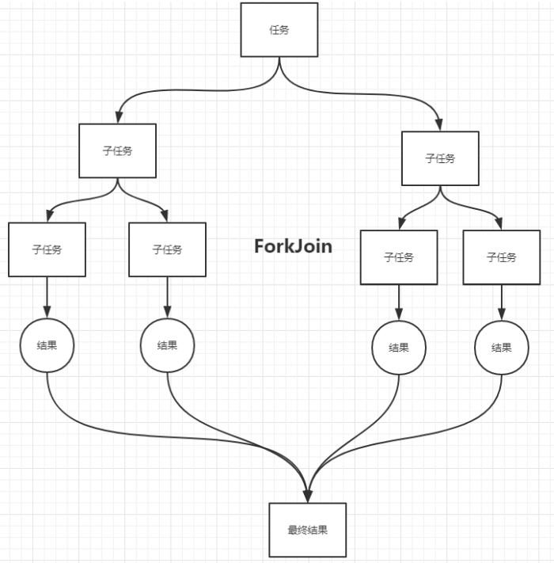

# 历届版本新特性


# JDK 1.8

- **Lambda 表达式**

- **函数式接口**
- **方法引用和构造器调用**
- **Stream API**
- **并行流和串行流**
- **Optional 容器**
- **接口中的默认方法和静态方法**
- **Nashorn JavaScript引擎**
- **新时间日期 API**
- **JVM的新特性**

## 小优化

> 在jdk1.8中对hashMap等map[集合](https://so.csdn.net/so/search?q=集合&spm=1001.2101.3001.7020)的数据结构优化。hashMap数据结构的优化
>
> - 原来的hashMap采用的[数据结构](https://so.csdn.net/so/search?q=数据结构&spm=1001.2101.3001.7020)是哈希表（数组+链表），hashMap默认大小是16，一个0-15索引的数组，如何往里面存储元素，首先调用元素的hashcode方法，计算出哈希码值，经过哈希算法算成数组的索引值，如果对应的索引处没有元素，直接存放，如果有对象在，那么比较它们的equals方法比较内容
>   如果内容一样，后一个value会将前一个value的值覆盖，如果不一样，在1.7的时候，后加的放在前面，形成一个链表，形成了碰撞，在某些情况下如果链表无限下去，那么效率极低，碰撞是避免不了的
> - 加载因子：0.75，数组扩容，达到总容量的75%，就进行扩容，但是无法避免碰撞的情况发生
> - 在1.8之后，在数组+链表+红黑树来实现hashmap，当碰撞的元素个数大于8时 & 总容量大于64，会有红黑树的引入
> - 除了添加之后，效率都比链表高，1.8之后链表新进元素加到末尾
> - ConcurrentHashMap (锁分段机制)，concurrentLevel,jdk1.8采用CAS算法(无锁算法，不再使用锁分段)，数组+链表中也引入了红黑树的使用

## **Lambda表达式**

> lambda[表达式](https://so.csdn.net/so/search?q=表达式&spm=1001.2101.3001.7020)本质上是一段匿名内部类，也可以是一段可以传递的代码

先来体验一下lambda最直观的优点：简洁代码

```java
  //匿名内部类
  Comparator<Integer> cpt = new Comparator<Integer>() {
      @Override
      public int compare(Integer o1, Integer o2) {
          return Integer.compare(o1,o2);
      }
  };

  TreeSet<Integer> set = new TreeSet<>(cpt);

  System.out.println("=========================");

  //使用lambda表达式
  Comparator<Integer> cpt2 = (x,y) -> Integer.compare(x,y);
  TreeSet<Integer> set2 = new TreeSet<>(cpt2);
```

只需要一行代码，极大减少代码量！！

这样一个场景，在商城浏览商品信息时，经常会有条件的进行筛选浏览，例如要选颜色为红色的、价格小于8000千的….

```java
// 筛选颜色为红色
public  List<Product> filterProductByColor(List<Product> list){
    List<Product> prods = new ArrayList<>();
    for (Product product : list){
        if ("红色".equals(product.getColor())){
            prods.add(product);
        }
    }
    return prods;
 }

// 筛选价格小于8千的
public  List<Product> filterProductByPrice(List<Product> list){
    List<Product> prods = new ArrayList<>();
    for (Product product : list){
        if (product.getPrice() < 8000){
            prods.add(product);
        }
    }
    return prods;
 }
```

我们发现实际上这些过滤方法的核心就只有if语句中的条件判断，其他均为模版代码，每次变更一下需求，都需要新增一个方法，然后复制黏贴，假设这个过滤方法有几百行，那么这样的做法难免笨拙了一点。如何进行优化呢？

<font color=red>优化一：使用设计模式</font>

定义一个MyPredicate接口

```java
public interface MyPredicate <T> {
    boolean test(T t);
}
```

如果想要筛选颜色为红色的商品，定义一个颜色过滤类

```java
public class ColorPredicate implements MyPredicate <Product> {

     private static final String RED = "红色";

     @Override
     public boolean test(Product product) {
         return RED.equals(product.getColor());
     }
}
```

定义过滤方法，将过滤接口当做参数传入，这样这个过滤方法就不用修改，在实际调用的时候将具体的实现类传入即可。

```java
public List<Product> filterProductByPredicate(List<Product> list,MyPredicate<Product> mp){
        List<Product> prods = new ArrayList<>();
        for (Product prod : list){
            if (mp.test(prod)){
                prods.add(prod);
            }
        }
        return prods;
    }
}
```

例如，如果想要筛选价格小于8000的商品，那么新建一个价格过滤类既可

```java
public class PricePredicate implements MyPredicate<Product> {
    @Override
    public boolean test(Product product) {
        return product.getPrice() < 8000;
    }
}
```

这样实现的话可能有人会说，每次变更需求都需要新建一个实现类，感觉还是有点繁琐呀，那么再来优化一下

优化二：使用匿名内部类

定义过滤方法：

```java
public List<Product> filterProductByPredicate(List<Product> list,MyPredicate<Product> mp){
  List<Product> prods = new ArrayList<>();
  for (Product prod : list){
    if (mp.test(prod)){
      prods.add(prod);
    }
  }
  return prods;
}
```

调用过滤方法的时候：

```java
// 按价格过滤
public void test2(){
    filterProductByPredicate(proList, new MyPredicate<Product>() {
        @Override
        public boolean test(Product product) {
            return product.getPrice() < 8000;
        }
    });
}

 // 按颜色过滤
 public void test3(){
     filterProductByPredicate(proList, new MyPredicate<Product>() {
         @Override
         public boolean test(Product product) {
             return "红色".equals(product.getColor());
         }
     });
 }
```

使用匿名内部类，就不需要每次都新建一个实现类，直接在方法内部实现。看到匿名内部类，不禁想起了Lambda表达式。

优化三：使用lambda表达式

定义过滤方法：

```java
public List<Product> filterProductByPredicate(List<Product> list,MyPredicate<Product> mp){
  List<Product> prods = new ArrayList<>();
  for (Product prod : list){
    if (mp.test(prod)){
      prods.add(prod);
    }
  }
  return prods;
}
```

使用lambda表达式进行过滤

```java
@Test
public void test4(){
      List<Product> products = filterProductByPredicate(proList, (p) -> p.getPrice() < 8000);
      for (Product pro : products){
          System.out.println(pro);
      }
  }
```

在jdk1.8中还有更加简便的操作 [Stream](https://so.csdn.net/so/search?q=Stream&spm=1001.2101.3001.7020) API

优化四：使用Stream API

甚至不用定义过滤方法，直接在集合上进行操作

```java
// 使用jdk1.8中的Stream API进行集合的操作
@Test
public void test(){
    // 根据价格过滤
    proList.stream()
           .fliter((p) -> p.getPrice() <8000)
           .limit(2)
           .forEach(System.out::println);

    // 根据颜色过滤
    proList.stream()
           .fliter((p) -> "红色".equals(p.getColor()))
           .forEach(System.out::println);

    // 遍历输出商品名称
    proList.stream()
           .map(Product::getName)
           .forEach(System.out::println);
}
```

Lmabda表达式的语法总结： `() -> ();`

表达式的语法总结： () -> ();

| 前置                                       | 语法                                                 |
| ------------------------------------------ | ---------------------------------------------------- |
| 无参数无返回值                             | () -> System.out.println(“Hello WOrld”)              |
| 有一个参数无返回值                         | (x) -> System.out.println(x)                         |
| 有且只有一个参数无返回值                   | x -> System.out.println(x)                           |
| 有多个参数，有返回值，有多条lambda体语句   | (x，y) -> {System.out.println(“xxx”);return xxxx;}； |
| 有多个参数，有返回值，只有一条lambda体语句 | (x，y) -> xxxx                                       |

口诀：左右遇一省括号，左侧推断类型省

> 注：当一个接口中存在多个抽象方法时，如果使用lambda表达式，并不能智能匹配对应的抽象方法，因此引入了函数式接口的概念

<hr>

## 函数式接口

定义了一个抽象方法的接口（Object类的public方法除外），就是函数式接口，并且还提供了注解：@FunctionalInterface

常见的四大函数式接口

- Consumer 《T》：消费型接口，有参无返回值

```java
@Test
public void test(){
  changeStr("hello",(str) -> System.out.println(str));
}

/**
     *  Consumer<T> 消费型接口
     * @param str
     * @param con
     */
public void changeStr(String str, Consumer<String> con){
  con.accept(str);
}
```

- Supplier 《T》：供给型接口，无参有返回值

```java
@Test
public void test2(){
  String value = getValue(() -> "hello");
  System.out.println(value);
}

/**
     *  Supplier<T> 供给型接口
     * @param sup
     * @return
     */
public String getValue(Supplier<String> sup){
  return sup.get();
}
```

- Function 《T,R》：:函数式接口，有参有返回值

```java
@Test
public void test3(){
  Long result = changeNum(100L, (x) -> x + 200L);
  System.out.println(result);
}

/**
     *  Function<T,R> 函数式接口
     * @param num
     * @param fun
     * @return
     */
public Long changeNum(Long num, Function<Long, Long> fun){
  return fun.apply(num);
}
```

- Predicate《T》： 断言型接口，有参有返回值，返回值是boolean类型

```java
public void test4(){
  boolean result = changeBoolean("hello", (str) -> str.length() > 5);
  System.out.println(result);
}

/**
     *  Predicate<T> 断言型接口
     * @param str
     * @param pre
     * @return
     */
public boolean changeBoolean(String str, Predicate<String> pre){
  return pre.test(str);
}
```

在四大核心函数式接口基础上，还提供了诸如BiFunction、BinaryOperation、toIntFunction等扩展的函数式接口，都是在这四种函数式接口上扩展而来的，不做赘述。

总结：函数式接口的提出是为了让我们更加方便的使用lambda表达式，不需要自己再手动创建一个函数式接口，直接拿来用就好了

<hr>

## **方法引用和构造器调用**

> 若lambda体中的内容有方法已经实现了，那么可以使用“方法引用”
> 也可以理解为方法引用是lambda表达式的另外一种表现形式并且其语法比lambda表达式更加简单	

### 方法引用

三种表现形式：

- 对象：：实例方法名
- 类：：静态方法名
- 类：：实例方法名 （lambda参数列表中第一个参数是实例方法的调用 者，第二个参数是实例方法的参数时可用）

```java
public void test() {
  /**
        *注意：
        *   1.lambda体中调用方法的参数列表与返回值类型，要与函数式接口中抽象方法的函数列表和返回值类型保持一致！
        *   2.若lambda参数列表中的第一个参数是实例方法的调用者，而第二个参数是实例方法的参数时，可以使用ClassName::method
        *
        */
  Consumer<Integer> con = (x) -> System.out.println(x);
  con.accept(100);

  // 方法引用-对象::实例方法
  Consumer<Integer> con2 = System.out::println;
  con2.accept(200);

  // 方法引用-类名::静态方法名
  BiFunction<Integer, Integer, Integer> biFun = (x, y) -> Integer.compare(x, y);
  BiFunction<Integer, Integer, Integer> biFun2 = Integer::compare;
  Integer result = biFun2.apply(100, 200);

  // 方法引用-类名::实例方法名
  BiFunction<String, String, Boolean> fun1 = (str1, str2) -> str1.equals(str2);
  BiFunction<String, String, Boolean> fun2 = String::equals;
  Boolean result2 = fun2.apply("hello", "world");
  System.out.println(result2);
}
```

### 构造器引用

`格式：ClassName::new`

```java
public void test2() {

  // 构造方法引用  类名::new
  Supplier<Employee> sup = () -> new Employee();
  System.out.println(sup.get());
  Supplier<Employee> sup2 = Employee::new;
  System.out.println(sup2.get());

  // 构造方法引用 类名::new （带一个参数）
  Function<Integer, Employee> fun = (x) -> new Employee(x);
  Function<Integer, Employee> fun2 = Employee::new;
  System.out.println(fun2.apply(100));
}
```

### 数组引用

`格式：Type[]::new`

```java
public void test(){
  // 数组引用
  Function<Integer, String[]> fun = (x) -> new String[x];
  Function<Integer, String[]> fun2 = String[]::new;
  String[] strArray = fun2.apply(10);
  Arrays.stream(strArray).forEach(System.out::println);
}
```


## Stream API

新增的[Stream API](http://www.javacodegeeks.com/2014/05/the-effects-of-programming-with-java-8-streams-on-algorithm-performance.html)（java.util.stream）将生成环境的函数式编程引入了Java库中。

这是目前为止最大的一次对`Java`库的完善，以便开发者能够写出更加有效、更加简洁和紧凑的代码。

Stream操作的三个步骤

- 创建 stream

```java
// 1，校验通过Collection 系列集合提供的stream()或者paralleStream()
List<String> list = new ArrayList<>();
Strean<String> stream1 = list.stream();

// 2.通过Arrays的静态方法stream()获取数组流
String[] str = new String[10];
Stream<String> stream2 = Arrays.stream(str);

// 3.通过Stream类中的静态方法of
Stream<String> stream3 = Stream.of("aa","bb","cc");

// 4.创建无限流
// 迭代
Stream<Integer> stream4 = Stream.iterate(0,(x) -> x+2);

//生成
Stream.generate(() ->Math.random());
```

- 中间操作（过滤、map）

```java
/**
   * 筛选 过滤  去重
   */
  emps.stream()
          .filter(e -> e.getAge() > 10)
          .limit(4)
          .skip(4)
          // 需要流中的元素重写hashCode和equals方法
          .distinct()
          .forEach(System.out::println);


  /**
   *  生成新的流 通过map映射
   */
  emps.stream()
          .map((e) -> e.getAge())
          .forEach(System.out::println);


  /**
   *  自然排序  定制排序
   */
  emps.stream()
          .sorted((e1 ,e2) -> {
              if (e1.getAge().equals(e2.getAge())){
                  return e1.getName().compareTo(e2.getName());
              } else{
                  return e1.getAge().compareTo(e2.getAge());
              }
          })
          .forEach(System.out::println);
```

- 终止操作

```java
 /**
         *      查找和匹配
         *          allMatch-检查是否匹配所有元素
         *          anyMatch-检查是否至少匹配一个元素
         *          noneMatch-检查是否没有匹配所有元素
         *          findFirst-返回第一个元素
         *          findAny-返回当前流中的任意元素
         *          count-返回流中元素的总个数
         *          max-返回流中最大值
         *          min-返回流中最小值
         */

        /**
         *  检查是否匹配元素
         */
        boolean b1 = emps.stream()
                .allMatch((e) -> e.getStatus().equals(Employee.Status.BUSY));
        System.out.println(b1);

        boolean b2 = emps.stream()
                .anyMatch((e) -> e.getStatus().equals(Employee.Status.BUSY));
        System.out.println(b2);

        boolean b3 = emps.stream()
                .noneMatch((e) -> e.getStatus().equals(Employee.Status.BUSY));
        System.out.println(b3);

        Optional<Employee> opt = emps.stream()
                .findFirst();
        System.out.println(opt.get());

        // 并行流
        Optional<Employee> opt2 = emps.parallelStream()
                .findAny();
        System.out.println(opt2.get());

        long count = emps.stream()
                .count();
        System.out.println(count);

        Optional<Employee> max = emps.stream()
                .max((e1, e2) -> Double.compare(e1.getSalary(), e2.getSalary()));
        System.out.println(max.get());

        Optional<Employee> min = emps.stream()
                .min((e1, e2) -> Double.compare(e1.getSalary(), e2.getSalary()));
        System.out.println(min.get());
```

还有功能比较强大的两个终止操作 `reduce`和`collect`
`reduce`操作： reduce:(T identity,BinaryOperator)                    reduce(BinaryOperator)    

​						可以将流中元素反复结合起来，得到一个值

```java
         /**
         *  reduce ：规约操作
         */
        List<Integer> list = Arrays.asList(1,2,3,4,5,6,7,8,9,10);
        Integer count2 = list.stream()
                .reduce(0, (x, y) -> x + y);
        System.out.println(count2);

        Optional<Double> sum = emps.stream()
                .map(Employee::getSalary)
                .reduce(Double::sum);
        System.out.println(sum);
```

`collect`操作：Collect   -   将流转换为其他形式，接收一个Collection接口的实现，用于给Stream中元素做汇总的方法

```java
        /**
         *  collect：收集操作
         */

        List<Integer> ageList = emps.stream()
                .map(Employee::getAge)
                .collect(Collectors.toList());
        ageList.stream().forEach(System.out::println);
```

Steam API极大得简化了集合操作（后面我们会看到不止是集合），首先看下这个叫Task的类：

```java
public class Streams  {
    private enum Status {
        OPEN, CLOSED
    };
 
    private static final class Task {
        private final Status status;
        private final Integer points;
 
        Task( final Status status, final Integer points ) {
            this.status = status;
            this.points = points;
        }
 
        public Integer getPoints() {
            return points;
        }
 
        public Status getStatus() {
            return status;
        }
 
        @Override
        public String toString() {
            return String.format( "[%s, %d]", status, points );
        }
    }
}
```

Task类有一个分数（或伪复杂度）的概念，另外还有两种状态：OPEN或者CLOSED。现在假设有一个task集合：

```java
final Collection< Task > tasks = Arrays.asList(
    new Task( Status.OPEN, 5 ),
    new Task( Status.OPEN, 13 ),
    new Task( Status.CLOSED, 8 ) 
);
```

首先看一个问题：在这个task集合中一共有多少个OPEN状态的点？

在Java 8之前，要解决这个问题，则需要使用**foreach**循环遍历`task`集合

但是在Java 8中可以利用steams解决：包括一系列元素的列表，并且支持顺序和并行处理。

```php
// Calculate total points of all active tasks using sum()
final long totalPointsOfOpenTasks = tasks
    .stream()
    .filter( task -> task.getStatus() == Status.OPEN )
    .mapToInt( Task::getPoints )
    .sum();
 
System.out.println( "Total points: " + totalPointsOfOpenTasks );
```

运行这个方法的控制台输出是：

```undefined
Total points: 18
```

这里有很多知识点值得说。

- 首先，tasks集合被转换成`steam`表示
- 其次，在`steam`上的**filter**操作会过滤掉所有`CLOSED`的`task`
- 第三，**mapToInt**操作基于每个task实例的**Task::getPoints**方法将task流转换成Integer集合；最后，通过**sum**方法计算总和，得出最后的结果。

在学习下一个例子之前，还需要记住一些steams（[点此更多细节](http://docs.oracle.com/javase/8/docs/api/java/util/stream/package-summary.html#StreamOps)）的知识点。Steam之上的操作可分为中间操作和晚期操作。

中间操作会返回一个新的steam——执行一个中间操作（例如**filter**）并不会执行实际的过滤操作，而是创建一个新的`steam`，并将原`steam`中符合条件的元素放入新创建的`steam`。

晚期操作（例如**forEach**或者**sum**），会遍历steam并得出结果或者附带结果；在执行晚期操作之后，steam处理线已经处理完毕，就不能使用了。在几乎所有情况下，晚期操作都是立刻对steam进行遍历。

steam的另一个价值是创造性地支持并行处理（parallel processing）。对于上述的tasks集合，我们可以用下面的代码计算所有任务的点数之和：

```java
// Calculate total points of all tasks
final double totalPoints = tasks
   .stream()
   .parallel()
   .map( task -> task.getPoints() ) // or map( Task::getPoints ) 
   .reduce( 0, Integer::sum );
 
System.out.println( "Total points (all tasks): " + totalPoints );
```

这里我们使用**parallel**方法并行处理所有的task，并使用**reduce**方法计算最终的结果。控制台输出如下：

```r
Total points（all tasks）: 26.0
```

对于一个集合，经常需要根据某些条件对其中的元素分组。利用steam提供的API可以很快完成这类任务，代码如下：

```java
// Group tasks by their status
final Map< Status, List< Task > > map = tasks
    .stream()
    .collect( Collectors.groupingBy( Task::getStatus ) );
System.out.println( map );
```

控制台的输出如下：

```cpp
{CLOSED=[[CLOSED, 8]], OPEN=[[OPEN, 5], [OPEN, 13]]}
```

最后一个关于tasks集合的例子问题是：如何计算集合中每个任务的点数在集合中所占的比重，具体处理的代码如下：

```java
// Calculate the weight of each tasks (as percent of total points) 
final Collection< String > result = tasks
    .stream()                                        // Stream< String >
    .mapToInt( Task::getPoints )                     // IntStream
    .asLongStream()                                  // LongStream
    .mapToDouble( points -> points / totalPoints )   // DoubleStream
    .boxed()                                         // Stream< Double >
    .mapToLong( weigth -> ( long )( weigth * 100 ) ) // LongStream
    .mapToObj( percentage -> percentage + "%" )      // Stream< String> 
    .collect( Collectors.toList() );                 // List< String > 
 
System.out.println( result );
```

控制台输出结果如下：

```json
[19%, 50%, 30%]
```

最后，正如之前所说，Steam API不仅可以作用于Java集合，传统的IO操作（从文件或者网络一行一行得读取数据）可以受益于steam处理，这里有一个小例子：

```java
final Path path = new File( filename ).toPath();
try( Stream< String > lines = Files.lines( path, StandardCharsets.UTF_8 ) ) {
    lines.onClose( () -> System.out.println("Done!") ).forEach( System.out::println );
}
```

Stream的方法**onClose** 返回一个等价的有额外句柄的Stream，当Stream的close（）方法被调用的时候这个句柄会被执行。Stream API、Lambda表达式还有接口默认方法和静态方法支持的方法引用，是Java 8对软件开发的现代范式的响应。

<hr>

## 并行流和串行流

> 在jdk1.8新的stream包中针对集合的操作也提供了并行操作流和串行操作流。
>
> 并行流就是把内容切割成多个数据块，并且使用多个线程分别处理每个数据块的内容。
>
> Stream api中声明可以通过`parallel()`与`sequential()`方法在并行流和串行流之间进行切换。
> jdk1.8并行流使用的是`fork/join`框架进行并行操作

### ForkJoin框架

Fork/Join 框架：就是在必要的情况下，将一个大任务，进行拆分(fork)成若干个小任务（拆到不可再拆时），再将一个个的小任务运算的结果进行 join 汇总。

<font color=red>关键字：递归分合、分而治之。</font>



 “工作窃取”模式（work-stealing）：当执行新的任务时它可以将其拆分分成更小的任务执行，并将小任务加到线
程队列中，然后再从一个随机线程的队列中偷一个并把它放在自己的队列中相对于一般的线程池实现，fork/join框架的优势体现在对其中包含的任务的处理方式上。

在一般的线程池中，如果一个线程正在执行的任务由于某些原因无法继续运行，那么该线程会处于等待状态。

而在fork/join框架实现中，如果某个子问题由于等待另外一个子问题的完成而无法继续运行。那么处理该子问题的线程会主动寻找其他尚未运行的子问题来执行。这种方式减少了线程的等待时间，提高了性能.。

```java
/**
 * 要想使用Fark—Join，类必须继承
 * RecursiveAction（无返回值）
 * Or
 * RecursiveTask（有返回值）
*
*/
public class ForkJoin extends RecursiveTask<Long> {

  /**
     * 要想使用Fark—Join，类必须继承RecursiveAction（无返回值） 或者
     * RecursiveTask（有返回值）
     *
     * @author Wuyouxin
     */
  private static final long serialVersionUID = 23423422L;

  private long start;
  private long end;

  public ForkJoin() {
  }

  public ForkJoin(long start, long end) {
    this.start = start;
    this.end = end;
  }

  // 定义阙值
  private static final long THRESHOLD = 10000L;

  @Override
  protected Long compute() {
    if (end - start <= THRESHOLD) {
      long sum = 0;
      for (long i = start; i < end; i++) {
        sum += i;
      }
      return sum;
    } else {
      long middle = (end - start) / 2;
      ForkJoin left = new ForkJoin(start, middle);
      //拆分子任务，压入线程队列
      left.fork();
      ForkJoin right = new ForkJoin(middle + 1, end);
      right.fork();

      //合并并返回
      return left.join() + right.join();
    }
  }

  /**
     * 实现数的累加
     */
  @Test
  public void test1() {
    //开始时间
    Instant start = Instant.now();

    //这里需要一个线程池的支持
    ForkJoinPool pool = new ForkJoinPool();

    ForkJoinTask<Long> task = new ForkJoin(0L, 10000000000L);
    // 没有返回值     pool.execute();
    // 有返回值
    long sum = pool.invoke(task);

    //结束时间
    Instant end = Instant.now();
    System.out.println(Duration.between(start, end).getSeconds());
  }

  /**
     * java8 并行流 parallel()
     */
  @Test
  public void test2() {
    //开始时间
    Instant start = Instant.now();

    // 并行流计算    累加求和
    LongStream.rangeClosed(0, 10000000000L).parallel()
      .reduce(0, Long :: sum);

    //结束时间
    Instant end = Instant.now();
    System.out.println(Duration.between(start, end).getSeconds());
  }

  @Test
  public void test3(){
    List<Integer> list = Arrays.asList(1, 2, 3, 4, 5);
    list.stream().forEach(System.out::print);

    list.parallelStream()
      .forEach(System.out::print);
  }
```

展示多线程的效果：

```java
@Test
public void test(){
  // 并行流 多个线程执行
  List<Integer> numbers = Arrays.asList(1, 2, 3, 4, 5, 6, 7, 8, 9);
  numbers.parallelStream()
    .forEach(System.out::print);

  //
  System.out.println("=========================");
  numbers.stream()
    .sequential()
    .forEach(System.out::print);
}
```

<hr>

## Optional 容器

Java应用中最常见的bug就是`空值异常`。在Java 8之前，[Google Guava](http://code.google.com/p/guava-libraries/)引入了**Optionals**类来解决**NullPointerException**，从而避免源码被各种**`null`**检查污染，以便开发者写出更加整洁的代码。

Java 8也将**Optional**加入了官方库

使用Optional容器可以快速的定位`NPE`，并且在一定程度上可以减少对参数非空检验的代码量。

```java
Optional< String > fullName = Optional.ofNullable( null );
System.out.println( "Full Name is set? " + fullName.isPresent() );        
System.out.println( "Full Name: " + fullName.orElseGet( () -> "[none]" ) ); 
System.out.println( fullName.map( s -> "Hey " + s + "!" ).orElse( "Hey Stranger!" ) );
---## 结果如下 ##---
Full Name is set? false
Full Name: [none]
Hey Stranger!

/**
     *      Optional.of(T t); // 创建一个Optional实例
     *      Optional.empty(); // 创建一个空的Optional实例
     *      Optional.ofNullable(T t); // 若T不为null，创建一个Optional实例，否则创建一个空实例
     *      isPresent();    // 判断是够包含值
     *      orElse(T t);   //如果调用对象包含值，返回该值，否则返回T
     *      orElseGet(Supplier s);  // 如果调用对象包含值，返回该值，否则返回s中获取的值
     *      map(Function f): // 如果有值对其处理，并返回处理后的Optional，否则返回Optional.empty();
     *      flatMap(Function mapper);// 与map类似。返回值是Optional
     *
     *      总结：Optional.of(null)  会直接报NPE
     */
Optional<Employee> op = Optional.of(new Employee("zhansan", 11, 12.32, Employee.Status.BUSY));
        System.out.println(op.get());

        // NPE
        Optional<Employee> op2 = Optional.of(null);
        System.out.println(op2);
@Test
    public void test2(){
        Optional<Object> op = Optional.empty();
        System.out.println(op);

        // No value present
        System.out.println(op.get());
    }
@Test
    public void test3(){
        Optional<Employee> op = Optional.ofNullable(new Employee("lisi", 33, 131.42, Employee.Status.FREE));
        System.out.println(op.get());

        Optional<Object> op2 = Optional.ofNullable(null);
        System.out.println(op2);
       // System.out.println(op2.get());
    }
    @Test
    public void test5(){
        Optional<Employee> op1 = Optional.ofNullable(new Employee("张三", 11, 11.33, Employee.Status.VOCATION));
        System.out.println(op1.orElse(new Employee()));
        System.out.println(op1.orElse(null));
    }

    @Test
    public void test6(){
        Optional<Employee> op1 = Optional.of(new Employee("田七", 11, 12.31, Employee.Status.BUSY));
        op1 = Optional.empty();
        Employee employee = op1.orElseGet(() -> new Employee());
        System.out.println(employee);
    }

    @Test
    public void test7(){
        Optional<Employee> op1 = Optional.of(new Employee("田七", 11, 12.31, Employee.Status.BUSY));
        System.out.println(op1.map( (e) -> e.getSalary()).get());
    }
```

如果**Optional**实例持有一个非空值，则**isPresent()**方法返回true，否则返回false

**orElseGet()**方法，**Optional**实例持有null，则可以接受一个lambda表达式生成的默认值

`map()`**方法可以将现有的**`Opetional`**实例的值转换成新的值**

`orElse()`**方法与**`orElseGet()`方法类似，但是在持有`null`的时候返回传入的默认值


## 接口定义默认实现方法和静态方法

使用`default`和`static`关键字来修饰接口中定义的普通方法

```java
public interface Interface {
    default  String getName(){
        return "zhangsan";
    }

    static String getName2(){
        return "zhangsan";
    }
}
```

在JDK1.8中很多接口会新增方法，为了保证1.8向下兼容，1.7版本中的接口实现类不用每个都重新实现新添加的接口方法，引入了`default`默认实现，`static`的用法是直接用接口名去调方法即可。

当一个类继承父类又实现接口时，若后两者方法名相同，则优先继承父类中的同名方法，即“`类优先`”，如果实现两个同名方法的接口，则要求实现类必须手动声明默认实现哪个接口中的方法。

<hr>

## Nashorn JavaScript引擎

Java 8提供了新的[Nashorn JavaScript引擎](http://www.javacodegeeks.com/2014/02/java-8-compiling-lambda-expressions-in-the-new-nashorn-js-engine.html)，使得我们可以在JVM上开发和运行JS应用。Nashorn JavaScript引擎是javax.script.ScriptEngine的另一个实现版本，这类Script引擎遵循相同的规则，允许Java和JavaScript交互使用，例子代码如下：

```java
ScriptEngineManager manager = new ScriptEngineManager();
ScriptEngine engine = manager.getEngineByName( "JavaScript" );
 
System.out.println( engine.getClass().getName() );
System.out.println( "Result:" + engine.eval( "function f() { return 1; }; f() + 1;" ) );
```

这个代码的输出结果如下：

```java
jdk.nashorn.api.scripting.NashornScriptEngine
Result: 2
```


<hr>

## 新时间日期 API


```java
@Test
public void test(){
  // 从默认时区的系统时钟获取当前的日期时间。不用考虑时区差
  LocalDateTime date = LocalDateTime.now();
  //2018-07-15T14:22:39.759
  System.out.println(date);

  System.out.println(date.getYear());
  System.out.println(date.getMonthValue());
  System.out.println(date.getDayOfMonth());
  System.out.println(date.getHour());
  System.out.println(date.getMinute());
  System.out.println(date.getSecond());
  System.out.println(date.getNano());

  // 手动创建一个LocalDateTime实例
  LocalDateTime date2 = LocalDateTime.of(2017, 12, 17, 9, 31, 31, 31);
  System.out.println(date2);
  // 进行加操作，得到新的日期实例
  LocalDateTime date3 = date2.plusDays(12);
  System.out.println(date3);
  // 进行减操作，得到新的日期实例
  LocalDateTime date4 = date3.minusYears(2);
  System.out.println(date4);
}

@Test
public void test2(){
  // 时间戳  1970年1月1日00：00：00 到某一个时间点的毫秒值
  // 默认获取UTC时区
  Instant ins = Instant.now();
  System.out.println(ins);

  System.out.println(LocalDateTime.now().toInstant(ZoneOffset.of("+8")).toEpochMilli());
  System.out.println(System.currentTimeMillis());

  System.out.println(Instant.now().toEpochMilli());
  System.out.println(Instant.now().atOffset(ZoneOffset.ofHours(8)).toInstant().toEpochMilli());
}

@Test
public void test3(){
  // Duration:计算两个时间之间的间隔
  // Period：计算两个日期之间的间隔

  Instant ins1 = Instant.now();

  try {
    Thread.sleep(1000);
  } catch (InterruptedException e) {
    e.printStackTrace();
  }
  Instant ins2 = Instant.now();
  Duration dura = Duration.between(ins1, ins2);
  System.out.println(dura);
  System.out.println(dura.toMillis());

  System.out.println("======================");
  LocalTime localTime = LocalTime.now();
  try {
    Thread.sleep(1000);
  } catch (InterruptedException e) {
    e.printStackTrace();
  }
  LocalTime localTime2 = LocalTime.now();
  Duration du2 = Duration.between(localTime, localTime2);
  System.out.println(du2);
  System.out.println(du2.toMillis());
}

@Test
public void test4(){
  LocalDate localDate =LocalDate.now();

  try {
    Thread.sleep(1000);
  } catch (InterruptedException e) {
    e.printStackTrace();
  }

  LocalDate localDate2 = LocalDate.of(2016,12,12);
  Period pe = Period.between(localDate, localDate2);
  System.out.println(pe);
}

@Test
public void test5(){
  // temperalAdjust 时间校验器
  // 例如获取下周日  下一个工作日
  LocalDateTime ldt1 = LocalDateTime.now();
  System.out.println(ldt1);

  // 获取一年中的第一天
  LocalDateTime ldt2 = ldt1.withDayOfYear(1);
  System.out.println(ldt2);
  // 获取一个月中的第一天
  LocalDateTime ldt3 = ldt1.withDayOfMonth(1);
  System.out.println(ldt3);

  LocalDateTime ldt4 = ldt1.with(TemporalAdjusters.next(DayOfWeek.FRIDAY));
  System.out.println(ldt4);

  // 获取下一个工作日
  LocalDateTime ldt5 = ldt1.with((t) -> {
    LocalDateTime ldt6 = (LocalDateTime)t;
    DayOfWeek dayOfWeek = ldt6.getDayOfWeek();
    if (DayOfWeek.FRIDAY.equals(dayOfWeek)){
      return ldt6.plusDays(3);
    }
    else if (DayOfWeek.SATURDAY.equals(dayOfWeek)){
      return ldt6.plusDays(2);
    }
    else {
      return ldt6.plusDays(1);
    }
  });
  System.out.println(ldt5);
}

@Test
public void test6(){
  // DateTimeFormatter: 格式化时间/日期
  // 自定义格式
  LocalDateTime ldt = LocalDateTime.now();
  DateTimeFormatter formatter = DateTimeFormatter.ofPattern("yyyy年MM月dd日");
  String strDate1 = ldt.format(formatter);
  String strDate = formatter.format(ldt);
  System.out.println(strDate);
  System.out.println(strDate1);

  // 使用api提供的格式
  DateTimeFormatter dtf = DateTimeFormatter.ISO_DATE;
  LocalDateTime ldt2 = LocalDateTime.now();
  String strDate3 = dtf.format(ldt2);
  System.out.println(strDate3);

  // 解析字符串to时间
  DateTimeFormatter df = DateTimeFormatter.ofPattern("yyyy-MM-dd HH:mm:ss");
  LocalDateTime time = LocalDateTime.now();
  String localTime = df.format(time);
  LocalDateTime ldt4 = LocalDateTime.parse("2017-09-28 17:07:05",df);
  System.out.println("LocalDateTime转成String类型的时间："+localTime);
  System.out.println("String类型的时间转成LocalDateTime："+ldt4);
}

// ZoneTime  ZoneDate       ZoneDateTime
@Test
public void test7(){
  LocalDateTime now = LocalDateTime.now(ZoneId.of("Asia/Shanghai"));
  System.out.println(now);

  LocalDateTime now2 = LocalDateTime.now();
  ZonedDateTime zdt = now2.atZone(ZoneId.of("Asia/Shanghai"));
  System.out.println(zdt);

  Set<String> set = ZoneId.getAvailableZoneIds();
  set.stream().forEach(System.out::println);
}
```

 * 之前使用的java.util.Date月份从0开始，我们一般会+1使用，很不方便，java.time.LocalDate月份和星期都改成了enum
 * java.util.Date和SimpleDateFormat都不是线程安全的，而LocalDate和LocalTime和最基本的String一样，是不变类型，不但线程安全，而且不能修改。
 * java.util.Date是一个“万能接口”，它包含日期、时间，还有毫秒数，更加明确需求取舍
 * 新接口更好用的原因是考虑到了日期时间的操作，经常发生往前推或往后推几天的情况。用java.util.Date配合Calendar要写好多代码，而且一般的开发人员还不一定能写对。


### LocalDate

```java
public static void localDateTest() {
  //获取当前日期,只含年月日 固定格式 yyyy-MM-dd    2018-05-04
  LocalDate today = LocalDate.now();

  // 根据年月日取日期，5月就是5，
  LocalDate oldDate = LocalDate.of(2018, 5, 1);

  // 根据字符串取：默认格式yyyy-MM-dd，02不能写成2
  LocalDate yesteday = LocalDate.parse("2018-05-03");

  // 如果不是闰年 传入29号也会报错
  LocalDate.parse("2018-02-29");
}

/** 常用转化
  * 日期转换常用,第一天或者最后一天...
  */
public static void localDateTransferTest(){
  //2018-05-04
  LocalDate today = LocalDate.now();
  // 取本月第1天： 2018-05-01
  LocalDate firstDayOfThisMonth = today.with(TemporalAdjusters.firstDayOfMonth());
  // 取本月第2天：2018-05-02
  LocalDate secondDayOfThisMonth = today.withDayOfMonth(2);
  // 取本月最后一天，再也不用计算是28，29，30还是31： 2018-05-31
  LocalDate lastDayOfThisMonth = today.with(TemporalAdjusters.lastDayOfMonth());
  // 取下一天：2018-06-01
  LocalDate firstDayOf2015 = lastDayOfThisMonth.plusDays(1);
  // 取2018年10月第一个周三 so easy?：  2018-10-03
  LocalDate thirdMondayOf2018 = LocalDate.parse("2018-10-01").with(TemporalAdjusters.firstInMonth(DayOfWeek.WEDNESDAY));
}
```

### LocalTime

```java
 public static void localTimeTest(){
   //16:25:46.448(纳秒值)
   LocalTime todayTimeWithMillisTime = LocalTime.now();
   //16:28:48 不带纳秒值
   LocalTime todayTimeWithNoMillisTime = LocalTime.now().withNano(0);
   LocalTime time1 = LocalTime.parse("23:59:59");
 }
```

### LocalDateTime

```java
public static void localDateTimeTest(){
  //转化为时间戳  毫秒值
  long time1 = LocalDateTime.now().toInstant(ZoneOffset.of("+8")).toEpochMilli();
  long time2 = System.currentTimeMillis();

  //时间戳转化为localdatetime
  DateTimeFormatter df= DateTimeFormatter.ofPattern("YYYY-MM-dd HH:mm:ss.SSS");

  System.out.println(df.format(LocalDateTime.ofInstant(Instant.ofEpochMilli(time1),ZoneId.of("Asia/Shanghai"))));
}
```

<hr>

## JVM的新特性

使用**[Metaspace](http://www.javacodegeeks.com/2013/02/java-8-from-permgen-to-metaspace.html)**（[JEP 122](http://openjdk.java.net/jeps/122)）代替持久代（**PermGen** space）。在JVM参数方面，使用**`-XX:MetaSpaceSize`**和**`-XX:MaxMetaspaceSize`**代替原来的**`-XX:PermSize`**和**`-XX:MaxPermSize`**。

<hr>

## 编译器的新特性

参数名称：

为了在运行时获得Java程序中方法的参数名称，老一辈的Java程序员必须使用不同方法，例如[Paranamer liberary](https://github.com/paul-hammant/paranamer)。

Java 8终于将这个特性规范化，在语言层面（使用反射API和**`Parameter.getName()`方法**）和字节码层面（使用新的**`javac`**编译器以及**`-parameters`**参数）提供支持。

```java
package com.javacodegeeks.java8.parameter.names;
 
import java.lang.reflect.Method;
import java.lang.reflect.Parameter;
 
public class ParameterNames {
    public static void main(String[] args) throws Exception {
        Method method = ParameterNames.class.getMethod( "main", String[].class );
        for( final Parameter parameter: method.getParameters() ) {
            System.out.println( "Parameter: " + parameter.getName() );
        }
    }
}
```

在Java 8中这个特性是默认关闭的，因此如果不带**-parameters**参数编译上述代码并运行，则会输出如下结果：

```sql
Parameter: arg0
```

如果带**-parameters**参数，则会输出如下结果（正确的结果）：

```sql
Parameter: args
```

如果你使用Maven进行项目管理，则可以在**maven-compiler-plugin**编译器的配置项中配置**-parameters**参数：

```xml
<plugin>
    <groupId>org.apache.maven.plugins</groupId>
    <artifactId>maven-compiler-plugin</artifactId>
    <version>3.1</version>
    <configuration>
        <compilerArgument>-parameters</compilerArgument>
        <source>1.8</source>
        <target>1.8</target>
    </configuration>
</plugin>
```


<hr>

# JDK 9

- **集合加强**
- **私有接口方法**
- **垃圾收集机制**
- **`I/O`流加强**
- **`JShell`工具**


## 集合加强

jdk9为所有集合（List/Set/Map）都增加了`of`和`copyOf`方法，用来创建不可变集合，即一旦创建就无法再执行添加、删除、替换、排序等操作，否则将报`java.lang.UnsupportedOperationException`异常。

例子如下：

```java
List strs = List.of("Hello", "World");

List strsCopy = List. copyOf(strs);

Set strs = Set.of("Hello", "World");

Map maps = Map.of("Hello", 1, "World", 2);
```

## 私有接口方法

jdk8提供了接口的默认方法（default）和静态方法，打破了之前接口只能定义方法而不能存在行为。

jdk9则是允许接口定义私有方法，私有方法可以作为通用方法放在默认方法中调用，不过实际中并无多大用处，至少对我来说。


# JDK 10

- **局部变量类型推断**
- **线程本地握手**
- **`GC`改进和内存管理**


# JDK 11

- **字符串加强**
- **HttClient API**
- **Lambda 参数的局部变量语法**
- **ZGC**

> 总结并优化了 JDK9、10 的几乎所有新特性，这里就不再赘述！


# JDK 12

- Switch Expressions
- Shenandoah GC


# JDK 13


# JDK 17