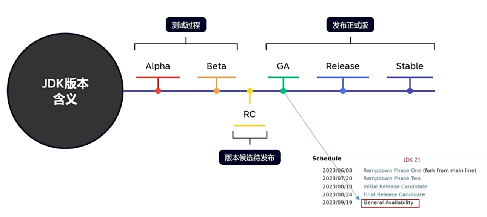
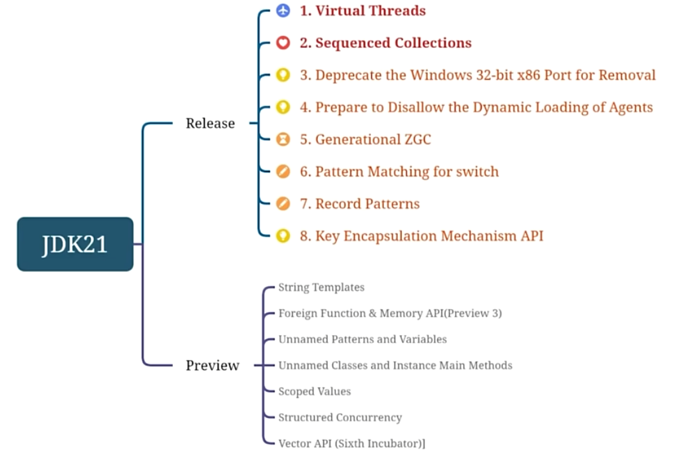
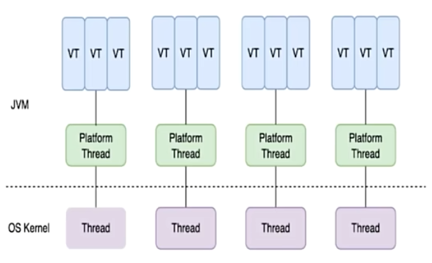
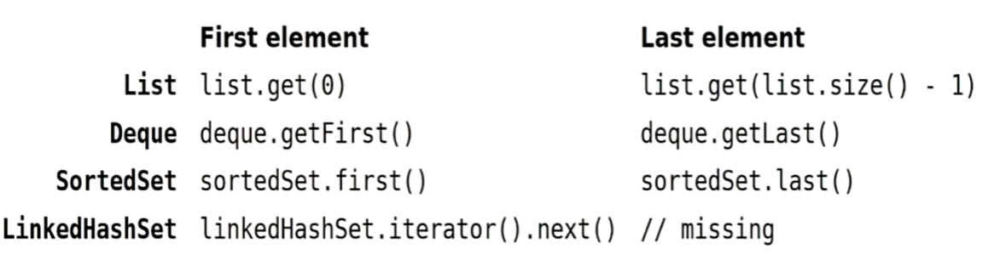
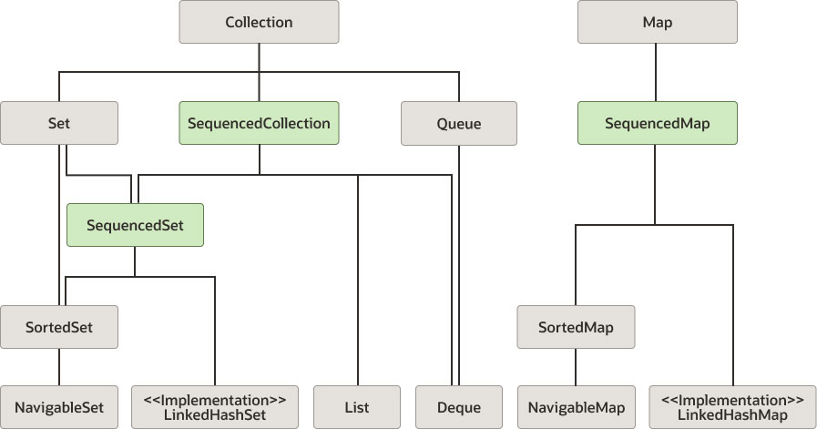
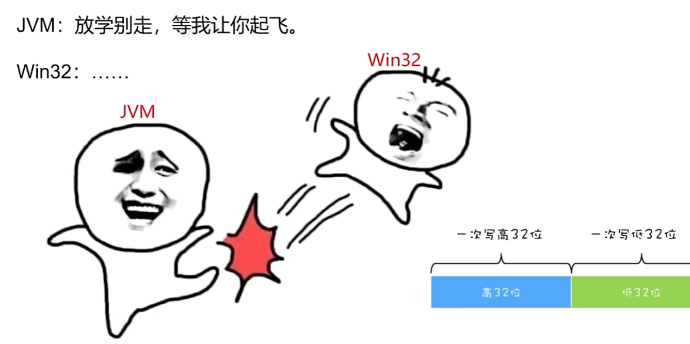

# JDK 21








## Virtual Threads




```java
try (var executor = Executors.newVirtualThreadPerTaskExecutor()) {
    IntStream.range(0, 10_000).forEach(i ->{
        executor.submit(() -> {
            Thread.sleep(Duration.ofSeconds(1) );
            return i;
        });
    });
}	// executor.close() is called implicitly, and waits
```


## Sequedced Collections



```java
interface sequencedcollection<E> extends collection<E> {
    // new method
    sequencedcollection<E> reversed();
    // methods promoted from Deque
    void addFirst(E);
    void addLast(E);
    E getFirst();
    E getLast();
    E removeFirst();
    E removeLast();
}
```



> https://docs.oracle.com/en/java/javase/21/core/index.html#Java-Platform%2C-Standard-Edition


## Deprecate the Windows 32-bit x86 Port for Removal





## Prepare to Disallow the Dynamic Loading of Agents
- 将代理动态加载到正在运行的 JVM 中时发出警告。这些警告旨在让用户为将来的版本做好准备，该版本默认情况下不允许动态加载代理，以提高默认情况下的完整性。

- 动态加载代理允许开发人员在运行时修改和监视 Java 应用程序的行为。虽然这对于调试和性能分析等方面非常有用，但也存在潜在的安全风险。恶意代码可能会利用动态加载代理的功能来执行恶意操作，例如窃取敏感信息、篡改数据等。

  因此，为了加强 Java 应用程序的安全性，限制动态加载代理的使用是很有必要的。


## Generational ZGC
- 通过扩展 ZGC 垃圾回收器来提高应用程序性能，区分年轻代和年老代分开垃圾回收。对于通过高频率的垃圾回收可以迅速释放 JVM 内存，从而提升性能
- 为什么 ZGC 出了5年了才有分代收集?
  因为 ZGC 分代实现起来麻烦，所以先实现了一个比较简单可用的版本。然后时隔 5 年才弄出了分代 Gc


## Pattern Matching for switch

```java
// Prior to Java 21
static string formatter(object obj) {
    string formatted = "unknown";
    if (obj instanceof Integer i) {
        formatted = String.format("int %d", i);
    } else if (obj instanceof Long 1) {
    	formatted - String.format("long %d", 1);
    } else if (obj instanceof Double d) {
    	formatted - String.format("double %f" ,d);
    } else if (obj instanceof string s) {
    	formatted - String.format("string %s", s);
    }
    return formatted;
}
```

```java
// As of Java 21
static string formatterPatternSwitch(object obj) {
    return switch (obj) {
    	case Integer i -> String.format("int %d"，i)
        case Long l    -> String.format("long %d", l)
        case Double d  -> String.format( "double %f", d)
        case String s  -> String.format("string %s", s)
        default        -> obj.toString();
    };
}
```


## Record Patterns

实现原理主要涉及两个方面：

- 记录类型
  记录类型是一种新的类声明形式，通过record关键字来定义
- 模式匹配
  模式匹配是指根据给定的模式来匹配某个对象，并执行相应的操作。在Record Patterns 中，可以使用 `instance of` 关键字和模式变量来进行模式匹配。具体地说，进行模式匹配时，编译器会自动为记录类型生成一个模式匹配方法。这个方法接受一个对象作为参数，并根据给定的模式进行匹配。如果匹配成功，则将字段值绑定到相应的模式变量中，从而可以在后续代码中使用。

```java
record Person(string name，int age){}

public class Main {
    public static void main(string[] args) {
        Person person = new Person("Alice"，25);
        if (person instanceof Person p) {
        	System.out.println(p.name()); // 输出 "Alice"
            System.out.println(p.age()); // 输出 25
    }
}
```

```java
// As of Java 16
record Point(int x,int y){}

static void printSum(object obj) {
    if (obj instanceof Point p) {
        int x = p.x();
        int y = p.y();
        System.out.println(x+y);
    }
}
```

```java
// As of Java 21
static void printSum(object obj) {
	if (obj instanceof Point(int x，int y){
        System.out.println(x+y);
    }
}
```


## KEM ( Key Encapsulation Mechanism APl )
通常用于非对称密码学中的密钥交换过程，以安全地生成和交换共享密钥。

```java
// Receiver side
var kpg = KeyPairGenerator.getInstance("x25519");
var kp = kpg.generatekeyPair();

// sender side
var kem1 = KEM.getInstance("DHKEM");
var sender = kem1.newEncapsulator(kp.getpublic());
var encapsulated = sender.encapsulate();
var k1 = encapsulated.key();
                          
// Receiver side
var kem2 = KEM.getInstance("DHKEM");
var receiver = kem2.newDecapsulator(kp.getprivate());
var k2 = receiver.decapsulate(encapsulated.encapsulation());

assert Arrays.equals(k1.getEncoded()，k2.getEncoded());
```


