# 防抖和节流函数


## 一、认识防抖debounce函数

们用一副图来理解一下它的过程：

- 当事件触发时，相应的函数并不会立即触发，而是会等待一定的时间；
- 当事件密集触发时，函数的触发会被频繁的推迟；
- 只有等待了一段时间也没有事件触发，才会真正的执行响应函数；

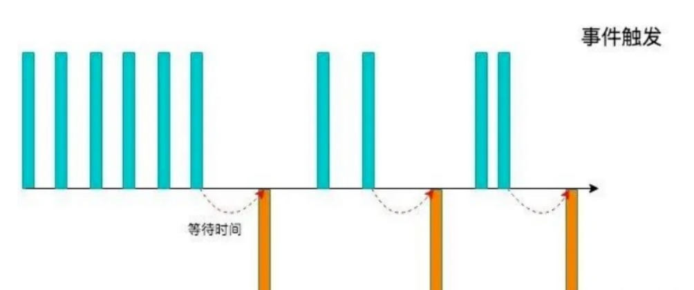

防抖的应用场景很多：

- 输入框中频繁的输入内容，搜索或者提交信息；
- 频繁的点击按钮，触发某个事件；
- 监听浏览器滚动事件，完成某些特定操作；
- 用户缩放浏览器的resize事件；

**总结：防抖其实是`延迟函数的执行`，只有当等待了一段时间也没有事件触发时，才会真正去执行函数**

### 1.1 防抖函数的案例

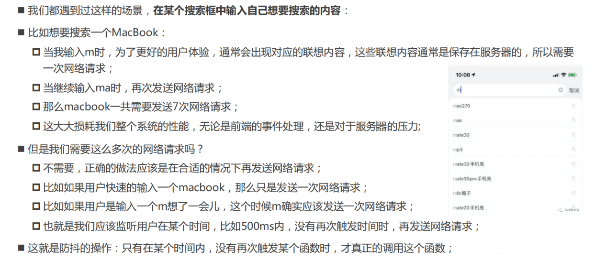


### 1.2  手写防抖函数

我们按照如下思路来实现：

- 防抖基本功能实现：可以实现防抖效果

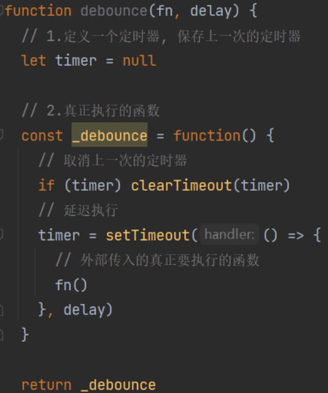

优化一：优化参数和`this`指向

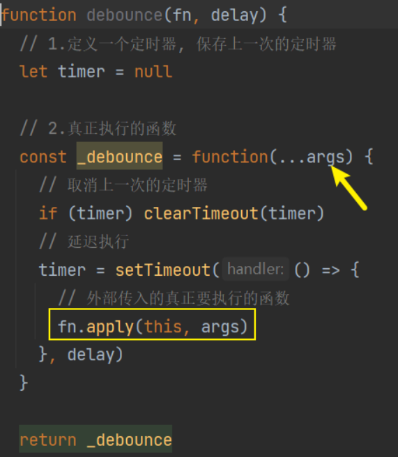

优化二：优化立即执行效果（第一次立即执行）

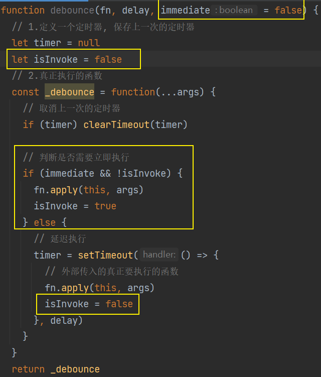

优化三：优化取消操作（增加取消功能）

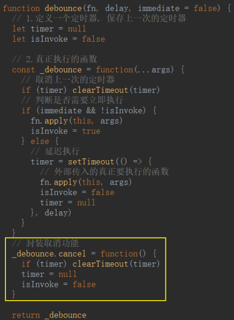

优化四：优化返回值

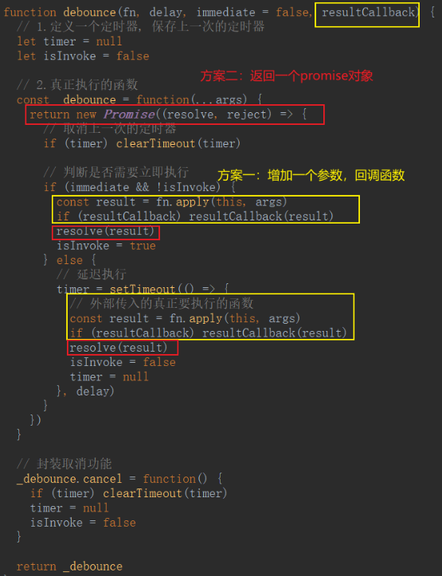

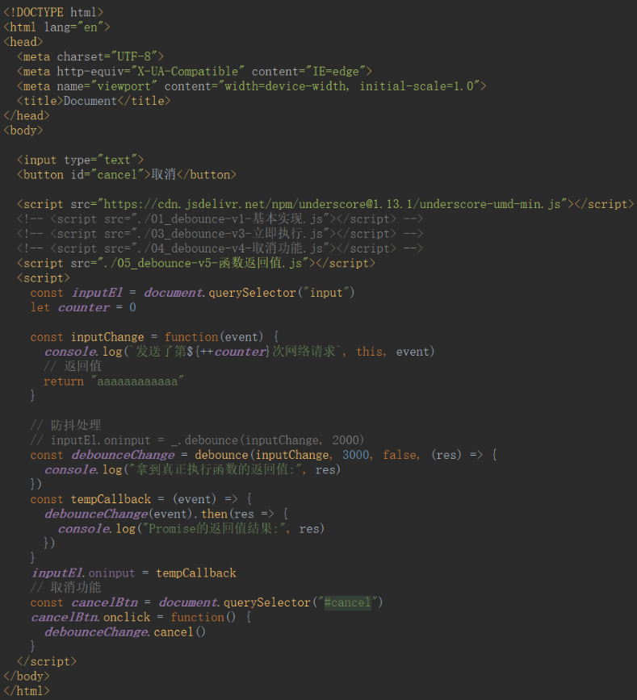

```html
<!DOCTYPE html>
<html lang="en">
<head>
  <meta charset="UTF-8">
  <meta http-equiv="X-UA-Compatible" content="IE=edge">
  <meta name="viewport" content="width=device-width, initial-scale=1.0">
  <title>Document</title>
</head>
<body>

  <input type="text">
  <button id="cancel">取消</button>

  <script src="https://cdn.jsdelivr.net/npm/underscore@1.13.1/underscore-umd-min.js"></script>
  <!-- <script src="./01_debounce-v1-基本实现.js"></script> -->
  <!-- <script src="./03_debounce-v3-立即执行.js"></script> -->
  <!-- <script src="./04_debounce-v4-取消功能.js"></script> -->
  <script src="./05_debounce-v5-函数返回值.js"></script>
  <script>
    const inputEl = document.querySelector("input")
    let counter = 0

    const inputChange = function(event) {
      console.log(`发送了第${++counter}次网络请求`, this, event)
      // 返回值
      return "aaaaaaaaaaaa"
    }

    // 防抖处理
    // inputEl.oninput = _.debounce(inputChange, 2000)
    const debounceChange = debounce(inputChange, 3000, false, (res) => {
      console.log("拿到真正执行函数的返回值:", res)
    })
    const tempCallback = (event) => {
      debounceChange(event).then(res => {
        console.log("Promise的返回值结果:", res)
      })
    }
    inputEl.oninput = tempCallback
    // 取消功能
    const cancelBtn = document.querySelector("#cancel")
    cancelBtn.onclick = function() {
      debounceChange.cancel()
    }
  </script>
</body>
</html>
```

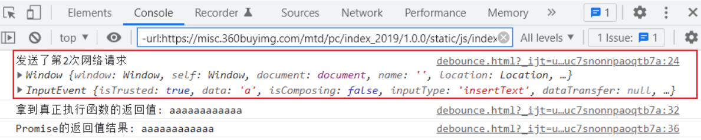


## 二、认识节流throttle函数

我们用一副图来理解一下节流的过程

- 当事件触发时，会执行这个事件的响应函数；
- 如果这个事件会被频繁触发，那么节流函数会按照一定的频率来执行函数；
- 不管在这个中间有多少次触发这个事件，执行函数的频繁总是固定的；

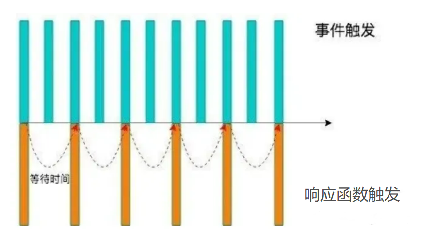

**总结：节流函数是以`固定的频率去触发`需要执行的函数**


### 2.1 节流的应用场景

- 监听页面的滚动事件；
- 鼠标移动事件；
- 用户频繁点击按钮操作；
- 游戏中的一些设计；

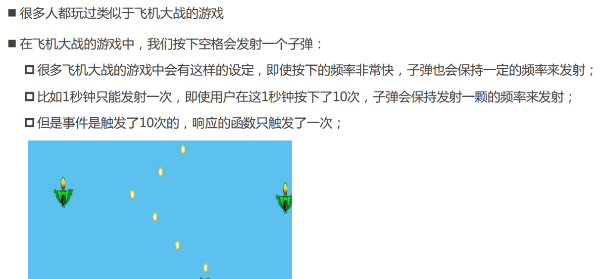


### 2.2 手写节流函数

我们按照如下思路来实现：

- 节流函数的基本实现：可以实现节流效果

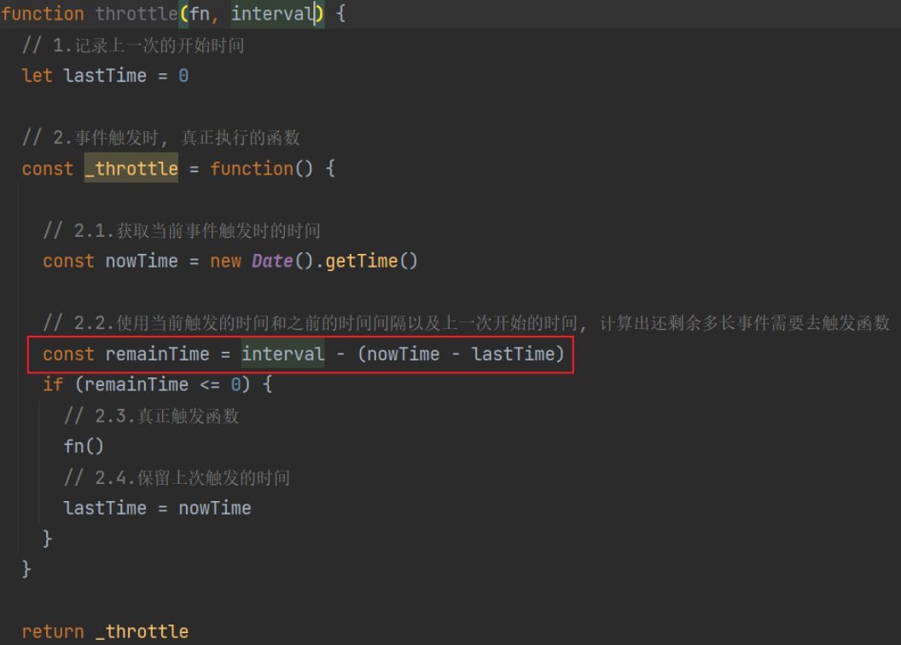

优化一：控制节流第一次是否执行函数

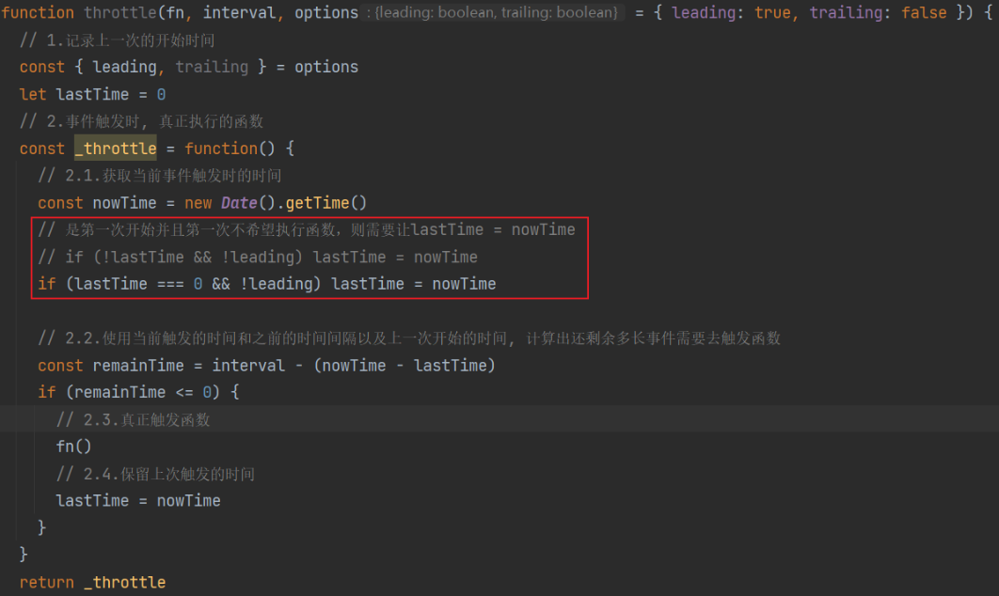

优化二：控制节流最后一次是否执行函数

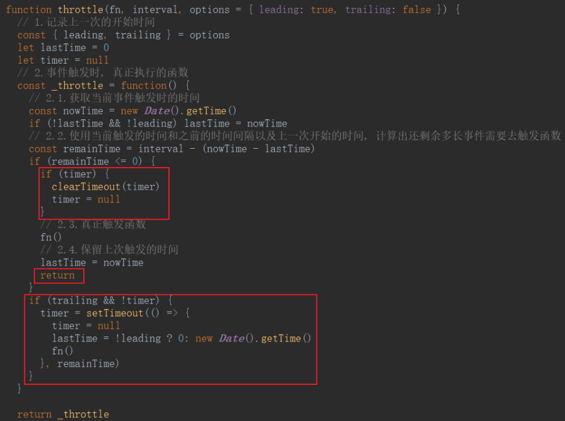

优化三：优化this参数

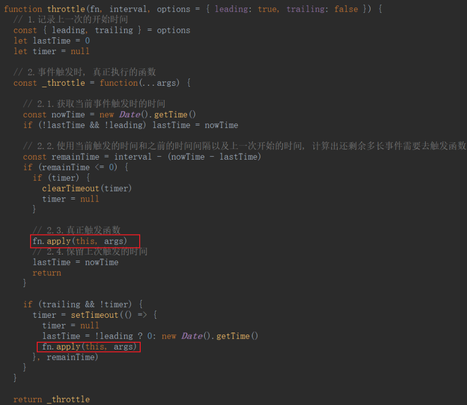

优化四：优化添加取消功能

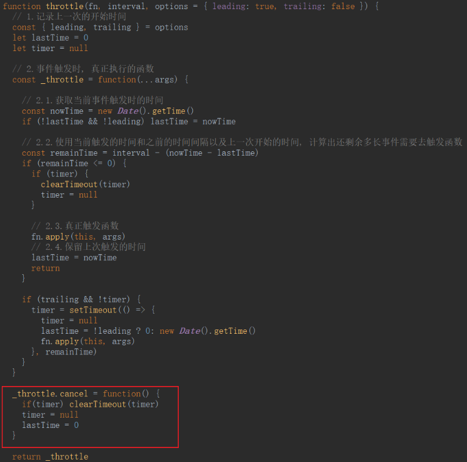

优化五：优化返回值问题

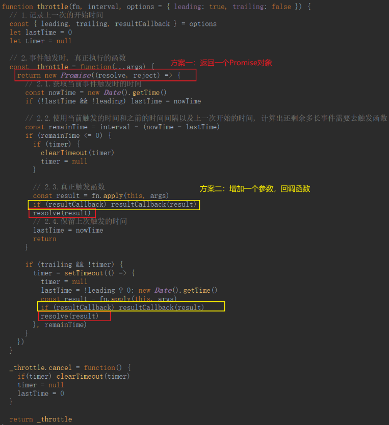

```html
<!DOCTYPE html>
<html lang="en">
<head>
  <meta charset="UTF-8">
  <meta http-equiv="X-UA-Compatible" content="IE=edge">
  <meta name="viewport" content="width=device-width, initial-scale=1.0">
  <title>Document</title>
</head>
<body>

  <input type="text">
  <button id="cancel">取消</button>
  
  <script src="https://cdn.jsdelivr.net/npm/underscore@1.13.1/underscore-umd-min.js"></script>
  <!-- <script src="./06_throttle-v1-基本实现.js"></script> -->
  <!-- <script src="./07_throttle-v1-leading实现.js"></script> -->
  <!-- <script src="./08_throttle-v3-traling实现.js"></script> -->
  <!-- <script src="./09_throttle-v4-this-参数.js"></script> -->
  <!-- <script src="./10_throttle-v4-取消功能.js"></script> -->
  <script src="./11_throttle-v6-函数返回值.js"></script>
  
  <script>
    const inputEl = document.querySelector("input")
    let counter = 0
    const inputChange = function(event) {
      console.log(`发送了第${++counter}次网络请求`, this, event)

      return 11111111111
    }

    // 节流处理
    // inputEl.oninput = _.throttle(inputChange, 2000)
    const _throttle = throttle(inputChange, 3000, { 
      leading: false, 
      trailing: true,
      resultCallback: function(res) {
        console.log("resultCallback:", res)
      }
     })
    const tempCallback = (...args) => {
      _throttle.apply(inputEl, args).then(res => {
        console.log("Promise:", res)
      })
    }
    inputEl.oninput = tempCallback

    // 取消功能
    const cancelBtn = document.querySelector("#cancel")
    cancelBtn.onclick = function() {
      _throttle.cancel()
    }
  </script>

</body>
</html>
```

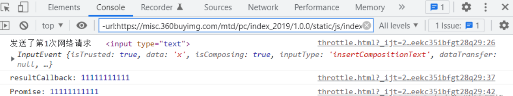