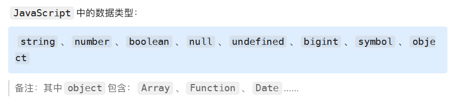
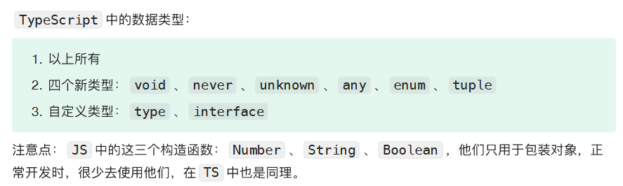
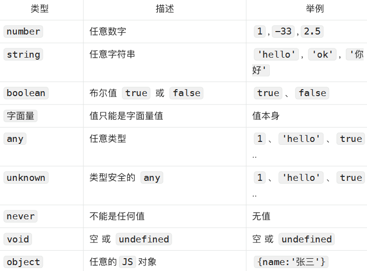
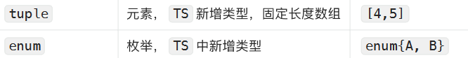
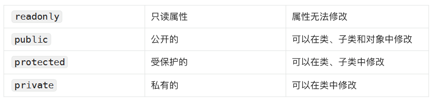

# TypeScript


# 快速入门


## 1. 类型声明

```ts
let a: string //变量a只能存储字符串
let b: number //变量a只能存储数值
let c: boolean //变量a只能存储布尔值
a = 'hello'
a = 100 //警告：不能将类型“number”分配给类型“string”
b = 666
b = '你好'//警告：不能将类型“string”分配给类型“number”
c = true
c = 666 //警告：不能将类型“number”分配给类型“boolean”
// 参数x必须是数字，参数y也必须是数字，函数返回值也必须是数字
function demo(x:number,y:number):number{
    return x + y
}

demo(100,200)
demo(100,'200') //警告：类型“string”的参数不能赋给类型“number”的参数
demo(100,200,300) //警告：应有 2 个参数，但获得 3 个
demo(100) //警告：应有 2 个参数，但获得 1 个
```

## 2. 类型推断

```ts
let d = -99 //TypeScript会推断出变量d的类型是数字
d = false //警告：不能将类型“boolean”分配给类型“number”
```

## 3. 类型总览





```ts
let n = 56
n.toFixed(2)
/*
    当执行n.toFixed(2) ，底层做了这几件事：
    1.let temp = new Number(42)
    2.value = temp.toFixed(2)
    3.删除value
    4.返回value
*/
```





## 4. 常用类型

### 4.1 字面量

```ts
let a: '你好' //a的值只能为字符串“你好”
let b: 100 //b的值只能为数字100
a = '欢迎'//警告：不能将类型“"欢迎"”分配给类型“"你好"”
b = 200 //警告：不能将类型“200”分配给类型“100”
let gender: '男'|'女' //定义一个gender变量，值只能为字符串“男”或“女”
gender = '男'
gender = '未知' //不能将类型“"未知"”分配给类型“"男" | "女"”
```

### 4.2 any

any 的含义是：任意类型，一旦将变量类型限制为 any ，那就意味着放弃了对该变量的类型检查。

```ts
//明确的表示a的类型是any —— 显式的any
let a: any
//以下对a的赋值，均无警告
a = 100
a = '你好'
a = false
//没有明确的表示b的类型是any，但TS主动推断了出来 —— 隐式的any
let b
//以下对b的赋值，均无警告
b = 100
b = '你好'
b = false
```

注意点： any 类型的变量，可以赋值给任意类型的变量

```ts
/* 注意点：any类型的变量，可以赋值给任意类型的变量 */
let a
let x: string
x = a // 无警告
```

### 4.3 unknown

unknown 的含义是：未知类型

> 备注1：unknown可以理解为一个类型安全的any
>
> 备注2：unknown适用于：开始不知道数据的具体类型，后期才能确定数据的类型

```ts
// 设置a的类型为unknown
let a: unknown
//以下对a的赋值，均正常
a = 100
a = false
a = '你好'
// 设置x的数据类型为string
let x: string
x = a //警告：不能将类型“unknown”分配给类型“string”
```

若就是想把 a 赋值给 x ，可以用以下三种写法：

```ts
// 设置a的类型为unknown
let a: unknown
a = 'hello'
//第一种方式：加类型判断
if(typeof a === 'string'){
x = a
}
//第二种方式：加断言
x = a as string
//第三种方式：加断言
x = <string>a
```

any 后点任何的东⻄都不会报错，而 unknown 正好与之相反

```ts
let str1: string = 'hello'
str1.toUpperCase() //无警告
let str2: any = 'hello'
str2.toUpperCase() //无警告
let str3: unknown = 'hello';
str3.toUpperCase() //警告：“str3”的类型为“未知”
// 使用断言强制指定str3的类型为string
(str3 as string).toUpperCase() //无警告
```

### 4.4 never

never 的含义是：任何值都不是，简言之就是不能有值， undefined 、 null 、 '' 、 0 都不行

1. 几乎不用 never 去直接限制变量，因为没有意义，例如

   ```ts
   /* 指定a的类型为never，那就意味着a以后不能存任何的数据了 */
   let a: never
   // 以下对a的所有赋值都会有警告
   a = 1
   a = true
   a = undefined
   a = null
   ```

2. never 一般是 TypeScript 主动推断出来的，例如

   ```ts
   // 指定a的类型为string
   let a: string
   // 给a设置一个值
   a = 'hello'
   if(typeof a === 'string'){
   	a.toUpperCase()
   }else{
   	console.log(a) // TypeScript会推断出此处的a是never，因为没有任何一个值符合此处的逻辑
   }
   ```

3. never 也可用于限制函数的返回值

   ```ts
   // 限制demo函数不需要有任何返回值，任何值都不行，像undeifned、null都不行
   function demo():never{
       throw new Error('程序异常退出')
   }
   ```

### 4.5 void

void 的含义是： 空 或 undefined ，严格模式下不能将 null 赋值给 void 类型

```ts
let a:void = undefined
//严格模式下，该行会有警告：不能将类型“null”分配给类型“void”
let b:void = null
```

void 常用于限制函数返回值

```ts
// 无警告
function demo1():void{}
// 无警告
function demo2():void{
    return
}
// 无警告
function demo3():void{
    return undefined
}
// 有警告：不能将类型“number”分配给类型“void”
function demo4():void{
    return 666
}
```

### 4.6 object

关于 Object 与 object ，直接说结论：在类型限制时， Object 几乎不用，因为范围太大了，无意义

1. object 的含义：任何【非原始值类型】，包括：对象、函数、数组等，限制的范围比较宽泛，用的少

   ```ts
   let a:object //a的值可以是任何【非原始值类型】，包括：对象、函数、数组等
   // 以下代码，是将【非原始类型】赋给a，所以均无警告
   a = {}
   a = {name:'张三'}
   a = [1,3,5,7,9]
   a = function(){}
   // 以下代码，是将【原始类型】赋给a，有警告
   a = null // 警告：不能将类型“null”分配给类型“object”
   a = undefined // 警告：不能将类型“undefined”分配给类型“object”
   a = 1 // 警告：不能将类型“number”分配给类型“object”
   a = true // 警告：不能将类型“boolean”分配给类型“object”
   a = '你好' // 警告：不能将类型“string”分配给类型“object”
   ```

2. Object 的含义： Object 的实例对象，限制的范围太大了，几乎不用

   ```ts
   let a:Object //a的值必须是Object的实例对象，
   // 以下代码，均无警告，因为给a赋的值，都是Object的实例对象
   a = {}
   a = {name:'张三'}
   a = [1,3,5,7,9]
   a = function(){}
   a = 1 // 1不是Object的实例对象，但其包装对象是Object的实例
   a = true // truue不是Object的实例对象，但其包装对象是Object的实例
   a = '你好' // “你好”不是Object的实例对象，但其包装对象是Object的实例
   // 以下代码均有警告
   a = null // 警告：不能将类型“null”分配给类型“Object”
   a = undefined // 警告：不能将类型“undefined”分配给类型“Object”
   ```

3. 实际开发中，限制一般对象，通常使用以下形式

   ```ts
   // 限制person对象的具体内容，使用【,】分隔，问号代表可选属性
   let person: { name: string, age?: number}
   // 限制car对象的具体内容，使用【;】分隔，必须有price和color属性，其他属性不去限制，有
   没有都行
   let car: { price: number; color: string; [k:string]:any}
   // 限制student对象的具体内容，使用【回⻋】分隔
   let student: {
       id: string
       grade:number
   }
   // 以下代码均无警告
   person = {name:'张三',age:18}
   person = {name:'李四'}
   car = {price:100,color:'红色'}
   student = {id:'tetqw76te01',grade:3}
   ```

4. 限制函数的参数、返回值，使用以下形式

   ```ts
   let demo: (a: number, b: number) => number
   demo = function(x,y) {
       return x+y
   }
   ```

5. 限制数组，使用以下形式

   ```ts
   let arr1: string[] // 该行代码等价于： let arr1: Array<string>
   let arr2: number[] // 该行代码等价于： let arr2: Array<number>
   arr1 = ['a','b','c']
   arr2 = [1,3,5,7,9]
   ```

### 4.7 tuple

tuple 就是一个⻓度固定的数组

```ts
et t: [string,number]
t = ['hello',123]
// 警告，不能将类型“[string, number, boolean]”分配给类型“[string, number]”
t = ['hello',123,false]
```

### 4.8 enum

enum 是枚举

```ts
// 定义一个枚举
enum Color {
    Red,
    Blue,
    Black,
    Gold
}
// 定义一个枚举，并指定其初识数值
enum Color2 {
    Red = 6,
    Blue,
    Black,
    Gold
}
console.log(Color)
/*
{
    0: 'Red',
    1: 'Blue',
    2: 'Black',
    3: 'Gold',
    Red: 0,
    Blue: 1,
    Black: 2,
    Gold: 3
}
*/
console.log(Color2)
/*
{
    6: 'Red',
    7: 'Blue',
    8: 'Black',
    9: 'Gold',
    Red: 6,
    Blue: 7,
    Black: 8,
    Gold: 9
}
*/
// 定义一个phone变量，并设置对⻬进行限制
let phone: {name:string,price:number,color:Color}
phone = {name:'华为Mate60',price:6500,color:Color.Red}
phone = {name:'iPhone15Pro',price:7999,color:Color.Blue}
if(phone.color === Color.Red){
    console.log('手机是红色的')
}
```

## 5. 自定义类型

自定义类型，可以更灵活的限制类型

```ts
// 性别的枚举
enum Gender {
    Male,
    Female
}
// 自定义一个年级类型（高一、高二、高三）
type Grade = 1 | 2 | 3
// 自定义一个学生类型
type Student = {
    name:string,
    age:number,
    gender:Gender,
    grade:Grade
}
// 定义两个学生变量：s1、s2
let s1:Student
let s2:Student
s1 = {name:'张三',age:18,gender:Gender.Male,grade:1}
s2 = {name:'李四',age:18,gender:Gender.Female,grade:2}
```


## 6. 抽象类

常规类

```ts
class Person {
    name: string
    age: number
    constructor(name:string,age:number){
        this.name = name
        this.age = age
    }
}
const p1 = new Person('张三',18)
const p2 = new Person('李四',19)
console.log(p1)
console.log(p2)
```

继承

```ts
// Person类
class Person { }
// Teacher类继承Person
class Teacher extends Person { }
// Student类继承Person
class Student extends Person { }
// Person实例
const p1 = new Person('周杰伦',38)
// Student实例
const s1 = new Student('张同学',18)
const s2 = new Student('李同学',20)
// Teacher实例
const t1 = new Teacher('刘老师',40)
const t2 = new Teacher('孙老师',50)
```

抽象类：不能去实例化，但可以被别人继承，抽象类里有抽象方法

```ts
// Person（抽象类）
abstract class Person { }
// Teacher类继承Person
class Teacher extends Person {
    // 构造器
    constructor(name: string,age: number){
        super(name,age)
    }
    // 方法
    speak(){
    	console.log('你好！我是老师:',this.name)
    }
}
// Student类继承Person
class Student extends Person { }
// Person实例
// const p1 = new Person('周杰伦',38) // 由于Person是抽象类，所以此处不可以new Person的实例对象
```

## 7. 接口


1. 接口用于限制一个类中包含哪些属性和方法

   ```ts
   // Person接口
   interface Person {
       // 属性声明
       name: string
       age: number
       // 方法声明
       speak():void
   }
   // Teacher实现Person接口
   class Teacher implements Person {
       name: string
       age: number
       // 构造器
       constructor(name: string,age: number){
           this.name = name
           this.age = age
       }
       // 方法
       speak(){
           console.log('你好！我是老师:',this.name)
       }
   }
   ```

2. 接口是可以重复声明的

```ts
// Person接口
interface PersonInter {
    // 属性声明
    name: string
    age: number
}
// Person接口
interface PersonInter {
    // 方法声明
    speak():void
}
// Person类继承PersonInter
class Person implements PersonInter {
    name: string
    age: number
    // 构造器
    constructor(name: string,age: number){
        this.name = name
        this.age = age
    }
    // 方法
    speak(){
        console.log('你好！我是老师:',this.name)
    }
}
```

3. 【接口】与【自定义类型】的区别

   接口可以：

   1. 当自定义类型去使用；
   2. 可以限制类的结构；

   自定义类型：

   1. 仅仅就是自定义类型

   ```ts
   // Person接口
   interface Person {
       // 应该具有的属性
       name: string
       age: number
       // 应该具有的方法
       speak():void
   }
   // Person类型
   /*
   type Person = {
       // 应该具有的属性
       name: string
       age: number
       // 应该具有的方法
       speak():void
   }
   */
   // 接口当成自定义类型去使用
   let person:Person = {
       name:'张三',
       age:18,
       speak(){
           console.log('你好！')
       }
   }
   ```

4. 【接口】与【抽象类】的区别

   抽象类：

   1. 可以有普通方法，也可以有抽象方法；
   2. 使用 extends 关键字去继承抽象类；

   ```ts
   // 抽象类 —— Person
   abstract class Person {
       // 属性
       name:string
       age:number
       // 构造器
       constructor(name:string,age:number){
           this.name = name
           this.age = age
       }
       // 抽象方法
       abstract speak():void
       // 普通方法
       walk(){
       	console.log('我在行走中....')
       }
   }
   // Teacher类继承抽象类Person
   class Teacher extends Person {
       constructor(name:string,age:number){
       	super(name,age)
       }
       speak(){
       	console.log(`我是老师，我的名字是${this.name}`)
       }
   }
   ```

   接口中：

   1. 只能有抽象方法；
   2. 使用 implements 关键字去实现接口

   ```ts
   // 接口 —— Person，只能包含抽象方法
   interface Person {
       // 属性，不写具体值
       name:string
       age:number
       // 方法，不写具体实现
       speak():void
   }
   // 创建Teacher类实现Person接口
   class Teacher implements Person {
       name:string
       age:number
       constructor(name:string,age:number){
           this.name = name
           this.age = age
       }
       speak(){
       	console.log('我在⻜快的行走中......')
       }
   }
   ```

   

## 8. 属性修饰符




## 9. 泛型

定义一个函数或类时，有些情况下无法确定其中要使用的具体类型（返回值、参数、属性的类型不能确定），此时就需要泛型

举例： <T> 就是泛型，（不一定非叫 T ），设置泛型后即可在函数中使用 T 来表示该类型

```ts
function test<T>(arg: T): T{
    return arg;
}
// 不指名类型，TS会自动推断出来
test(10)
// 指名具体的类型
test<number>(10)
```

泛型可以写多个
```ts
function test<T, K>(a: T, b: K): K{
    return b;
}
// 为多个泛型指定具体自值
test<number, string>(10, "hello");
```

类中同样可以使用泛型

```ts
class MyClass<T>{
    prop: T;
    constructor(prop: T){
        this.prop = prop;
    }
}
```

也可以对泛型的范围进行约束

```ts
interface Demo{
    length: number;
}
// 泛型T必须是MyInter的子类，即：必须拥有length属性
function test<T extends Demo>(arg: T): number{
    return arg.length;
}
test(10) // 类型“number”的参数不能赋给类型“Demo”的参数
test({name:'张三'}) // 类型“{ name: string; }”的参数不能赋给类型“Demo”的参数
test('123')
test({name:'张三',length:10})
```

