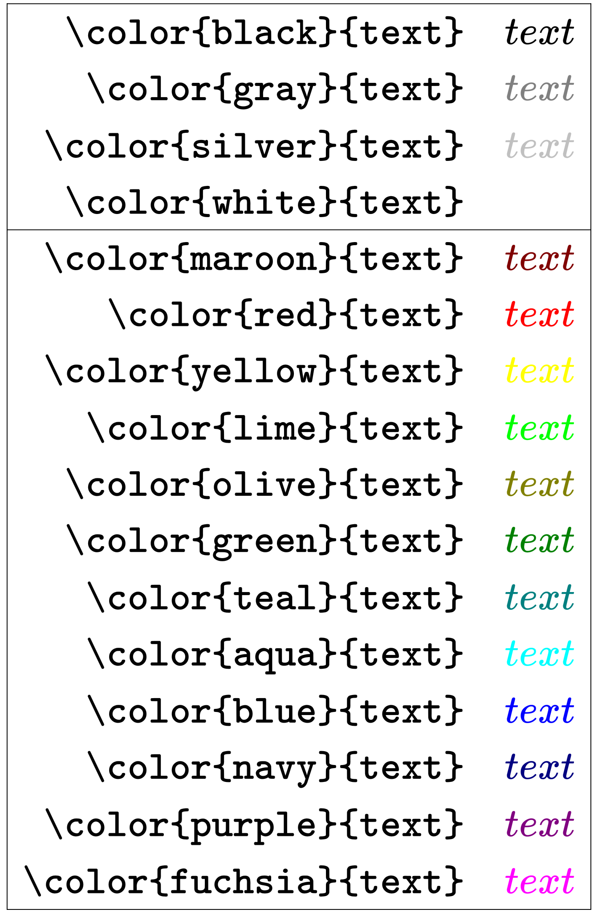
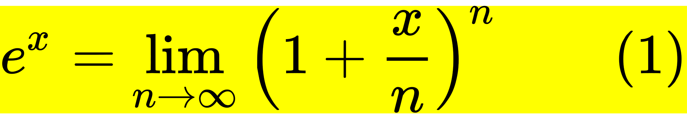
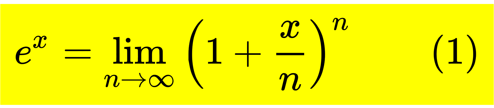
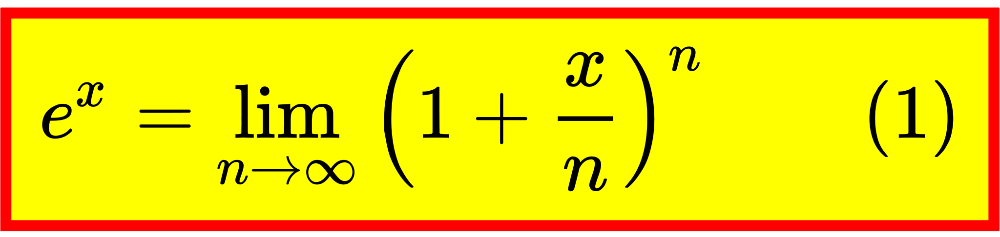
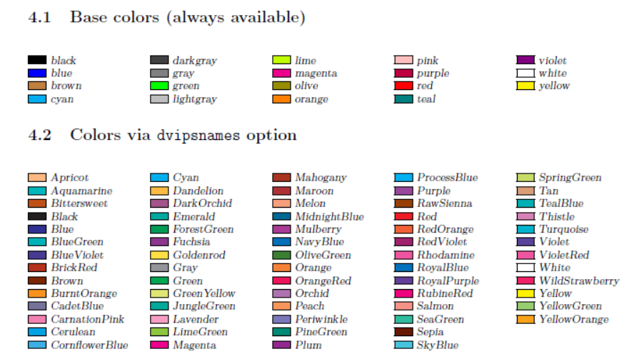
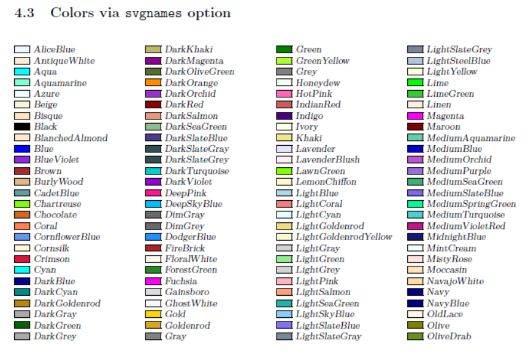
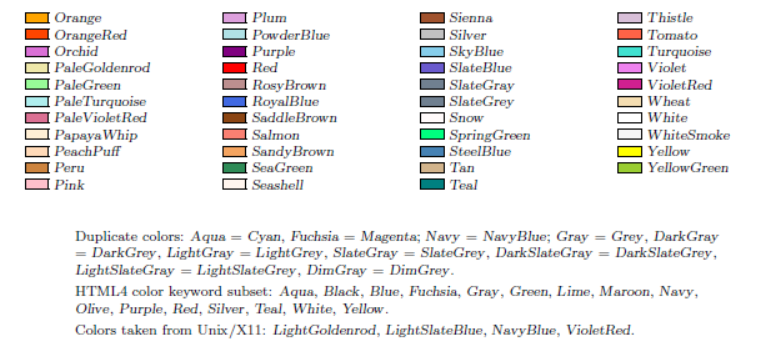
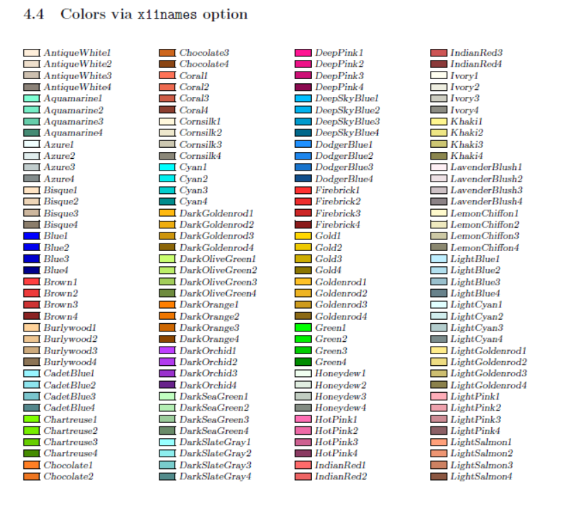
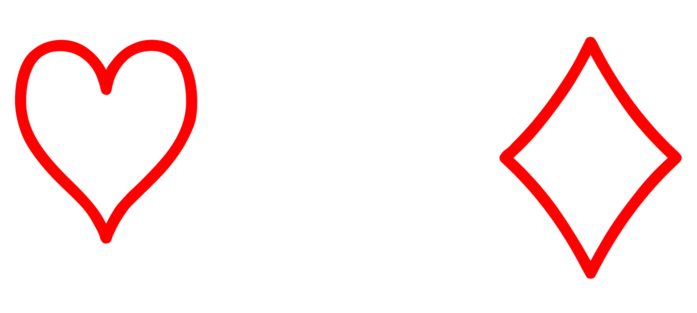
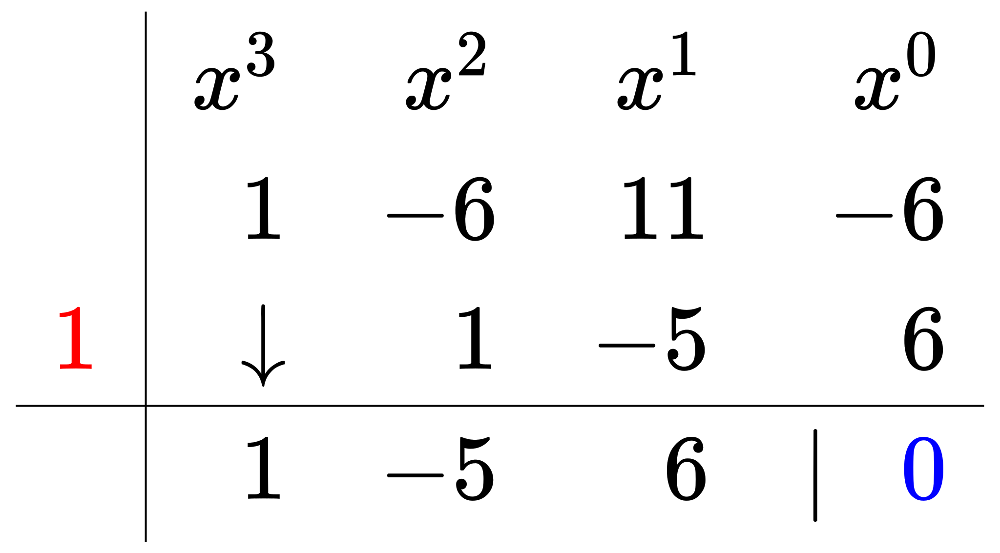

# LateX 公式模板

## 矩阵 | Matrices


```plain
\begin{matrix}
1 & x & x^2 \\
1 & y & y^2 \\
1 & z & z^2 \\
\end{matrix}
```


```plain
\begin{pmatrix}1&2\\3&4\\ \end{pmatrix}
```


```plain
\begin{bmatrix}1&2\\3&4\\ \end{bmatrix}
```


```plain
\begin{Bmatrix}1&2\\3&4\\ \end{Bmatrix}
```


```plain
\begin{vmatrix}1&2\\3&4\\ \end{vmatrix}
```


```plain
\begin{Vmatrix}1&2\\3&4\\ \end{Vmatrix}
```


```plain
\begin{pmatrix}
 1 & a_1 & a_1^2 & \cdots & a_1^n \\
 1 & a_2 & a_2^2 & \cdots & a_2^n \\
 \vdots  & \vdots& \vdots & \ddots & \vdots \\
 1 & a_m & a_m^2 & \cdots & a_m^n    
 \end{pmatrix}
```


```plain
\left[
\begin{array}{cc|c}
  1&2&3\\
  4&5&6
\end{array}
\right]
```


```plain
\begin{pmatrix}
    a & b\\
    c & d\\
  \hline
    1 & 0\\
    0 & 1
  \end{pmatrix}
```


```plain
 $\bigl( \begin{smallmatrix} a & b \\ c & d \end{smallmatrix} \bigr)$
```


## 对齐方程 | Aligned equations


```plain
\begin{align}
\sqrt{37} & = \sqrt{\frac{73^2-1}{12^2}} \\
 & = \sqrt{\frac{73^2}{12^2}\cdot\frac{73^2-1}{73^2}} \\ 
 & = \sqrt{\frac{73^2}{12^2}}\sqrt{\frac{73^2-1}{73^2}} \\
 & = \frac{73}{12}\sqrt{1 - \frac{1}{73^2}} \\ 
 & \approx \frac{73}{12}\left(1 - \frac{1}{2\cdot73^2}\right)
\end{align}
```


```plain
\begin{align} f(x)&=\left(x^3\right)+\left(x^3+x^2+x^1\right)+\left(x^3+x^‌2\right)\\ f'(x)&=\left(3x^2+2x+1\right)+\left(3x^2+2x\right)\\ f''(x)&=\left(6x+2\right)\\ \end{align}
```


## 分段函数 | piecewise functions


```plain
f(n) =
\begin{cases}
n/2,  & \text{if $n$ is even} \\
3n+1, & \text{if $n$ is odd}
\end{cases}
```


```plain
\left.
\begin{array}{l}
\text{if $n$ is even:}&n/2\\
\text{if $n$ is odd:}&3n+1
\end{array}
\right\}
=f(n)
```


```plain
f(n) =
\begin{cases}
\frac{n}{2},  & \text{if $n$ is even} \\[2ex]
3n+1, & \text{if $n$ is odd}
\end{cases}
```


## 数组 | Arrays


```plain
\begin{array}{c|lcr}
n & \text{Left} & \text{Center} & \text{Right} \\
\hline
1 & 0.24 & 1 & 125 \\
2 & -1 & 189 & -8 \\
3 & -20 & 2000 & 1+10i
\end{array}
```


```plain
% outer vertical array of arrays
\begin{array}{c}
% inner horizontal array of arrays
\begin{array}{cc}
% inner array of minimum values
\begin{array}{c|cccc}
\text{min} & 0 & 1 & 2 & 3\\
\hline
0 & 0 & 0 & 0 & 0\\
1 & 0 & 1 & 1 & 1\\
2 & 0 & 1 & 2 & 2\\
3 & 0 & 1 & 2 & 3
\end{array}
&
% inner array of maximum values
\begin{array}{c|cccc}
\text{max}&0&1&2&3\\
\hline
0 & 0 & 1 & 2 & 3\\
1 & 1 & 1 & 2 & 3\\
2 & 2 & 2 & 2 & 3\\
3 & 3 & 3 & 3 & 3
\end{array}
\end{array}
\\
% inner array of delta values
\begin{array}{c|cccc}
\Delta&0&1&2&3\\
\hline
0 & 0 & 1 & 2 & 3\\
1 & 1 & 0 & 1 & 2\\
2 & 2 & 1 & 0 & 1\\
3 & 3 & 2 & 1 & 0
\end{array}
\end{array}
```


```plain
\begin{array}{ll} \hfill\mathrm{Bad}\hfill & \hfill\mathrm{Better}\hfill \\ \hline \\ e^{i\frac{\pi}2} \quad e^{\frac{i\pi}2}& e^{i\pi/2} \\ \int_{-\frac\pi2}^\frac\pi2 \sin x\,dx & \int_{-\pi/2}^{\pi/2}\sin x\,dx \\ \end{array}
```


## 方程组 | System of equations


```plain
\left\{ 
\begin{array}{c}
a_1x+b_1y+c_1z=d_1 \\ 
a_2x+b_2y+c_2z=d_2 \\ 
a_3x+b_3y+c_3z=d_3
\end{array}
\right.
```


```plain
\begin{cases}
a_1x+b_1y+c_1z=d_1 \\ 
a_2x+b_2y+c_2z=d_2 \\ 
a_3x+b_3y+c_3z=d_3
\end{cases}
```


```plain
\left\{
\begin{aligned} 
a_1x+b_1y+c_1z &=d_1+e_1 \\ 
a_2x+b_2y&=d_2 \\ 
a_3x+b_3y+c_3z &=d_3 
\end{aligned} 
\right. 
```


```plain
\left\{
\begin{array}{ll}
a_1x+b_1y+c_1z &=d_1+e_1 \\ 
a_2x+b_2y &=d_2 \\ 
a_3x+b_3y+c_3z &=d_3 
\end{array} 
\right.
```


```plain
\begin{cases}
a_1x+b_1y+c_1z=\frac{p_1}{q_1} \\[2ex] 
a_2x+b_2y+c_2z=\frac{p_2}{q_2} \\[2ex] 
a_3x+b_3y+c_3z=\frac{p_3}{q_3}
\end{cases}
```


```plain
\begin{cases}
a_1x+b_1y+c_1z=\frac{p_1}{q_1} \\
a_2x+b_2y+c_2z=\frac{p_2}{q_2} \\
a_3x+b_3y+c_3z=\frac{p_3}{q_3}
\end{cases}
```


```plain
\left\{ \begin{array}{l}
0 = c_x-a_{x0}-d_{x0}\dfrac{(c_x-a_{x0})\cdot d_{x0}}{\|d_{x0}\|^2} + c_x-a_{x1}-d_{x1}\dfrac{(c_x-a_{x1})\cdot d_{x1}}{\|d_{x1}\|^2} \\[2ex] 
0 = c_y-a_{y0}-d_{y0}\dfrac{(c_y-a_{y0})\cdot d_{y0}}{\|d_{y0}\|^2} + c_y-a_{y1}-d_{y1}\dfrac{(c_y-a_{y1})\cdot d_{y1}}{\|d_{y1}\|^2} \end{array} \right. 
```


## 颜色 | Colors





```plain
\begin{array}{|rc|}
\hline
\verb+\color{black}{text}+ & \color{black}{text} \\
\verb+\color{gray}{text}+ & \color{gray}{text} \\
\verb+\color{silver}{text}+ & \color{silver}{text} \\
\verb+\color{white}{text}+ & \color{white}{text} \\
\hline
\verb+\color{maroon}{text}+ & \color{maroon}{text} \\
\verb+\color{red}{text}+ & \color{red}{text} \\
\verb+\color{yellow}{text}+ & \color{yellow}{text} \\
\verb+\color{lime}{text}+ & \color{lime}{text} \\
\verb+\color{olive}{text}+ & \color{olive}{text} \\
\verb+\color{green}{text}+ & \color{green}{text} \\
\verb+\color{teal}{text}+ & \color{teal}{text} \\
\verb+\color{aqua}{text}+ & \color{aqua}{text} \\
\verb+\color{blue}{text}+ & \color{blue}{text} \\
\verb+\color{navy}{text}+ & \color{navy}{text} \\
\verb+\color{purple}{text}+ & \color{purple}{text} \\ 
\verb+\color{fuchsia}{text}+ & \color{magenta}{text} \\
\hline
\end{array}
```


```plain
\begin{array}{|rc|}
\hline
\verb+\color{black}{text}+ & \color{black}{text} \\
\verb+\color{gray}{text}+ & \color{gray}{text} \\
\verb+\color{silver}{text}+ & \color{silver}{text} \\
\verb+\color{white}{text}+ & \color{white}{text} \\
\hline
\verb+\color{maroon}{text}+ & \color{maroon}{text} \\
\verb+\color{red}{text}+ & \color{red}{text} \\
\verb+\color{yellow}{text}+ & \color{yellow}{text} \\
\verb+\color{lime}{text}+ & \color{lime}{text} \\
\verb+\color{olive}{text}+ & \color{olive}{text} \\
\verb+\color{green}{text}+ & \color{green}{text} \\
\verb+\color{teal}{text}+ & \color{teal}{text} \\
\verb+\color{aqua}{text}+ & \color{aqua}{text} \\
\verb+\color{blue}{text}+ & \color{blue}{text} \\
\verb+\color{navy}{text}+ & \color{navy}{text} \\
\verb+\color{purple}{text}+ & \color{purple}{text} \\ 
\verb+\color{fuchsia}{text}+ & \color{magenta}{text} \\
\hline
\end{array}
```


## 交换图 | Commutative diagrams


```plain
\begin{CD}
A @>a>> B\\
@V b V V= @VV c V\\
C @>>d> D
\end{CD}
```


```plain
\begin{CD}
A @>>> B @>{\text{very long label}}>> C \\
@. @AAA @| \\
D @= E @<<< F
\end{CD}
```


```plain
\begin{CD}
  RCOHR'SO_3Na @>{\text{Hydrolysis,$\Delta, Dil.HCl$}}>> (RCOR')+NaCl+SO_2+ H_2O 
\end{CD}
```


## 持续分数 | Continued fractions


```plain
x = a_0 + \cfrac{1^2}{a_1
          + \cfrac{2^2}{a_2
          + \cfrac{3^2}{a_3 + \cfrac{4^4}{a_4 + \cdots}}}}
```


```plain
x = a_0 + \frac{1^2}{a_1
          + \frac{2^2}{a_2
          + \frac{3^2}{a_3 + \frac{4^4}{a_4 + \cdots}}}}
```


```plain
x = a_0 + \frac{1^2}{a_1+}
          \frac{2^2}{a_2+}
          \frac{3^2}{a_3 +} \frac{4^4}{a_4 +} \cdots
```


```plain
\cfrac{a_{1}}{b_{1}+\cfrac{a_{2}}{b_{2}+\cfrac{a_{3}}{b_{3}+\ddots }}}=   {\genfrac{}{}{}{}{a_1}{b_1}}   {\genfrac{}{}{0pt}{}{}{+}}   {\genfrac{}{}{}{}{a_2}{b_2}}   {\genfrac{}{}{0pt}{}{}{+}}   {\genfrac{}{}{}{}{a_3}{b_3}}   {\genfrac{}{}{0pt}{}{}{+\dots}}
```


```plain
\underset{j=1}{\overset{\infty}{\LARGE\mathrm K}}\frac{a_j}{b_j}=\cfrac{a_1}{b_1+\cfrac{a_2}{b_2+\cfrac{a_3}{b_3+\ddots}}}.
```


```plain
\mathop{\LARGE\mathrm K}_{i=1}^\infty \frac{a_i}{b_i}
```


## 大括号 | Big braces


```plain
f\left(
   \left[ 
     \frac{
       1+\left\{x,y\right\}
     }{
       \left(
          \frac{x}{y}+\frac{y}{x}
       \right)
       \left(u+1\right)
     }+a
   \right]^{3/2}
\right)
```


```plain
\begin{aligned}
a=&\left(1+2+3+  \cdots \right. \\
& \cdots+ \left. \infty-2+\infty-1+\infty\right)
\end{aligned}
```


```plain
\left\langle  
  q
\middle\|
  \frac{\frac{x}{y}}{\frac{u}{v}}
\middle| 
   p 
\right\rangle
```


## 高亮 | Highlighting equation





```plain
\bbox[yellow]
{
e^x=\lim_{n\to\infty} \left( 1+\frac{x}{n} \right)^n
\qquad (1)
}
```





```plain
\bbox[yellow,5px]
{
e^x=\lim_{n\to\infty} \left( 1+\frac{x}{n} \right)^n
\qquad (1)
}
```


```plain
\bbox[5px,border:2px solid red]
{
e^x=\lim_{n\to\infty} \left( 1+\frac{x}{n} \right)^n
\qquad (2) 
}
```





```plain
\bbox[yellow,5px,border:2px solid red]
{
e^x=\lim_{n\to\infty} \left( 1+\frac{x}{n} \right)^n
\qquad (1)
}
```








## Pack of cards


 


```plain
\spadesuit\quad\heartsuit\quad\diamondsuit\quad\clubsuit
```


```plain
\color{red}{\heartsuit}\quad\color{red}{\diamondsuit}
```


```plain
♠\quad♡\quad♢\quad♣\\
♤\quad♥\quad♦\quad♧
```


## 长除法 | Long division


```plain
\require{enclose}
\begin{array}{r}
                13  \\[-3pt]
4 \enclose{longdiv}{52} \\[-3pt]
     \underline{4}\phantom{2} \\[-3pt]
                12  \\[-3pt]
     \underline{12}
\end{array}
```





```plain
\begin{array}{c|rrrr}& x^3 & x^2 & x^1 &  x^0\\ & 1 & -6 & 11 & -6\\ {\color{red}1} & \downarrow & 1 & -5 & 6\\ \hline & 1 & -5 & 6 & |\phantom{-} {\color{blue}0} \end{array}
```


```plain
x^3−6x^2+11x−6=(x−{\color{red}1})(x^2−5x+6)+{\color{blue}0}
```


## Degree symbol


```plain
\begin{array} \\
\text{45^\text{o}} & \text{renders as} & 45^\text{o} \\
\text{45^o} & \text{renders as} & 45^o \\
\text{45^\circ} & \text{renders as} & 45^\circ \\
\text{90°} & \text{renders as} & 90° & \text{Using keyboard entry of symbol}
%
% Use the following line as a template for additional entries
%
% \text{} & \text{renders as} &  \\
\end{array}
```


## 其他 | Others


```plain
\sum_{n=1}^\infty \frac{1}{n^2} \to
  \textstyle \sum_{n=1}^\infty \frac{1}{n^2} \to
  \displaystyle \sum_{n=1}^\infty \frac{1}{n^2}
```


Compare  versus 


能量守恒


```plain
e=mc^2 \tag{1}\label{eq1}
```


```plain
\begin{equation}\begin{aligned}
a &= b + c \\
  &= d + e + f + g \\
  &= h + i
\end{aligned}\end{equation}\tag{2}\label{eq2}
```


```plain
\begin{align}
a &= b + c \tag{3}\label{eq3} \\
x &= yz \tag{4}\label{eq4}\\
l &= m - n \tag{5}\label{eq5}
\end{align}
```


```plain
54\,321.123\,45
```


```plain
\left.\mathrm{m}\middle/\mathrm{s}^2\right.
```


```plain
\mu_0=4\pi\times10^{-7} \ \left.\mathrm{\mathrm{T}\!\cdot\!\mathrm{m}}\middle/\mathrm{A}\right.
```


```plain
\begin{array}{rrrrrr|r}
           & x_1 & x_2 & s_1 & s_2 & s_3 &    \\ \hline
       s_1 &   0 &   1 &   1 &   0 &   0 &  8 \\
       s_2 &   1 &  -1 &   0 &   1 &   0 &  4 \\
       s_3 &   1 &   1 &   0 &   0 &   1 & 12 \\ \hline
           &  -1 &  -1 &   0 &   0 &   0 &  0
\end{array}
```


```plain
\begin{array}{rrrrrrr|rr}
  & x_1 & x_2 & s_1 & s_2 & s_3 &  w &    & \text{ratio} \\ \hline
  s_1 &   0 &   1 &   1 &   0 &   0 &  0 &  8 &            - \\
w & 1^* &  -1 &   0 &  -1 &   0 &  1 &  4 &            4 \\
  s_3 &   1 &   1 &   0 &   0 &   1 &  0 & 12 &           12 \\ \hdashline
  &   1 &  -1 &   0 &  -1 &   0 &  0 &  4 &              \\ \hline
  s_1 &   0 &   1 &   1 &   0 &   0 &  0 &  8 &              \\
  x_1 &   1 &  -1 &   0 &  -1 &   0 &  1 &  4 &              \\
  s_3 &   0 &   2 &   0 &   2 &   1 & -1 &  8 &              \\ \hdashline
  &   0 &   0 &   0 &   0 &   0 & -1 &  0 &
\end{array}
```


```plain
\begin{array}{rrrrrrrr|r}
         & x_1 & x_2 & x_3 & x_4 & x_5 & x_6 &  x_7 &        \\ \hline
     x_4 &   0 &  -3 &   7 &   1 &   0 &   0 &    2 & 2M  -4 \\
     x_5 &   0 &  -9 &   0 &   0 &   1 &   0 &   -1 & -M  -3 \\
     x_6 &   0 &   6 &  -1 &   0 &   0 &   1 & -4^* & -4M +8 \\
     x_1 &   1 &   0 &   1 &   0 &   0 &   0 &    1 &      M \\ \hline
         &   0 &   1 &   1 &   0 &   0 &   0 &    2 &     2M \\
\text{ratio} &     &     &   1 &     &     &     &  1/2 &
\end{array}
```


```plain
\begin{array}{rrrrrrr|r}
         &  x_1 &  x_2 &  x_3 &  s_1 &    s_2 &  s_3 &       \\     \hline
     s_1 &   -2 &    0 &   -2 &    1 &      0 &    0 &   -60 \\
     s_2 &   -2 & -4^* &   -5 &    0 &      1 &    0 &   -70 \\
     s_3 &    0 &   -3 &   -1 &    0 &      0 &    1 &   -27 \\ \hdashline
         &    8 &   10 &   25 &    0 &      0 &    0 &     0 \\
\text{ratio} &   -4 & -5/2 &   -5 &      &        &      &       \\     \hline
     s_1 & -2^* &    0 &   -2 &    1 &      0 &    0 &   -60 \\
     x_2 &  1/2 &    1 &  5/4 &    0 &   -1/4 &    0 &  35/2 \\
     s_3 &  3/2 &    0 & 11/4 &    0 &   -3/4 &    1 &  51/2 \\ \hdashline
         &    3 &    0 & 25/2 &    0 &    5/2 &    0 &  -175 \\
\text{ratio} & -3/2 &      & 25/4 &      &        &      &       \\     \hline
     x_1 &    1 &    0 &    1 & -1/2 &      0 &    0 &    30 \\
     x_2 &    0 &    1 &  3/4 &  1/4 &   -1/4 &    0 &   5/2 \\
     s_3 &    0 &    0 &  5/4 &  3/4 & -3/4^* &    1 & -39/2 \\ \hdashline
         &    0 &    0 & 19/2 &  3/2 &    5/2 &    0 &  -265 \\
\text{ratio} &      &      &      &      &  \dots &      &       \\     \hline
     x_1 &    1 &    0 &    1 & -1/2 &      0 &    0 &    30 \\
     x_2 &    0 &    1 &  1/3 &    0 &      0 & -1/3 &     9 \\
     s_2 &    0 &    0 & -5/3 &   -1 &      1 & -4/3 &    26 \\ \hdashline
         &    0 &    0 & 41/3 &    4 &      0 & 10/3 &  -330
\end{array}
```


```plain
\require{extpfeil} % produce extensible horizontal arrows
\begin{array}{ccc} % arrange LPPs
% first row
% first LPP
\begin{array}{ll}
\max & z = c^T x \\
\text{s.t.} & A x \le b \\
& x \ge 0
\end{array}
& \xtofrom{\text{duality}} &
% second LPP
\begin{array}{ll}
\min & v = b^T y \\
\text{s.t.} & A^T y \ge c \\
& y \ge 0
\end{array} \\
({\cal PC}) & & ({\cal DC}) \\
\text{add } {\Large \downharpoonleft} \text{slack var} &  & \text{minus } {\Large \downharpoonright} \text{surplus var}\\ % Change to your favorite arrow style
%
% second row
% third LPP
\begin{array}{ll}
\max & z = c^T x \\
\text{s.t.} & A x + s = b \\
& x,s \ge 0
\end{array}
& \xtofrom[\text{some steps skipped}]{\text{duality}} &
% fourth LPP
\begin{array}{ll}
\min & v = b^T y \\
\text{s.t.} & A^T y - t = c \\
& y,t \ge 0
\end{array} \\
({\cal PS}) & & ({\cal DS})
%
\end{array}
```


```plain
\Large\LaTeX
```


```plain
\sum_{i=0}^n i^2 = \frac{(n^2+n)(2n+1)}{6}
```


```plain
\Biggl(\biggl(\Bigl(\bigl((egg)\bigr)\Bigr)\biggr)\Biggr)
```


## 字体 | Fonts


```plain
\mathbb{CHNQRZ}
```


```plain
\mathbf{ABCDEFGHIJKLMNOPQRSTUVWXYZ}
```


```plain
\mathbf{abcdefghijklmnopqrstuvwxyz}
```


```plain
\mathit{ABCDEFGHIJKLMNOPQRSTUVWXYZ}
```


```plain
\mathit{abcdefghijklmnopqrstuvwxyz}
```


```plain
\pmb{ABCDEFGHIJKLMNOPQRSTUVWXYZ,abcdefghijklmnopqrstuvwxyz}
```


```plain
\mathtt{ABCDEFGHIJKLMNOPQRSTUVWXYZ,abcdefghijklmnopqrstuvwxyz}
```


```plain
\mathrm{ABCDEFGHIJKLMNOPQRSTUVWXYZ,abcdefghijklmnopqrstuvwxyz}
```


```plain
\mathsf{ABCDEFGHIJKLMNOPQRSTUVWXYZ,abcdefghijklmnopqrstuvwxyz}
```


```plain
\mathcal{ABCDEFGHIJKLMNOPQRSTUVWXYZ,abcdefghijklmnopqrstuvwxyz}
```


```plain
\mathscr{ABCDEFGHIJKLMNOPQRSTUVWXYZ,abcdefghijklmnopqrstuvwxyz}
```


```plain
\mathfrak{ABCDEFGHIJKLMNOPQRSTUVWXYZ} \mathfrak{abcdefghijklmnopqrstuvwxyz}
```


## 