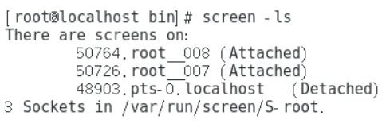

使用：

screen -S sessionname （创建名为sessionname的会话）

screen -ls  （显示已经创建的session）

（其中最后一个session是不用screen -S创建的会话，系统自动添加的名字，Attached表示session未与终端断开，Detached表示session已于终端断开，可用screen -r sessionname 来恢复 或者将sessionname替换为前面的数字）

screeen -x （加入正在连接的session，两个终端连接相同的sesssion，可使两个终端显示相同的效果）

exit （在两个终端的任意终端的命令行输入exit即可退出screen）

screen -x sessionname

同一台设备的不同终端可以直接使用，不同设备的终端需要使用ssh连接设备在使用screen -x sessionname

------------------------------------------------
