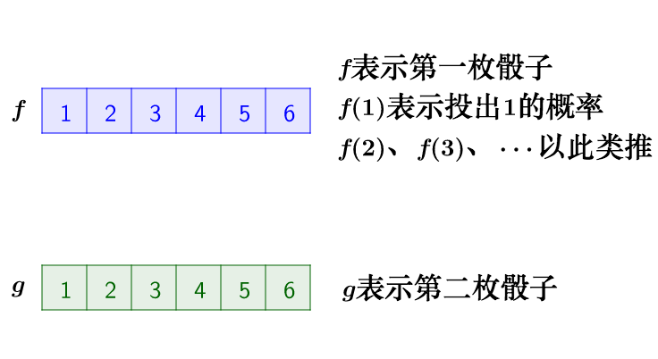
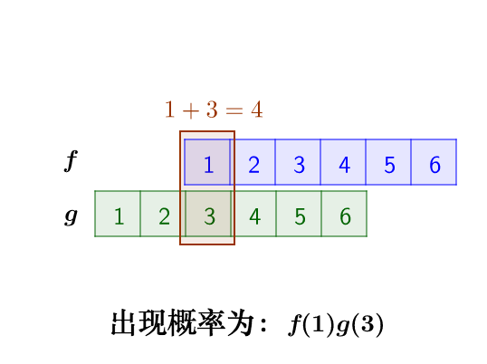
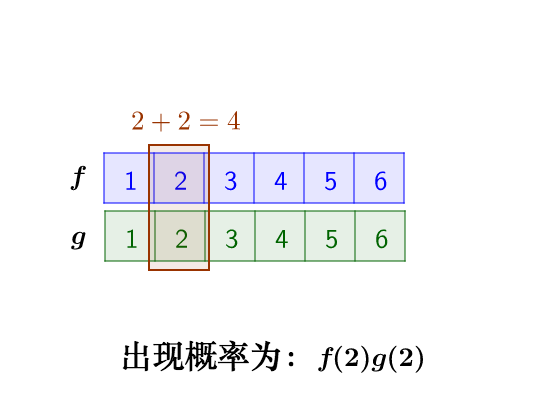
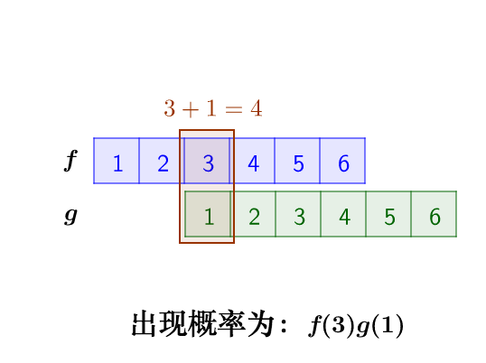

# 卷积

​	

从数学上讲，卷积就是一种运算。

某种运算，能被定义出来，至少有以下特征：

- 首先是抽象的、符号化的
- 其次，在生活、科研中，有着广泛的作用

比如加法：

- `a+b` ，是抽象的，本身只是一个 `数学符号`
- 在现实中，有非常多的意义，比如增加、合成、旋转等等

> 卷积，是我们学习高等数学之后，新接触的一种运算，因为涉及到积分、级数，所以看起来觉得很复杂。

##  卷积的定义

​	我们称 $(f∗g)(n)$ 为 $f,g$ 的卷积

​	其连续的定义为：

​										$(f∗g)(n) = \int_{-\infty}^{\infty}f(\tau) g(n - \tau)d\tau$

​	其离散的定义为：

​										$ (f∗g)(n) = \sum_{\tau = -\infty}^\infty f(\tau) g(n - \tau) $

我们令 $x=τ,y=n−τ $，那么 $x+y=n$ 就是下面这些直线：

我们来看看现实中，这样的定义有什么意义

​		我有两枚骰子：

​		把这两枚骰子都抛出去：

​		求：两枚骰子点数加起来为 4 的概率是多少？

>  这里问题的关键是，两个骰子加起来要等于4，这正是卷积的应用场景。

>  我们把骰子各个点数出现的概率表示出来：

​		那么，两枚骰子点数加起来为 4 的情况有：

​	

因此，两枚骰子点数加起来为 4 的概率为：

​														$f(1)g(3) + f(2)g(2) + f(3)g(1)$

符合卷积的定义，把它写成标准的形式就是：

​														$ (f∗g)(4) = \sum_{m = 1}^3f(4 - m) g(m) $

\$(f∗g)(n)\$

 $(f∗g)(n)$ 
