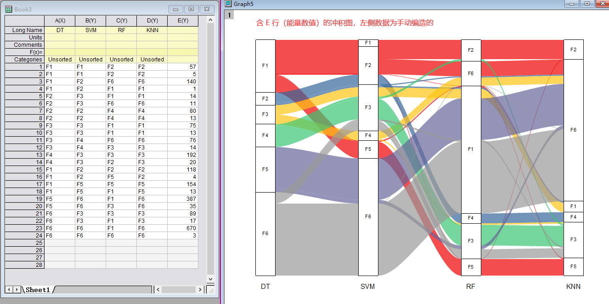
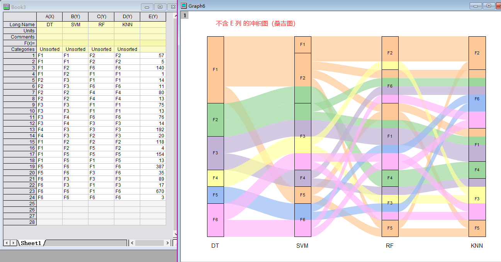
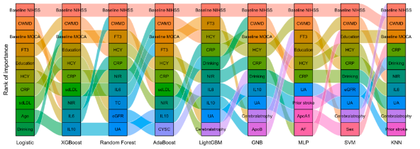

# Alluvial

​	冲击图（alluvial diagram）是流程图的一种，也是平行坐标图（PCP）的一种变体，最初用来表示网络结构的时间变化，强调节点之间的加权流（weighted flows）。冲击图中，变量被分配到平行的垂直或水平轴上，值由每个轴上的区块表示，区块的高度表示特定变量集的大小，流的宽度表示由流连接的两个区块中包含的组间的大小。

Python代码完成 冲积图 ，还未得出完整的结果，我使用 **Origin 绘图工具** 画出以下结果，不知道是不是老师您想得到结果：

> 图中的 冲积图 格式包括 节点，连接线的颜色大小都可以自定义

老师您上次给的图应该不是 准确的桑基图，桑基图要求 不同层次之间不能含有 相同的节点，但下图中 Logistic 与 XGBoost 等有相同的节点（如 HCY 格子），Python 代码无法实现不同层之间有相同节点的桑基图。

## 桑基图

​	桑基图（Sankey diagrams），即桑基能量分流图，也叫桑基能量平衡图。用来展示数据的“流动”变化，分支的宽度表示流量的大小，应用于能源流向、收入支出、人员流动等数据的可视化。桑基图主要由边、流量和支点组成，其中边代表了流动的数据，流量代表了流动数据的具体数值，**节点代表了不同分类**。边的宽度与流量成比例的显示，边越宽，数值越大。

> 它是一种**特定类型的流程图，图中延伸的分支的宽度对应数据流量的大小**，通常应用于能源、材料成分、金融等数据的可视化分析。因1898年Matthew Henry Phineas Riall Sankey绘制的“蒸汽机的能源效率图”而闻名，此后便以其名字命名为“桑基图”。
>  **特征：始末端的分支宽度总和相等**，即所有主支宽度的总和应与所有分出去的分支宽度的总和相等，**保持能量的平衡**，数据从开始到结束总量都保持不变
>  **用途：呈现能量的流动与分布，用于表达流量分布和结构对比**
>  **组成**：主要由边、能量和节点组成。**边**，代表流动的数据；**流量**，代表流动数据的具体数值；**节点**，代表不同的分类。边的宽度与流量成正比显示出来（边越宽，则数值越大）

