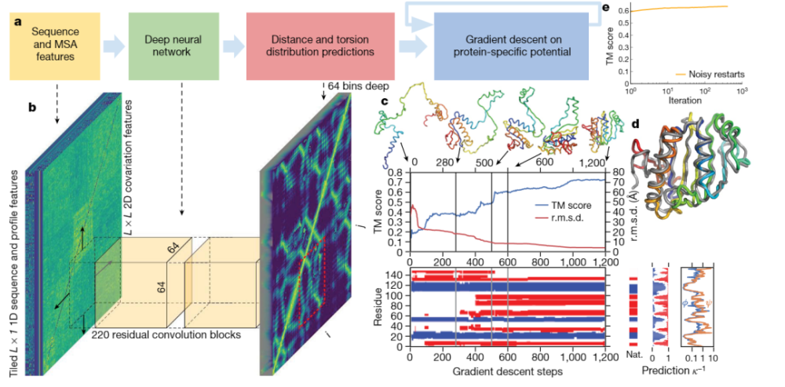
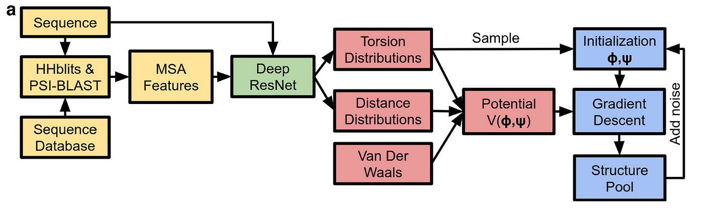
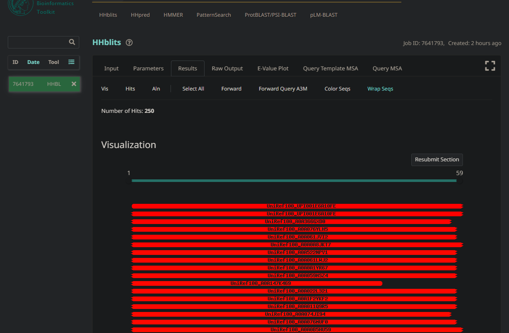
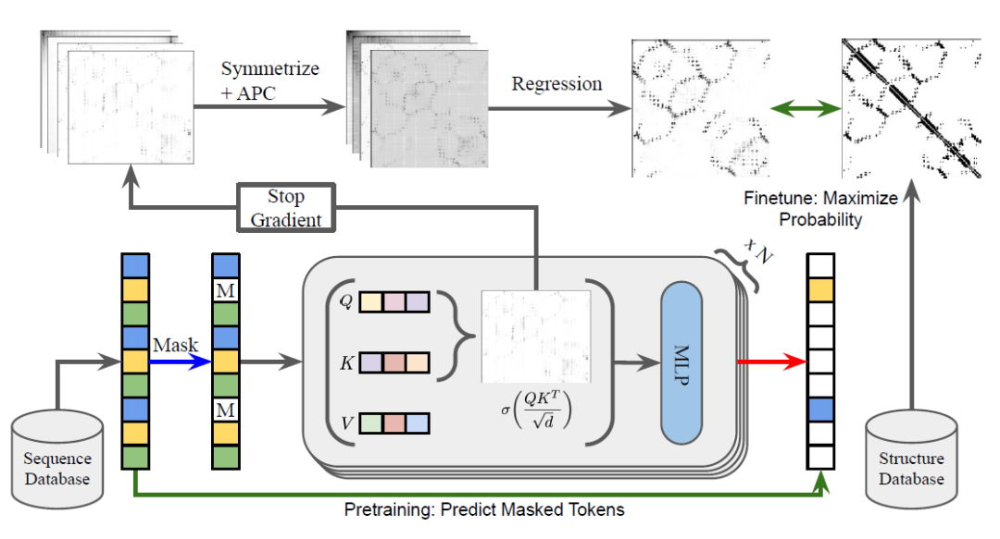
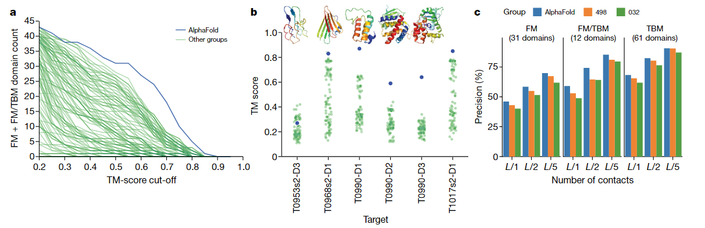

# AlphaFold

​	通过分析同源序列中的协变来推断哪些氨基酸残基与接触，有助于蛋白质结构的预测。

​	训练神经网络来准确预测残基对之间的距离，这比接触预测传达了更多关于结构的信息。利用这些信息，构建了一个平均力的潜力，可以准确地描述蛋白质的形状。

​	由此产生的潜力可以通过简单的梯度下降算法进行优化，以生成结构，而无需复杂的采样过程。生成的系统名为 AlphaFold，即使在同源序列较少的序列中也能实现高精度。在最近蛋白质结构预测的关键评估中5 (CASP13)——对该领域状态的盲目评估——AlphaFold在43个自由建模领域中为24个创建了高精度结构(模板建模(TM)得分为0.7或更高)，而下一个使用采样和接触信息的最佳方法在43个领域中只有14个达到了这样的精度。

> 一种蛋白质结构预测的深度学习方法，通过训练神经网络（图 2b）来构建学习的、特定于蛋白质的潜力，以准确预测给定序列的蛋白质的结构，并通过最小化梯度下降的潜力来准确预测结构本身（图 2c）。神经网络预测包括主干扭转角和残基之间的成对距离。

​	将蛋白质分为 104 个域进行评分，并将每个域分为适合基于模板建模（TBM，template based modelling (即具有相似序列的蛋白质具有已知结构，并根据序列差异修改同源结构）或需要自由建模（FM，free modelling 在没有同源结构的情况下），以及中间（FM/TBM）类别。

AlphaFold解决的问题是蛋白质折叠问题，可以抽象成如下：

> 输入：Alpha Fold的输入是一个氨基酸序列，每一个位置的元素代表了链上的一个氨基酸单元（一共可以有21种氨基酸单元），一个典型的输入如下：一个包含59个氨基酸的链

> PIAQIHILEGRSDEQKETLIREVSEAISRSLDAPLTSVRVIITEMAKGHFGIGGELASK

输出：在接收到这个单一序列的输入之后，AlphaFold需要使用算法，预测这一个氨基酸链条会如何折叠，所以输出的是一个拓扑结构，上面这段氨基酸输入经过AlphaFold模型运算之后输出的氨基酸拓扑结构可视化如下：

<video src="images/01.mp4"></video>

​	这个拓扑结构本身肯定不能作为输出，作为输出肯定需要是结构化的数据。准确的说，输出的数据是每一个氨基酸单元和其下一个氨基酸单元在空间中的夹角，由于是三维空间，所以说明一个方位需要2维数据，(φ, ψ)，所以AlphaFold的模型的输出就是一组数量和输入对应的夹角对：

> (φ1, ψ1),(φ2, ψ2),(φ3, ψ3),(φ4, ψ4),...
>
> *如果输入的是k个氨基酸，那么输出的就是k-1个夹角对，比如上文中输入是59个氨基酸组成的氨基酸链，那么就应该输出58个夹角对。*

> ​	图c展示了蛋白质结构预测的梯度下降步骤。x轴代表梯度下降步骤，y轴代表TM得分。TM得分是一种衡量预测蛋白质结构与真实蛋白质结构相似性的评价指标，得分越高，预测结果越准确。

整个AlphaFold算法大致分为几个部分：

（1）序列和 MSA (Multiple Sequence Alignment) 特征抽取，可以理解为机器学习中最常见的特征构造部分，把氨基酸链的输入转换到特征空间

（2）深度神经网络结构预测，主要工作是用根据（1）中的抽取的特征预测输出氨基酸链的一些性质，比如氨基酸之间两两的**距离分布**，氨基酸链的**夹角分布**（注意，这里不是直接预测结构，而是预测距离和夹角的**分布**，同时注意，这里预测的都是分布，而不是直接预测夹角/距离，这是算法的很重要的细节）

（3）potential construction，其任务是根据（2）中神经网络预测的性质，构造一个评估函数，来评估诸多可能的解的合理程度

（4）结构生成，这里使用了（3）中构建的评估函数，*使用（3）中的预测夹角分布初始化一个解*，然后使用评估函数评估它，并且使用梯度下降法优化这个解，直到解收敛。

## **特征提取**

AlphaFold的特征提取包含了**序列特征**和**序列平方特征**两大部分。

> ​	首先是**序列特征**，序列特征是长度和原始输入序列相同的，包括了one-hot 的氨基酸种类特征（21维）,HHblit 特征（22维），MSA特征等等，*其中 HHblit*  特征代表HHblit工具算法对每个氨基酸计算出的一个特征向量，类似的很多其他特征也被加入到序列特征中用于丰富特征表达能力。
>
> ​	序列特征中的 MSA 特征，这个技术用于从一个大的数据库中抽取和输入氨基酸序列相近的序列，并且进行对齐。抽取这个特征的原因是类似的氨基酸序列一般来说折叠方式也类似，相当于在特征中就加入了相近的序列结构信息。

例子，HHblit工具也可以用来做MSA，在网站中输入上文用于举例的59个氨基酸组成的序列，HHblit 工具会在数据库中开始搜索序列与之相近的氨基酸序列，并且进行对齐。检索完成后会显示查询结果：

https://toolkit.tuebingen.mpg.de/jobs/7641793

如果输入的氨基酸序列长度为k，那么**序列特征**的矩阵就是一个维度为 (k,m) 的矩阵，其中m是序列特征的总维度。

​	**序列平方特征**，主要包含另一个模型预测的氨基酸两两之间的 Contact map（接触图）和这一接触图模型的参数，它是把另一个模型的输出作为 AlphaFold 的输入，这个被作为 AlphaFold 输入的模型是 **CCMpred**

​	输入的氨基酸长度为k，**序列平方**特征的就会是一个维度为$(k,k,n)$的矩阵 ($n$为序列平方特征的数量)，其预测的是氨基酸两两之间的结构上的接触概率。

## **结构预测模型** 

模型的输入包含了特征抽取后的 **序列特征** 和 **序列平方特征**

模型的输出包含两个部分：

- 一个$（k,k,64）$维度的输出，代表预测的两两氨基酸单元之间的**距离分布**，这个输出是距离的概率分布，64代表的是将 $2-22Å$（$1Å=10^-10m$，是一个距离单位）划分为64个桶，网络输出两两氨基酸的距离落在相应的桶里的概率
- 一个$（*k-1,1296）$维度的输出，$1296 = 36^2$，这个输出代表每一个氨基酸和其后一个氨基酸的相对方位夹角，上文有提到，这个夹角应该用两个维度表示：$(φ1, ψ1),(φ2, ψ2),(φ3, ψ3),(φ4, ψ4),...$ ，但是这里 AlphaFold 的处理比较暴力，直接将每个360度划分成 36 个桶，这样一个夹角对就可以落到 36x36=1296 个桶中的一个，网络仍然是预测每个氨基酸对和后一个的夹角落在每个桶中的概率。

## 结论

​	图 1a 显示，与其他系统相比，AlphaFold 预测的调频结构域的准确率更高，尤其是在 0.6-0.7 TM 分数范围内。TM 分数介于 0 和 1 之间，衡量的是拟建结构的整体（骨架）形状与原生结构的匹配程度。AlphaFold 在调频类别中获得了 52.8 的总和分数，而紧随其后的小组（322 个）仅获得了 36.6 的分数。结合调频和 TBM/FM 类别，AlphaFold 得分 68.3，而 TBM/FM 得分 48.2。

​	AlphaFold 能够高精度预测以前未知的折叠（图 1b）。尽管只使用了调频技术而没有使用模板，但根据评估人员的公式0-capped z-score，AlphaFold在TBM类别中也取得了很好的成绩，在前一个模型中排名第四，在五个最佳模型中排名第一。AlphaFold 的准确性在很大程度上归功于距离预测的准确性，这一点从相应的接触预测的高精度中可以看出（图 1c 和扩展数据图 2a）。

