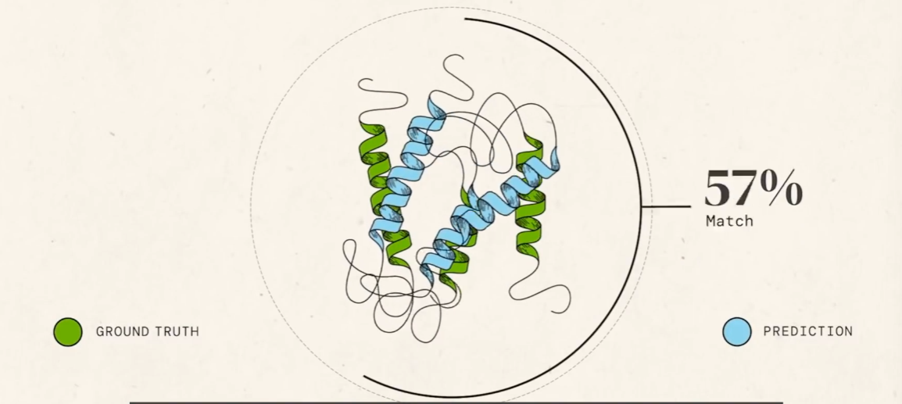

# Basic Knowledge

​	蛋白质结构相似性通常通过 **RMSD**（均方根偏差）分数、**GDT**（全局距离测试）分数和模板建模分数 **TM-score** 来衡量

​	原子位置的均方根偏差（RMSD）是衡量叠加蛋白质的原子（通常是骨架原子）之间平均距离的度量. 是用来量化两个结构之间的差异性的数值。
​	在结构生物学中，rmsd常用于比较蛋白质的三维结构，以评估分子模拟的精度和可靠性。
​	rmsd 的计算方法是将两个结构中的每个原子都进行配对，计算它们之间的距离，并求出它们平方的平均值，最后将其平方根即可得到 rmsd 值。通常，**rmsd 值越小，说明两个结构之间的差异越小，相似度越高**

​	

​	**TM-scores 评分**是评估蛋白质结构拓扑相似性的指标。它使用Levitt-Gerstein权重计算所有残基对。TM 分数对全局拓扑比局部变化更敏感。此外，由于它采用蛋白质大小依赖性量表来归一化残基距离，因此随机蛋白质对的TM评分的大小与蛋白质大小无关.

​									$TM-score = \frac{1}{L}[\sum^{L_ali}_{i = 1}{\frac{1}{1 + d^2_i / d^2_0}}]$

​	其中 $L$ 是目标蛋白的长度，$L_{ali}$ 是两种蛋白质中等效残基的数量。$d_i$ 是两个结构之间等效残基的第 $i$ 对的距离，取决于叠加矩阵;“max”表示确定使公式（1）中的总和最大化的最佳叠加矩阵的过程。规模定义为标准化 TM 评分，即随机蛋白质对的平均 TM 评分的大小与蛋白质的大小无关。
​	TM 分数保持在 （0， 1) 中，值越高表示相似性越强

​	**GDT 分数**被广泛用于社区范围的CASP和CAFASP实验，以评估蛋白质结构预测的建模准确性，随机结构对的GDT和MaxSub评分的大小与蛋白质长度具有幂律依赖性(可以用以下形式的数学关系来描述：$Y = a * X^b$， 其中：$Y$ 和 $X$ 是两个变量)，这使得分数的绝对值意义不大。它还有一个缺点，即相关蛋白质的相似性在很大程度上取决于它们的长度

​	在大约 90 分的情况下，就可以认为从一串氨基酸序列转发成蛋白质折叠出的三维结构问题大部分已经得到解决，在 2020 年前的相关比赛中，从来没有超过 90，甚至是 60。GDT 分数意味着实际三维结构和生成的三维结构的全局距离分数。也可以说是预测结构和真实蛋白质结构相似度的度量值，如下：

​	RFdiffusion 是一种生成模型，用于设计新的蛋白质。它通过结合结构预测网络和生成扩散模型，创建了一种强大的新方式来设计蛋白质。与以前的设计方法相比，使用新方法，团队只需要测试一种设计挑战就可以找到执行如预期的单个分子。

​	ProteinMPNN则是一种基于深度学习的蛋白质序列设计方法。它使用神经网络分析大量蛋白质数据，并识别出可以用来创建具有特定属性的新蛋白质的模式。在给定蛋白质结构的情况下，ProteinMPNN可以快速识别出可能折叠成该骨架的新氨基酸序列。

​	"Denovo"在蛋白质设计中通常指的是从头开始设计蛋白质，而不是修改或改进现有的自然蛋白质。这可能会产生具有定制形状和功能的新的蛋白质序列、折叠和功能。这种方法搜索可以折叠成预先指定的三维骨架结构的序列。
​	然而，这个过程可能会非常具有挑战性，因为可能的蛋白质序列数量是巨大的，随着蛋白质链的大小呈指数级增长。因此，尽管我们有强大的计算工具和大量的蛋白质数据，但在没有任何参考的情况下进行纯粹的de novo设计仍然可能需要尝试几百次才能找到一个有效的设计。
​	对于这些靶点，de novo蛋白质设计可能提供一种新的策略，通过设计新的蛋白质来影响这些靶点。然而，由于这些靶点本身就很难针对，所以使用de novo设计方法也可能面临很高的失败率。这是一个活跃的研究领域，科学家们正在努力改进设计方法并寻找新的策略来解决这些挑战。

​	药物靶点是指药物在体内的作用结合位点，通常是生物大分子，如基因位点、受体、酶、离子通道和核酸等。药物通过特异性地、高活性地与这些靶点相结合，发挥其药理作用。例如，一个优秀的靶向药物会特异性地、高活性地与对应的生物功能分子相结合，通过这种亲和性关系，我们便可以得到药物分子-生物功能分子的复合物。
​	这些靶点不仅要能与药物特异性结合，而且还要符合以下几个特征：首先要参与疾病相关病理过程，并且扮演关键角色，且不参与与疾病无关的正常组织生理过程。另外值得注意的是，一个有效的靶标需要尽可能避免参与多条代谢或信号通路，也就是说一个靶点最好是单独参与某一条信号通路，这样才能便于对其进行后续研究。

# 专有词

> **TBM** 是一种蛋白质结构预测方法，它依赖于已知具有相似氨基酸序列的蛋白质的已知结构（通常称为模板）来预测目标蛋白质的结构。
>
> **TM** 值（Transition Matrix Value）是一种在生物化学研究中常用的计算方法，用于衡量蛋白质序列的**稳定性和可折叠性**。
> 	TM 值是通过分析蛋白质序列史的氨基酸转变矩阵来得到的。转变矩阵记录了蛋白质序列史两个氨基酸之间的转变概率。通常情况下，TM 值越高，蛋白质的稳定性越好，可折叠性越高。

​	最成功的 FM 都依赖于**片段组装**。在这些方法中，结构是通过随机抽样过程（如**模拟退火**）创建的，是从最小化蛋白质数据库 (PDB) 结构中提取的汇总统计得出的统计潜力。在片段组装过程中，重复修改结构假设，通常是通过更改短部分的形状，同时保留降低电位的变化，最终导致潜在的结构较低。模拟退火需要数千个这样的移动，必须重复多次才能很好地覆盖低势结构。

​	在相关序列集中发现的**进化协变**数据（evolutionary covariation data）：

​	**残差**，是指实际观察值与回归估计值的差。残差分析就是通过残差所提供的信息，分析出数据的可靠性、周期性或其它干扰。残差图的分布趋势可以帮助判明所拟合的线性模型是否满足有关假设。残差有多种形式，上述为普通残差。为了更深入地研究某一自变量与因变量的关系，引进了偏残差。以某种残差为纵坐标，其它变量为横坐标作散点图，即残差图，它是残差分析的重要方法之一。需分析具体情况，探索合适的校正方案，如非线性处理，引入新自变量，或考察误差是否有自相关性。

> Reference：https://baijiahao.baidu.com/s?id=1767191720946683833