# Kafka


​	Kafka是 一个开源的 分布式事件流平台 （Event Streaming Platform），被数千家公司用于高性能数据管道、流分析、数据集成和关键任务应用

> ​	消息队列 企业中比较常见的消息队列产品主要有Kafka、ActiveMQ 、RabbitMQ 、 RocketMQ 等。 在大数据场景主要采用 Kafka 作为消息队列。在 JavaEE 开发中主要采用 ActiveMQ、 RabbitMQ、RocketMQ

**应用场景**

传统的消息队列的主要应用场景包括：缓存/消峰、解耦和异步通信

- 缓冲/消峰：有助于控制和优化数据流经过系统的速度，解决生产消息和消费消息的处理速度不一致的情况
- 解耦：允许你独立的扩展或修改两边的处理过程，只要确保它们遵守同样的接口约束
- 异步通信：允许用户把一个消息放入队列，但并不立即处理它，然后在需要的时候再去处理它们

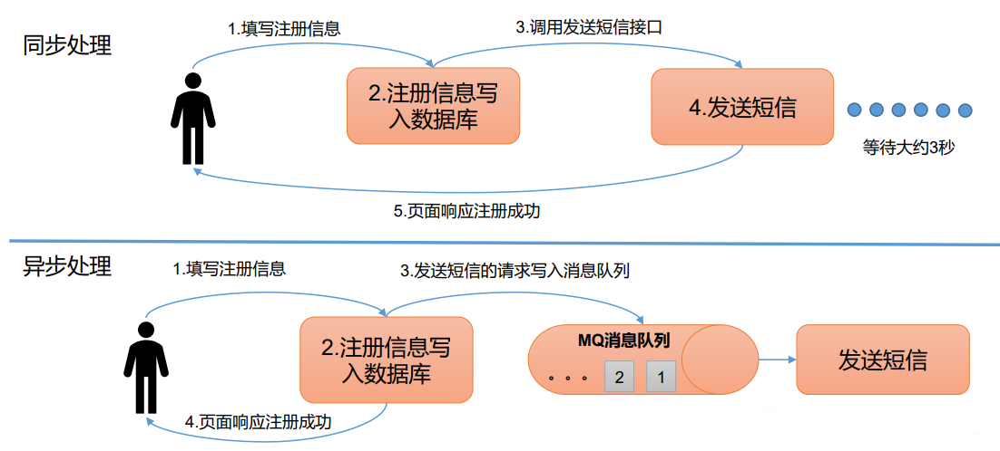

**消息队列的两种模式**

1）点对点模式：消费者主动拉取数据，消息收到后清除消息

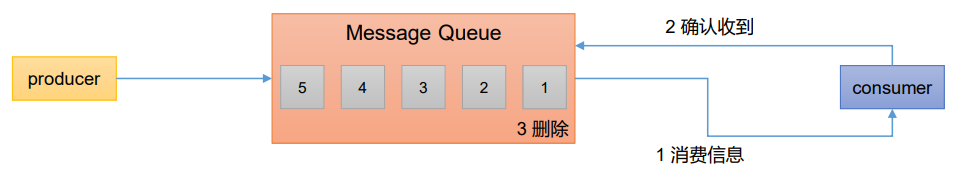

2）发布/订阅模式

- 可以有多个topic主题（浏览、点赞、收藏、评论等）
- 消费者消费数据之后，不删除数据
- 每个消费者相互独立，都可以消费到数据

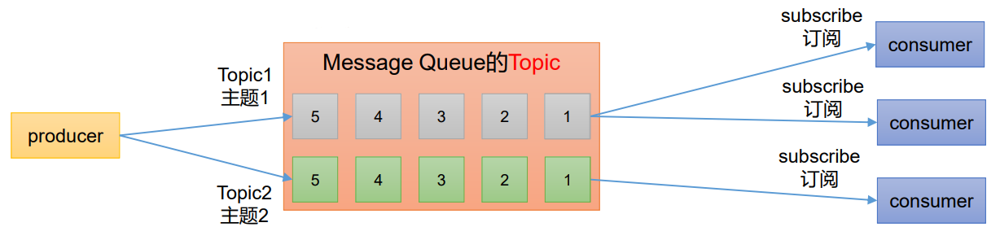

## **Kafka 基础架构**

1. 为方便扩展，并提高吞吐量，一个 topic 分为多个 partition
2. .配合分区的设计，提出消费者组的概念，组内每个消费者并行消费
3. 为提高可用性，为每个 partition 增加若干副本，类似NameNode HA
4. ZK 中记录谁是 leader，Kafka2.8.0 以后也可以配置不采用 ZK

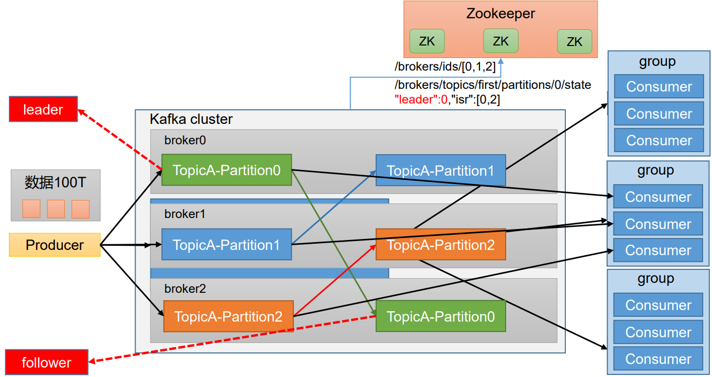

（1）Producer：消息生产者，就是向 Kafka broker 发消息的客户端。 
（2）Consumer：消息消费者，向 Kafka broker 取消息的客户端。 
（3）Consumer Group（CG）：消费者组，由多个 consumer 组成。消费者组内每个消 费者负责消费不同分区的数据，一个分区只能由一个组内消费者消费；消费者组之间互不 影响。所有的消费者都属于某个消费者组，即消费者组是逻辑上的一个订阅者。
（4）Broker：一台 Kafka 服务器就是一个 broker。一个集群由多个 broker 组成。一个 broker 可以容纳多个 topic。
（5）Topic：可以理解为一个队列，生产者和消费者面向的都是一个 topic。 
（6）Partition：为了实现扩展性，一个非常大的 topic 可以分布到多个 broker（即服 务器）上，一个 topic 可以分为多个 partition，每个 partition 是一个有序的队列。 
（7）Replica：副本。一个 topic 的每个分区都有若干个副本，一个 Leader 和若干个 Follower。 
（8）Leader：每个分区多个副本的“主”，生产者发送数据的对象，以及消费者消费数 据的对象都是 Leader。 
（9）Follower：每个分区多个副本中的“从”，实时从 Leader 中同步数据，保持和 Leader 数据的同步。Leader 发生故障时，某个 Follower 会成为新的 Leader。


## 部署

### 集群规划

| hadoop001 | hadoop002 | hadoop003 |
| :-------: | :-------: | :-------: |
|    zk     |    zk     |    zk     |
|   kafka   |   kafka   |   kafka   |


### 安装

0）官方下载地址：http://kafka.apache.org/downloads.html

1）解压安装包

```bash
mkdir /opt/module
tar -zxvf kafka_2.12-3.6.0.tgz -C /opt/module/
mv kafka_2.12-3.6.0 kafka
```

2）进入到 `/opt/module/kafka` 目录，修改配置文件

```bash
cd config/
vim server.properties
### 输入以下内容
#broker 的全局唯一编号，不能重复，只能是数字
broker.id=0
#处理网络请求的线程数量
num.network.threads=3
#用来处理磁盘 IO 的线程数量
num.io.threads=8
#发送套接字的缓冲区大小
socket.send.buffer.bytes=102400
#接收套接字的缓冲区大小
socket.receive.buffer.bytes=102400
#请求套接字的缓冲区大小
socket.request.max.bytes=104857600
#kafka 运行日志(数据)存放的路径，路径不需要提前创建，kafka 自动帮你创建，可以配置多个磁盘路径，路径与路径之间可以用"，"分隔
log.dirs=/opt/module/kafka/datas
#topic 在当前 broker 上的分区个数
num.partitions=1
#用来恢复和清理 data 下数据的线程数量
num.recovery.threads.per.data.dir=1
# 每个 topic 创建时的副本数，默认时 1 个副本
offsets.topic.replication.factor=1
#segment 文件保留的最长时间，超时将被删除
log.retention.hours=168
#每个 segment 文件的大小，默认最大 1G
log.segment.bytes=1073741824
# 检查过期数据的时间，默认 5 分钟检查一次是否数据过期
log.retention.check.interval.ms=300000
#配置连接 Zookeeper 集群地址（在 zk 根目录下创建/kafka，方便管理）
zookeeper.connect=hadoop102:2181,hadoop103:2181,hadoop104:2181/kafka
```

3）分发安装包

```bash
xsync kafka/

scp -r /opt/module/kafka hadoop2:/opt/module/
scp -r /opt/module/kafka hadoop3:/opt/module/
```

4）分别在 hadoop103 和 hadoop104 上修改配置文件 `/opt/module/kafka/config/server.properties` 中的 `broker.id=1`、`broker.id=2`

> 注：broker.id 不得重复，整个集群中唯一

```bash
vim kafka/config/server.properties

### 修改:
# The id of the broker. This must be set to a unique integer for each broker.
broker.id=1

vim kafka/config/server.properties
### 修改:
# The id of the broker. This must be set to a unique integer for each broker.
broker.id=2

log.dirs=/data/kafka
# or 
log.dirs=/opt/module/kafka/datas

zookeeper.connect=hadoop001:2181,hadoop002:2181,hadoop003:2181/kafka
```

5）配置环境变量

（1）在 `/etc/profile.d/container_env.sh` 文件中增加 `kafka` 环境变量配置
```bash
sudo vim /etc/profile.d/container_env.sh

# KAFKA_HOME
export KAFKA_HOME=/opt/module/kafka
export PATH=$PATH:$KAFKA_HOME/bin

scp -r /etc/profile.d/container_env.sh hadoop2:/etc/profile.d/
scp -r /etc/profile.d/container_env.sh hadoop3:/etc/profile.d/
source /etc/profile

### 分发环境变量文件到其他节点，并 source
sudo /home/gardenia/bin/xsync /etc/profile.d/container_env.sh
```

6）启动集群

（1）先启动 Zookeeper 集群，然后启动 Kafka
```bash
zk.sh start
```

（2）依次在 hadoop001、hadoop002、hadoop003节点上启动  `Kafka` 
```bash
bin/kafka-server-start.sh -daemon config/server.properties
```

> 注意：配置文件的路径要能够到 `server.properties` 
>
> 关闭集群：`bin/kafka-server-stop.sh` 

#### 集群启停脚本

1）在 `/home/gardenia/bin`  目录下创建文件 `kf.sh` 脚本文件

```bash
#! /bin/bash
case $1 in 
"start"){
	for i in hadoop001 hadoop002 hadoop003
	do
		echo " --------start $i Kafka-------"
		ssh $i "/opt/module/kafka/bin/kafka-server-start.sh -daemon /opt/module/kafka/config/server.properties"
	done
};;
"stop"){
	for i in hadoop001 hadoop002 hadoop003
	do
		echo " --------stop $i Kafka-------"
		ssh $i "/opt/module/kafka/bin/kafka-server-stop.sh "
	done
};;
esac
```

2）添加执行权限

```bash
chmod +x kf.sh
```

3）集群命令

```bash
### 启动集群
kf.sh start

### 停止
kf.sh stop
```


## Kafka Commands

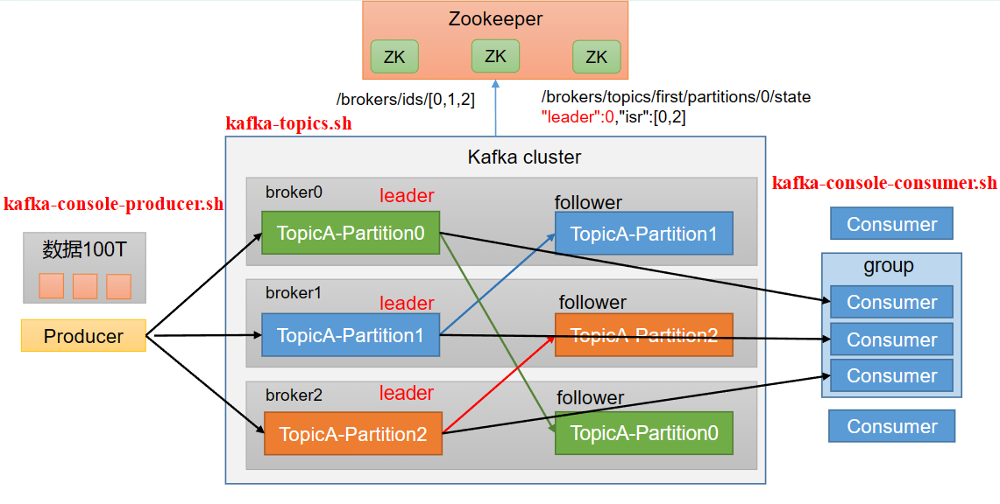

### Topic 命令行操作

```bash
# 查看操作主题命令参数
bin/kafka-topics.sh
```

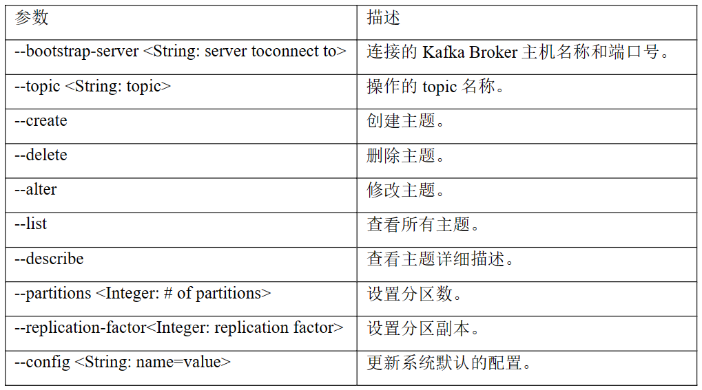

```bash
# 查看当前服务器中的所有 topic
bin/kafka-topics.sh --bootstrap-server hadoop102:9092 --list

## 创建 first topic
bin/kafka-topics.sh --bootstrap-server hadoop102:9092 --create --partitions 1 --replication-factor 3 --topic first
选项说明：
--topic 定义 topic 名
--replication-factor 定义副本数
--partitions 定义分区数

## 查看 first 主题的详情
bin/kafka-topics.sh --bootstrap-server hadoop102:9092 --describe --topic first

## 修改分区数（注意：分区数只能增加，不能减少）
bin/kafka-topics.sh --bootstrap-server hadoop102:9092 --alter --topic first --partitions 3

## 删除 topic
bin/kafka-topics.sh --bootstrap-server hadoop102:9092 --delete --topic first
```


### Producer 命令行操作

```bash
# 查看操作生产者命令参数
bin/kafka-console-producer.sh
```

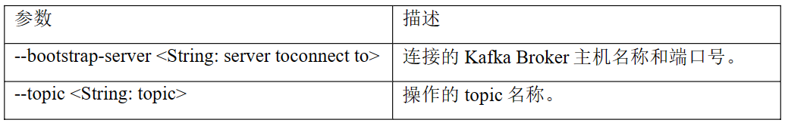

```bash
# 发送消息
bin/kafka-console-producer.sh --bootstrap-server hadoop102:9092 --topic first
```


### Consumer 命令行操作

```bash
# 查看操作消费者命令参数
bin/kafka-console-consumer.sh
```

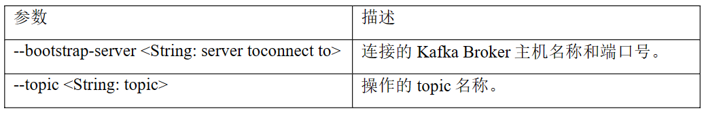

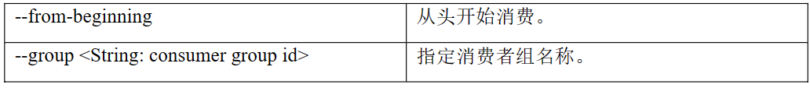

```bash
## 消费 first 主题中的数据
bin/kafka-console-consumer.sh --bootstrap-server hadoop102:9092 --topic first

## 把主题中所有的数据都读取出来（包括历史数据）
bin/kafka-console-consumer.sh --bootstrap-server hadoop102:9092 --from-beginning --topic first
```


## 生产者

### 生产者消息发送流程

​	在消息发送的过程中，涉及到了两个线程——main 线程和 Sender 线程。在 main 线程中创建了一个双端队列 RecordAccumulator。main 线程将消息发送给 RecordAccumulator，Sender 线程不断从 RecordAccumulator 中拉取消息发送到 Kafka Broker


### 生产者重要参数列表

| 参数名称                              | 描述                                                         |
| ------------------------------------- | ------------------------------------------------------------ |
| bootstrap.servers                     | 生 产 者 连 接 集 群 所 需 的 broker 地 址 清 单 。 例 如 hadoop102:9092,hadoop103:9092,hadoop104:9092，可以设置 1 个或者多个，中间用逗号隔开。注意这里并非需要所有的 broker 地址，因为生产者从给定的 broker 里查找到其他 broker 信息 |
| key.serializer 和 value.serializer    | 指定发送消息的 key 和 value 的序列化类型。一定要写全类名     |
| buffer.memory                         | RecordAccumulator 缓冲区总大小，默认 32m                     |
| batch.size                            | 缓冲区一批数据最大值，默认 16k。适当增加该值，可以提高吞吐量，但是如果该值设置太大，会导致数据传输延迟增加 |
| linger.ms                             | 如果数据迟迟未达到 batch.size，sender 等待 linger.time 之后就会发送数据。单位 ms，默认值是 0ms，表示没有延迟。生产环境建议该值大小为 5-100ms 之间 |
| acks                                  | 0：生产者发送过来的数据，不需要等数据落盘应答。<br/>1：生产者发送过来的数据，Leader 收到数据后应答。<br/>-1（all）：生产者发送过来的数据，Leader+ 和 isr 队列里面的所有节点收齐数据后应答。默认值是-1，-1 和 all 是等价的 |
| max.in.flight.requests.per.connection | 允许最多没有返回 ack 的次数，默认为 5，开启幂等性要保证该值是 1-5 的数字 |
| retries                               | 当消息发送出现错误的时候，系统会重发消息。retries 表示重试次数。默认是 int 最大值，2147483647。<br/>如果设置了重试，还想保证消息的有序性，需要设置MAX_IN_FLIGHT_REQUESTS_PER_CONNECTION=1 否则在重试此失败消息的时候，其他的消息可能发送成功了 |
| retry.backoff.ms                      | 两次重试之间的时间间隔，默认是 100ms                         |
| enable.idempotence                    | 是否开启幂等性，默认 true，开启幂等性                        |
| compression.type                      | 生产者发送的所有数据的压缩方式。默认是 none，也就是不压缩。<br/>支持压缩类型：none、gzip、snappy、lz4 和 zstd |


### 异步发送 API

#### 普通异步发送

> 需求：创建 Kafka 生产者，采用异步的方式发送到 Kafka Broker


**Code**

```java
// 依赖
<dependency>
    <groupId>org.apache.kafka</groupId>
    <artifactId>kafka-clients</artifactId>
    <version>3.0.0</version>
</dependency>
    
// 创建包名：com.atguigu.kafka.producer	
// 不带回调函数的 API 代码
import org.apache.kafka.clients.producer.KafkaProducer;
import org.apache.kafka.clients.producer.ProducerConfig;
import org.apache.kafka.clients.producer.ProducerRecord;
import org.apache.kafka.common.serialization.StringSerializer;
import java.util.Properties;

public class CustomProducer {
    public static void main(String[] args) {
        // 0 配置
        Properties properties = new Properties();
        // 连接集群 bootstrap.servers
        properties.put(ProducerConfig.BOOTSTRAP_SERVERS_CONFIG,"hadoop002:9092,hadoop003:9092");
        // 指定对应的 key 和 value 的序列化类型 key.serializer
        properties.put(ProducerConfig.KEY_SERIALIZER_CLASS_CONFIG, StringSerializer.class.getName());
        properties.put(ProducerConfig.VALUE_SERIALIZER_CLASS_CONFIG,StringSerializer.class.getName());
        // 1 创建kafka生产者对象
        // "" hello
        KafkaProducer<String, String> kafkaProducer = new KafkaProducer<>(properties);
        // 2 发送数据
        for (int i = 0; i < 5; i++) {
            kafkaProducer.send(new ProducerRecord<>("first","gardenia"+i));
        }
        // 3 关闭资源
        kafkaProducer.close();
    }
}
```

**Test**

```bash
# 在 hadoop102 上开启 Kafka 消费者
bin/kafka-console-consumer.sh --bootstrap-server hadoop102:9092 --topic first

# 在 IDEA 中执行代码，观察 hadoop102 控制台中是否接收到消息
```


#### 带回调函数的异步发送

​	回调函数会在 producer 收到 ack 时调用，为异步调用，该方法有两个参数，分别是元数据信息（RecordMetadata）和异常信息（Exception），如果 Exception 为 null，说明消息发送成功，如果 Exception 不为 null，说明消息发送失败

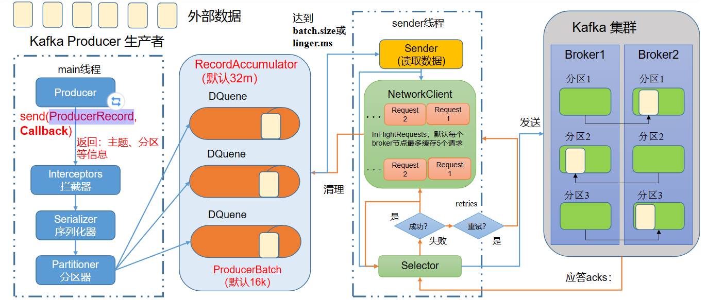

> 注意：消息发送失败会自动重试，不需要在回调函数中手动重试

```java
import org.apache.kafka.clients.producer.*;
import org.apache.kafka.common.serialization.StringSerializer;
import java.util.Properties;

public class CustomProducerCallback {
    public static void main(String[] args) throws InterruptedException {
        // 0 配置
        Properties properties = new Properties();
        // 连接集群 bootstrap.servers
        properties.put(ProducerConfig.BOOTSTRAP_SERVERS_CONFIG, "hadoop002:9092,hadoop003:9092");
        // 指定对应的key和value的序列化类型 key.serializer
//        properties.put(ProducerConfig.KEY_SERIALIZER_CLASS_CONFIG,"org.apache.kafka.common.serialization.StringSerializer");
        properties.put(ProducerConfig.KEY_SERIALIZER_CLASS_CONFIG, StringSerializer.class.getName());
        properties.put(ProducerConfig.VALUE_SERIALIZER_CLASS_CONFIG, StringSerializer.class.getName());

        // 1 创建kafka生产者对象
        // "" hello
        KafkaProducer<String, String> kafkaProducer = new KafkaProducer<>(properties);
        // 2 发送数据
        for (int i = 0; i < 500; i++) {
            kafkaProducer.send(new ProducerRecord<>("first", "gardenia" + i), new Callback() {
                @Override
                public void onCompletion(RecordMetadata metadata, Exception exception) {
                    if (exception == null) {
                        System.out.println("主题： " + metadata.topic() + " 分区： " + metadata.partition());
                    }
                }
            });
            Thread.sleep(2);
        }
        // 3 关闭资源
        kafkaProducer.close();
    }
}
// Test 同上
// 在 IDEA 控制台观察回调信息
/*
主题：first->分区：0
主题：first->分区：0
主题：first->分区：1
主题：first->分区：1
主题：first->分区：1
*/
```


#### 同步发送 API

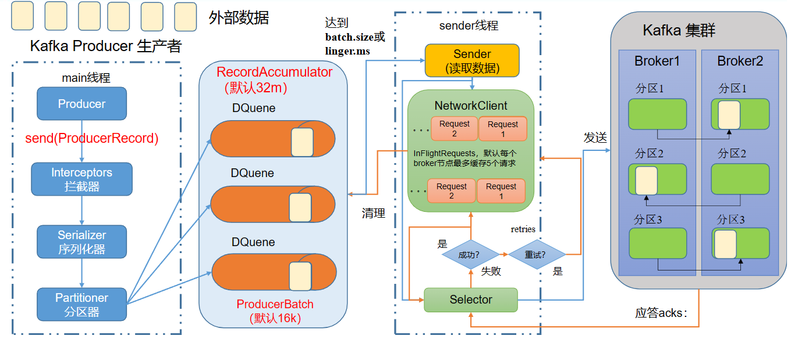

只需在异步发送的基础上，再调用一下 `get()` 方法即可 

```java
import org.apache.kafka.clients.producer.KafkaProducer;
import org.apache.kafka.clients.producer.ProducerConfig;
import org.apache.kafka.clients.producer.ProducerRecord;
import org.apache.kafka.common.serialization.StringSerializer;
import java.util.Properties;
import java.util.concurrent.ExecutionException;

public class CustomProducerSync {
    public static void main(String[] args) throws ExecutionException, InterruptedException {
        // 0 配置
        Properties properties = new Properties();
        // 连接集群 bootstrap.servers
        properties.put(ProducerConfig.BOOTSTRAP_SERVERS_CONFIG, "hadoop002:9092,hadoop003:9092");
        // 指定对应的key和value的序列化类型 key.serializer
        properties.put(ProducerConfig.KEY_SERIALIZER_CLASS_CONFIG, StringSerializer.class.getName());
        properties.put(ProducerConfig.VALUE_SERIALIZER_CLASS_CONFIG, StringSerializer.class.getName());

        // 1 创建kafka生产者对象
        // "" hello
        KafkaProducer<String, String> kafkaProducer = new KafkaProducer<>(properties);
        // 2 发送数据
        for (int i = 0; i < 5; i++) {
            kafkaProducer.send(new ProducerRecord<>("first", "atguigu" + i)).get();
        }
        // 3 关闭资源
        kafkaProducer.close();
    }
}
// Test 同上
```


#### 生产者分区

（1）便于合理使用存储资源，每个 `Partition` 在一个 `Broker` 上存储，可以把海量的数据按照分区切割成一块一块数据存储在多台  `Broker` 上。合理控制分区的任务，可以实现负载均衡的效果。
（2）提高并行度，生产者可以以分区为单位发送数据；消费者可以以分区为单位进行消费数据。

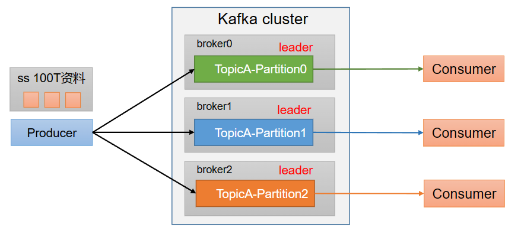

##### 分区策略

1. 默认的分区器  `DefaultPartitioner` 

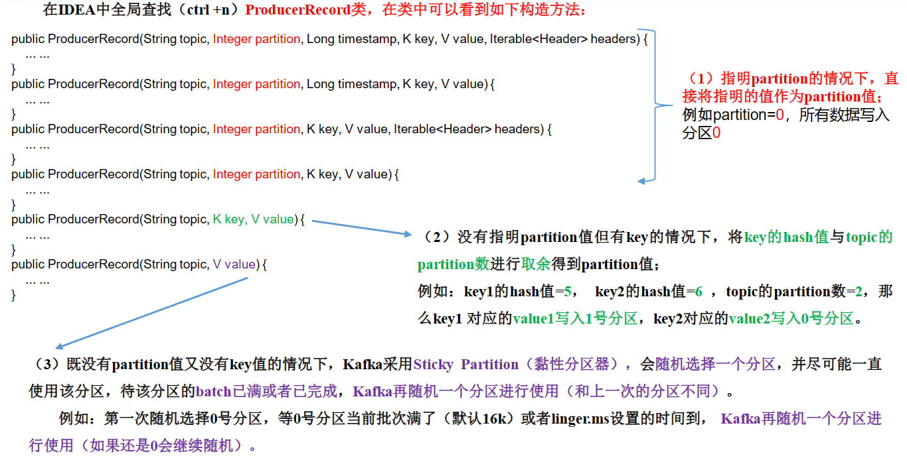

栗子🌰
```java
// 将数据发往指定 partition 的情况下，例如，将所有数据发往分区 1 中
import org.apache.kafka.clients.producer.*;
import org.apache.kafka.common.serialization.StringSerializer;
import java.util.Properties;

public class CustomProducerCallbackPartitions {
    public static void main(String[] args) throws InterruptedException {
        // 0 配置
        Properties properties = new Properties();
        // 连接集群 bootstrap.servers
        properties.put(ProducerConfig.BOOTSTRAP_SERVERS_CONFIG, "hadoop002:9092,hadoop003:9092");

        // 指定对应的key和value的序列化类型 key.serializer
        properties.put(ProducerConfig.KEY_SERIALIZER_CLASS_CONFIG, StringSerializer.class.getName());
        properties.put(ProducerConfig.VALUE_SERIALIZER_CLASS_CONFIG, StringSerializer.class.getName());
        
        // 1 创建kafka生产者对象
        KafkaProducer<String, String> kafkaProducer = new KafkaProducer<>(properties);
        // 2 发送数据
        for (int i = 0; i < 5; i++) {
            kafkaProducer.send(new ProducerRecord<>("first", 1, "", "hello" + i), new Callback() {
                @Override
                public void onCompletion(RecordMetadata metadata, Exception exception) {
                    if (exception == null) {
                        System.out.println("主题： " + metadata.topic() + " 分区： " + metadata.partition());
                    }
                }
            });
            Thread.sleep(2);
        }
        // 3 关闭资源
        kafkaProducer.close();
    }
}
```

在 hadoop002 上开启 Kafka 消费者后，在 IDEA 中执行代码，观察 hadoop002 控制台中是否接收到消息 | 在 IDEA 控制台观察回调信息

```java
// 没有指明 partition 值但有 key 的情况下，将 key 的 hash 值与 topic 的 partition 数进行取余得到 partition 值
```

2. 自定义分区器

栗子🌰
	实现一个分区器实现，发送过来的数据中如果包含 gardenia，就发往 0 号分区，不包含 gardenia，就发往 1 号分区

```java
// 定义类实现 Partitioner 接口	重写 partition() 方法
import org.apache.kafka.clients.producer.Partitioner;
import org.apache.kafka.common.Cluster;
import java.util.Map;

public class MyPartitioner implements Partitioner {
    @Override
    public int partition(String topic, Object key, byte[] keyBytes, Object value, byte[] valueBytes, Cluster cluster) {
        // 获取数据 atguigu  hello
        String msgValues = value.toString();
        int partition;
        if (msgValues.contains("gardenia")) {
            partition = 0;
        } else {
            partition = 1;
        }
        return partition;
    }
}
```

```java
// 使用分区器的方法，在生产者的配置中添加分区器参数
import org.apache.kafka.clients.producer.*;
import org.apache.kafka.common.serialization.StringSerializer;
import java.util.Properties;

public class CustomProducerCallbackPartitions {
    public static void main(String[] args) throws InterruptedException {
        // 0 配置
        Properties properties = new Properties();

        // 连接集群 bootstrap.servers
        properties.put(ProducerConfig.BOOTSTRAP_SERVERS_CONFIG, "hadoop002:9092,hadoop003:9092");

        // 指定对应的key和value的序列化类型 key.serializer
        properties.put(ProducerConfig.KEY_SERIALIZER_CLASS_CONFIG, StringSerializer.class.getName());
        properties.put(ProducerConfig.VALUE_SERIALIZER_CLASS_CONFIG, StringSerializer.class.getName());

        // 关联自定义分区器
        properties.put(ProducerConfig.PARTITIONER_CLASS_CONFIG, "com.gardenia.kafka.producer.MyPartitioner");

        // 1 创建kafka生产者对象
        KafkaProducer<String, String> kafkaProducer = new KafkaProducer<>(properties);

        // 2 发送数据
        for (int i = 0; i < 5; i++) {
            kafkaProducer.send(new ProducerRecord<>("first", 1, "", "hello" + i), new Callback() {
                @Override
                public void onCompletion(RecordMetadata metadata, Exception exception) {

                    if (exception == null) {
                        System.out.println("主题： " + metadata.topic() + " 分区： " + metadata.partition());
                    }
                }
            });
            Thread.sleep(2);
        }
        // 3 关闭资源
        kafkaProducer.close();
    }
}
```


### 生产者	提高吞吐量

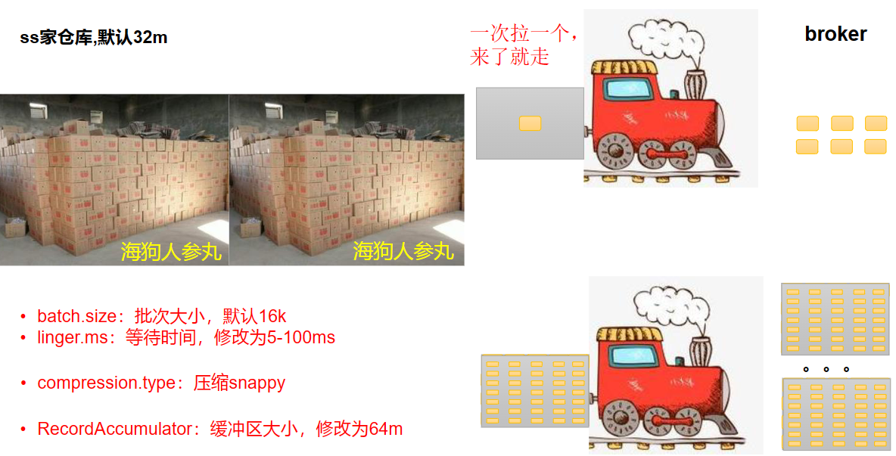

```java
import org.apache.kafka.clients.producer.KafkaProducer;
import org.apache.kafka.clients.producer.ProducerConfig;
import org.apache.kafka.clients.producer.ProducerRecord;
import org.apache.kafka.common.serialization.StringSerializer;
import java.util.Properties;

public class CustomProducerParameters {
    public static void main(String[] args) {
        // 0 配置
        Properties properties = new Properties();
        // 连接kafka集群
        properties.put(ProducerConfig.BOOTSTRAP_SERVERS_CONFIG, "hadoop002:9092,hadoop003:9092");
        // 序列化
        properties.put(ProducerConfig.KEY_SERIALIZER_CLASS_CONFIG, StringSerializer.class.getName());
        properties.put(ProducerConfig.VALUE_SERIALIZER_CLASS_CONFIG, StringSerializer.class.getName());
        
        // 缓冲区大小
        properties.put(ProducerConfig.BUFFER_MEMORY_CONFIG, 33554432);
        // 批次大小
        properties.put(ProducerConfig.BATCH_SIZE_CONFIG, 16384);
        // linger.ms
        properties.put(ProducerConfig.LINGER_MS_CONFIG, 1);
        // 压缩
        properties.put(ProducerConfig.COMPRESSION_TYPE_CONFIG, "snappy");
        
        // 1 创建生产者
        KafkaProducer<String, String> kafkaProducer = new KafkaProducer<>(properties);
        // 2 发送数据
        for (int i = 0; i < 5; i++) {
            kafkaProducer.send(new ProducerRecord<>("first", "gardenia" + i));
        }
        // 3 关闭资源
        kafkaProducer.close();
    }
}
```

在 hadoop002 上开启 Kafka 消费者后，在 IDEA 中执行代码，观察 hadoop002 控制台中是否接收到消息


### 数据可靠性

#### **ACK 应答级别**

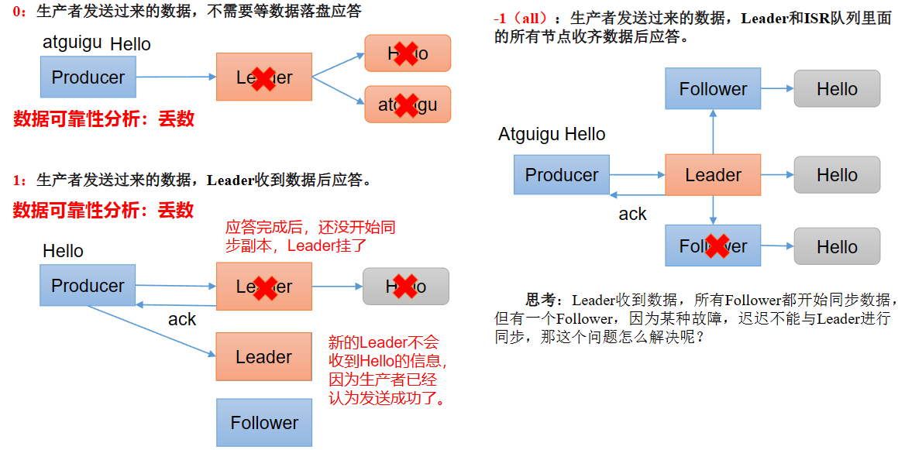

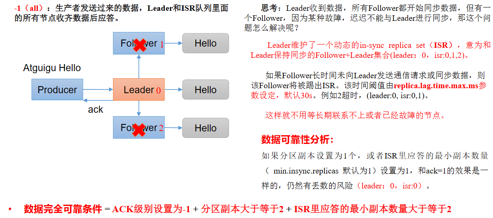

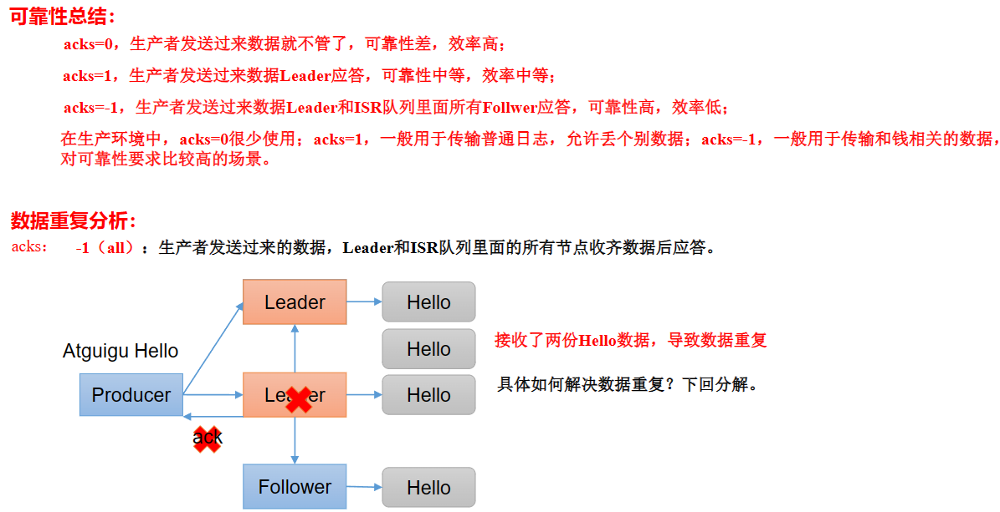

```java
import org.apache.kafka.clients.producer.KafkaProducer;
import org.apache.kafka.clients.producer.ProducerConfig;
import org.apache.kafka.clients.producer.ProducerRecord;
import org.apache.kafka.common.serialization.StringSerializer;
import java.util.Properties;

public class CustomProducerAcks {
    public static void main(String[] args) {
        // 0 配置
        Properties properties = new Properties();
        // 连接集群 bootstrap.servers
        properties.put(ProducerConfig.BOOTSTRAP_SERVERS_CONFIG, "hadoop002:9092,hadoop003:9092");
        // 指定对应的key和value的序列化类型 key.serializer
        properties.put(ProducerConfig.KEY_SERIALIZER_CLASS_CONFIG, StringSerializer.class.getName());
        properties.put(ProducerConfig.VALUE_SERIALIZER_CLASS_CONFIG, StringSerializer.class.getName());
        // acks
        properties.put(ProducerConfig.ACKS_CONFIG, "1");
        
        // 重试次数
        properties.put(ProducerConfig.RETRIES_CONFIG, 3);
        // 1 创建kafka生产者对象
        KafkaProducer<String, String> kafkaProducer = new KafkaProducer<>(properties);

        // 2 发送数据
        for (int i = 0; i < 5; i++) {
            kafkaProducer.send(new ProducerRecord<>("first", "gardenia" + i));
        }
        // 3 关闭资源
        kafkaProducer.close();
    }
}
```


### 数据去重

#### 数据传递语义

- 至少一次（At Least Once）= <span style="color:red">ACK级别设置为 -1 + 分区副本大于等于 2 + ISR 里应答的最小副本数量大于等于 2</span>
- 多一次（At Most Once）= <span style="color:red">ACK级别设置为 0</span>
- 总结
  - At Least Once可以保证数据不丢失，但是<span style="color:red">不能保证数据不重复</span>
  - At Most Once可以保证数据不重复，但是<span style="color:red">不能保证数据不丢失</span>
- 精确一次（Exactly Once）：对于一些非常重要的信息，比如和钱相关的数据，要求数据<span style="color:red">既不能重复也不丢失</span>

Kafka 0.11 版本以后，引入了一项重大特性：<span style="color:red">幂等性和事务</span>

#### 幂等性原理

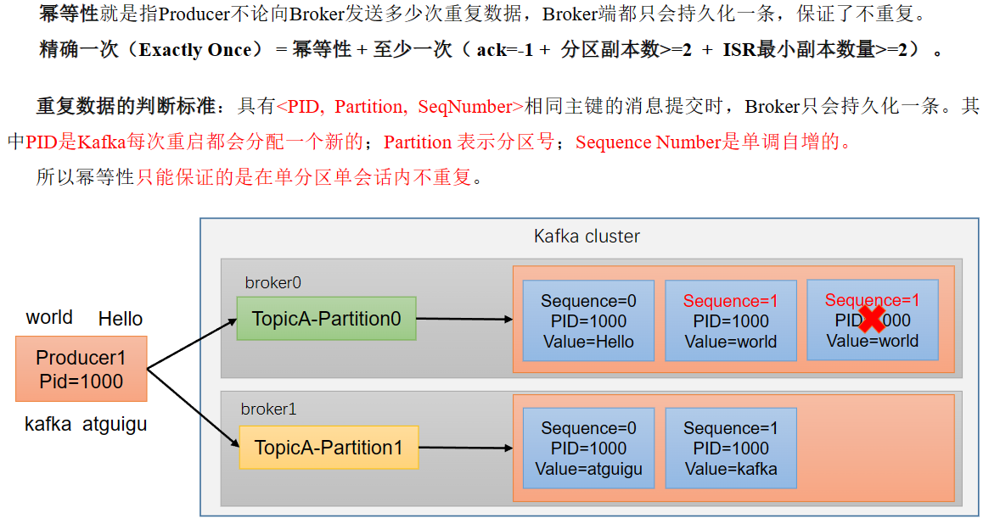

开启参数 `enable.idempotence`  默认为 true，false 关闭

#### 生产者事务

开启事务，必须开启幂等性


```java
// Kafka 的事务一共有如下 5 个 API
// 1 初始化事务
void initTransactions();

// 2 开启事务
void beginTransaction() throws ProducerFencedException;

// 3 在事务内提交已经消费的偏移量（主要用于消费者）
void sendOffsetsToTransaction(Map<TopicPartition, OffsetAndMetadata> offsets, String consumerGroupId) throws ProducerFencedException;

// 4 提交事务
void commitTransaction() throws ProducerFencedException;

// 5 放弃事务（类似于回滚事务的操作）
void abortTransaction() throws ProducerFencedException;
```

```java
// 单个 Producer，使用事务保证消息的仅一次发送
import org.apache.kafka.clients.producer.KafkaProducer;
import org.apache.kafka.clients.producer.ProducerConfig;
import org.apache.kafka.clients.producer.ProducerRecord;
import org.apache.kafka.common.serialization.StringSerializer;
import java.util.Properties;

public class CustomProducerTranactions {
    public static void main(String[] args) {
        // 0 配置
        Properties properties = new Properties();
        // 连接集群 bootstrap.servers
        properties.put(ProducerConfig.BOOTSTRAP_SERVERS_CONFIG, "hadoop002:9092,hadoop003:9092");
        // 指定对应的key和value的序列化类型 key.serializer
        properties.put(ProducerConfig.KEY_SERIALIZER_CLASS_CONFIG, StringSerializer.class.getName());
        properties.put(ProducerConfig.VALUE_SERIALIZER_CLASS_CONFIG, StringSerializer.class.getName());
        // 设置事务 id（必须），事务 id 任意起名
        properties.put(ProducerConfig.TRANSACTIONAL_ID_CONFIG, "tranactional_id_01");
        // 1 创建kafka生产者对象
        KafkaProducer<String, String> kafkaProducer = new KafkaProducer<>(properties);

        kafkaProducer.initTransactions();
        kafkaProducer.beginTransaction();

        try {
            // 2 发送数据
            for (int i = 0; i < 5; i++) {
                kafkaProducer.send(new ProducerRecord<>("first", "gardenia" + i));
            }
            int i = 1 / 0;
            kafkaProducer.commitTransaction();
        } catch (Exception e) {
            kafkaProducer.abortTransaction();
        } finally {
            // 3 关闭资源
            kafkaProducer.close();
        }
    }
}
```


### 数据有序

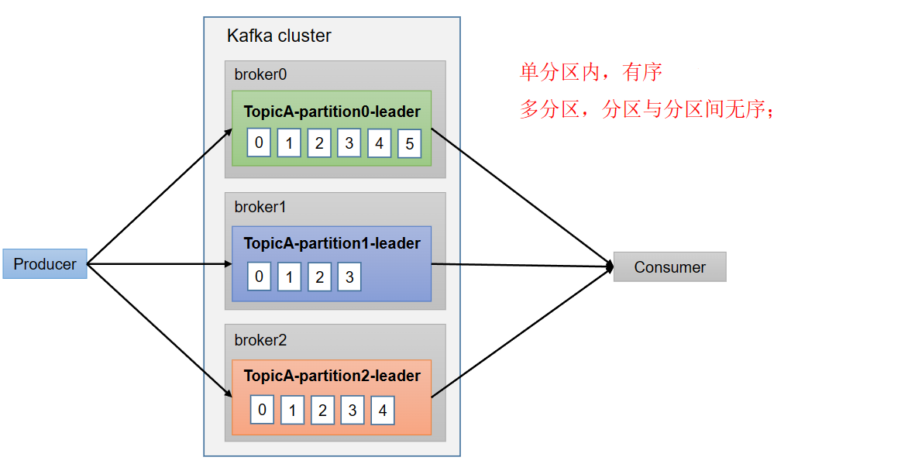


### 数据乱序

1. kafka 在1.x 版本之前保证数据单分区有序，条件如下：

   - `max.in.flight.requests.per.connection=1` （不需要考虑是否开启幂等性）

2. kafka 在 1.x 及以后版本保证数据单分区有序，条件如下：

   - 未开启幂等性	`max.in.flight.requests.per.connection` 需要设置为 1

   - 开启幂等性	`max.in.flight.requests.per.connection` 需要设置小于等于 5

     > 在 kafka1.x 以后，启用幂等后， `kafka` 服务端会缓存 `producer` 发来的最近 5 个 `request` 的元数据，
     > 故无论如何，都可以保证最近 5 个 `request` 的数据都是有序的

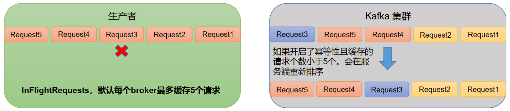


## Kafka Broker

### Broker 工作流程

#### Zookeeper 存储的 Kafka 信息

```bash
# 启动 Zookeeper 客户端
[@hadoop002 zookeeper]$ bin/zkCli.sh

# 通过 ls 命令可以查看 kafka 相关信息
ls /kafka
```

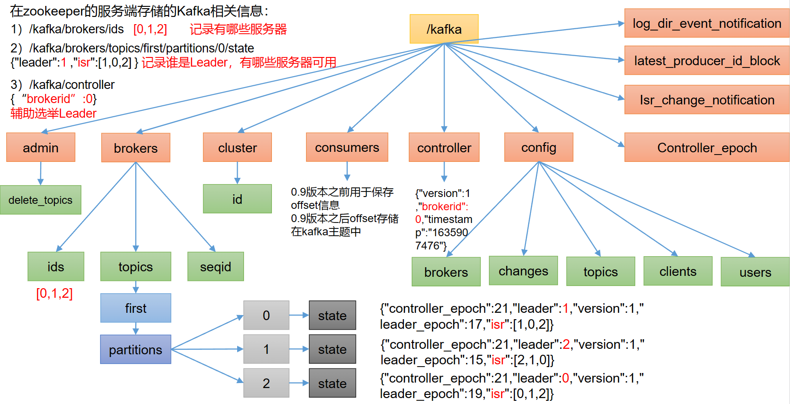

#### Broker 总体工作流程

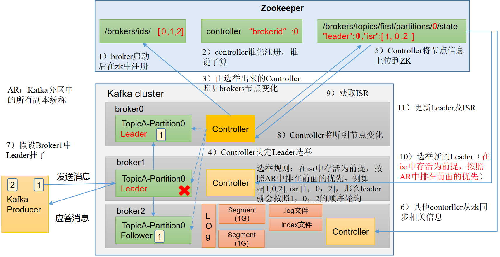

```bash
### Kafka 上下线，Zookeeper 中数据变化
# 查看 /kafka/brokers/ids 路径上的节点
ls /kafka/brokers/ids

# 查看 /kafka/controller 路径上的数据
get /kafka/controller

# 查看 /kafka/brokers/topics/first/partitions/0/state 路径上的数据
get /kafka/brokers/topics/first/partitions/0/state

# 停止 hadoop003 上的 kafka
bin/kafka-server-stop.sh

# 重复 查看 Zookeeper 里的内容
```

#### Broker 重要参数

| 参数名称                                | 描述                                                         |
| --------------------------------------- | ------------------------------------------------------------ |
| replica.lag.time.max.ms                 | ISR 中，如果 Follower 长时间未向 Leader 发送通信请求或同步数据，则该 Follower 将被踢出 ISR。<br/>该时间阈值，默认 30s |
| auto.leader.rebalance.enable            | 默认是 true。 自动 Leader Partition 平衡                     |
| leader.imbalance.per.broker.percentage  | 默认是 10%。每个 broker 允许的不平衡的 leader 的比率。如果每个 broker 超过了这个值，控制器会触发 leader 的平衡 |
| leader.imbalance.check.interval.seconds | 默认值 300 秒。检查 leader 负载是否平衡的间隔时间            |
| log.segment.bytes                       | Kafka 中 log 日志是分成一块块存储的，此配置是指 log 日志划分 成块的大小，默认值 1G |
| log.index.interval.bytes                | 默认 4kb，kafka 里面每当写入了 4kb 大小的日志（.log），然后就往 index 文件里面记录一个索引 |
| log.retention.hours                     | Kafka 中数据保存的时间，默认 7 天                            |
| log.retention.minutes                   | Kafka 中数据保存的时间，分钟级别，默认关闭                   |
| log.retention.ms                        | Kafka 中数据保存的时间，毫秒级别，默认关闭                   |
| log.retention.check.interval.ms         | 检查数据是否保存超时的间隔，默认是 5 分钟                    |
| log.retention.bytes                     | 默认等于-1，表示无穷大。超过设置的所有日志总大小，删除最早的 segment |
| log.cleanup.policy                      | 默认是 delete，表示所有数据启用删除策略；<br/>如果设置值为 compact，表示所有数据启用压缩策略 |
| num.io.threads                          | 默认是 8。负责写磁盘的线程数。整个参数值要占总核数的 50%     |
| num.replica.fetchers                    | 副本拉取线程数，这个参数占总核数的 50% 的 1/3                |
| num.network.threads                     | 默认是 3。数据传输线程数，这个参数占总核数的50%的 2/3        |
| log.flush.interval.messages             | 强制页缓存刷写到磁盘的条数，默认是 long 的最大值，9223372036854775807。一般不建议修改，交给系统自己管理 |
| log.flush.interval.ms                   | 每隔多久，刷数据到磁盘，默认是 null。一般不建议修改，交给系统自己管理 |


### 节点服役和退役

#### 服役新节点

```bash
### 新节点准备
# 关闭 hadoop004，并右键执行克隆操作 & 开启一个新的容器
# 开启 hadoop005，并修改 IP 地址
vim /etc/sysconfig/network-scripts/ifcfg-ens160

DEVICE=ens160
TYPE=Ethernet
ONBOOT=yes
BOOTPROTO=static
IPADDR=192.168.9.5
PREFIX=24
GATEWAY=192.168.9.1
DNS1=8.8.8.8

# 在 hadoop005 上，修改主机名称为 hadoop005
vim /etc/hostname hadoop005

# 重新启动 hadoop004、hadoop005
# 修改 haodoop005 中 kafka 的 broker.id 为 3
# 删除 hadoop005 中 kafka 下的 datas 和 logs
rm -rf datas/* logs/*

# 启动 hadoop002、hadoop003、hadoop004 上的 kafka 集群
zk.sh start
kf.sh start

# 单独启动 hadoop005 中的 kafka
bin/kafka-server-start.sh -daemon ./config/server.properties
```

```BASH
### 负载均衡
# 创建一个要均衡的主题
vim topics-to-move.json
{
	"topics": [
		{"topic": "first"}
	],
	"version": 1
}

# 生成一个负载均衡的计划
bin/kafka-reassign-partitions.sh --bootstrap-server hadoop002:9092 --topics-to-move-json-file topics-to-move.json --broker-list "0,1,2,3" --generate

# 创建副本存储计划（所有副本存储在 broker0、broker1、broker2、broker3 中）
vim increase-replication-factor.json
{"version":1,"partitions":[{"topic":"first","partition":0,"replicas":[2,3,0],"log_dirs":["any","any","any"]},{"topic":"first","partition":1,"replicas":[3,0,1],"log_dirs":["any","any","any"]},{"topic":"first","partition":2,"replicas":[0,1,2],"log_dirs":["any","any","any"]}]}

# 执行副本存储计划
bin/kafka-reassign-partitions.sh --bootstrap-server hadoop002:9092 --reassignment-json-file increase-replication-factor.json --execute

# 验证副本存储计划
bin/kafka-reassign-partitions.sh --bootstrap-server hadoop002:9092 --reassignment-json-file increase-replication-factor.json --verify
```


### 退役旧节点

先按照退役一台节点，生成执行计划，然后按照服役时操作流程执行负载均衡

```bash
### 负载均衡
# 创建一个要均衡的主题
vim topics-to-move.json
{
	"topics": [
		{"topic": "first"}
	],
	"version": 1
}

# 创建执行计划
bin/kafka-reassign-partitions.sh --bootstrap-server hadoop002:9092 --topics-to-move-json-file topics-to-move.json --broker-list "0,1,2" --generate

# 创建副本存储计划（所有副本存储在 broker0、broker1、broker2 中）
vim increase-replication-factor.json
{"version":1,"partitions":[{"topic":"first","partition":0,"replicas":[2,0,1],"log_dirs":["any","any","any"]},{"topic":"first","partition":1,"replicas":[0,1,2],"log_dirs":["any","any","any"]},{"topic":"first","partition":2,"replicas":[1,2,0],"log_dirs":["any","any","any"]}]}

# 执行副本存储计划
bin/kafka-reassign-partitions.sh --bootstrap-server hadoop002:9092 --reassignment-json-file increase-replication-factor.json --execute

# 验证副本存储计划
bin/kafka-reassign-partitions.sh --bootstrap-server hadoop002:9092 --reassignment-json-file increase-replication-factor.json --verify
```

```bash
# 执行停止命令	在 hadoop005 上执行停止命令即可
bin/kafka-server-stop.sh
```


### Kafka 副本

#### 副本基本信息

1. Kafka 副本作用：提高数据可靠性
2. Kafka 默认副本 1 个，生产环境一般配置为 2 个，保证数据可靠性；太多副本会增加磁盘存储空间，增加网络上数据传输，降低效率
3. Kafka 中副本分为：Leader 和 Follower。Kafka 生产者只会把数据发往 Leader，然后 Follower 找 Leader 进行同步数据
4. Kafka 分区中的所有副本统称为 AR（Assigned Repllicas）
   - AR = ISR + OSR
   - ISR，表示和 Leader 保持同步的 Follower 集合。如果 Follower 长时间未向 Leader 发送通信请求或同步数据，则该 Follower 将被踢出 ISR。该时间阈值由 `replica.lag.time.max.ms` 参数设定，默认 30s。Leader 发生故障之后，就会从 ISR 中选举新的 Leader
   - OSR，表示 Follower 与 Leader 副本同步时，延迟过多的副本

#### Leader 选举流程

​	Kafka 集群中有一个 broker 的 Controller 会被选举为 Controller Leader，负责管理集群 broker 的上下线，所有 topic 的分区副本分配和 Leader 选举等工作。
​	Controller 的信息同步工作是依赖于 Zookeeper 

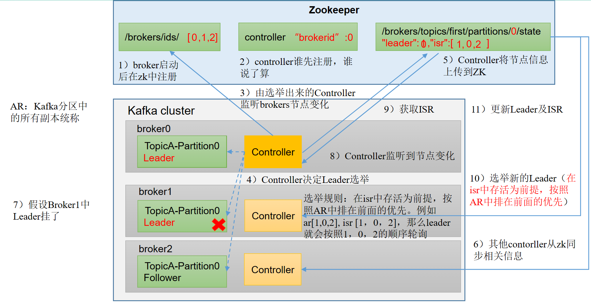

```bash
# 创建一个新的 topic，4 个分区，4 个副本
bin/kafka-topics.sh --bootstrap-server hadoop002:9092 --create --topic gardenia01 --partitions 4 --replication-factor 4

# 查看 Leader 分布情况
bin/kafka-topics.sh --bootstrap-server hadoop002:9092 --describe --topic gardenia01

# 停止掉 hadoop005 的 kafka 进程，并查看 Leader 分区情况
bin/kafka-server-stop.sh
bin/kafka-topics.sh --bootstrap-server hadoop002:9092 --describe --topic gardenia01

# 停止掉 hadoop004 的 kafka 进程，并查看 Leader 分区情况
bin/kafka-server-stop.sh
bin/kafka-topics.sh --bootstrap-server hadoop002:9092 --describe --topic gardenia01

# 启动 hadoop005 的 kafka 进程，并查看 Leader 分区情况
bin/kafka-server-start.sh -daemon config/server.properties
bin/kafka-topics.sh --bootstrap-server hadoop002:9092 --describe --topic gardenia01

# 启动 hadoop004 的 kafka 进程，并查看 Leader 分区情况
bin/kafka-server-start.sh -daemon config/server.properties
bin/kafka-topics.sh --bootstrap-server hadoop002:9092 --describe --topic gardenia01

# 停止掉 hadoop003 的 kafka 进程，并查看 Leader 分区情况
bin/kafka-server-stop.sh
bin/kafka-topics.sh --bootstrap-server hadoop002:9092 --describe --topic gardenia01
```


#### Leader 和 Follower 故障处理细节

​	<span style="color:red">LEO（Log End Offset）</span>：每个副本的最后一个 `offset` ，LEO其实就是最新的 `offset + 1` 

​	<span style="color:red">HW（High Watermark）</span>：所有副本中最小的 LEO

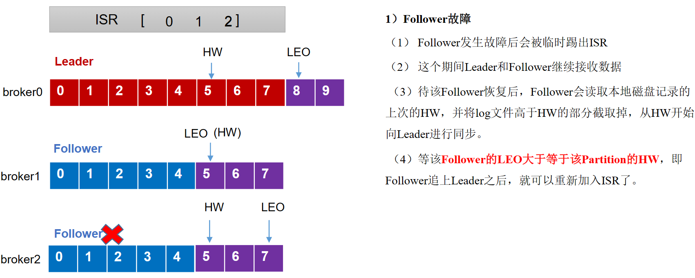

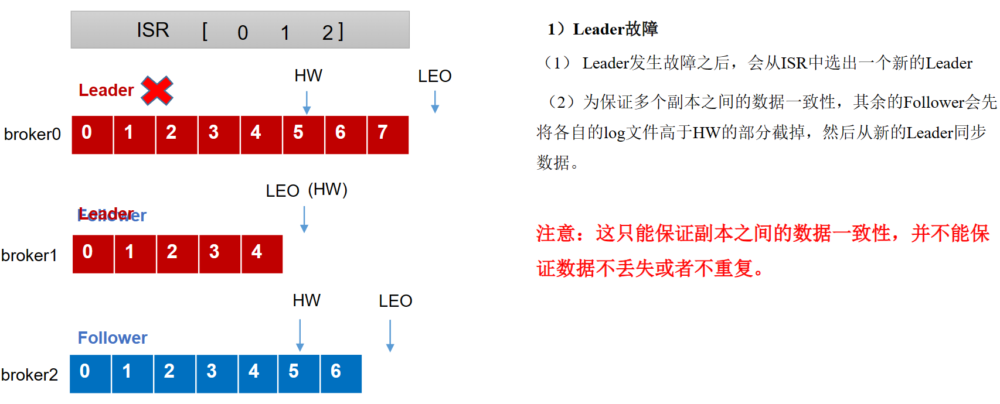

#### 分区副本分配

​	如果 kafka 服务器只有 4 个节点，那么设置 kafka 的分区数大于服务器台数，在 kafka 底层如何分配存储副本呢？

```bash
### 创建 16 分区，3 个副本
# 创建一个新的 topic，名称为 second
bin/kafka-topics.sh --bootstrap-server hadoop002:9092 --create --partitions 16 --replication-factor 3 --topic second

# 查看分区和副本情况
bin/kafka-topics.sh --bootstrap-server hadoop002:9092 --describe --topic second
```


### 手动调整分区副本存储

​	在生产环境中，每台服务器的配置和性能不一致，但是 `Kafka` 只会根据自己的代码规则创建对应的分区副本，就会导致个别服务器存储压力较大。所有需要手动调整分区副本的存储。

​	需求：<span style="color:red">创建一个新的 `topic` ，4个分区，两个副本，名称为 three。将该 `topic` 的所有副本都存储到 `broker0` 和 `broker1` 两台服务器上。</span>

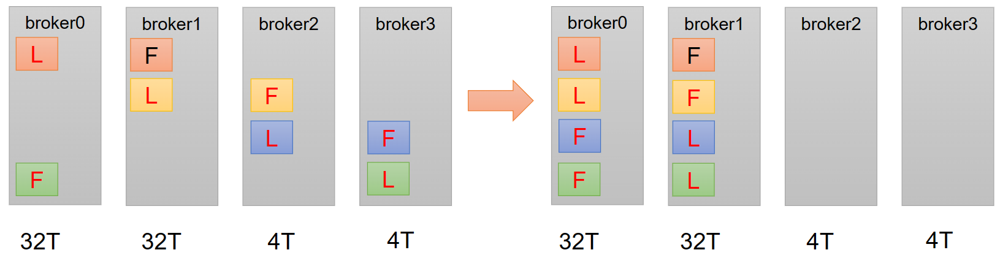

手动调整分区副本存储的步骤如下：

```bash
# 创建一个新的 topic，名称为 three
bin/kafka-topics.sh --bootstrap-server hadoop002:9092 --create --partitions 4 --replication-factor 2 --topic three

# 查看分区副本存储情况
bin/kafka-topics.sh --bootstrap-server hadoop002:9092 --describe --topic three

# 创建副本存储计划（所有副本都指定存储在 broker0、broker1 中）
vim increase-replication-factor.json
{
	"version":1,
	"partitions":[{"topic":"three","partition":0,"replicas":[0,1]},
		{"topic":"three","partition":1,"replicas":[0,1]},
		{"topic":"three","partition":2,"replicas":[1,0]},
		{"topic":"three","partition":3,"replicas":[1,0]}]
}

# 执行副本存储计划
bin/kafka-reassign-partitions.sh --bootstrap-server hadoop002:9092 --reassignment-json-file increase-replication-factor.json --execute

# 验证副本存储计划
bin/kafka-reassign-partitions.sh --bootstrap-server hadoop002:9092 --reassignment-json-file increase-replication-factor.json --verify

 # 查看分区副本存储情况
bin/kafka-topics.sh --bootstrap-server hadoop002:9092 --describe --topic three
```


### Leader Partition 负载平衡

​	正常情况下，Kafka 本身会自动把 `Leader Partition` 均匀分散在各个机器上，来保证每台机器的读写吞吐量都是均匀的。但是如果某些 `broker` 宕机，会导致 `Leader Partition` 过于集中在其他少部分几台 `broker` 上，这会导致少数几台 `broker` 的读写请求压力过高，其他宕机的 `broker` 重启之后都是 `follower partition` ，读写请求很低，造成集群负载不均衡。


### 增加副本因子

​	在生产环境当中，由于某个主题的重要等级需要提升，我们考虑增加副本。副本数的增加需要先制定计划，然后根据计划执行。

```bash
# 创建 topic
bin/kafka-topics.sh --bootstrap-server hadoop002:9092 --create --partitions 3 --replication-factor 1 --topic four

### 手动增加副本存储
# 创建副本存储计划（所有副本都指定存储在 broker0、broker1、broker2 中）
vim increase-replication-factor.json
{"version":1,"partitions":[{"topic":"four","partition":0,"replicas":[0,1,2]},{"topic":"four","partition":1,"replicas":[0,1,2]},{"topic":"four","partition":2,"replicas":[0,1,2]}]}

# 执行副本存储计划
bin/kafka-reassign-partitions.sh --bootstrap-server hadoop002:9092 --reassignment-json-file increase-replication-factor.json --execute
```


## 文件存储机制

### Topic 数据的存储机制

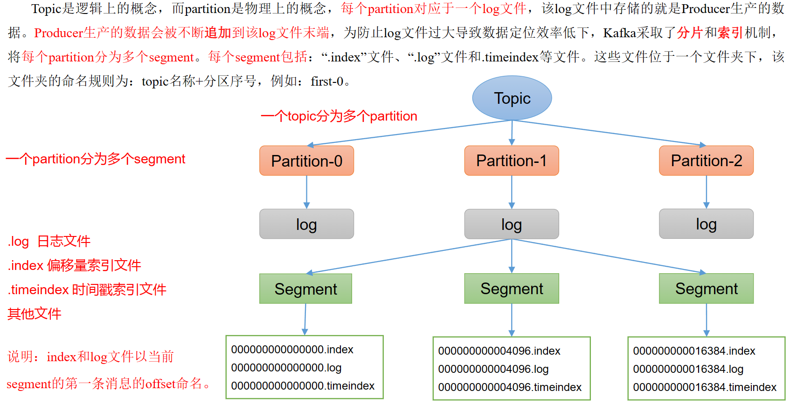

```bash
# 查看 hadoop102（或者 hadoop103、hadoop104）的/opt/module/kafka/datas/first-1（first-0、first-2）路径上的文件
ls kafka/datas/first-1

# 通过工具查看 index 和 log 信息
kafka-run-class.sh kafka.tools.DumpLogSegments --files ./00000000000000000000.index
kafka-run-class.sh kafka.tools.DumpLogSegments --files ./00000000000000000000.log
```

### index 文件和 log 文件

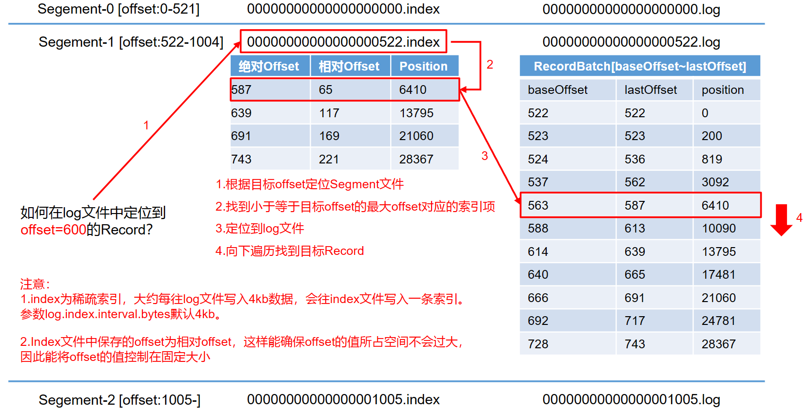


### 文件清理策略

Kafka 中默认的<span style="color:red">日志保存时间为 7 天</span>，可以通过调整如下参数修改保存时间

- `log.retention.hours`	最低优先级小时，默认 7 天
- `log.retention.minutes`	分钟
- `log.retention.ms`	最高优先级毫秒
- `log.retention.check.interval.ms`	负责设置检查周期，默认 5 分钟

Kafka 中提供的日志清理策略有 <span style="color:red">delete</span> 和 <span style="color:red">compact</span> 两种

1. `delete` 日志删除：将过期数据删除

   - `log.cleanup.policy = delete`  所有数据启用删除策略

     （1）基于时间：默认打开。以 segment 中所有记录中的最大时间戳作为该文件时间戳
     （2）基于大小：默认关闭。超过设置的所有日志总大小，删除最早的 segment
     	`log.retention.bytes` ，默认等于-1，表示无穷大。

2. compact 日志压缩

   - 对于相同 key 的不同 value 值，只保留最后一个版本

   - `log.cleanup.policy = compact`  所有数据启用压缩策略

     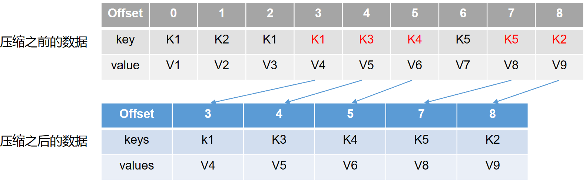

​	压缩后的 offset 可能是不连续的，比如上图中没有 6，当从这些 `offset` 消费消息时，将会拿到比这个 `offset `大的 `offset` 对应的消息，实际上会拿到 `offse` t为 7 的消息，并从这个位置开始消费。
​	这种策略只适合特殊场景，比如消息的 `key `是用户ID，value 是用户的资料，通过这种压缩策略，整个消息集里就保存了所有用户最新的资料。

### 高效读写数据

1）Kafka 本身是分布式集群，可以采用分区技术，并行度高

2）读数据采用稀疏索引，可以快速定位要消费的数据

3）顺序写磁盘
	Kafka 的 producer 生产数据，要写入到 log 文件中，写的过程是一直追加到文件末端，为顺序写。官网有数据表明，同样的磁盘，顺序写能到 600M/s，而随机写只有 100K/s。这与磁盘的机械机构有关，顺序写之所以快，是因为其省去了大量磁头寻址的时间。

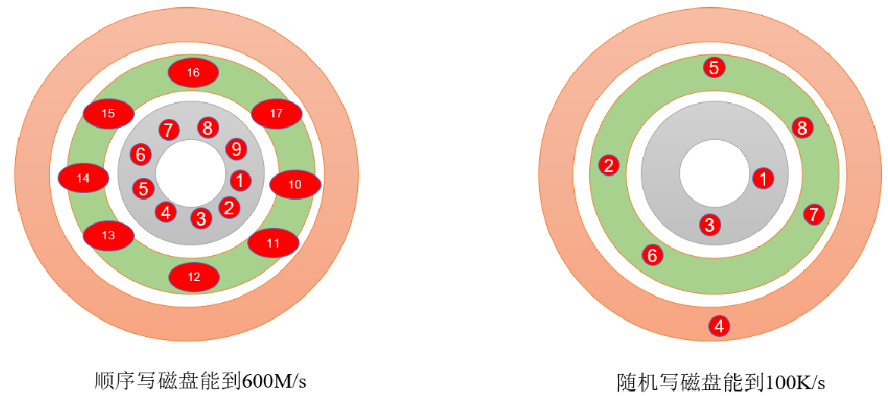

4）页缓存 + 零拷贝技术

​	零拷贝：Kafka 的数据加工处理操作交由 Kafka 生产者和 Kafka 消费者处理。Kafka Broker 应用层不关心存储的数据，所以就不用
走应用层，传输效率高。
​	`PageCache` 页 缓 存 ： Kafka 重度依赖底层操作系统提供的 `PageCache` 功 能。当上层有写操作时，操作系统只是将数据写入
`PageCache` 。当读操作发生时，先从 `PageCache` 中查找，如果找不到，再去磁盘中读取。实际上 `PageCache` 是把尽可能多的空闲内存
都当做了磁盘缓存来使用。

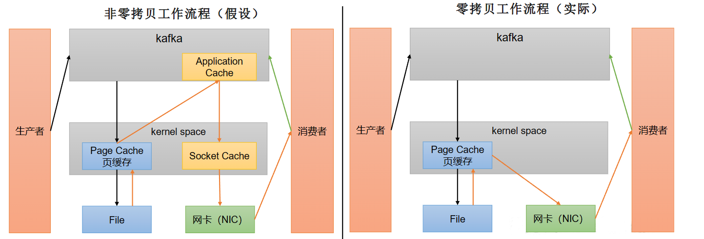

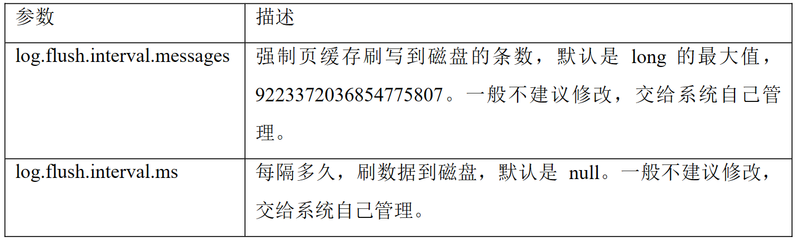

<hr>

## 消费者


