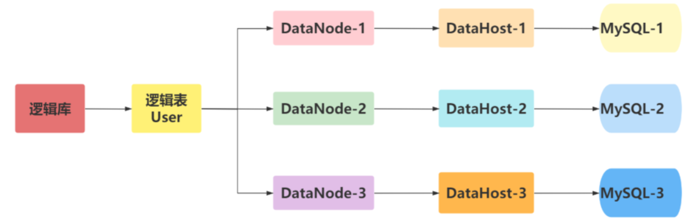
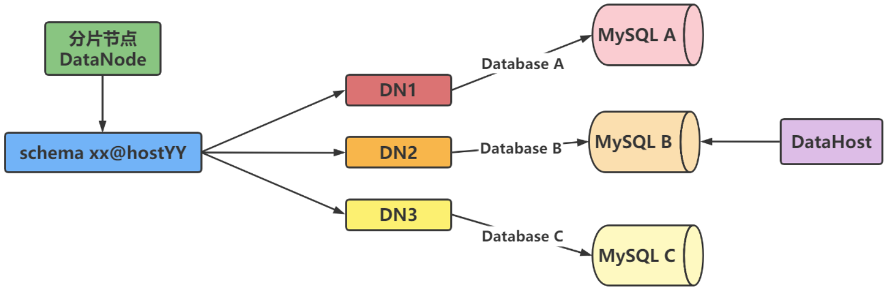
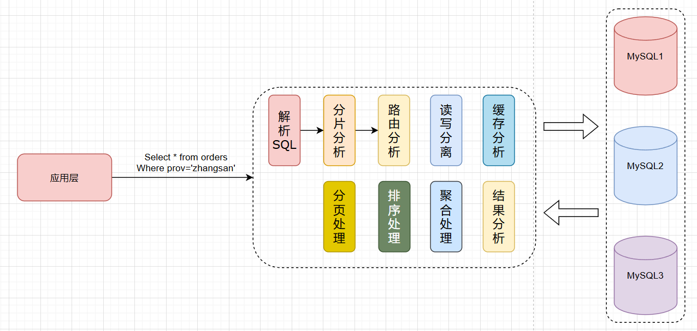
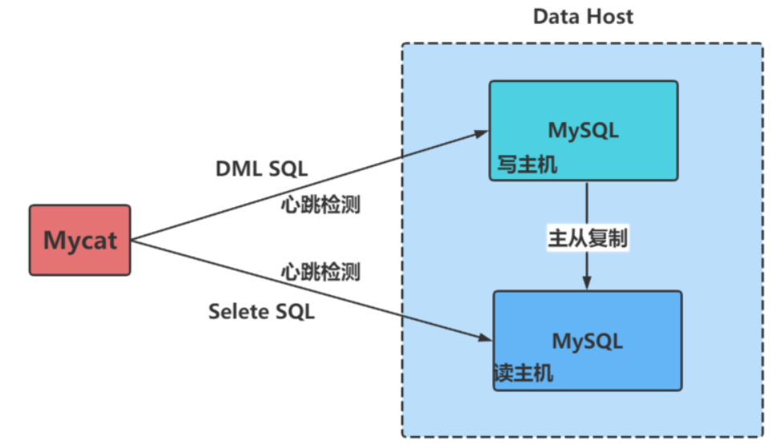

# MyCat

> http://www.mycat.org.cn/

**MyCAT** 是一个完全开源的、面向企业应用开发的大数据库集群。

它提供对事务的支持，满足 **ACID** 特性，是MySQL的强化替代方案。

可作为企业级MySQL数据库集群，用于替代昂贵的 **Oracle集群**。

MyCAT融合了多个数据库集群技术特性，具备高性能、高可扩展性。

同时兼具 **MySQL** 和 **Oracle** 集群的优势，经济高效，适合企业部署使用。


> 完全实现分布式事务，完全的支持分布式
>
> 通过 Mycat web（eye）完成可视化配置，及智能监控，自动运维
>
> 通过 mysql 本地节点，完整的解决数据扩容难度，实现自动扩容机制，解决扩容难点
>
> 支持基于zookeeper的主从切换及Mycat集群化管理
>
> 通过 Mycat Balance 替代第三方的 Haproxy，LVS 等第三方高可用，完整的兼容 Mycat 集群节点的动态上下线
>
> 接入Spark等第三方工具，解决数据分析及大数据聚合的业务场景
>
> 通过 Mycat 智能优化，分析分片热点，提供合理的分片建议，索引建议，及数据切分实时业务建议


## Console


```bash
wget http://dl.mycat.org.cn/1.6.7.6/20210303094759/Mycat-server-1.6.7.6-release-20210303094759-linux.tar.gz
wget https://github.com/MyCATApache/Mycat-Server/archive/refs/tags/1.6.76-release-2020-11-2.tar.gz
tar xvf 1.6.76-release-2020-11-2.tar.gz -C /opt/
# 配置环境变量
echo 'PATH=/opt/mycat/bin:$PATH' > /etc/profile.d/mycat.sh
source /etc/profile.d/mycat.sh

mycat start

ss -ntlp

# 8066 用于进行数据的 CRUD 操作
mysql -uroot -p123456 -h 10.0.0.8 -P8066
mysql -uroot -p123456 -h 192.168.47.100 -P8066 -DTESTDB

# MyCat的连接用户名相关信息在配置文件/usr/local/mycat/conf/users/root.user.json中查看编辑
{
    "dialect":"mysql",
    "ip":null,
    "password":"123456",
    "transactionType":"proxy",
    "username":"root"
}
mycat start       #启动 MyCat
mycat stop        #停止 MyCat
mycat console     #前台运行 MyCat带控制台输出
mycat restart     #重启 MyCat
mycat pause       #暂停 MyCat
mycat status      #查看启动状态

select @@server_id;

vim /opt/mycat/conf/server.xml
vim /opt/mycat/conf/schema.xml
```


## 概念

**逻辑库  schema**
	业务开发人员通常在实际应用中并不需要知道中间件的存在，只需要关注数据库，所以数据库中间件可以被当作一个或多个数据库集群构成的逻辑库。逻辑库，与MySQL中的Database（数据库）对应，⼀个逻辑库中定义了所包括的 Table

**逻辑表table**
	既然有逻辑库，就会有逻辑表。在分布式数据库中，对于应用来说，读写数据的表就是逻辑表。逻辑表可以分布在一个或多个分片库中，也可以不分片。（Table：表，即物理数据库中存储的某⼀张表，与传统数据库不同，这⾥的表格需要声明其所存储的逻辑数据节点DataNode）



​	将数据切分后，每个分片节点不一定会独占一台机器，同一台机器上可以有多个分片数据库，这样一个或多个分片节点所在的机器就是节点主机。为了规避单节点主机并发数量的限制,尽量将**读写压力高的分片节点**均匀地放在不同的节点主机上。



**数据库主机 DataHost**
	数据切分后，每个分片节点(dataNode)不一定都会独占一台机器，同一机器上面可以有多个分片数据库，这样一个或多个分片节点(dataNode)所在的机器就是节点主机(dataHost),为了规避单节点主机并发数限制，尽量将读写压力高的分片节点(dataNode)均衡的放在不同的节点主机(dataHost)。


​	Mycat 的原理中最重要的一个动词是“**拦截**”，它拦截了用户发送过来的SQL 语句。

​	首先对 SQL 语句做了一些特定的分析：如分片分析、路由分析、读写分离 分析、缓存分析等，然后将此 SQL 发 往后端的真实数据库，并将返回的结果做适当的处理，最终再返回给用户。




## Mycat 主要配置

### **Server.xml**

最主要的配置项，此文件关联mysql读写分离策略、分库分表策略、分片节点都是在此文件中配置的

存放 Mycat 软件本身相关的配置文件，如：连接Mycat的用户，密码，数据库名称等

`server.xml` 文件中配置的参数解释说明：

| 参数       | 说明                                                         |
| ---------- | ------------------------------------------------------------ |
| user       | 用户配置节点                                                 |
| name       | 客户端登录 Mycat 的用户名，也就是客户端用来连接 Mycat 的用户名 |
| password   | 客户端登录 Mycat 的密码                                      |
| schemas    | 数据库名，这里会和 schema.xml 中的配置关联，多个用逗号分开，例如: db1,db2 |
| privileges | 配置用户针对表的增删改查的权限                               |
| readOnly   | Mycat 逻辑库所具有的权限。true为只读，false 为读写都有，默认为 false |

```xml
...省略...
#修改下面行的8066改为3306复制到到独立非注释行
<property name="serverPort">3306</property>
<property name="handlelDistributedTransactions">0</property> #将上面行放在此行前面

<property name="serverPort">3306</property>
<property name="managerPort">9066</property>
<property name="idleTimeout">300000</property>
<property name="authTimeout">15000</property>
<property name="bindIp">0.0.0.0</property>
<property name="dataNodeIdleCheckPeriod">300000</property> # 5 * 60 * 1000L; # 连接空闲检查
<property name="frontWriteQueueSize">4096</property> <property 
name="processors">32</property>
 .....
<user name="root">                                       # 连接 Mycat 的用户名
   <property name="password">magedu</property>           # 连接 Mycat 的密码
   <property name="schemas">TESTDB</property>            # 数据库名要和 schema.xml 相对应
</user>
</mycat:server>
```

> 注意：
>
> - server.xml 文件里登录 Mycat 的用户名和密码可以任意定义，这个账号和密码是为客户机登录 Mycat 时使用的账号信息
> - 逻辑库名(如上面的TESTDB，也就是登录 Mycat 后显示的库名，切换这个库之后，显示的就是代理的真实mysql数据库的表)要在schema.xml里面也定义，否则会导致 Mycat 服务启动失败！
>   这里只定义了一个标签，所以把多余的都注释了。如果定义多个标签，即设置多个连接 Mycat 的用户名和密码，那么就需要在schema.xml文件中定义多个对应的库！

### **Schema.xml**

| 参数     | 说明                                                         |
| -------- | ------------------------------------------------------------ |
| schema   | 数据库设置，此数据库为逻辑数据库，name与server.xml中schema对应 |
| dataNode | 分片信息，也就是分库相关配置                                 |
| dataHost | 物理数据库，真正存储数据的数据库                             |

> name 属性唯一标识 dataHost 标签，供上层的标签使用
> maxCon 属性指定每个读写实例连接池的最大连接。标签内嵌套的 writeHost、readHos t标签都会使用这个属性的值来实例化出连接池的最大连接数
> minCon 属性指定每个读写实例连接池的最小连接，初始化连接池的大小

**Schema**

| 属性           | 说明                                         |
| -------------- | -------------------------------------------- |
| name           | **逻辑数据库名**，与server.xml中的schema对应 |
| checkSQLschema | 数据库前缀相关设置，这里为false              |
| sqlMaxLimit    | select 时默认的limit，避免查询全表           |

- **Schema.Table**

| 属性          | 说明                                                         |
| ------------- | ------------------------------------------------------------ |
| name          | 表名，物理数据库中表名                                       |
| dataNode      | 表存储到哪些节点，多个节点用逗号分隔。节点为下文dataNode设置的name |
| primaryKey    | 主键字段名，自动生成主键时需要设置                           |
| autoIncrement | 是否自增                                                     |
| rule          | 分片规则名，具体规则下文rule详细介绍                         |

**DataNode**

| 属性     | 说明                                   |
| -------- | -------------------------------------- |
| name     | 节点名，与table中dataNode对应          |
| datahost | **物理数据库名**，与datahost中name对应 |
| database | 物理数据库中数据库名                   |

**DataHost**

| 属性      | 说明                                   |
| --------- | -------------------------------------- |
| name      | 物理数据库名，与dataNode中dataHost对应 |
| balance   | 均衡负载的方式                         |
| writeType | 写入方式                               |
| dbType    | 数据库类型                             |
| heartbeat | 心跳检测语句，注意语句结尾的分号要加   |

`Schema.xml` 文件中有三点需要注意：**balance=“1”，writeType=“0”, switchType=“1”**

1. Balance 的取值决定了负载均衡对非事务内的读操作的处理。**Balance 属性负载均衡类型，目前的取值有 4 种：**
   1. balance=“0”：不开启读写分离机制，所有读操作都发送到当前可用的 writeHost 上, 即读请求仅发送到 writeHost 上
   2. balance=“1”：一般用此模式，读请求随机分发到当前 writeHost 对应的 readHost 和 `standby` 的 writeHost 上。即全部的 readHost 与 stand by writeHost 参与 select 语句的负载均衡，简单的说，当双主双从模式(M1 ->S1 ， M2->S2，并且 M1 与 M2 互为主备)，正常情况下， M2, S1, S2 都参与 select 语句的负载均衡
   3. balance=“2”：读请求随机分发到当前 dataHost 内所有的 writeHost 和 readHost 上。即所有读操作都随机的在 writeHost、 readhost 上分发
   4. balance=“3”：读请求随机分发到当前 writeHost 对应的 readHost 上。即所有读请求随机的分发到 wiriterHost 对应的 readhost 执行, writerHost 不负担读压力，注意 balance=3 只在 1.4 及其以后版本有，1.3 没有

在一个 DataHost 内可以定义多个 writeHost 和 readHost。但是，如果 writeHost 指定的后端数据库宕机，那么这个 writeHost 绑定的所有 readHost 都将不可用。另一方面，由于这个 writeHost 宕机系统会自动的检测到，并切换到备用的 writeHost 上

```xml
<?xml version="1.0"?>
<!DOCTYPE mycat:schema SYSTEM "schema.dtd">
<mycat:schema xmlns:mycat="http://io.mycat/">

	<schema name="TESTDB" checkSQLschema="false" sqlMaxLimit="100" randomDataNode="dn1">
		<!-- auto sharding by id (long) -->
		<!--splitTableNames 启用 <table name 属性使用逗号分割配置多个表,即多个表使用这个配置 -->
		<table name="t1,t2" dataNode="dn1,dn1,dn1" rule="auto-sharding-long" splitTableNames="true" />
		<!-- <table name="oc_call" primaryKey="ID" dataNode="dn1$0-743" rule="latest-month-calldate" /> -->
	</schema>
	<!-- <dataNode name="dn1$0-743" dataHost="localhost1" database="db$0-743" /> -->
	<dataNode name="dn1" dataHost="localhost1" database="mycat" />
	<!--<dataNode name="dn4" dataHost="sequoiadb1" database="SAMPLE" />
         <dataNode name="jdbc_dn1" dataHost="jdbchost" database="db1" />
        <dataNode       name="jdbc_dn2" dataHost="jdbchost" database="db2" />
        <dataNode name="jdbc_dn3"       dataHost="jdbchost" database="db3" /> -->
	<dataHost name="localhost1" maxCon="1000" minCon="10" balance="1"
			  writeType="0" dbType="mysql" dbDriver="native" switchType="1" slaveThreshold="100">
		<heartbeat>select user()</heartbeat>
		<!-- can have multi write hosts -->
		<writeHost host="hostM1" url="10.0.0.18:3306" user="root" password="123456">
			<readHost host="hostM2" url="10.0.0.28:3306" user="root" password="123456" />
		</writeHost>
		<!-- <writeHost host="hostM2" url="localhost:3316" user="root" password="123456"/> -->
	</dataHost>
</mycat:schema>
```

> Mycat 主从分离只是在读的时候做了处理，写入数据的时候，只会写入到 writehost，需要通过数据库产品的主从复制将数据复制到 Readhost


## MySQL 读写分离

​	MyCat 的读写分离是建立在 MySQL 主从复制基础之上实现的，所以必须先搭建MySQL的主从复制。数据库读写分离对于⼤型系统或者访问量很⾼的互联网应用来说，是必不可少的⼀个重要功能。



**创建数据源**
首先创建读写的数据源

```mysql
/*+ mycat:createDataSource{
  "dbType":"mysql",
  "idleTimeout":60000,
  "initSqls":[],
  "initSqlsGetConnection":true,
  "instanceType":"READ_WRITE",
  "maxCon":1000,
  "maxConnectTimeout":3000,
  "maxRetryCount":5,
  "minCon":1,
  "name":"m1",
  "password":"123456",
  "type":"JDBC",
  "url":"jdbc:mysql://192.168.47.100:3306?useUnicode=true&serverTimezone=UTC&characterEncoding=UTF-8",
  "user":"root",
  "weight":0
} */;
```

**创建读的数据源**

```mysql
/*+ mycat:createDataSource{
  "dbType":"mysql",
  "idleTimeout":60000,
  "initSqls":[],
  "initSqlsGetConnection":true,
  "instanceType":"READ",
  "maxCon":1000,
  "maxConnectTimeout":3000,
  "maxRetryCount":5,
  "minCon":1,
  "name":"m1s1",
  "password":"123456",
  "type":"JDBC",
  "url":"jdbc:mysql://192.168.47.101:3306?useUnicode=true&serverTimezone=UTC&characterEncoding=UTF-8",
  "user":"root",
  "weight":0
} */;
```

**查询数据源**

```mysql
/*+ mycat:showDataSources{} */
```

**创建集群**
配置主从，masters(主) 和 replicas(从)分别对应着 m1 和 m1s1

```sql
/*! mycat:createCluster{
  "clusterType":"MASTER_SLAVE",
  "heartbeat":{
   "heartbeatTimeout":1000,
   "maxRetry":3,
   "minSwitchTimeInterval":300,
   "slaveThreshold":0
  },
  "masters":[
   "m1"
  ],
  "maxCon":2000,
  "name":"prototype",
  "readBalanceType":"BALANCE_ALL",
  "replicas":[
   "m1s1"
  ],
  "switchType":"SWITCH"
} */;
```

**查询集群**

```powershell
/*+ mycat:showClusters{} */
```


## 分库分表

数据切分有两种切分模式

- 按照**不同的表将数据切分到不同的数据库**中，这种切分可以叫作数据的垂直切分。
- 根据表中数据的逻辑关系，将**同一个表中的数据按照某种条件拆分到多个数据库**中，这种切分叫作数据的水平切分。当数据量超过800万行且需要做分片时，可以利用 Mycat 实现数据切分。


## 数据库路由器

​	Mycat基于 MySQL 实例的连接池复用机制，可以让每个应用最大程度地共享一个MySQL实例的所有连接池，让数据库的并发访问能力大大提升。


