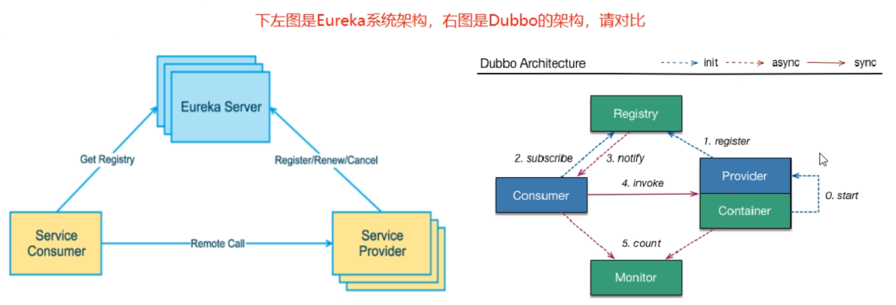
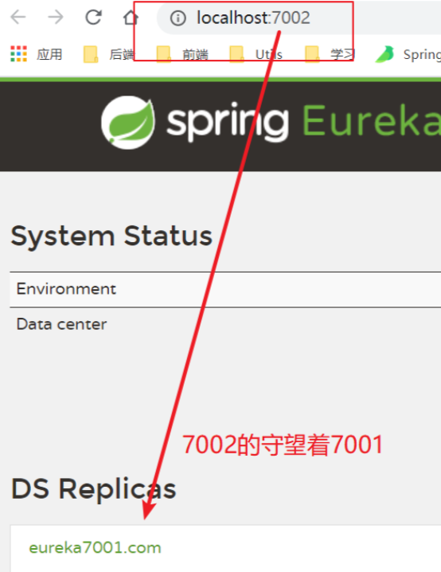
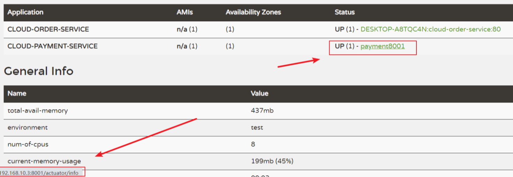
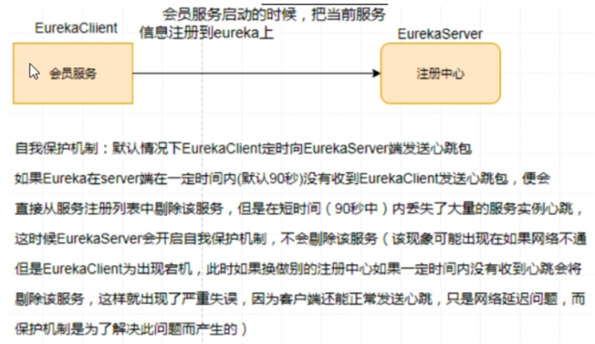

# 一、Eureka

## 1、Eureka基础知识

### 1.1 什么是服务治理

- SpringCloud 封装了Netflix公司开发的Eureka 模块来实现服务治理【SpringCloud抄的Netflix作业】
- 在传统的RPC远程调用框架中，管理每个服务与服务之间依赖关系比较复杂，所以服务之间依赖关系，可以实现服务调用，负载均衡，容错等，实现服务发现与注册。

### 1.2 什么是服务注册与发现

- Eureka采用了CS的设计架构，Eureka Server 作为服务注册功能的服务器，他是服务注册中心，而系统中的其他微服务，使用Eureka Server并维持心跳连接，这样系统的维护人员就可以通过Eureka Server来监控系统中各个微服务是否正常运行


- 在服务注册与发现中，有一个注册中心，当服务器启动时，会把当前自己服务器的信息比如服务地址通讯地址等以别名方式注册到注册中心中，另一方（消费者|提供者），以该别名的方式去注册中心获取到实际的服务通讯地址，然后再实现本地RPC调用RPC远程调用框架核心设计思想：在于注册中心，因为使用注册中心管理每个服务与服务之间的一个依赖关系（服务治理概念）。在任何RPC远程框架中，都会有一个注册中心（存放服务地址相关信息[接口地址]）



### 1.3 Eureka包含的两个组件

#### ① `Eureka Server`提供服务注册服务

各个微服务节点通过配置启动后，会在`Eureka Server`中进行注册，这样`Eureka Server`中的服务注册表中将会存储所有可用服务节点的信息，服务节点的信息可以在界面中直观的看到。


#### ② `Eureka Client` 通过注册中心进行询问

是一个Java客户端，用于简化Eureka Server的交互，客户端同时也具备一个内置的、使用轮询（round-robin）负载算法的负载均衡器。在应用启动后，将会向Eureka Server发送心跳（默认周期为30秒）。如果Eureka Server 在多个心跳周期内没有接收到某个节点的心跳，EurekaServer将会从服务注册表中把这个服务节点移除（默认90秒）

<hr>

## 2、单机Eureka搭建

本版本使用的是JDK8 进行创建，如果使用JDK高版本可能会启动报错，原因是JDK高版本对一些类 进行了删除

### 2.1 建module

### 2.2 改pom

Eureka1 和 Eureka2 的依赖对比

```xml
<!-- 以前的老版本，分不清client 还是server -->
<dependency>
    <groupId>org.springframework.cloud</groupId>
    <artifactId>spring-cloud-starter-eureka</artifactId>
    <version>1.4.7.RELEASE</version>
</dependency>

<!-- 现在的新版本 -->
<dependency>
    <groupId>org.springframework.cloud</groupId>
    <artifactId>spring-cloud-starter-netflix-eureka-client</artifactId>
    <version>3.0.2</version>
</dependency>
```

```xml
<dependencies>
  <dependency>
    <groupId>org.springframework.cloud</groupId>
    <artifactId>spring-cloud-starter-netflix-eureka-server</artifactId>
  </dependency>

  <dependency>
    <groupId>com.yixuexi.springcloud</groupId>
    <artifactId>cloud-api-commons</artifactId>
    <version>${project.version}</version>
  </dependency>

  <dependency>
    <groupId>org.springframework.boot</groupId>
    <artifactId>spring-boot-starter-web</artifactId>
  </dependency>

  <dependency>
    <groupId>org.springframework.boot</groupId>
    <artifactId>spring-boot-starter-actuator</artifactId>
  </dependency>

  <dependency>
    <groupId>org.springframework.boot</groupId>
    <artifactId>spring-boot-devtools</artifactId>
    <scope>runtime</scope>
    <optional>true</optional>
  </dependency>

  <dependency>
    <groupId>org.projectlombok</groupId>
    <artifactId>lombok</artifactId>
  </dependency>

  <dependency>
    <groupId>org.springframework.boot</groupId>
    <artifactId>spring-boot-starter-test</artifactId>
    <scope>test</scope>
  </dependency>
  <dependency>
    <groupId>junit</groupId>
    <artifactId>junit</artifactId>
  </dependency>

</dependencies>
```

### 2.3 写Yaml

```yaml
server:
  port: 7001

eureka:
  instance:
    hostname: localhost
  client:
    # 不需要将自己注册进Eureka注册中心
    register-with-eureka: false
    # 表示自己就是服务中心,职责是维护服务实例,并不需要检索服务
    fetch-registry: false
    service-url:
      #设置与eureka server交互的地址查询服务和注册服务都需要依赖这个地址
      defaultZone: http://${eureka.instance.hostname}:${server.port}/eureka/
```

### 2.4 主启动类

需要添加 `@EnableEurekaServer` 注解

```java
@SpringBootApplication
@EnableEurekaServer
public class EurekaMain7001 {
    public static void main(String[] args) {
        SpringApplication.run(EurekaMain7001.class,args);
    }
}
```

### 2.5 将8001、80 注册进Eureka

对于Eureka来说，Eureka就是最底层的提供者，对于他而言，所有的提供者 都是 消费者

**每个微服务都应该有一个名字  spring.application.name**

#### ① 添加依赖

```xml
<!--Eureka-->
<dependency>
  <groupId>org.springframework.cloud</groupId>
  <artifactId>spring-cloud-starter-netflix-eureka-client</artifactId>
</dependency>
```

#### ② 写yaml

```yaml
eureka:
  client:
  	# 是否从EurekaServer抓取已有的注册信息，默认为true，单节点无所谓
    # 集群必须设置为 true，才能配置ribbon使用
    fetch-registry: true
    register-with-eureka: true
    service-url:
      defaultZone: http://localhost:7001/eureka
```

#### ③ 主启动类

添加 `@EnableEurekaClient`注解

```java
@EnableEurekaClient
@SpringBootApplication
public class PaymentMain8001 {
    public static void main(String[] args) {
        SpringApplication.run(PaymentMain8001.class,args);
    }
}
```

# 二、集群Eureka搭建

## 1、Eureka集群原理说明


解决办法：搭建Eureka注册中心集群，实现负载均衡+故障容错

Eureka集群原理：**互相注册，相互守望！**


## 2、集群搭建步骤

### 2.1 创建cloud-eureka-server7002

参照7001

### 2.2 改pom

把7001的pom复制过去

### 2.3 修改映射配置文件 Hosts 文件

使用火绒的安全工具可以快速修改

127.0.0.1 eureka7001.com

127.0.0.1 eureka7002.com


### 2.4 写YAML(重要) 集群配置

如果配置3个以上的集群那么 service-url 的defaultZone写的地址 为 2 个 用逗号隔开  1》2 3  ， 2》1 3  ，3》  1  2

7001的yaml配置

```yaml
server:
  port: 7001

eureka:
  instance:
    hostname: eureka7001.com
  client:
    # 不需要将自己注册进Eureka注册中心
    register-with-eureka: false
    # 表示自己就是服务中心,职责是维护服务实例,并不需要检索服务
    fetch-registry: false
    service-url:
      # 7001 的eureka 守望着7002的eureka
      defaultZone: http://eureka7002.com:7002/eureka/
```

7002的yaml 的配置

```yaml
server:
  port: 7002
eureka:
  instance:
    hostname: eureka7002.com
  client:
    # 表示不向eureka注册自己
    register-with-eureka: false
    # 表示自己就是注册中心,职责是维护服务实例,不需要去检索服务
    fetch-registry: false
    service-url:
      # 7002端口的eureka 守望着 70001的eureka
      defaultZone: http://eureka7001.com:7001/eureka/
```

### 2.5 主启动

不要忘记添加 `**@EnableEurekaServer**` 注解


### 2.6 查看是否成功




## 3、将8001和80加入到eureka集群中

其余代码不动

修改yaml配置文件

defaultZone 写两个eureka路径，使用**逗号**分隔

```yaml
eureka:
  client:
    fetch-registry: true
    register-with-eureka: true
    service-url:
      defaultZone: http://eureka7001.com:7001/eureka,http://eureka7002.com:7002/eureka
```

<hr>

# 三、负载均衡

## 1、修改提供者的controller方法

添加一个端口属性，并且在方法中输出

```java
@Value("${server.port}")
private String port;
```


## 2、RestTemplate上添加注解

`@LoadBalanced` 注解表示 开启负载均衡

因为加了eureka就会自动添加 ribbon依赖，所以不用加ribbon

```java
@LoadBalanced
@Bean
public RestTemplate restTemplate(){
    return new RestTemplate();
}
```

## 3、consumer端的restful调用别写url

url 地址要写提供方微服务的名称，不能写 localhost:8001

```java
 @GetMapping("/consumer/get/payment/{id}")
public CommonResult<Payment> get(@PathVariable Long id){
    String url = "http://cloud-payment-service/get/payment/";
    // getForObject() 内部发get 请求
    return restTemplate.getForObject(url+id,CommonResult.class);
}
```

## 4、启动多个实例

启动时，把devtools注释掉，要不一修改配置文件，就重启一次


## 5、总结

Ribbon和Eureka整合后，Consumer可以直接调用服务不用再关心地址和端口号，且该服务还有负载功能！


------

# 四、actuator微服务信息完善

注意：需要有这些依赖

```xml
<!-- web -->
<dependency>
  <groupId>org.springframework.boot</groupId>
  <artifactId>spring-boot-starter-web</artifactId>
</dependency>

<!-- 图形化监控 -->
<dependency>
  <groupId>org.springframework.boot</groupId>
  <artifactId>spring-boot-starter-actuator</artifactId>
</dependency>
```

## 1、配置yaml

```
instance.instance-id : payment8001
```

```yaml
eureka:
  client:
    fetch-registry: true
    register-with-eureka: true
    service-url:
      defaultZone: http://eureka7001.com:7001/eureka,http://eureka7002.com:7002/eureka
  instance:
    instance-id: payment8001
    prefer-ip-address: true   # 访问路径可以显示IP地址
```

配置前



# 五、服务发现Discovery

通过注册进eureka里面的微服务，可以通过服务发现来获得该服务的信息。


## 1、修改cloud-provider-payment8001的controller

```
import ``org.springframework.cloud.client.discovery.DiscoveryClient``;
```

别导错包了

```java
 @Autowired
private DiscoveryClient discoveryClient;

@GetMapping(value = "/payment/discovery")
public Object discovery(){
    List<String> services = discoveryClient.getServices();
    for (String element : services) {
        log.info("***** element:"+element);
    }
    List<ServiceInstance> instances = discoveryClient.getInstances("CLOUD-PAYMENT-SERVICE");
    for (ServiceInstance instance : instances) {
        log.info(instance.getServiceId()+"\t"+instance.getHost()+"\t"+instance.getPort()+"\t"+instance.getUri());
    }
    return this.discoveryClient;
}
```

## 2、`@EnableDiscoveryClient`

添加在8001的主启动类上


## 3、自测

- 先要启动EurekaServer，7001/7002服务
- 再启动8001主启动类，需要稍等一会

- http://localhost:8001/payment/discovery


# 六、Eureka的自我保护机制

## 1、故障现象

保护模式主要用于一组客户端和Eureka Server之间存在网络分区场景下的保护。一旦进行保护模式：

Eureka Server将会尝试保护其服务注册表中的信息，不再删除服务注册表中的数据，也就是不会注销任何微服务


如果在Eureka Server的首页看到以下这段提示，说明Eureka进入了保护模式：


### 2.1 为什么会产生Eureka自我保护机制？

为了防止EurekaClient 可以正常运行，但是与EurekaServer网络不通情况下，EurekaServer不会立刻价格呢EurekaClient服务题出


### 2.2 什么是自我保护模式？

默认情况下，如果EurekaServer在一定时间内没有接收到某个微服务实例的心跳，EurekaServer将会注销该实例（默认90秒），但是当网络分区故障发生（延时、卡顿、拥挤时），微服务与EurekaServer之间无法正常通信，以上行为可能变得非常危险，-----因为微服务本身健康的，此时不应该注销这个微服务 Eureka通过“自我保护模式”来解决这个问题， 当EurekaServer节点在短时间内丢失过多客户端时（可能发生了网络分区故障）那么这个节点就会自动进入 自我保护模式



在自我保护模式中，EurekaServer会保护服务注册表中的信息，不再注销任何微服务实例


他的设计哲学就是宁可保留错误的服务注册信息，也不盲目注销任何可能健康的服务实例。好死不如赖活着


综上：自我保护模式是一种应对网络异常的安全保护措施，他的架构哲学时宁可同时保留所有微服务，（健康的微服务和不健康的微服务都会保留） 也不盲目注销任何健康的微服务。使用自我保护模式，可以让Eureka集群更加的健壮，稳定。

## 3、怎么禁止自我保护

默认 自我保护模式 是**开启状态 （**一般生产环境不会禁止自我保护**）**

### 3.1 注册中心eureakeServer端7001

- 出厂默认，自我保护机制是开启的

- `eureka.server.enable-self-preservation = true`

- 使用`eureka.server.enable-self-preservation = false`可以禁用自我保护模式
- 关闭效果

- 在eurekaServer端7001处设置关闭自我保护机制

### 3.2 生产者客户端eureakeClient端8001

**默认**

```
eureka.instance.lease-renewal-interval-in-seconds=30
eureka.instance.lease-expiration-duration-in-seconds=90
```

**配置**


**测试**

- 7001和8001都配置完成
- 先启动7001再启动8001

- 先关闭8001
- 马上被删除了