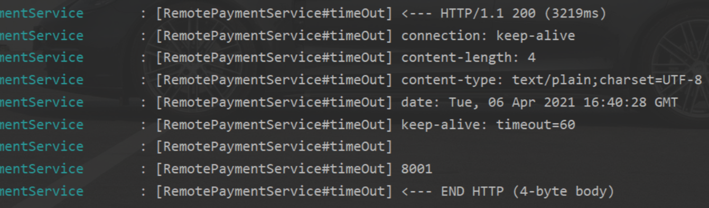

# 04、OpenFeign服务接口调用

# 一、OpenFeign概述

## 1、OpenFeign是什么

https://github.com/spring-cloud/spring-cloud-openfeign

Feign是一个声明式WebService客户端，使用Feign能让编写Web Service客户端更加简单，只需要创建一个接口并添加注解即可

他的使用方法时定义一个服务接口然后在上面添加注解，Feign也支持可插拔式的编码器和解码器。Spring Cloud 对Feign进行了封装。使其支持了SpringMVC 标准注解和HttpMessageConverters。Feign可以与Eureka和Ribbon组合使用以支持负载均衡。


## 2、Feign作用

Feign旨在使编写Java Http客户端变得更加容易。

个人理解：声明式远程方法调用


前面在使用Ribbon + RestTemplate时，利用RestTemplate 对http请求的封装处理，形成一套模板化的调用方法，但是在实际开发中，由于对服务依赖的调用可能不止一处，往往一个接口会被多出调用，所以通常都会针对每个微服务自行封装一些客户端类来包装这些依赖服务的调用。所以，Feign在此基础上做了进一步的封装，由它来帮助我们定义和实现依赖服务接口的定义。在Feign的实现下，我们只需要创建一个接口并使用注解的方式来配置它（以前是Dao接口上面标注Mapper注解，现在是一个微服务接口上面标注一个Feign注解即可） 即可完成对服务提供方的接口绑定，简化了使用Spring Cloud Ribbon时，自动封装服务调用客户端的开发量。


## 3、Feign集成了Ribbon

利用Ribbon维护了 [payment]的服务列表信息，并且通过轮询实现了客户端的负载均衡，而与Ribbon不同的是，通过Feign只需要定义服务绑定接口且以声明式的方法，简单而优雅的实现了服务调用。


# 二、OpenFeign使用步骤

Feign 是使用在消费端！

## 1、创建cloud-consumer-openfeign-order80 模块


## 2、写pom

```xml
<!-- OpenFeign 依赖 -->
<dependency>
  <groupId>org.springframework.cloud</groupId>
  <artifactId>spring-cloud-starter-openfeign</artifactId>
</dependency>
```

总体pom

```xml
<!--openfeign-->
<dependencies>
  <dependency>
    <groupId>org.springframework.cloud</groupId>
    <artifactId>spring-cloud-starter-openfeign</artifactId>
  </dependency>
  <dependency>
    <groupId>org.springframework.cloud</groupId>
    <artifactId>spring-cloud-starter-netflix-eureka-client</artifactId>
  </dependency>
  <dependency>
    <groupId>com.yixuexi.springcloud</groupId>
    <artifactId>cloud-api-commons</artifactId>
    <version>${project.version}</version>
  </dependency>
  <dependency>
    <groupId>org.springframework.boot</groupId>
    <artifactId>spring-boot-starter-web</artifactId>
  </dependency>

  <dependency>
    <groupId>org.springframework.boot</groupId>
    <artifactId>spring-boot-starter-actuator</artifactId>
  </dependency>

  <dependency>
    <groupId>org.springframework.boot</groupId>
    <artifactId>spring-boot-devtools</artifactId>
    <scope>runtime</scope>
    <optional>true</optional>
  </dependency>

  <dependency>
    <groupId>org.projectlombok</groupId>
    <artifactId>lombok</artifactId>
    <optional>true</optional>
  </dependency>
  <dependency>
    <groupId>org.springframework.boot</groupId>
    <artifactId>spring-boot-starter-test</artifactId>
    <scope>test</scope>
  </dependency>
</dependencies>
```

## 3、写yaml

```yaml
server:
  port: 80

eureka:
  client:
    register-with-eureka: true
    fetch-registry: true
    service-url:
      defaultZone: http://eureka7001.com:7001/eureka, http://eureka7002.com:7002/eureka

spring:
  application:
    name: cloud-feign-consumer
```

## 4、主启动类

主启动类上添加 `@EableFeignClients`注解

```java
@SpringBootApplication
@EnableFeignClients  // 启用Feign功能
public class OpenFeignMainOrder80 {
    public static void main(String[] args) {
        SpringApplication.run(OpenFeignMainOrder80.class,args);

    }
}
```

## 5、业务类

声明一个远程调用服务接口，这个接口可以在 commons 模块中

如果是在一个别的模块中，那么这个远程调用服务接口所在的包结构，必须要能被Springboot扫描到

### 5.1 声明远程调用服务接口

```
@FeignClient("provider微服务名字")
```

注意：

- 这里声明的方法签命，必须和provider服务中的controller中方法的签命一致
- 如果需要传递参数，那么`@RequestParam` 和`@RequestBody` `@PathVariable` 不能省 必加

```java
@Component
@FeignClient("CLOUD-PAYMENT-SERVICE")
public interface RemotePaymentService {

    @GetMapping("/get/payment/{id}")
    public CommonResult<Payment> getPaymentById(@PathVariable("id") Long id);
    
}
```

### 5.2 consumer的controller

直接注入这个 RemotePaymentService 接口对象

```java
@RestController
public class FeignController {
    @Autowired
    private RemotePaymentService remotePaymentService;

    @GetMapping("/consumer/get/payment/{id}")
    public CommonResult<Payment> get(@PathVariable("id") Long id){
        CommonResult<Payment> paymentById = remotePaymentService.getPaymentById(id);
        return paymentById;
    }
}
```

### 5.3 provider的controller

这里声明的方法 要和 远程调用服务接口中的 方法签命保持一致

```java
@Slf4j
@RestController
public class PaymentController {
    @GetMapping("/get/payment/{id}")
    public CommonResult<Payment> getPaymentById(@PathVariable("id") Long id){
        Payment paymentById = paymentService.getPaymentById(id);

        if (paymentById != null){
            return new CommonResult<Payment>(200,"查询成功 "+ port,paymentById);
        }else{
            return new CommonResult<Payment>(444,"未查询到");
        }

    }
}
```

# 三、OpenFeign超时控制

## 1、超时设置，故意设置超时演示出错情况

### 1.1 服务提供方8001故意写暂停程序

```java
@RequestMapping("/get/feign/time/out")
public String timeOut() throws InterruptedException {
    Thread.sleep(3000);

    return port;
}
```

### 1.2 远程调用服务接口

```java
/**
 * @date: 2021/4/6   22:15
 * @author: 易学习
 * @FeignClient("提供者微服务的微服务名")
 */
@Component
@FeignClient("CLOUD-PAYMENT-SERVICE")
public interface RemotePaymentService {

    @RequestMapping("/get/feign/time/out")
    public String timeOut() throws InterruptedException;
}
```

### 1.3 消费方接口

```java
@RequestMapping("/consumer/get/feign/time/out")
public String timeOut() throws InterruptedException{

    String s = remotePaymentService.timeOut();
    return s;
}
```

### 1.4 页面报错


## 2、超时报错

### 2.1 OpenFeign默认等待时间为1秒钟，超过后报错

默认Feign客户端只等待一秒钟，但是服务段处理需要超过1秒钟，导致Feign客户端不想等待了，直接返回报错。

为了避免这种请况，有时候我们需要设置Feign客户端的超时控制

Feign 默认是支持Ribbon ，Feign依赖里自己带了Ribbon


### 2.2 解决问题

在消费端的配置文件中配置

这里的ReadTimeout 和 ConnectTimeout 没有代码提示，但可以使用

```
# 设置feign 客户端超时时间(OpenFeign默认支持ribbon)
ribbon:
  # 设置建立连接后从服务器读取到可用资源所用的时间
  ReadTimeout: 5000
  # 设置建立连接所用的时间,适用于网络状况正常的情况下,两端连接所用的时间
  ConnectTimeout: 5000
```

# 四、OpenFeign日志打印功能

Feign提供了日志打印功能，我们可以通过配置来调整日志级别，从而了解Feign中Http请求的细节。

说白了就是：对Feign接口的调用情况进行监控和输出。


## 1、日志级别

| NONE    | 默认的，不显示任何日志                                    |
| ------- | --------------------------------------------------------- |
| BASIC   | 仅记录请求方法、URL、响应状态码及执行时间                 |
| HEADERS | 除了BASIC中定义的信息之外，还有请求和响应的头信息         |
| FULL    | 除了HEADERS中定义的信息外，还有请求和响应的正文及元数据。 |

## 2、配置日志

配置在消费端

### 2.1 配置日志bean

```java
@Configuration
public class FeignConfig {
    @Bean
    Logger.Level feignLoggerLevel(){
        return Logger.Level.FULL;
    }
}
```

### 2.2 配置消费端的yaml文件

```yaml
logging:
  level:
    # feign 日志以什么级别监控哪个接口
    com.yixuexi.springcloud.service.RemotePaymentService: debug
```

### 2.3 查看后台日志

