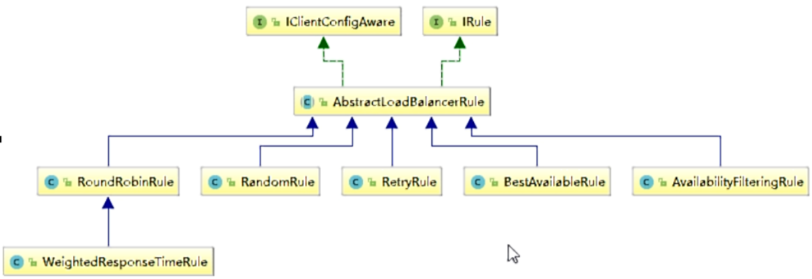

# 03、Ribbon负载均衡

# 一、Ribbon概述

SpringCloud Ribbon 是基于Netflix Ribbon实现的一套客户端，负载均衡的工具。


简单的说，Ribbon是Netflix发布的开源项目，主要功能是提供客户端的软件负载均衡算法和服务调用，Ribbon客户端组件提供一系列完善的配置项如连接超时，重试等，简单的说，就是配置文件中列出Load Banlancer (简称LB) 后面所有的机器，Ribbon都会自动的帮助你基于某种规则（如简单轮询，随机连接等）去连接这些机器。我们很容易使用Ribbon实现自定义的负载均衡算法。


官网： https://github.com/Netflix/ribbon/wiki/Getting-Started

Ribbon已经进入维护模式！未来的替换方案：Load Banlancer


## 1、Ribbon能作什么

### 1.1 LB （负载均衡）

**LB 负载均衡 Load balance 是什么**

简单的说就是将用户的请求平摊的分配到多个服务上，从而达到系统的HA（高可用）

常见的负载均衡有软件  Nginx   LVS   硬件F5等


**Ribbon本地负载均衡客户端VS Nginx 服务端负载均衡区别**

Nginx是服务器负载均衡，客户端所有请求都会交给Nginx，然后由Nginx实现转发请求，即负载均衡是由服务端实现的


Ribbon 本地负载均衡，再调用微服务接口时候，会在注册中心上获取注册信息服务列表之后缓存到JVM本地，从而在本地实现RPC远程服务调用技术

### 1.2 集中式 LB 

- 集中式LB：即在服务的消费方和提供方之间使用独立的LB设施（可以是硬件，如F5，也可以是软件，如Nginx），由该设施负责把访问请求通过某种策略转发至服务的提供方。


### 1.3 进程内 LB

- 将LB逻辑集成到消费方，消费方从服务注册中心或知有哪些地址可用，然后自己再从这些地址中选择出一个何时的服务器。
- Ribbon就属于是进程内LB, 它只是一个类库，集成与消费方进程，消费方通过它来获取到服务提供方的地址。


## 2、注意事项

如果配置文件中配置instace-id时 启动多个实例  注意修改id的值

```yaml
eureka:
  instance:
    instance-id: payment8002   # 这里的payment8002 如果要在启动一个的话 需要改成payment8003
    prefer-ip-address: true   # 访问路径可以显示IP地址
```


## 3、负载均衡演示

### 3.1 架构说明

**总结：Ribbon其实就是一个软负载均衡的客户端组件。**

它可以和其他所需请求的客户端结合使用，和eureka结合只是其中一个实例


### 3.2 Ribbon在工作时分为两步：

- 第一步先选择EurekaServer，它优先选择在同一个区域内负载较少的server
- 第二部再根据用户指定的策略，再从server取到的服务注册列表中选择一个地址。

其中Ribbon提供了多种策略：比如 **轮询，随机和根据响应时间加权。**


## 4、依赖

Eureka Client 会自己带着Ribbon 所以不需要添加Ribbon依赖


如果不放心 也可以自己添加【完全没必要加】

```xml
<dependency>
    <groupId>org.springframework.cloud</groupId>
    <artifactId>spring-cloud-starter-netflix-ribbon</artifactId>
</dependency>
```

## 5、二说`RestTemplate`


官网： https://docs.spring.io/spring-framework/docs/5.2.2.RELEASE/javadoc-api/org/springframework/web/client/RestTemplate.html

### 5.1 getForObject()  和 getForEntity() 


`getForObject()` // 返回对象为响应体中数据转化成的对象，基本上可以理解为JSON

`getForEntity()`  // 返回对象为ResponseEntity对象，包含了响应中的一些重要信息，比如响应头，响应状态码，响应体等。

```java

------------------ getForObject() --------------------------------------
@GetMapping(/consumer/get/payment/{id})
public CommonResult<Payment> get Payment(@PathVariable("id") Long id){
	String url = "http://localhost:8001/get/payment/" + id;
    
    // 返回对象为响应体中数据转化成的对象，基本上可以理解为JSON
	return restTemplate.getForObject(url,CommonResult.class);
}

------------------ getForEntity() --------------------------------------
@GetMapping("/consumer/get/payment/{id}")
public CommonResult<Payment> get Payment(@PathVariable("id") Long id){
	String url = "http://localhost:8001/get/payment/" + id;
    
    // 返回对象为ResponseEntity对象，包含了响应中的一些重要信息，比如响应头，响应状态码，响应体等。
    ResponseEntity<CommonResult> responseEntity = restTemplate.getForEntity(url,CommontResult.class);
    // 判断是否成功
    if(responseEntity,getStatusCode.is2xxSuccessful()){
    	return responseEntity.getBody();
    }else{
        return new CommonResult(444,"操作失败");
    }
}
```

### 5.2 postForObject()  和 postForEntity() 

```java
@PostMapping("/consumer/create/payment")
public CommonResult<Payment> create(@RequestBody Payment payment){
    String url = "http://localhost:8001/create/payment";
    // postForObject() 可以直接return回去
	return restTemplate.postForObject(url,payment,CommonResult.class);
    // postForEntity() 需要调用getBody() 在返回
    return restTemplate.postForEntity(url,payment,CommonResult.class).getBody;
}
```

## 6、Ribbon核心组件IRule

### 6.1 IRule:根据特定算法从服务列表中选取一个要访问的服务

- `com.netflix.loadbalancer.RoundRobinRule：`
  - 轮询

- `com.netflix.loadbalancer.RandomRule：`
  - 随机

- `com.netflix.loadbalancer.RetryRule`
  - 先按照RoundRobinRule的策略获取服务，如果获取服务失败则在指定时间内会进行重试

- `WeightedResponseTimeRule  `
  - 对RoundRobinRule的扩展，响应速度越快的实例选择权重越大，越容易被选择

- `BestAvailableRule  `
  - 会先过滤掉由于多次访问故障而处于断路器跳闸状态的服务，然后选择一个并发量最小的服务

- `AvailabilityFilteringRule ` 
  - 先过滤掉故障实例，再选择并发较小的实例

- `ZoneAvoidanceRule`
  - 默认规则，复合判断server所在区域的性能和server的可用性选择服务器



### 6.2 如何替换负载均衡算法

#### ① 修改消费者服务 consumer


#### ② 配置类

**注意****这个 自定义配置类不能放在@ComponentScan所扫描的当前包下以及子包**

**否则我们自定义的这个配置类旧会被所有的Ribbon客户端所共享，达不到特殊化定制的目的了。**

主启动类：`com.yixuexi.springcloud.主启动类`

负载均衡算法包：`com.yixuexi.myrule`  在主启动类上一次，就不会被扫描到

```java
@Configuration
public class MySelfRule {
    @Bean
    public IRule iRule(){
        // 随机算法
        return new RandomRule();
    }
}
```

#### ③ 主启动类

消费者的主启动类

```
**@RibbonClient(configuration = MySelfRule.class)**
```

```java
@EnableEurekaClient
@SpringBootApplication
// name 写要负载均衡访问的provider的微服务名字
@RibbonClient(name = "cloud-payment-service",configuration = MySelfRule.class)
public class OrderMain80 {
    public static void main(String[] args) {
        SpringApplication.run(OrderMain80.class,args);
    }
}
```

## 7、Ribbon负载均衡算法

### 7.1 原理

负载均衡算法：**rest接口第几次请求数 % 服务器集群总数量 = 实际调用服务器位置下标**，每次服务重启后rest接口计数从1开始。

```java
List<ServiceInstance> instances = doscoveryClient.getInstances("cloud-payment-service");
List[0] instances = 127.0.0.1:8002;
List[1] instances = 127.0.0.1:8001;

8001 + 8002 组合为集群，他们共计2台机器，集群总数为2，按照轮询算法原理：
当总请求数为1时：1 % 2 = 1，对应下标为 1，则获得服务地址为 127.0.0.1：8001
当总请求数为2时：2 % 2 = 0，对应下标为 0，则获得服务地址为 127.0.0.1：8002
当总请求数为3时：3 % 2 = 1，对应下标为 1，则获得服务地址为 127.0.0.1：8001
当总请求数为4时：4 % 2 = 0，对应下标为 0，则获得服务地址为 127.0.0.1：8002
如此类推
```

### 7.2 手写规则

#### ① 8001和8002微服务改造

```java
@RequestMapping("/get/lb")
public String getLBid(){
    return port;
}
```

#### ② 80消费者RestTemplate去掉`@LoadBalanced`

#### ③ 创建服务接口

```java
package com.yixuexi.springcloud.lb;

import org.springframework.cloud.client.ServiceInstance;

import java.util.List;

/**
 * @date: 2021/4/6   18:44
 * @author: 易学习
 */
public interface LoadBalancer {
    //收集服务器总共有多少台能够提供服务的机器，并放到list里面
    ServiceInstance instances(List<ServiceInstance> serviceInstances);
}
```

#### ④ 接口实现类

```java
@Component
public class MyLB implements LoadBalancer {

    private AtomicInteger atomicInteger = new AtomicInteger(0);

    //坐标
    private final int getAndIncrement(){
        int current;
        int next;
        do {
            current = this.atomicInteger.get();
            next = current >= 2147483647 ? 0 : current + 1;
        }while (!this.atomicInteger.compareAndSet(current,next));  //第一个参数是期望值，第二个参数是修改值是
        System.out.println("*******第几次访问，次数next: "+next);
        return next;
    }

    @Override
    public ServiceInstance instances(List<ServiceInstance> serviceInstances) {  //得到机器的列表
        int index = getAndIncrement() % serviceInstances.size(); //得到服务器的下标位置
        return serviceInstances.get(index);
    }
}
```

#### ⑤ OrderController

```java
@RestController
public class OrderController {
    @Autowired
    private RestTemplate restTemplate;
    @Autowired
    private DiscoveryClient discoveryClient;
    @Autowired
    private LoadBalancer loadBalancer;
    
    @GetMapping(value = "/consumer/payment/lb")
    public String getPaymentLB(){
        List<ServiceInstance> instances = discoveryClient.getInstances("CLOUD-PAYMENT-SERVICE");
        if (instances == null || instances.size() <= 0){
            return null;
        }
        ServiceInstance serviceInstance = loadBalancer.instances(instances);
        URI uri = serviceInstance.getUri();
        return restTemplate.getForObject(uri+"/get/lb",String.class);
    }
}
```

#### ⑥ 测试

http://localhost/consumer/payment/lb

