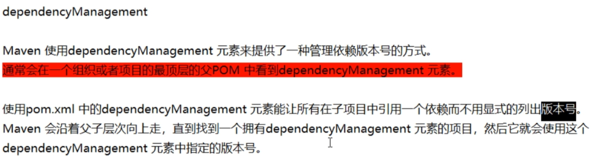
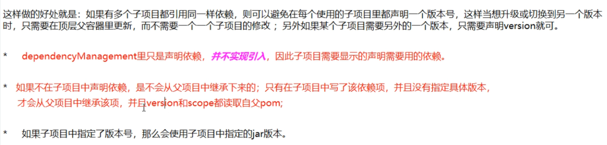
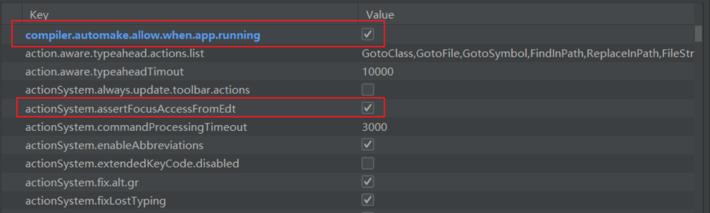

# SpringCloud Alibaba

# 一、微服务架构

业界大牛马丁.福勒（Martin Fowler） 这样描述微服务：论文网址：[链接](https://martinfowler.com/articles/microservices.html)


微服务架构是一种架构模式，它提倡将单一应⽤程序划分成一组小的服务，服务之间互相协调、互相配合，为用户提供最终价值。每个服务运行在其独立的进程中，服务与服务间采用轻量级的通信机制互相协作（通常是基于HTTP协议的RESTful API）。每个服务都围绕着具体业务进行构建，并且能够被独立的部署到生产环境、类生产环境等。另外，应当尽量避免统一的、集中式的服务管理机制，对具体的一个服务而言，应根据业务上下文，选择合适的语言、工具对其进行构建。

**SpringCloud ：**

分布式微服务架构的一站式解决方案，是多种微服务架构落地技术的集合体，俗称微服务全家桶

SpringCloud中包含了20+种技术。


## 1、技术选型

[查看SpringCloud 和SpringBoo版本兼容性](https://spring.io/projects/spring-cloud#overview) 


[查看SpringCloud 对其余各个技术版本的兼容性](https://start.spring.io/actuator/info) 需要转换成JSON进行查看


## 2、学习版本定稿

学习时必须和定稿版本一致

| **技术**             | **版本**          |
| -------------------- | ----------------- |
| Spring Cloud         | **Hoxton.SR1**    |
| Spring Boot          | **2.2.2.RELEASE** |
| Spring Cloud Alibaba | 2.1.0.RELEASE     |
| Java                 | 8                 |
| Maven                | 3.5               |
| MySQL                | 5.7               |

## 2、学习版本定稿

学习时必须和定稿版本一致

| **技术**             | **版本**          |
| -------------------- | ----------------- |
| Spring Cloud         | **Hoxton.SR1**    |
| Spring Boot          | **2.2.2.RELEASE** |
| Spring Cloud Alibaba | 2.1.0.RELEASE     |
| Java                 | 8                 |
| Maven                | 3.5               |
| MySQL                | 5.7               |


## 3、Cloud各种组件的停更/升级/替换

**停更不停用**

- bug不管了
- 不接受GitHub合并请求

- 不再发布新版本


**服务注册中心：**

- `Eureka`   停更
- `Zookeeper`  可用

- `Consul ` 可用但不推荐
- `Nacos ` 完美替换Eureka 推荐

**服务调用：**

- `Ribbon `可用
- `LoadBalancer`  Spring 新推出 打算替代Ribbon


**服务调用2：**

- `Fiegn`  停更
- `OpenFiegn`  可用 推荐


**服务降低熔断：**

- `Hystrix` 停更但企业大部分在使用
- `resilience4j`官网推荐，国外使用的居多

- `Sentinel`阿里巴巴的 强烈推荐


**服务网关:**

- `Zuul`  停更
- `Zuul2`   胎死腹中

- `gateway`  Spring家的，推荐


**服务配置：**

- `config`  不推荐
- `apolo`  携程的 推荐

- `Nacos` 阿里巴巴的  推荐


**服务总线：**

- `Bus`  不推荐
- `Nacos`  推荐


# 二、SpringCloud工程创建

此父工程声明了 SpringCloud 和SpringBoot的版本 Pom工程

## 1、实用maven生成一个空的  project 即可  【project】

### 1.1 pom

<dependencyManagement> 和 <dependencies>的区别





```xml
<?xml version="1.0" encoding="UTF-8"?>
<project xmlns="http://maven.apache.org/POM/4.0.0"
         xmlns:xsi="http://www.w3.org/2001/XMLSchema-instance"
         xsi:schemaLocation="http://maven.apache.org/POM/4.0.0 http://maven.apache.org/xsd/maven-4.0.0.xsd">
    <modelVersion>4.0.0</modelVersion>

    <groupId>com.yixuexi.springcloud</groupId>
    <artifactId>cloud2020</artifactId>
    <version>1.0-SNAPSHOT</version>
    <packaging>pom</packaging>

    <!-- 统一管理jar包版本 -->
    <properties>
        <project.build.sourceEncoding>UTF-8</project.build.sourceEncoding>
        <maven.compiler.source>1.8</maven.compiler.source>
        <maven.compiler.target>1.8</maven.compiler.target>
        <junit.version>4.12</junit.version>
        <log4j.version>1.2.17</log4j.version>
        <lombok.version>1.16.18</lombok.version>
        <mysql.version>5.1.47</mysql.version>
        <druid.version>1.1.16</druid.version>
        <mybatis.spring.boot.version>1.3.0</mybatis.spring.boot.version>
    </properties>

    <!-- 子模块继承之后，提供作用：锁定版本+子module不用写groupId和version  -->
    <dependencyManagement>
        <dependencies>
            <!--spring boot 2.2.2-->
            <dependency>
                <groupId>org.springframework.boot</groupId>
                <artifactId>spring-boot-dependencies</artifactId>
                <version>2.2.2.RELEASE</version>
                <type>pom</type>
                <scope>import</scope>
            </dependency>
            <!--spring cloud Hoxton.SR1-->
            <dependency>
                <groupId>org.springframework.cloud</groupId>
                <artifactId>spring-cloud-dependencies</artifactId>
                <version>Hoxton.SR1</version>
                <type>pom</type>
                <scope>import</scope>
            </dependency>
            <!--spring cloud alibaba 2.1.0.RELEASE-->
            <dependency>
                <groupId>com.alibaba.cloud</groupId>
                <artifactId>spring-cloud-alibaba-dependencies</artifactId>
                <version>2.1.0.RELEASE</version>
                <type>pom</type>
                <scope>import</scope>
            </dependency>

            <dependency>
                <groupId>mysql</groupId>
                <artifactId>mysql-connector-java</artifactId>
                <version>${mysql.version}</version>
            </dependency>
            <dependency>
                <groupId>com.alibaba</groupId>
                <artifactId>druid</artifactId>
                <version>${druid.version}</version>
            </dependency>
            <dependency>
                <groupId>org.mybatis.spring.boot</groupId>
                <artifactId>mybatis-spring-boot-starter</artifactId>
                <version>${mybatis.spring.boot.version}</version>
            </dependency>
            <dependency>
                <groupId>junit</groupId>
                <artifactId>junit</artifactId>
                <version>${junit.version}</version>
            </dependency>
            <dependency>
                <groupId>log4j</groupId>
                <artifactId>log4j</artifactId>
                <version>${log4j.version}</version>
            </dependency>
            <dependency>
                <groupId>org.projectlombok</groupId>
                <artifactId>lombok</artifactId>
                <version>${lombok.version}</version>
                <optional>true</optional>
            </dependency>
        </dependencies>
    </dependencyManagement>


    <build>
        <plugins>
            <plugin>
                <groupId>org.springframework.boot</groupId>
                <artifactId>spring-boot-maven-plugin</artifactId>
                <configuration>
                    <fork>true</fork>
                    <addResources>true</addResources>
                </configuration>
            </plugin>
        </plugins>
    </build>

</project>
```

## 2、支付模块构建

约定>配置>编码

### 2.1 改module

创建一个module，cloud-provider-payment8001

因为是在父工程下创建的，所以自动继承了父工程，

同时 父工程中也多出来这个:

```xml
<modules>
  <module>cloud-provider-payment8001</module>
</modules>
```

### 2.2 改pom

```xml
<dependencies>
  <!-- web -->
  <dependency>
    <groupId>org.springframework.boot</groupId>
    <artifactId>spring-boot-starter-web</artifactId>
  </dependency>

  <!-- 图形化监控 -->
  <dependency>
    <groupId>org.springframework.boot</groupId>
    <artifactId>spring-boot-starter-actuator</artifactId>
  </dependency>

  <!-- mybatis 和SpringBoot 整合-->
  <dependency>
    <groupId>org.mybatis.spring.boot</groupId>
    <artifactId>mybatis-spring-boot-starter</artifactId>
  </dependency>

  <!-- druid 数据库连接池 -->
  <dependency>
    <groupId>com.alibaba</groupId>
    <artifactId>druid-spring-boot-starter</artifactId>
  </dependency>
  <!-- MySQL 驱动 -->
  <dependency>
    <groupId>mysql</groupId>
    <artifactId>mysql-connector-java</artifactId>
  </dependency>
  <!-- jdbc -->
  <dependency>
    <groupId>org.springframework.boot</groupId>
    <artifactId>spring-boot-starter-jdbc</artifactId>
  </dependency>
  <!--热部署-->
  <dependency>
    <groupId>org.springframework.boot</groupId>
    <artifactId>spring-boot-devtools</artifactId>
    <scope>runtime</scope>
    <optional>true</optional>
  </dependency>

  <dependency>
    <groupId>org.projectlombok</groupId>
    <artifactId>lombok</artifactId>
    <optional>true</optional>
  </dependency>

  <dependency>
    <groupId>org.springframework.boot</groupId>
    <artifactId>spring-boot-starter-test</artifactId>
    <scope>test</scope>
  </dependency>
```

### 2.3 写yaml

```YAML
server:
  port: 8001


spring:
  application:
    name: cloud-payment-service
  datasource:
    type: com.alibaba.druid.pool.DruidDataSource
    driver-class-name: org.gjt.mm.mysql.Driver
    url: jdbc:mysql://localhost:3306/db2019?useUnicode=true&characterEncoding=utf-8&useSSL=false
    username: root
    password: 123456

mybatis:
  mapperLocations: classpath:mapper/*.xml
  type-aliases-package: com.atguigu.springcloud.entities
```

### 2.4 主启动类

```java
@SpringBootApplication
public class PaymentMain8001 {

    public static void main(String[] args) {
        SpringApplication.run(PaymentMain8001.class,args);
    }
}
```

### 2.5 业务类

```sql
CREATE TABLE `payment`(
  `id` BIGINT(20) NOT NULL AUTO_INCREMENT COMMENT 'ID',
  `serial` VARCHAR(200) DEFAULT'',
	PRIMARY KEY(`id`)
)ENGINE=INNODB AUTO_INCREMENT=1 DEFAULT CHARSET=utf8
```

entities

支付表实体类

```java
@NoArgsConstructor
@AllArgsConstructor
@Data
public class Payment implements Serializable {
    private Long id;
    private String serial;
}
```

通用 结果集实体类

```java
@NoArgsConstructor
@AllArgsConstructor
@Data
public class CommonResult<T> {
    private Integer code;
    private String message;
    private T data;

    public CommonResult(Integer code, String message) {
        this.code = code;
        this.message = message;
    }
}
```

dao

```java
/**
 * @date: 2021/4/5   0:55
 * @author: 易学习
 * @Mapper: 推荐使用@Mapper注解
 */
@Mapper
public interface PaymentDao {
    
    int create(Payment payment);
    
    Payment getPaymentById(@Param("id") Long id);
    
}
```

mapper

```xml
<?xml version="1.0" encoding="UTF-8" ?>
<!DOCTYPE mapper
        PUBLIC "-//mybatis.org//DTD Mapper 3.0//EN"
        "http://mybatis.org/dtd/mybatis-3-mapper.dtd">

<mapper namespace="com.yixuexi.springcloud.dao.PaymentDao">
    <resultMap id="BaseResultMap" type="com.yixuexi.springcloud.entities.Payment">
        <id property="id" column="id"></id>
        <result property="serial" column="serial" jdbcType="VARCHAR"></result>
    </resultMap>
    <select id="getPaymentById" resultMap="BaseResultMap">
        select * from payment where id = #{id}
    </select>

    <!-- userGeneratedKeys=true 说明把插入的值返回回来,回填到对象中
        keyProperty="id" 说明主键是id
     -->
    <insert id="create" parameterType="com.yixuexi.springcloud.entities.Payment"
            useGeneratedKeys="true" keyProperty="id">
        insert into payment(serial) values(#{serial})
    </insert>
</mapper>
```

service

```java
@Service
public class PaymentServiceImpl implements PaymentService {
    @Autowired
    private PaymentDao paymentDao;

    @Override
    public int create(Payment payment) {
        return paymentDao.create(payment);
    }

    @Override
    public Payment getPaymentById(Long id) {
        return paymentDao.getPaymentById(id);
    }
}
```

controller

```java
@Slf4j
@RestController
public class PaymentController {
    @Autowired
    private PaymentService paymentService;

    @PostMapping("/create/payment")
    public CommonResult<Payment> create(@RequestBody Payment payment) {
        log.info(payment.toString());
        int i = paymentService.create(payment);
        if (i > 0) {
            return new CommonResult<>(200, "创建成功");
        } else{
            return new CommonResult<>(444,"创建失败");
        }

    }
    @GetMapping("/get/payment/{id}")
    public CommonResult<Payment> getPaymentById(@PathVariable("id") Long id){
        Payment paymentById = paymentService.getPaymentById(id);
        if (paymentById != null){
            return new CommonResult<>(200,"查询成功",paymentById);
        }else{
            return new CommonResult<>(444,"未查询到");
        }

    }
}
```


# 三、Devtools 热部署

添加devtools 依赖和pom插件

```xml
<!-- devtools 依赖 -->
<dependency>
    <groupId>org.springframework.boot</groupId>
    <artifactId>spring-boot-devtools</artifactId>
   <scope>runtime</scope>
    <optional>true</optional>
</dependency>

<!-- devtools 插件 -->
<build>
  <plugins>
    <plugin>
      <groupId>org.springframework.boot</groupId>
      <artifactId>spring-boot-maven-plugin</artifactId>
      <configuration>
        <fork>true</fork>
        <addResources>true</addResources>
      </configuration>
    </plugin>
  </plugins>
</build>
```


Ctrl+Alt+Shift+/ --->registry---->打勾



重启IDEA  ----- 热部署OK!


# 四、消费者工程

## 1、使用RestTemplate来进行远程调用

- RedisTemplate 提供了多种便捷的访问远程HTTP服务的方法
- 是一种简单轻便的访问restful服务模板类，是Spring提供的用户访问Rest服务的客户端模板工具集。


## 2、使用RestTemplate

- `（url ，requestMap，ResponseBean.class）` 这三个参数分别代表了（Rest请求地址、请求参数、Http响应转换被转换成的对象类型）


## 3、将RestTemplate添加到容器中

```java
@Configuration
public class WebConfig {
    @Bean
    public RestTemplate restTemplate(){
        return new RestTemplate();
    }
}
```

## 4、使用RestTemplate 调用8001端口

```java
@RestController
public class OrderController {
    @Autowired
    private RestTemplate restTemplate;

    @PostMapping("/consumer/create/payment")
    public CommonResult<Payment> create(@RequestBody Payment payment){
        String url = "http://localhost:8001/create/payment";
        //使用 postForEntity 内部发的是post请求
        ResponseEntity<CommonResult> commonResultResponseEntity =
                restTemplate.postForEntity(url, payment, CommonResult.class);

         return commonResultResponseEntity.getBody();

    }

    @GetMapping("/consumer/get/payment/{id}")
    public CommonResult<Payment> get(@PathVariable Long id){
        String url = "http://localhost:8001/get/payment/";
        // getForObject() 内部发get 请求
        return restTemplate.getForObject(url+id,CommonResult.class);
    }
}
```

# 五、实体类工程

为了更简洁的代码，减少冗余

```xml
<dependencies>
  <!--热部署-->
  <dependency>
    <groupId>org.springframework.boot</groupId>
    <artifactId>spring-boot-devtools</artifactId>
    <scope>runtime</scope>
    <optional>true</optional>
  </dependency>

  <dependency>
    <groupId>org.projectlombok</groupId>
    <artifactId>lombok</artifactId>
    <optional>true</optional>
  </dependency>

  <dependency>
    <groupId>cn.hutool</groupId>
    <artifactId>hutool-all</artifactId>
    <version>5.1.0</version>
  </dependency>
</dependencies>
```

maven执行命令  `clean`  `install`

把其余工程中的实体类删除即可，然后把80 和8001的pom中加入commons工程依赖