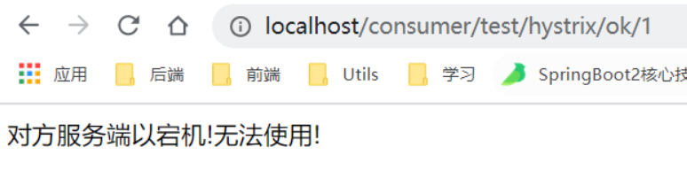
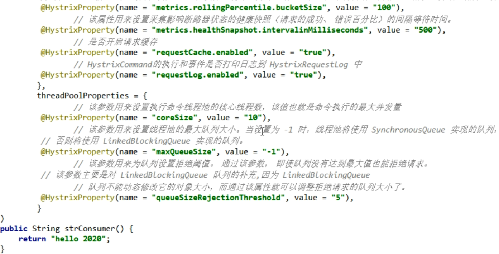
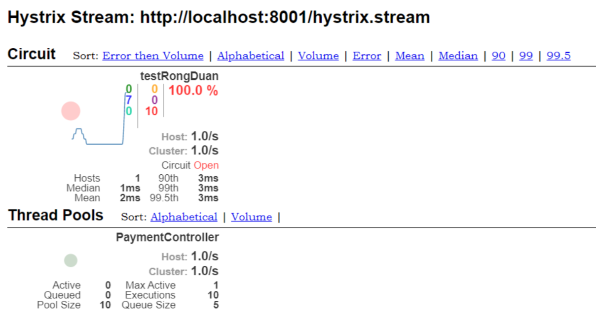
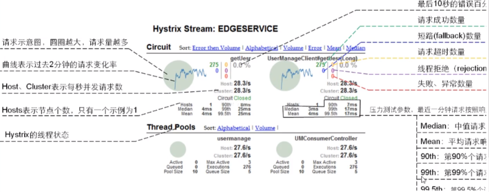

# 05、Hystrix断路器

# 一、概述

## 1、分布式系统面临的问题

复杂分布式体系机构中的应用程序有数十个依赖关系，每个依赖关系在某些时候将不可避免地失败

### 1.1 服务雪崩

多个微服务之间调用的时候，假设微服务A调用微服务B和微服务C，微服务B和微服务C又调用其他的微服务，这就是所谓的“扇出”如果扇出的链路上某个微服务的调用响应时间过长或者不可用，对微服务A的调用就会占用越来越多的系统资源，进而引起系统崩溃，所谓的“雪崩效应”。

对于高流量的应用来说，单一的后端依赖可能会导致所有服务器上的所有资源都在几秒钟内饱和，比失败更糟糕的是，这些应用程序还可能导致服务之间的延迟增加，备份队列，线程和其他系统资源紧张，导致整个系统发生更多的级联故障。这些都表示需要对故障和延迟进行隔离和管理，以便单个依赖关系的失败，不能取消整个应用程序或系统。


通常当你发现一个模块下某个实例失败后，这时候这个模块依然还会接收流量，然而这个有问题的模块还调用了其他模块，这样就会发生级联故障，或者叫雪崩。

## 2、Hystrix 是什么

Hystrix 是一个用于处理分布式系统的延迟和容错的开源库，在分布式系统里，许多依赖不可避免的会调用失败，比如超时，异常等，Hystrix能够保证在一个依赖出问题的情况下，不会导致整体服务失败，避免级联故障，以提高分布式系统的弹性。


断路器本身是一种开关装置，当某个服务单元发生故障之后，通过断路器的故障监控（类似熔断保险丝），向调用方返回一个符合预期的，可处理的备选响应（FallBack），而不是长时间的等待或者抛出调用方无法处理的异常，这样就保证了服务调用方的线程不会被长时间、不必要地占用，从而避免了故障在分布式系统中的蔓延，乃至雪崩


## 3、Hystrix能做什么

- 服务降级
- 服务熔断

- 接近实时的监控
- 。。。。


## 4、Hystrix官网

https://github.com/Netflix/Hystrix/wiki/How-To-Use


# 二、Hystrix 重要概念

## 1、服务降级

服务器繁忙，请稍后再试，不让客户端等待并立刻返回一个好友提示。`fallback`

哪些情况会触发降级：

- 程序运行异常
- 超时

- 服务熔断触发服务降级
- 线程池/信号量打满也会导致服务降级

## 2、服务熔断

类比保险丝达到最大服务访问后，直接拒绝访问，拉闸限电，然后调用服务降级的方法并返回友好提示 `break`

就是保险丝   ||    服务的降级--->进而熔断--->恢复调用链路

## 3、服务限流

秒杀高并发等操作，严禁一窝蜂的过来拥挤，大家排队，一秒钟N个，有序进行  `flowlimit`


# 三、Hystrix案例

## 1、构建正确提供者模块

搭建基础平台：从正确--->错误--->降级熔断--->恢复

以此平台 演示 Hystrix 服务降级 服务熔断 服务限流

### 1.1 创建cloud-provider-hystrix-payment8001模块

### 1.2 添加依赖

Hystrix 单体依赖

```xml
<!--新增hystrix-->
<dependency>
  <groupId>org.springframework.cloud</groupId>
  <artifactId>spring-cloud-starter-netflix-hystrix</artifactId>
</dependency>
```

总体依赖

```xml
<dependency>
  <groupId>org.springframework.cloud</groupId>
  <artifactId>spring-cloud-starter-netflix-eureka-client</artifactId>
</dependency>


<dependency>
  <groupId>com.yixuexi.springcloud</groupId>
  <artifactId>cloud-api-commons</artifactId>
  <version>${project.version}</version>
</dependency>


<dependency>
  <groupId>org.springframework.boot</groupId>
  <artifactId>spring-boot-starter-web</artifactId>
</dependency>

<dependency>
  <groupId>org.springframework.boot</groupId>
  <artifactId>spring-boot-starter-actuator</artifactId>
</dependency>

<dependency>
  <groupId>org.springframework.boot</groupId>
  <artifactId>spring-boot-devtools</artifactId>
  <scope>runtime</scope>
  <optional>true</optional>
</dependency>

<dependency>
  <groupId>org.projectlombok</groupId>
  <artifactId>lombok</artifactId>
  <optional>true</optional>
</dependency>
<dependency>
  <groupId>org.springframework.boot</groupId>
  <artifactId>spring-boot-starter-test</artifactId>
  <scope>test</scope>
</dependency>
```

### 1.3 yaml配置文件

```yaml
server:
  port: 8081

eureka:
  client:
    fetch-registry: true
    register-with-eureka: true
    service-url:
      defaultZone: http://eureka7001.com:7001/eureka,http://eureka7002.com:7002/eureka
spring:
  application:
    name: cloud-provider-hystrix-payment
```

### 1.4 主启动类

```java
@EnableEurekaClient
@SpringBootApplication
public class HystrixMain8001 {
    public static void main(String[] args) {
        SpringApplication.run(HystrixMain8001.class,args);
    }
}
```

### 1.5 业务类

service服务类

```java
@Service
public class PaymentHystrixServiceImpl implements PaymentHystrixService {
    @Override
    public String testHystrixOk(Integer id) {
        return "测试成功 + testHystrixOk() -->" + id;
    }

    @Override
    public String testHystrixTimeout(Integer id) throws InterruptedException {
        Thread.sleep(3000);

        return "测试成功 + testHystrixTimeout() -->" + id ;
    }
}
```

controller服务类

```java
@RestController
public class PaymentController {
    @Autowired
    private PaymentHystrixService paymentHystrixService;

    @RequestMapping("/test/hystrix/ok/{id}")
    public String testHystrixOk(@PathVariable("id") Integer id){
        return paymentHystrixService.testHystrixOk(id);
    }

    @RequestMapping("/test/hystrix/timeout/{id}")
    public String testHystrixTimeout(@PathVariable("id") Integer id) throws InterruptedException {
        return paymentHystrixService.testHystrixTimeout(id);
    }
}
```

### 1.6 测试

能够测试通过，但是访问 /test/hystrix/timeout/1 时会等待3秒钟


## 2、构建正确消费者模块

### 2.1 创建cloud-consumer-feign-hystrix-order80 模块

### 2.2 pom

```xml
<dependencies>
  <!--新增hystrix-->
  <dependency>
    <groupId>org.springframework.cloud</groupId>
    <artifactId>spring-cloud-starter-netflix-hystrix</artifactId>
  </dependency>
  <!--openfeign-->
  <dependency>
    <groupId>org.springframework.cloud</groupId>
    <artifactId>spring-cloud-starter-openfeign</artifactId>
  </dependency>
  <dependency>
    <groupId>org.springframework.cloud</groupId>
    <artifactId>spring-cloud-starter-netflix-eureka-client</artifactId>
  </dependency>
  <dependency>
    <groupId>com.yixuexi.springcloud</groupId>
    <artifactId>cloud-api-commons</artifactId>
    <version>${project.version}</version>
  </dependency>
  <dependency>
    <groupId>org.springframework.boot</groupId>
    <artifactId>spring-boot-starter-web</artifactId>
  </dependency>
  <dependency>
    <groupId>org.springframework.boot</groupId>
    <artifactId>spring-boot-starter-actuator</artifactId>
  </dependency>
  <dependency>
    <groupId>org.springframework.boot</groupId>
    <artifactId>spring-boot-devtools</artifactId>
    <scope>runtime</scope>
    <optional>true</optional>
  </dependency>
  <dependency>
    <groupId>org.projectlombok</groupId>
    <artifactId>lombok</artifactId>
    <optional>true</optional>
  </dependency>
  <dependency>
    <groupId>org.springframework.boot</groupId>
    <artifactId>spring-boot-starter-test</artifactId>
    <scope>test</scope>
  </dependency>
</dependencies>
```

### 2.3 yaml配置

```yaml
server:
  port: 80

eureka:
  client:
    register-with-eureka: true
    fetch-registry: true
    service-url:
      defaultZone: http://eureka7001.com:7001/eureka, http://eureka7002.com:7002/eureka

spring:
  application:
    name: cloud-feign-hystrix-consumer

# ribbon超时设置
# 设置feign 客户端超时时间(OpenFeign默认支持ribbon)
ribbon:
  # 设置建立连接后从服务器读取到可用资源所用的时间
  ReadTimeout: 5000
  # 设置建立连接所用的时间,适用于网络状况正常的情况下,两端连接所用的时间
  ConnectTimeout: 5000
```

### 2.4 主启动类

```java
@EnableFeignClients
@SpringBootApplication
public class HystrixMain80 {
    public static void main(String[] args) {
        SpringApplication.run(HystrixMain80.class,args);
    }
}
```

### 2.5 业务类

声明式远程调用接口

```java
@Component
@FeignClient("CLOUD-PROVIDER-HYSTRIX-PAYMENT")
public interface PaymentRemoteHystrixService {

    @RequestMapping("/test/hystrix/ok/{id}")
    public String testHystrixOk(@PathVariable("id") Integer id);

    @RequestMapping("/test/hystrix/timeout/{id}")
    public String testHystrixTimeout(@PathVariable("id") Integer id) throws InterruptedException;

}
```

controller

```java
@RestController
public class OrderHystrixController {
    @Autowired
    private PaymentRemoteHystrixService paymentRemoteHystrixService;

    @RequestMapping("/consumer/test/hystrix/ok/{id}")
    public String testHystrixOk(@PathVariable("id") Integer id){
        return paymentRemoteHystrixService.testHystrixOk(id);
    }


    @RequestMapping("/consumer/test/hystrix/timeout/{id}")
    public String testHystrixTimeout(@PathVariable("id") Integer id) throws InterruptedException {
        return paymentRemoteHystrixService.testHystrixTimeout(id);
    }
}
```

## 3、Hystrix解决问题

### 3.1 provider服务 8001超时了，调用者80不能一直卡死等待，必须有服务降级

### 3.2 provider服务 8001 宕机了，调用者80不能一直卡死等待，必须有服务降级

### 3.3 provdier服务 8001OK，调用者80自己出现了故障或有自我要求（自己的等待时间小于服务提供者）


# 四、服务降级

不管是在消费者，还是提供者，都可以进行服务降级，使用过@HystrixCommand注解指定降级后的方法

一般做服务降级 都是 客户端做

## 1、服务降级配置

`@HystrixCommand `注解

### 1.1 对8001 提供端进行改造

对80消费端改造的话 亦是如此

- 设置自身调用超时时间的峰值，峰值内可以正常运行，如果在峰值外就执行备用方法。
- 如果不设置峰值的话，直接在方法里抛出 10 / 0 by zero 异常 也会调用备用方法

```java
@RestController
public class PaymentController {
    /**
    * 远程式调用服务类
    */
    @Autowired
    private PaymentHystrixService paymentHystrixService;

    // 三秒以内执行完毕就是正常的业务逻辑,如果超过三秒 就去执行备用方法
    @HystrixCommand(fallbackMethod = "testHystrixTimoutFallback",commandProperties = {
            @HystrixProperty(name = "execution.isolation.thread.timeoutInMilliseconds",value = "3000")})
    @RequestMapping("/test/hystrix/timeout/{id}")
    public String testHystrixTimeout(@PathVariable("id") Integer id) throws InterruptedException {
        return paymentHystrixService.testHystrixTimeout(id);
    }
	
    // 兜底方法！
    public String testHystrixTimoutFallback(@PathVariable("id") Integer id) throws InterruptedException {
        return paymentHystrixService.testHystrixTimeout(id) + "降级服务方法执行!";
    }

}
```

### 1.2 主启动类激活

```
@EnableCircuitBreaker
```

你在消费端 进行了降级 就在消费端添加该注解，反之...

```java
@EnableCircuitBreaker
@EnableEurekaClient
@SpringBootApplication
public class HystrixMain8001 {
    public static void main(String[] args) {
        SpringApplication.run(HystrixMain8001.class,args);
    }
}
```


## 2、全局服务降级`@DefaultProperties`

解决的问题：

解决了每个方法都需要有兜底的方法的痛处

解决了兜底方法和业务逻辑混在一起的问题


### 2.1 解决代码膨胀

解决每个方法都要有兜底方法问题


```
@DefaultProperties(defaultFallback = "方法名")
```

标注在类上，表示没有指定`@HystrisCommand(fallbackMethod="方法名")`的方法就是用`@DefaultProperties(defaultFallback="方法名")`所指定的做备用方法。


注意：就算使用全局降级配置 也需要在方法上添加`@HystrisCommand` 注解

1：1每个方法配置一个服务降级的方法，技术上可以，实际中不可用

1：N 除了个别重要核心业务有专属，其他普通的可以通过`@DefaultProperties(defaultFallback= "")`统一跳转到统一处理结果页面

```java
@RestController
@DefaultProperties(defaultFallback = "globalHandler")
public class OrderHystrixController {
    @Autowired
    private PaymentRemoteHystrixService paymentRemoteHystrixService;

    @RequestMapping("/consumer/test/hystrix/ok/{id}")
    public String testHystrixOk(@PathVariable("id") Integer id){
        return paymentRemoteHystrixService.testHystrixOk(id);
    }
    // 精准打击  定义了fallbackMethod 属性
    @HystrixCommand(fallbackMethod = "testHystrix")
    @RequestMapping("/consumer/test/hystrix/timeout/{id}")
    public String testHystrixTimeout(@PathVariable("id") Integer id) throws InterruptedException {
        int i = 10 / 0;
        return paymentRemoteHystrixService.testHystrixTimeout(id);
    }
    // 使用全局服务降级配置
    @HystrixCommand
    @RequestMapping("/consumer/test/hystrix/default/{id}")
    public String test1(@PathVariable("id") Integer id) throws InterruptedException {
        int i = 10 / 0;
        return paymentRemoteHystrixService.testHystrixTimeout(id);
    }
    
    public String testHystrix(@PathVariable("id") Integer id){
        return "客户端80 服务降级启动!";
    }
    
    public String globalHandler(){
        return "全局兜底方法!!";
    }

}
```

## 3、服务降级，客户端调用服务端，服务端宕机了

本次案例服务降级处理是在客户端80实现完成的，与服务端8001没有关系

只需要为Feign客户端定义的远程调用接口添加一个服务降级处理的实现类即可实现解耦合


未来面临的异常

- 运行
- 超时

- 宕机

### 3.1 定义远程调用接口实现类

```java
/**
 * @date: 2021/4/7   21:48
 * @author: 易学习
 * 为远程调用接口创建统一降级类
 */
@Component
public class PaymentRemoteHystrixServiceImpl implements PaymentRemoteHystrixService {
    @Override
    public String testHystrixOk(Integer id) {

        return "对方服务端以宕机!无法使用!";
    }

    @Override
    public String testHystrixTimeout(Integer id) throws InterruptedException {
        return "对方服务端以宕机,无法使用!";
    }
}
```

### 3.2 远程调用接口中@FeignClient注解添加fallback属性

添加：`fallback = PaymentRemoteHystrixSserviceImpl.class` 属性

```java
@Component
@FeignClient(value = "CLOUD-PROVIDER-HYSTRIX-PAYMENT",fallback = PaymentRemoteHystrixServiceImpl.class)
public interface PaymentRemoteHystrixService {

    @RequestMapping("/test/hystrix/ok/{id}")
    public String testHystrixOk(@PathVariable("id") Integer id);

    @RequestMapping("/test/hystrix/timeout/{id}")
    public String testHystrixTimeout(@PathVariable("id") Integer id) throws InterruptedException;
}
```

### 3.3 yaml配置文件添加这一句

```yaml
feign:
  hystrix:
    enabled: true
```

### 3.4 测试



### 总结

1. 创建远程调用接口实现类，并对其进行[降级]实现
2. 给@FeignClient 添加fallback属性

3. 配置文件注意要启动 feign.hystrix

# 五、服务熔断

## 1、熔断机制概述

熔断机制式应对雪崩效应的一种微服务链路保护机制。当扇出链路的某个微服务出错不可用或者响应时间太长时，会进行服务的降级，进而熔断该节点微服务的调用，快速返回错误的响应信息。

**当检测到该节点微服务调用响应正常后，自动恢复调用链路。**

熔断状态： 开启   关闭    半开启


在SpringCloud框架中，熔断机制通过Hystrix实现Hystrix会监控微服务间调用的状况。

当失败的调用到一定阈值，缺省时5秒内20此调用失败，就会启动熔断机制，熔断机制的注解是`@HystrixCommand`


大神论文：https://martinfowler.com/bliki/CircuitBreaker.html

## 2、实操


注解中的配置解释：在一个10秒钟的窗口期，如果有10个请求 60%都失败了 就熔断

### 2.1 对8001服务端的controller进行改造 增加熔断机制

```java
@HystrixCommand(fallbackMethod = "testRongDuan_fallback",commandProperties = {
    @HystrixProperty(name = "circuitBreaker.enabled",value = "true"),  //是否开启断路器
    @HystrixProperty(name = "circuitBreaker.requestVolumeThreshold",value = "10"),   //请求次数
    @HystrixProperty(name = "circuitBreaker.sleepWindowInMilliseconds",value = "10000"),  //时间范围
    @HystrixProperty(name = "circuitBreaker.errorThresholdPercentage",value = "60")}//失败率达到多少后跳闸
               )
@RequestMapping("/test/hystrix/rongduan/{id}")
public String testRongDuan(@PathVariable Integer id){
    if (id < 0){
        // 这样做的目的是让他去执行兜底方法
        throw new RuntimeException("id 不能为负数");
    }
    return "服务执行成功! id: " + id;
}

public String testRongDuan_fallback(@PathVariable Integer id){

    return "id 不能为负数,降级服务执行…………  id:" + id;
}
```

### 2.2 测试

- 在web页面 输入参数为负数会进入到 兜底方法，如果输入负数的次数 【在一个10秒钟的窗口期，如果有10个请求 60%都失败了 就熔断】符合这个要求，那么就会触发熔断机制，然后你再输入正数都不会执行成功了！
- 慢慢的他自己会检测到后台输入好几个正数了，就会自动关闭熔断


## 3、总结

### 3.1 熔断类型

- **熔断打开**：请求不再进行调用当前服务，内部设置始终一般为MTTR(平均故障处理时间)，当打开时长达到所设始终则进入半熔断状态。
- **熔断关闭**：熔断关闭不会对服务进行熔断

- **熔断半开**：部分请求根据规则调用当前服务，如果请求成功且符合规则则认位当前服务恢复正常，关闭熔断


### 3.2 断路器在什么情况下开始起作用


涉及到断路器的三个重要因素：快照时间窗，请求总数阈值，错误百分比阈值

#### 1：快照时间窗：

- 断路器确定是否打开需要统计一些请求和错误数据，而统计的时间范围就是快照时间窗，默认为最近的10秒。


#### 2：请求总数阈值：

- 在快照时间窗内，必须满足请求总数阈值才有资格熔断，默认为20，意味着在10秒内，如果该Hystrix命令的调用次数不足20次，即使所有的请求都超时或者其他原因失败了，断路器都不会打开。


#### 3：错误百分比阈值：

- 当请求总数在快照时间窗内超过了阈值，比如发生了30次调用，如果在这30次调用中，有15次发生了超时异常，也就是超过50%的错误百分比，在默认设定50%阈值情况下，这时候就会将断路器打开。


### 3.3 断路器开始或者关闭条件

- 当满足一定的阈值的时候（默认是10秒内超过20个请求次数）
- 当失败率达到一定的时候（默认10秒内超过50%的请求失败）

- 到达以上阈值，断路器将会开启
- 当开启的时候，所有的请求都不会进行转发。

- 一段时间后（默认是5秒），这个时候断路器是半开状态，会让其中一个请求进行转发，如果成功，断路器关闭，如果失败，继续开启


### 3.4 断路器打开之后

1： 再有请求调用的时候，将不会调用主逻辑，而是直接调用降级的fallback方法，通过断路器，实现了自动的发现错误并将降级逻辑升级为主逻辑，减少响应延迟的效果。


#### 2：原来的主逻辑要如何恢复？

- 对于这一问题mhystrix也为我们实现了自动恢复功能。
- 当断路器打开，对主逻辑进行熔断之后，hystrix会启动一个休眠时间窗，在这个时间窗内，降级逻辑是临时的成为主逻辑。

- 当休眠时间窗到期，断路器将进入半开状态，释放给一次请求到原来的主逻辑上，如果此次请求正常返回，那么断路器将继续闭合。
- 主逻辑恢复，如果这次请求依然有问题，断路器继续进入打开状态，休眠时间窗重新计时。

## 4、ALL配置





# 六、服务限流

在spring cloud alibaba Sentinel时再说！


# 七、Hystrix工作流程 

https://github.com/Netflix/Hystrix/wiki/How-it-Works


# 八、服务监控 `HystrixDashboard`

除了隔离依赖服务的调用以外，Hystrix还提供了准实时的调用监控（Hystrix Dashboard）Hystrix会持续的记录所有通过Hystrix发起的请求的执行信息，并以统计报表和图形的形式展示给用户，包括**每秒执行多少请求多少成功，多少失败**等，Netflix通过`hystrix-metrics-event-stream`项目实现了对以上指标的监控，Spring Cloud提供了Hystrix Dashboard的整合，对监控内容转化成可视化页面。


## 1、搭建HystrixDashboard

Hystrix 做服务监控还需要创建一个模块，而阿里巴巴的sentinel 直接给你要给网站就能使用

### 1.1 创建新的模块 could-consumer-hystrix-dashboard9001

### 1.2 添加依赖

```xml
<dependencies>
  <!--新增hystrix dashboard-->
  <dependency>
    <groupId>org.springframework.cloud</groupId>
    <artifactId>spring-cloud-starter-netflix-hystrix-dashboard</artifactId>
  </dependency>

  <dependency>
    <groupId>org.springframework.cloud</groupId>
    <artifactId>spring-cloud-starter-netflix-eureka-client</artifactId>
    <version>3.0.2</version>
  </dependency>
  <dependency>
    <groupId>org.springframework.boot</groupId>
    <artifactId>spring-boot-starter-web</artifactId>
  </dependency>
  <dependency>
    <groupId>org.springframework.boot</groupId>
    <artifactId>spring-boot-starter-actuator</artifactId>
  </dependency>
  <dependency>
    <groupId>org.springframework.boot</groupId>
    <artifactId>spring-boot-devtools</artifactId>
    <scope>runtime</scope>
    <optional>true</optional>
  </dependency>

  <dependency>
    <groupId>org.projectlombok</groupId>
    <artifactId>lombok</artifactId>
    <optional>true</optional>
  </dependency>
  <dependency>
    <groupId>org.springframework.boot</groupId>
    <artifactId>spring-boot-starter-test</artifactId>
    <scope>test</scope>
  </dependency>
</dependencies>
```

### 1.3 yaml

```yaml
server:
  port: 9001

eureka:
  client:
    fetch-registry: true
    register-with-eureka: true
    service-url:
      defaultZone: http://eureka7001.com:7001/eureka,http://eureka7002.com:7002/eureka

spring:
  application:
    name: cloud-consumer-hystrix-dashboard
```

### 1.4 需要监控的服务都需要添加以下该依赖

```xml
<dependency>
  <groupId>org.springframework.boot</groupId>
  <artifactId>spring-boot-starter-actuator</artifactId>
</dependency>
```

### 1.5 主启动类添加注解 `@EnableHystrixDashboard` 

表示启动 监控服务

```java
@EnableHystrixDashboard
@SpringBootApplication
public class HystrixDashboardMain9001 {
    public static void main(String[] args) {
        SpringApplication.run(HystrixDashboardMain9001.class,args);
    }
}
```

### 1.6 测试

浏览器输入   http://localhost:9001/hystrix

进入下面页面


## 2、监控8001提供端

8001提供端 一定要有下面两个依赖

```xml
<dependency>
  <groupId>org.springframework.boot</groupId>
  <artifactId>spring-boot-starter-web</artifactId>
</dependency>
<dependency>
  <groupId>org.springframework.boot</groupId>
  <artifactId>spring-boot-starter-actuator</artifactId>
</dependency>
```

新版本Hystrix 需要在主启动类【MainHystrix8001】中指定监控路径

不然就会报错


在8001提供方的主启动类中添加以下代码

```java
@EnableCircuitBreaker
@EnableEurekaClient
@SpringBootApplication
public class HystrixMain8001 {
    public static void main(String[] args) {
        SpringApplication.run(HystrixMain8001.class,args);
    }
    /**
     *此配置是为了服务监控而配置，与服务容错本身无关，springcloud升级后的坑
     *ServletRegistrationBean因为springboot的默认路径不是"/hystrix.stream"，
     *只要在自己的项目里配置上下面的servlet就可以了
     */
    @Bean
    public ServletRegistrationBean getServlet() {
        HystrixMetricsStreamServlet streamServlet = new HystrixMetricsStreamServlet();
        ServletRegistrationBean registrationBean = new ServletRegistrationBean(streamServlet);
        registrationBean.setLoadOnStartup(1);
        registrationBean.addUrlMappings("/hystrix.stream");
        registrationBean.setName("HystrixMetricsStreamServlet");
        return registrationBean;
    }
}
```

在浏览器输入 http://localhost:8001/test/hystrix/rongduan/-1 测试8001接口

发现豪猪哥的监控页面 发生了变化



### 2.1 如何查看仪表盘


