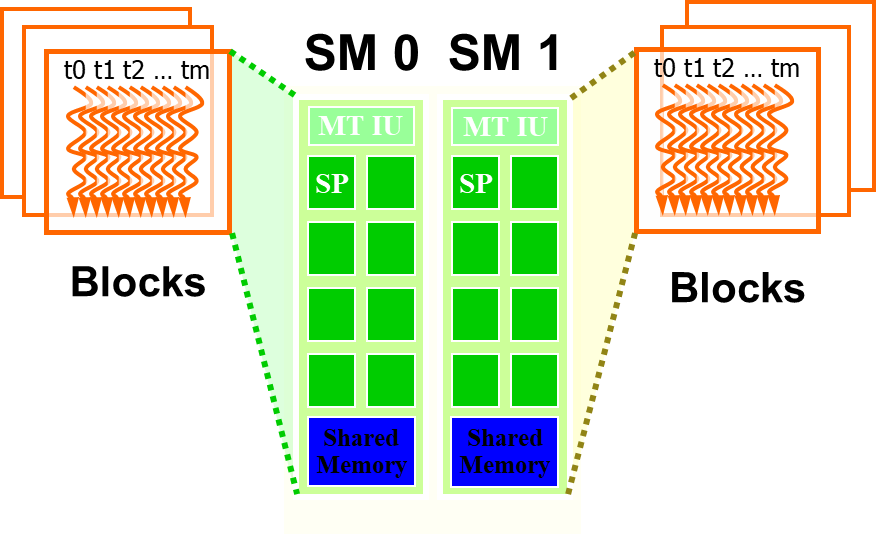

# CUDA


### 并行线程组织结构

Thread：并行的基本单位

Thread block：互相合作的线程组

- Cooperative Thread Array (CTA)
- 允许彼此同步
- 通过快速共享内存交换数据
- 以1维、2维或3维组织
- 最多包含512个线程

Grid：一组thread block

- 以1维、2维或3维组织
- 共享全局内存

Kernel：在GPU上执行的核心程序


> 


### CUDA引入的新变量

- `__device__`
  - 储存于GPU上的global memory空间
  - 和应用程序具有相同的生命期(lifetime)
  - 可被grid中所有线程存取,CPU代码通过`runtime`函数存取
  
- `__constant__`
  - 储存于GPU上的`constant_memory`空间
  - 和应用程序具有相同的生命期(lifetime)
  - 可被grid中所有线程存取,CPU代码通过runtime函数存取
  
- `___shared__`
  - 储存于GPU上`thread block`内的共享存储器
  - 和`thread block`具有相同的生命期(lifetime)
  - 只能被thread block内的线程存取
- `Local变量`
  - 储存于SM内的寄存器和`local memory`
  - 和thread具有相同的生命期(lifetime)
  - Thread私有


### 函数定义

|                                  | Exexuted on the | Only callable from the |
| :------------------------------: | :-------------: | :--------------------: |
| `__device__ ` float DeviceFunc() |     deivce      |         deivce         |
|  `__global__` void KernalFunc()  |     deivce      |          host          |
|   `__host__` float HostFunc()    |      host       |          host          |

> `__global__` 定义 kernal 函数 必须返回 void
>
> `__device__` 和 `__host__` 可以组合使用，都可在 CPU与GPU 上被编译

> ​		**SM是指流多处理器**（Streaming Multiprocessor）的缩写。SM是一种专门为GPU设计的处理器，每个SM都包含多个CUDA核心，能够同时执行多个线程。每个SM都有自己的寄存器、共享内存和高速缓存，可以独立地执行指令，因此可以并行执行多个线程块。线程块是一组线程的集合，可以在一个SM上执行。当线程块被分配到SM上时，SM将为线程块中的每个线程分配寄存器、共享内存和高速缓存，并执行线程块中的指令。通过将线程块分配到不同的SM上执行
>
> 


## FAQ

1. VS 2022  生成依赖项→ 生成自定义→ 没有CUDA 

```shell
# 将以下目录中的 文件拷贝
C:\Program Files\NVIDIA GPU Computing Toolkit\CUDA\v11.8\extras\visual_studio_integration\MSBuildExtensions

# 这个目录中
E:\Visual Studio\MSBuild\Microsoft\VC\v170\BuildCustomizations
```

2. VS 2022  新建项目里没有 CUDA 模板选项

```shell
# 此目录下运行以代码
E:\Visual Studio\Common7\IDE\Extensions

mkdir NVIDIA
cd NVIDIA
mkdir CUDA 11.8 Wizards
cd CUDA 11.8 Wizards
# mkdir 11.8
# cd 11.8

# 将以下目录中的 extension.vsixmanifest 与 Nvda.Vsip.CudaTemplates.pkgdef 创建快捷方式
C:\ProgramData\NVIDIA GPU Computing Toolkit\v11.8\extras\visual_studio_integration\CudaProjectVsWizards\17

# Final 打开 Developer Command Prompt for VS 2022(开发者命令控制台) 并运行
devenv.com /setup /nosetupvstemplates

# 上述方法无效，使用以下方法！
mklink /d "E:\Visual Studio\Common7\IDE\Extensions\NVIDIA\CUDA 11.8 Wizards\11.8" "C:\ProgramData\NVIDIA GPU Computing Toolkit\v11.8\extras\visual_studio_integration\CudaProjectVsWizards\17"

# 管理员身份打开运行 (IDE)
devenv /updateconfiguration
```

3. 测试程序 CUDA 是否安装正确！

```shell
# 测试程序默认在 此目录
C:\Program Files\NVIDIA GPU Computing Toolkit\CUDA\v11.8\extras\demo_suite
```

```shell
[CUDA Bandwidth Test] - Starting...
Running on...

 Device 0: NVIDIA GeForce MX250
 Quick Mode

 Host to Device Bandwidth, 1 Device(s)
 PINNED Memory Transfers
   Transfer Size (Bytes)        Bandwidth(MB/s)
   33554432                     3014.8

 Device to Host Bandwidth, 1 Device(s)
 PINNED Memory Transfers
   Transfer Size (Bytes)        Bandwidth(MB/s)
   33554432                     3090.9

 Device to Device Bandwidth, 1 Device(s)
 PINNED Memory Transfers
   Transfer Size (Bytes)        Bandwidth(MB/s)
   33554432                     47426.0

Result = PASS
```

```shell
deviceQuery.exe Starting...

 CUDA Device Query (Runtime API) version (CUDART static linking)

Detected 1 CUDA Capable device(s)

Device 0: "NVIDIA GeForce MX250"
  CUDA Driver Version / Runtime Version          11.8 / 11.8
  CUDA Capability Major/Minor version number:    6.1
  Total amount of global memory:                 2048 MBytes (2147352576 bytes)
  ( 3) Multiprocessors, (128) CUDA Cores/MP:     384 CUDA Cores
  GPU Max Clock rate:                            1582 MHz (1.58 GHz)
  Memory Clock rate:                             3504 Mhz
  Memory Bus Width:                              64-bit
  L2 Cache Size:                                 524288 bytes
  Maximum Texture Dimension Size (x,y,z)         1D=(131072), 2D=(131072, 65536), 3D=(16384, 16384, 16384)
  Maximum Layered 1D Texture Size, (num) layers  1D=(32768), 2048 layers
  Maximum Layered 2D Texture Size, (num) layers  2D=(32768, 32768), 2048 layers
  Total amount of constant memory:               zu bytes
  Total amount of shared memory per block:       zu bytes
  Total number of registers available per block: 65536
  Warp size:                                     32
  Maximum number of threads per multiprocessor:  2048
  Maximum number of threads per block:           1024
  Max dimension size of a thread block (x,y,z): (1024, 1024, 64)
  Max dimension size of a grid size    (x,y,z): (2147483647, 65535, 65535)
  Maximum memory pitch:                          zu bytes
  Texture alignment:                             zu bytes
  Concurrent copy and kernel execution:          Yes with 5 copy engine(s)
  Run time limit on kernels:                     Yes
  Integrated GPU sharing Host Memory:            No
  Support host page-locked memory mapping:       Yes
  Alignment requirement for Surfaces:            Yes
  Device has ECC support:                        Disabled
  CUDA Device Driver Mode (TCC or WDDM):         WDDM (Windows Display Driver Model)
  Device supports Unified Addressing (UVA):      Yes
  Device supports Compute Preemption:            Yes
  Supports Cooperative Kernel Launch:            Yes
  Supports MultiDevice Co-op Kernel Launch:      No
  Device PCI Domain ID / Bus ID / location ID:   0 / 2 / 0
  Compute Mode:
     < Default (multiple host threads can use ::cudaSetDevice() with device simultaneously) >

deviceQuery, CUDA Driver = CUDART, CUDA Driver Version = 11.8, CUDA Runtime Version = 11.8, NumDevs = 1, Device0 = NVIDIA GeForce MX250
Result = PASS
```

