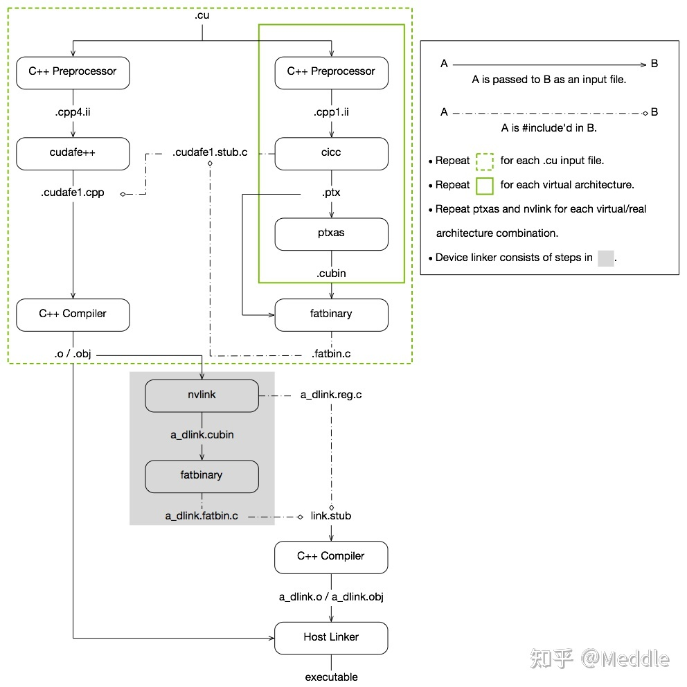
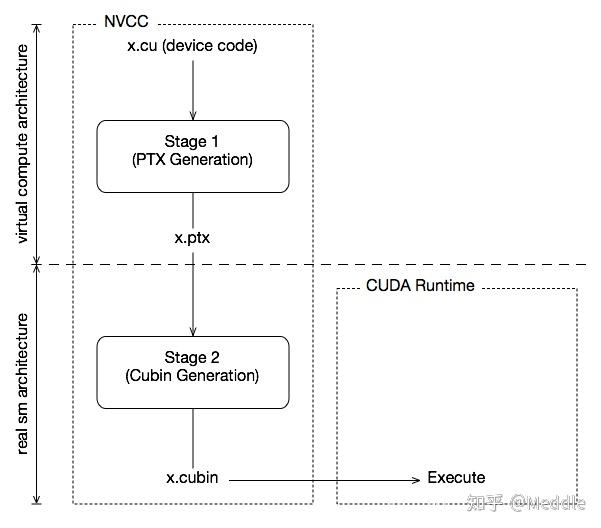

# CUDA 编程


> CPU：复杂的控制逻辑（优化CPU设计的目的主要是为了提高串行代码的性能），大型缓存（减少访问复杂应用程序的指令和数据时产生的延时并且节约带宽）都不利于提升峰值计算速度，内存带宽远远不如GPU
>
> GPU：普遍采用多线程来提升运算速度与吞吐量，硬件充分利用因为等待访问内存而产生较长延时的大量线程，简化了控制逻辑；小型缓存满足多线程对带宽的要求。
>
> GeForce 256是英伟达于1999年开发的第一个GPU，最初只用于在显示器上渲染高端图形。现在，GPU在主流计算中也有了更多应用，GPGPU（通用GPU）技术飞速发展。英伟达开发的了一种与C类似的语言和编程环境，通过克服异构计算及多种并行带来的挑战，从而提高程序员的生产效率。这一系统的名称就是CUDA（Compute Unified Device Architecture）。


## 一、**NVCC**

​		NVCC是CUDA的编译器，位于bin/目录中。它建立在NVVM优化器之上，而NVVM优化器本身构建在LLVM编译器基础结构之上。因此开发人员可以使用nvm/目录下的Compiler SDK来直接针对NVVM进行开发。实质上，NVCC是一个编译器的调用**集合**，**它会去调用很多其他的编译工具**，比如gcc、cicc、ptxas、fatbinary等等。

​		CUDA程序是包含主机代码和设备代码的统一源代码。NVCC编译器在编译过程中将两者区分开来，主机代码是用ANSI C编写的简单代码，由主机的标准C编译器进一步编译，编译后以一个普通的CPU进程的方式运行。设备代码用ANSI C扩展语言编写，用关键词来标识数据并行函数Kernel以及与之相关的数据结构来扩展代码。设备代码通常由nvcc进一步编译并在GPU上执行。

**NVCC编译流程**

NVCC的编译过程分为**离线编译**和**即时编译**两部分组成，下面结合一个编译例子以及英伟达的官方流程图来介绍。



**离线编译**如绿色虚线框内所示，CUDA源程序（即xxx.cu文件）在编译前的预处理会被分为**主机端代码和设备段代码**（即图中的**左右分支**）

**获取编译中间步骤**

NVCC的dryrun选项可以在控制台上列出所有的编译子命令而不进行真实的编译，我们先对sample.cu进行编译查看其中经历了哪些步骤，对于一个简单的`sample.cu`文件，执行

```bash
nvcc -dryrun sample.cu
```

**分析中间步骤**

输出的最开始是一段配置信息，包括头文件和库文件目录等； 核心步骤如下（我精简了一下每一步的配置信息）：

- 用gcc编译器对sample.cu文件进行预处理，生成sample.cpp1.ii文件，对应于图中右分支的第一步。注意后缀名为ii的文件就是预处理后的C++文件。

  ```bash
  gcc "sample.cu" -o "sample.cpp1.ii" 
  ```

- 用cicc将sample.cpp1.ii文件处理为sample.ptx文件，也就是CUDA的Virtual Architecture的汇编文件，对应于图中右分支的第二步。cicc是一个基于LLVM的高层优化器和PTX生成器。

  ```bash
  cicc -arch compute_52 "sample.cpp1.ii" -o "sample.ptx"
  ```

- 用ptxas将sample.ptx文件根据Real Architecture编译为sample.sm_52.cubin文件，对应于图中右分支的第三步。注意对于指定的每一个Virtual Architecture，需要重复进行1~3步。也就是整体编译链接图中的实线绿框部分

  ```bash
  ptxas -arch=sm_52 "sample.ptx" -o "sample.sm_52.cubin" 
  ```

- 用fatbinary将不同的Virtual Architecture生成的.ptx文件和.cubin合并在一起生成.fatbin.c文件，对应于图中右分支的第四步。

  ```bash
  fatbinary "sample.sm_52.cubin" "sample.ptx" --embedded-fatbin="sample.fatbin.c" 
  ```

- 有了fatbin.c文件，设备部分的编译就暂时告一段落。接下来用gcc对sample.cu文件再进行一次预处理，得到sample.cpp4.ii文件，对应图中左分支的第一步。这次预处理主要是为了进行host部分的编译。

  ```bash
  gcc "sample.cu" -o "sample.cpp4.ii"
  ```

- 用cudafe++将sample.cpp4.ii文件中的host和device部分进行分离，得到host部分sample.cudafe1.cpp文件，对应图中左分支的第二步。

  ```bash
  cudafe++ "sample.cudafe1.cpp" "sample.cpp4.ii"
  ```

- 将分离的host部分代码sample.cudafe1.cpp结合刚才1~4步编译的设备端产物sample.fatbin.c编译为sample.o。注意sample.cudafe1.cpp包含了sample.cudafe1.stub.c，而sample.cudafe1.stub.c包含了sample.fatbin.c，这样就保证sample.o既有host部分，又有device部分。

  ```bash
  gcc "sample.cudafe1.cpp" -o "sample.o"
  ```

*整体来说，前面几步其实是将.cu中的device部分交由右边流程处理(CUDA专用Compiler)，将host部分交由左边流程处理(CPP/C专用Compiler)，最终再将它们合并到一个object文件中。*

- 前面几步产生了不同.cu文件对应产物.o文件。此时，进入了重要一环，就是将不同.o文件中的device code重新定位到同一个文件中，即使用nvlink将所有device code编译到a_dlink.sm_52.cubin文件中，对应于绿色框外链接第一步。

  ```bash
  nvlink "sample.o"  -lcudadevrt  -o "/a_dlink.sm_52.cubin"
  ```

- 有了统一之后的.cubin文件，再使用fatbinary将.cubin文件处理为a_dlink.fatbin.c文件，方便C Compiler进行统一编译，对应于绿色框外链接第二步。

  ```bash
  fatbinary -link "a_dlink.sm_52.cubin" --embedded-fatbin="a_dlink.fatbin.c"
  ```

- 将a_dlink.fatbin.c文件结合a_dlink.reg.c还有/usr/local/cuda/bin/crt/link.stub生成device code对应的最终编译产a_dlink.o，对应于绿色框外链接第三步。

  ```bash
  gcc "a_dlink.fatbin.c" "a_dlink.reg.c" "/usr/local/cuda/bin/crt/link.stub" -o "a_dlink.o"
  ```

- 最后使用g++将a_dlink.o和sample.o链接为最终的目标产物a.out。也就是将host object和device object链接在一起，对应于绿色框外链接第四步。

  ```bash
  g++ "a_dlink.o" "sample.o" "a.out"
  ```


## 二、**PTX**

PTX是一个稳定的编程模型和指令集，是Virtual Architecture的汇编产物，这个ISA能够跨越多种GPU，并且能够优化代码的编译等等。而Real Architecture提供的是真实GPU上的指令集，也是最终CUDA程序运行的指令集SASS。详细的介绍可以看官方文档，也有几篇挺不错的阅读笔记。

> https://cloud.tencent.com/developer/article/1016284
>
> NVCC极大的考虑到了应用的向后兼容性，将输入设备端代码根据虚拟GPU结构（virtual architecture）编译成ptx，以及通过当前的真实GPU结构将其编译成cubin文件，到时进行直接执行即可，如下图。
>
> 

由于ptx的存在，可以提高其兼容性，通过在运行时对ptx进行即时编译成cubin文件并执行。


nvcc可以通过命令进行设置相应的virtual compute architecture和real sm architecture，比如之前的两步：

```bash
cicc -arch compute_52 "sample.cpp1.ii" -o "sample.ptx"
ptxas -arch=sm_52 "sample.ptx" -o "sample.sm_52.cubin"
```

其中 -arch=compute_52 是指对虚拟GPU体系结构进行配置，生成相应的ptx；-code=sm_52则是对实际结构进行配置。**注意：-arch 的配置一定要低于-code ，否者是无法进行编译的。**（nvcc编译是支持向后编译的，ptx是由虚拟体系结构进行编译的，而现实版本比虚拟gpu体系结构还要低，这会导致无法运行。）

**Separate Compilation**


第一步是将**relocatable device code**编译到对应host object中，比如x.o和y.o

第二步是使用nvlink将x.o和y.o中的device code链接到一起得到a_dlink.o

这里之所以称第一步编译的device code为relocatable，意思是说这些device code在host object的位置会在第二步重新定位(relocatable)。对比Whole Program Compilation，我们称其device code为executable device code，意思是编译后的device code在host object中已经定位好了，一直到生成可执行文件都是不需要重新定位的(executable)。


**Makefile例子**

> 用cudnn-learning-framework的Makefile作为例子。（写Makefile可以参考cuDNN给的官方example，这里主要讲一讲如何修改）
>
> 修改的第一部分主要是配置CUDA的include path还有library path等，得查找到自己的cuDNN库在哪里。

```makefile
# Common includes and paths for CUDA
INCLUDES := -I$(CUDA_PATH)/include
LIBRARIES := -L$(CUDA_PATH)/lib64

ifeq ($(TARGET_ARCH), ppc64le)
INCLUDES += -I$(CUDA_PATH)/targets/ppc64le-linux/include
LIBRARIES += -L$(CUDA_PATH)/targets/ppc64le-linux/lib
endif

CUDNN_INCLUDE_PATH ?= /usr/include
INCLUDES += -I$(CUDNN_INCLUDE_PATH)

CUBLAS_LIB_PATH ?= $(CUDA_PATH)/lib64
CUDNN_LIB_PATH ?= /usr/lib/x86_64-linux-gnu

LIBRARIES += -L$(CUBLAS_LIB_PATH)
LIBRARIES += -L$(CUDNN_LIB_PATH)

INCLUDES += -I./include

# Target rules
all: build

build: Mnist

check.deps:
ifeq ($(SAMPLE_ENABLED),0)
 @echo "Sample will be waived due to the above missing dependencies"
else
 @echo "Sample is ready - all dependencies have been met"
endif

CUSRCS = $(wildcard ./src/*.cu)
CPPSRCS = $(wildcard ./src/*.cpp)

OBJ = main.o
OBJ += $(CPPSRCS:.cpp=.o)
OBJ += $(CUSRCS:.cu=.o)
INC = $(wildcard *.h)

Mnist: $(OBJ)
 $(EXEC) $(NVCC) $(ALL_LDFLAGS) $(GENCODE_FLAGS) -o $@ $+ $(INCLUDES) $(LIBRARIES)

%.o: %.cpp $(INC)
 $(EXEC) $(HOST_COMPILER) $(INCLUDES) $(CCFLAGS) $(EXTRA_CCFLAGS) -o $@ -c $<

%.o: %.cu $(INC)
 $(EXEC) $(NVCC) $(INCLUDES) $(ALL_CCFLAGS) $(GENCODE_FLAGS) -o $@ -c $<
```

