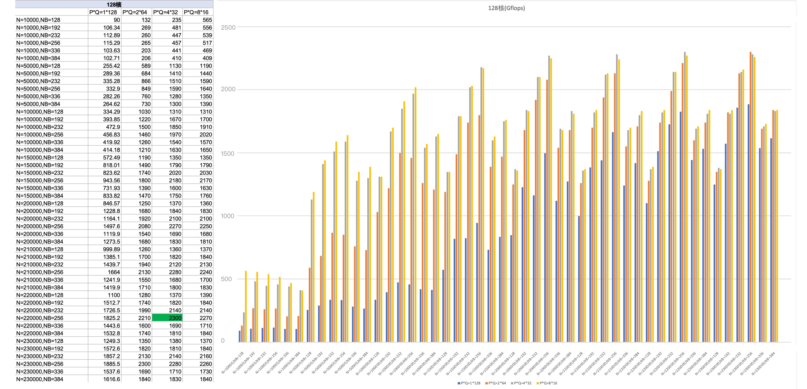
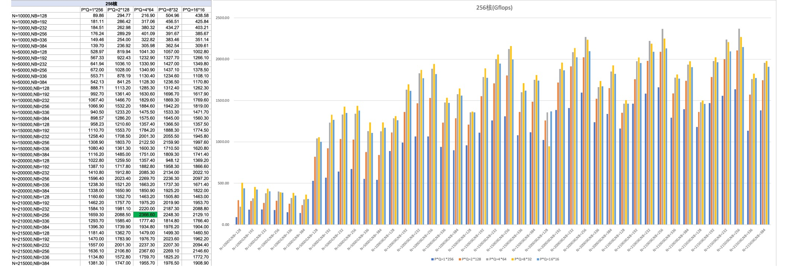
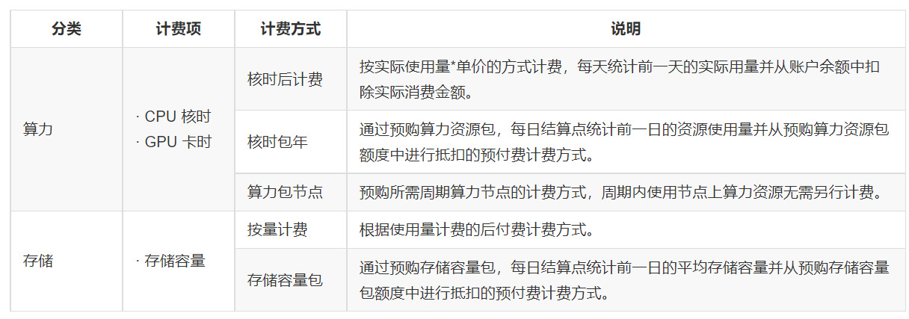

# HPC

# 平台简介

## 一. 什么是HPC

高性能计算（High-performance computing，HPC）是一个计算机集群系统，它通过各种互联技术将多个计算机系统连接在一起，利用所有被连接系统的综合计算能力来处理大型计算问题，所以又通常被称为高性能计算集群。

随着信息化社会的飞速发展，各行各业对信息处理能力的要求越来越高，不仅石油勘探、气象预报、航天国防、科学研究等需求高性能计算机，金融、政府信息化、教育、企业等更广泛的领域对高性能计算的需求也迅猛增长。

而各种业务场景下，因数据处理量、计算任务关联关系等不同，对计算能力、存储效率、网络带宽及时延要求有各自侧重。

## 二. 原力超算平台

有孚原力超算平台，是一种快捷、弹性、安全、互通的公共高性能计算云服务，面向各行业企事业单位、组织、个人开放，支持算力弹性定制、大大降低计算的应用成本，安全稳定、且具有极大的使用灵活性，进一步帮助行业用户降低HPC成本门槛，让使用者更专注于应用运算。

有孚原力超算平台集成了用户登录、文件传输、程序编译、算力分配、作业执行、资源监控和计量计费等，将高性能计算物理集群封装为实现可进行统一管理和调度的算力应用平台。

# 应用场景

高性能集群计算凭借高带宽、低延迟网络，快速存储，大容量内存和超高计算能力，可以广泛应用于科学研究、工程分析、智能研究等方面。

## 一、教育科研

高性能计算当前已成为科研工作者必备的一项研究工具，利用高性能集群计算提供的强大计算能力，结合资源集成的各类开源应用软件，可以观察到比实验现象更细致的层次，对目前比较昂贵或无法实现的实验进行理论模拟，从而帮助解释实验结果，理解自然规律，进一步指导实验过程。高性能计算可以有效满足气象预测、计算物理、计算化学、材料研究、生信分析、医药研制、金融分析、地质勘探、多尺度动力学模拟等需求，提升科研教育能力，打破算力性能局限。

## 二、制造与工程

制造业能够在进行复杂工程项目时利用高性能计算辅助分析复杂工程架构和力学结构，对大型装配集合甚至整个系统快速获得仿真结果。利用HPC高性能计算能力及高带宽、低延迟节点网络互联性能，快速的文件读写能力，为中到大型数值计算问题带来显著的性能提升。HPC涉及到的仿真制造有智能汽车，航天航空，机械建筑等方面。

## 三、AI深度学习

人工智能深度学习技术被应用到许多实际问题中，如自动驾驶、照片定位、实时语音翻译、自动回复电子邮件、脸部识别等都是深度学习的研究范畴。深度学习多基于数据海量处理，需要很强的计算处理能力，人工智能的研究与开发需依托强大的HPC平台，利用HPC提供的强大计算能力，构建深度学习训练的平台，结合高性能集群计算产品提供的数据存储功能和良好的应用兼容性，构建深度学习训练系统，开展深度学习训练任务。

#  基本概念

| **概念**            | **说明**                                                     |
| ------------------- | ------------------------------------------------------------ |
| **地域**            | 支持HPC服务的逻辑位置。不同地域间存在资源配置、服务价格等差异，地域间服务相互隔离。 |
| **作业**            | 提交到HPC集群进行高性能计算的基本工作单元。                  |
| **计算用户**        | 用于在HPC服务下提交作业时的系统身份。平台限定每个计算用户需关联一个云账号进行使用。 |
| **队列**            | 算力资源的分区，一个作业需在指定的队列中运行，一般不同队列性能、限制等资源配置不同，比如硬件配置、单作业核数、单作业最大运行时间等。 |
| **账户（account）** | 调度系统slurm的计费账户。平台每个客户在服务开通后将拥有一个account，所有计算用户算力资源使用将归属于该account。 |
| **节点**            | HPC服务集群由节点组成，包括控制节点、计算节点和登录节点。计算节点的硬件配置决定了服务的计算性能。 |
| **文件系统**        | 为用户提供的文件存储空间的管理系统类型。                     |
| **客户配额**        | 配额用于规划控制资源的可用量。当配额使用已满时，将无法再创建新的资源。客户配额下，所有使用用户共享配额，即所有用户的总配额一定，资源可用数量由总的资源使用量而定。如客户配额不足，可以根据业务需要，由主账号申请提升配额。 |

#  算力机型与队列

## 一、 集群配置

HPC原力超算集群，基于高性能计算服务器，集成Luster的文件存储，以及高速通信的RDMA网络，为节点和节点间，节点和存储间提供高效的传输网络。

## 二、 算力机型与队列

​		服务提供不同参数的算力机型与队列，以满足不同用户场景所需算力的性能与配置要求。部分公共机型与队列信息如下：

- **原力超算一区**

​		高性能集群，共195个计算节点，共享Lustre文件系统和共享Slurm作业调度系统，完美融入现有超算系统。

​		AMD超算单节点配备128核（2.6 GHz）、512 GB内存，节点间采用25Gbps高速互联，挂载Lustre并行文件系统。

​	集群系统所有登录节点和计算节点的操作系统，提供标准的64位Linux操作环境。

- **算力机型**

| 机型          | CPU/节点                      | 内存/节点       | 本地磁盘/节点 | 网络          | 理论峰值/Gflops                                              |
| ------------- | ----------------------------- | --------------- | ------------- | ------------- | ------------------------------------------------------------ |
| 通用型-ccg4m  | 2*AMD EPYC 7H12@2.6GHz，128核 | DDR4，512GB内存 | ——            | RDMA 25Gbit/s | **2300**  |
| 通用型-ccg2mt | AMD EPYC 7H12@2.6GHz，256核   | DDR4，512GB内存 | ——            | RDMA 25Gbit/s | **2366**  |

- **队列参数**

详细队列介绍，请参阅[队列申请与使用>>](https://cloud.yovole.com/hpc-doc/partitionguid.html)。

| 参数队列           | Force1       | Force2        |
| ------------------ | ------------ | ------------- |
| 机型               | 通用型-ccg4m | 通用型-ccg2mt |
| 队列性质           | 公共         | 公共          |
| 物理核             | 128          | 128           |
| 单节点CPUs         | 128          | 256           |
| 节点预留内存（MB） | 10240        | 10240         |
| 可用内存（MB）     | 505465       | 505465        |
| 总节点数           | 85           | 85            |
| 总CPUs             | 10880        | 21760         |
| 最大作业运行时间   | 72小时       | 72小时        |
| 默认内存/CPU       | 2048         | 1024          |
| 最大内存/CPU       | 3948         | 1974          |

如有其他配置需求，请联系您的客户经理。

# 资源计量

HPC原力超算服务会对存储容量、算力资源用量进行计量，并形成服务计费的依据。

| 大类 | 计量指标 | 计量单位 |                           计量方法                           | 说明                  |
| :--: | -------- | -------- | :----------------------------------------------------------: | --------------------- |
| 存储 | 存储容量 | Kb       | 每2分钟采集账户权限目录下存储占用量；平均单日所有采集用量，获得日均存储容量。 | 占用存储空间的容量。  |
| 算力 | 占用CPU  | 核时     |            作业运行时间占用的CPU总核数 * 运行时间            | 占用的CPU算力资源量。 |
|      | 占用GPU  | 卡时     |           作业运行时间内占用的GPU总卡数 * 运行时间           | 占用的GPU算力资源量。 |

​		原力超算服务会对用户使用过程中的存储、算力、网络等指标进行使用计量，并依据计量数据对存储容量、CPU核时、GPU卡时进行计费。

​		系统对存储资源和算力资源提供多种计费方式，用户可灵活进行选择。

