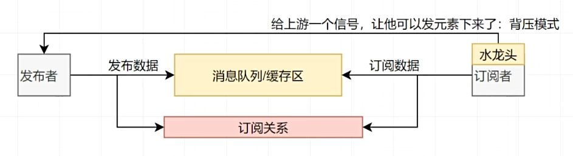
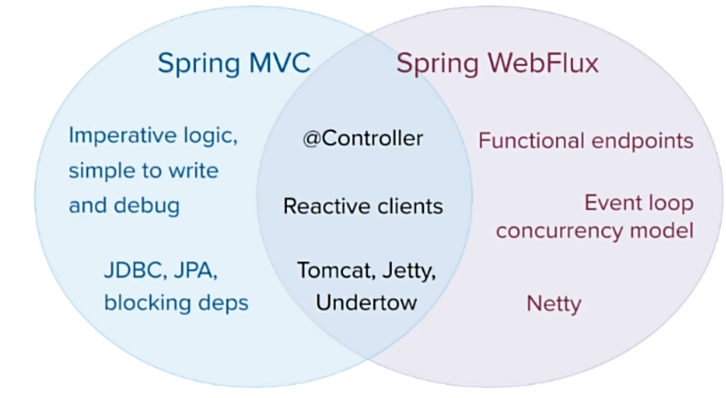

# Spring Webflux

响应式编程


# 一、Reactor

​	Reactor 是一个用于JVM的完全非阻塞的响应式编程框架，具备高效的需求管理（即对 “背压（backpressure）”的控制）能力。它与 Java 8 函数式 API 直接集成，比如 CompletableFuture， Stream， 以及 Duration。它提供了异步序列 API Flux（用于[N]个元素）和 Mono（用于 [0|1]个元素），并完全遵循和实现了“响应式扩展规范”（Reactive Extensions Specification）

​	Reactor 的 reactor-ipc 组件还支持非阻塞的进程间通信（inter-process communication, IPC）。 Reactor IPC 为 HTTP（包括 Websockets）、TCP 和 UDP 提供了支持背压的网络引擎，从而适合 应用于微服务架构。并且完整支持响应式编解码（reactive encoding and decoding）

```xml
<dependencyManagement> 
    <dependencies>
        <dependency>
            <groupId>io.projectreactor</groupId>
            <artifactId>reactor-bom</artifactId>
            <version>2023.0.0</version>
            <type>pom</type>
            <scope>import</scope>
        </dependency>
    </dependencies>
</dependencyManagement>

<dependencies>
    <dependency>
        <groupId>io.projectreactor</groupId>
        <artifactId>reactor-core</artifactId> 
    </dependency>
    <dependency>
        <groupId>io.projectreactor</groupId>
        <artifactId>reactor-test</artifactId> 
        <scope>test</scope>
    </dependency>
</dependencies>
```


## 1.1 响应式编程

​	响应式编程是一种关注于**数据流（data streams）**和**变化传递（propagation of change）**的**异步编程**方式。 这意味着它可以用既有的编程语言表达静态（如数组）或动态（如事件源）的数据流。

历史：

- 在响应式编程方面，微软跨出了第一步，它在 .NET 生态中创建了响应式扩展库（Reactive Extensions library, Rx）。接着 RxJava 在JVM上实现了响应式编程。后来，在 JVM 平台出现了一套标准的响应式 编程规范，它定义了一系列标准接口和交互规范。并整合到 Java 9 中（使用 Flow 类）。

- 响应式编程通常作为面向对象编程中的“观察者模式”（Observer design pattern）的一种扩展。 响应式流（reactive streams）与“迭代子模式”（Iterator design pattern）也有相通之处， 因为其中也有 Iterable-Iterator 这样的对应关系。主要的区别在于，Iterator 是基于 “拉取”（pull）方式的，而响应式流是基于“推送”（push）方式的。

- 使用 iterator 是一种“命令式”（imperative）编程范式，即使访问元素的方法是 Iterable 的唯一职责。关键在于，什么时候执行 next() 获取元素取决于开发者。在响应式流中，相对应的 角色是 Publisher-Subscriber，但是 *当有新的值到来的时候* ，却反过来由发布者（Publisher） 通知订阅者（Subscriber），这种“推送”模式是响应式的关键。此外，对推送来的数据的操作 是通过一种声明式（declaratively）而不是命令式（imperatively）的方式表达的：开发者通过 描述“控制流程”来定义对数据流的处理逻辑。

- 除了数据推送，对错误处理（error handling）和完成（completion）信号的定义也很完善。 一个 Publisher 可以推送新的值到它的 Subscriber（调用 onNext 方法）， 同样也可以推送错误（调用 onError 方法）和完成（调用 onComplete 方法）信号。 错误和完成信号都可以终止响应式流。可以用下边的表达式描述：
  ```R
  onNext x 0..N [onError | onComplete]
  ```

## 1.1 阻塞是对资源的浪费

现代应用需要**应对大量的并发用户**，而且即使现代硬件的处理能力飞速发展，**软件性能仍然是关键因素**。

广义来说有两种思路来提升程序性能：

1. **并行化（parallelize）** ：使用更多的线程和硬件资源。[异步]
2. 基于现有的资源来 **提高执行效率** 。

通常，Java开发者使用阻塞式（blocking）编写代码。这没有问题，在出现性能瓶颈后， 可以增加处理线程，线程中同样是阻塞的代码。但是这种使用资源的方式会迅速面临 资源竞争和并发问题。

更糟糕的是，阻塞会浪费资源。具体来说，比如当一个程序面临延迟（通常是I/O方面， 比如数据库读写请求或网络调用），所在线程需要进入 idle 状态等待数据，从而浪费资源。

所以，并行化方式并非银弹。这是挖掘硬件潜力的方式，但是却带来了复杂性，而且容易造成浪费。


第二种思路——提高执行效率——可以解决资源浪费问题。通过编写 *异步非阻塞* 的代码， （任务发起异步调用后）执行过程会切换到另一个 **使用同样底层资源** 的活跃任务，然后等 异步调用返回结果再去处理。

但是在 JVM 上如何编写异步代码呢？Java 提供了两种异步编程方式：

- **回调（Callbacks）** ：异步方法没有返回值，而是采用一个 callback 作为参数（lambda 或匿名类），当结果出来后回调这个 callback。常见的例子比如 Swings 的 EventListener。
- **Futures** ：异步方法 **立即** 返回一个 Future<T>，该异步方法要返回结果的是 T 类型，通过 Future封装。这个结果并不是 *立刻* 可以拿到，而是等实际处理结束才可用。比如， ExecutorService 执行 Callable<T> 任务时会返回 Future 对象。

这些技术够用吗？并非对于每个用例都是如此，两种方式都有局限性。

回调很难组合起来，因为很快就会导致代码难以理解和维护（即所谓的“回调地狱（callback hell）”）。

考虑这样一种情景：

- 在用户界面上显示用户的5个收藏，或者如果没有任何收藏提供5个建议
- 这需要3个 服务（一个提供收藏的ID列表，第二个服务获取收藏内容，第三个提供建议内容）

回调地狱（Callback Hell）的例子：

```java
userService.getFavorites(userId, new Callback<List<String>>() { 
  public void onSuccess(List<String> list) { 
    if (list.isEmpty()) { 
      suggestionService.getSuggestions(new Callback<List<Favorite>>() {
        public void onSuccess(List<Favorite> list) { 
          UiUtils.submitOnUiThread(() -> { 
            list.stream()
                .limit(5)
                .forEach(uiList::show); 
            });
        }

        public void onError(Throwable error) { 
          UiUtils.errorPopup(error);
        }
      });
    } else {
      list.stream() 
          .limit(5)
          .forEach(favId -> favoriteService.getDetails(favId, 
            new Callback<Favorite>() {
              public void onSuccess(Favorite details) {
                UiUtils.submitOnUiThread(() -> uiList.show(details));
              }

              public void onError(Throwable error) {
                UiUtils.errorPopup(error);
              }
            }
          ));
    }
  }

  public void onError(Throwable error) {
    UiUtils.errorPopup(error);
  }
});
```

Reactor 改造后为：

```java
userService.getFavorites(userId) 
           .flatMap(favoriteService::getDetails) 
           .switchIfEmpty(suggestionService.getSuggestions()) 
           .take(5) 
           .publishOn(UiUtils.uiThreadScheduler()) 
           .subscribe(uiList::show, UiUtils::errorPopup); 
```

确保“收藏的ID”的数据在800ms内获得（如果超时，从缓存中获取）
在基于回调的代码中， 会比较复杂。但 Reactor 中就很简单，在处理链中增加一个 timeout 的操作符即可

```java
userService.getFavorites(userId)
           .timeout(Duration.ofMillis(800)) 
           .onErrorResume(cacheService.cachedFavoritesFor(userId)) 
           .flatMap(favoriteService::getDetails) 
           .switchIfEmpty(suggestionService.getSuggestions())
           .take(5)
           .publishOn(UiUtils.uiThreadScheduler())
           .subscribe(uiList::show, UiUtils::errorPopup);
```

> 额外扩展：
>
> Futures 比回调要好一点，但即使在 Java 8 引入了 CompletableFuture，它对于多个处理的组合仍不够好用。 编排多个 Futures 是可行的，但却不易。此外，Future 还有一个问题：当对 Future 对象最终调用 get() 方法时，仍然会导致阻塞，并且缺乏对多个值以及更进一步对错误的处理。
>
> 考虑另外一个例子，首先得到 ID 的列表，然后通过它进一步获取到“对应的 name 和 statistics” 为元素的列表，整个过程用异步方式来实现。
>
> CompletableFuture 处理组合的例子
>
> ```java
> CompletableFuture<List<String>> ids = ifhIds(); 
> 
> CompletableFuture<List<String>> result = ids.thenComposeAsync(l -> { 
>     Stream<CompletableFuture<String>> zip =
>                     l.stream().map(i -> { 
>                        CompletableFuture<String> nameTask = ifhName(i); 
>                        CompletableFuture<Integer> statTask = ifhStat(i); 
> 
>                        return nameTask.thenCombineAsync(statTask, (name, stat) -> "Name " + name + " has stats " + stat); 
>                                      });
>     List<CompletableFuture<String>> combinationList = zip.collect(Collectors.toList()); 
>     CompletableFuture<String>[] combinationArray = combinationList.toArray(new CompletableFuture[combinationList.size()]);
> 
>     CompletableFuture<Void> allDone = CompletableFuture.allOf(combinationArray); 
>     return allDone.thenApply(v -> combinationList.stream()
>                                                                                                      .map(CompletableFuture::join) 
>                                                                                                      .collect(Collectors.toList()));
> });
> 
> List<String> results = result.join(); 
> assertThat(results).contains(
>                                 "Name NameJoe has stats 103",
>                                 "Name NameBart has stats 104",
>                                 "Name NameHenry has stats 105",
>                                 "Name NameNicole has stats 106",
>                                 "Name NameABSLAJNFOAJNFOANFANSF has stats 121");
> ```

类似 Reactor 这样的响应式库的目标就是要弥补上述“经典”的 JVM 异步方式所带来的不足， 此外还会关注一下几个方面：

- **可编排性（Composability）** 以及 **可读性（Readability）**
- 使用丰富的 **操作符** 来处理形如 **流** 的数据
- 在 **订阅（subscribe）** 之前什么都不会发生
- **背压（backpressure）** 具体来说即 *消费者能够反向告知生产者生产内容的速度的能力*
- **高层次** （同时也是有高价值的）的抽象，从而达到 *并发无关* 的效果

**可编排性与可读性**

​	可编排性，指的是编排多个异步任务的能力。比如将前一个任务的结果传递给后一个任务作为输入， 或者将多个任务以分解再汇总（fork-join）的形式执行，或者将异步的任务作为离散的组件在系统中 进行重用。

​	这种编排任务的能力与代码的可读性和可维护性是紧密相关的。随着异步处理任务数量和复杂度 的提高，编写和阅读代码都变得越来越困难。就像刚才看到的，回调模式是简单的，但是缺点 是在复杂的处理逻辑中，回调中会层层嵌入回调，导致 **回调地狱（Callback Hell）** 。能猜到 （或有过这种痛苦经历），这样的代码是难以阅读和分析的。

​	Reactor 提供了丰富的编排操作，从而代码直观反映了处理流程，并且所有的操作保持在同一层次 （尽量避免了嵌套）。

**装配流水线**

​	可以想象数据在响应式应用中的处理，就像流过一条装配流水线。Reactor 既是传送带， 又是一个个的装配工或机器人。原材料从源头（最初的 Publisher）流出，最终被加工为成品， 等待被推送到消费者（或者说 Subscriber）。

​	原材料会经过不同的中间处理过程，或者作为半成品与其他半成品进行组装。如果某处有齿轮卡住， 或者某件产品的包装过程花费了太久时间，相应的工位就可以向上游发出信号来限制或停止发出原材料。

**操作符（Operators）**

​	在 Reactor 中，操作符（operator）就像装配线中的工位（操作员或装配机器人）。**每一个操作符 对 Publisher 进行相应的处理，然后将 **Publisher 包装为一个新的 Publisher。就像一个链条， 数据源自第一个 Publisher，然后顺链条而下，在每个环节进行相应的处理。最终，一个订阅者 (Subscriber）终结这个过程。请记住，在订阅者（Subscriber）订阅（subscribe）到一个 发布者（Publisher）之前，什么都不会发生。

​	理解了操作符会创建新的 Publisher 实例这一点，能够帮助避免一个常见的问题， 这种问题会让觉得处理链上的某个操作符没有起作用。虽然响应式流规范（Reactive Streams specification）没有规定任何操作符， 类似 Reactor 这样的响应式库所带来的最大附加价值之一就是提供丰富的操作符。包括基础的转换操作， 到过滤操作，甚至复杂的编排和错误处理操作。

**subscribe() 之前什么都不会发生**

​	在 Reactor 中，当创建了一条 Publisher 处理链，数据还不会开始生成。事实上，是创建了 一种抽象的对于异步处理流程的描述（从而方便重用和组装）。当真正“订阅（subscrib）”的时候，需要将 Publisher 关联到一个 Subscriber 上，然后 才会触发整个链的流动。这时候，Subscriber 会向上游发送一个 request 信号，一直到达源头 的 Publisher。

**背压**

​	向上游传递信号这一点也被用于实现 **背压** ，就像在装配线上，某个工位的处理速度如果慢于流水线 速度，会对上游发送反馈信号一样。在响应式流规范中实际定义的机制同刚才的类比非常接近：订阅者可以无限接受数据并让它的源头 “满负荷”推送所有的数据，也可以通过使用 request 机制来告知源头它一次最多能够处理 n 个元素。中间环节的操作也可以影响 request。想象一个能够将每10个元素分批打包的缓存（buffer）操作。 如果订阅者请求一个元素，那么对于源头来说可以生成10个元素。此外预取策略也可以使用了， 比如在订阅前预先生成元素。

​	这样能够将“推送”模式转换为“推送+拉取”混合的模式，如果下游准备好了，可以从上游拉取 n 个元素；但是如果上游元素还没有准备好，下游还是要等待上游的推送。

**热（Hot） vs 冷（Cold）**

​	在 Rx 家族的响应式库中，响应式流分为“热”和“冷”两种类型，区别主要在于响应式流如何 对订阅者进行响应：

- 一个“冷”的序列，指对于每一个 Subscriber，都会收到从头开始所有的数据。如果源头 生成了一个 HTTP 请求，对于每一个订阅都会创建一个新的 HTTP 请求。
- 一个“热”的序列，指对于一个 Subscriber，只能获取从它开始 订阅 *之后* 发出的数据。不过注意，有些“热”的响应式流可以缓存部分或全部历史数据。 通常意义上来说，一个“热”的响应式流，甚至在即使没有订阅者接收数据的情况下，也可以 发出数据（这一点同 “Subscribe() 之前什么都不会发生”的规则有冲突）。


# 二、核心特性


Mono: 0 | 1 数据流

Flux: N 数据流

响应式流：元素（内容） + 信号（完成/异常）


## 2.1 subscribe()

自定义流的信号感知回调

```java
flux.subscribe(
        v-> System.out.println("v = " + v), //流元素消费
        throwable -> System.out.println("throwable = " + throwable), //感知异常结束
        ()-> System.out.println("流结束了...") //感知正常结束
);
```

自定义消费者

```java
flux.subscribe(new BaseSubscriber<String>() {

            // 生命周期钩子1： 订阅关系绑定的时候触发
            @Override
            protected void hookOnSubscribe(Subscription subscription) {
                // 流被订阅的时候触发
                System.out.println("绑定了..."+subscription);

                //找发布者要数据
                request(1); //要1个数据
//                requestUnbounded(); //要无限数据
            }

            @Override
            protected void hookOnNext(String value) {
                System.out.println("数据到达，正在处理："+value);
                request(1); //要1个数据
            }


            //  hookOnComplete、hookOnError 二选一执行
            @Override
            protected void hookOnComplete() {
                System.out.println("流正常结束...");
            }

            @Override
            protected void hookOnError(Throwable throwable) {
                System.out.println("流异常..."+throwable);
            }

            @Override
            protected void hookOnCancel() {
                System.out.println("流被取消...");
            }

            @Override
            protected void hookFinally(SignalType type) {
                System.out.println("最终回调...一定会被执行");
            }
});
```


## 2.2 流

消费者调用 cancle() 取消流的订阅

```java
Flux<String> flux = Flux.range(1, 10)
        .map(i -> {
            System.out.println("map..."+i);
            if(i==9) {
                i = 10/(9-i); //数学运算异常;  doOnXxx
            }
            return "哈哈：" + i;
        }); //流错误的时候，把错误吃掉，转为正常信号


//        flux.subscribe(); //流被订阅; 默认订阅；
//        flux.subscribe(v-> System.out.println("v = " + v));//指定订阅规则： 正常消费者：只消费正常元素


//        flux.subscribe(
//                v-> System.out.println("v = " + v), //流元素消费
//                throwable -> System.out.println("throwable = " + throwable), //感知异常结束
//                ()-> System.out.println("流结束了...") //感知正常结束
//        );


// 流的生命周期钩子可以传播给订阅者。
//  a() {
//      data = b();
//  }
flux.subscribe(new BaseSubscriber<String>() {

    // 生命周期钩子1： 订阅关系绑定的时候触发
    @Override
    protected void hookOnSubscribe(Subscription subscription) {
        // 流被订阅的时候触发
        System.out.println("绑定了..."+subscription);

        //找发布者要数据
        request(1); //要1个数据
//                requestUnbounded(); //要无限数据
    }

    @Override
    protected void hookOnNext(String value) {
        System.out.println("数据到达，正在处理："+value);
        if(value.equals("哈哈：5")){
            cancel(); //取消流
        }
        request(1); //要1个数据
    }


    //  hookOnComplete、hookOnError 二选一执行
    @Override
    protected void hookOnComplete() {
        System.out.println("流正常结束...");
    }

    @Override
    protected void hookOnError(Throwable throwable) {
        System.out.println("流异常..."+throwable);
    }

    @Override
    protected void hookOnCancel() {
        System.out.println("流被取消...");
    }

    @Override
    protected void hookFinally(SignalType type) {
        System.out.println("最终回调...一定会被执行");
    }
});
```


## 2.3 背压（Backpressure ）和请求重塑（Reshape Requests）




```java
Flux<List<Integer>> flux = Flux.range(1, 10)  //原始流10个
        .buffer(3)
        .log();//缓冲区：缓冲3个元素: 消费一次最多可以拿到三个元素； 凑满数批量发给消费者
//
//        //一次发一个，一个一个发；
// 10元素，buffer(3)；消费者请求4次，数据消费完成
```

```java
Flux.range(1, 1000)
    .log()
    //限流触发，看上游是怎么限流获取数据的
    .limitRate(100) //一次预取30个元素； 第一次 request(100)，以后request(75)
    .subscribe();
```


## 2.4 Sink

Sink.next  

Sink.complete

```java
// 单播   只能一个消费者
Sinks.many().unicast();
// 多播   多个消费者
Sinks.many().multicast();
// 重放   多个消费者，且消费者可以重复消费数据
Sinks.many().replay().all();

//  限流   只能有一个消费者，且消费者可以重复消费数据
Sinks.Many<Object> objectMany = Sinks.many().unicast().onBackpressureBuffer(new LinkedBlockingQueue<>(9));
new Thread(() -> {
    for (int i = 0; i < 10; i++) {
        objectMany.tryEmitNext(i);
        try {
            Thread.sleep(1000);
        } catch (InterruptedException e) {
            throw new RuntimeException(e);
        }
    }
}).start();
objectMany.asFlux().subscribe(System.out::println);

// 默认订i阅者,从订阅的那一刻开始接元素
Sinks.Many<Object> objectManyMulticast = Sinks.many().multicast().onBackpressureBuffer();

// 发布者 数据 重放
Sinks.Many<Object> limit = Sinks.many().replay().limit(3);

System.in.read();
```


## 2.5 handle()

```java
Flux.range(1,10)
        .handle((value,sink)->{
            System.out.println("拿到的值："+value);
            sink.next("张三："+value); // 可以向下发送数据的通道
        })
        .log() // 日志
        .subscribe();
```


## 2.6 **自定义线程调度**

响应式：响应式编程： 全异步、消息、事件回调

默认还是用当前线程，生成整个流、发布流、流操作

```java
public void thread1(){
    Scheduler s = Schedulers.newParallel("parallel-scheduler", 4);

    final Flux<String> flux = Flux
            .range(1, 2)
            .map(i -> 10 + i)
            .log()
            .publishOn(s)
            .map(i -> "value " + i)
            ;

    //只要不指定线程池，默认发布者用的线程就是订阅者的线程；
    new Thread(() -> flux.subscribe(System.out::println)).start();
}
```


## 2.7 错误处理

命令式编程：常见的错误处理方式

1. Catch and return a static default value. 捕获异常返回一个静态默认值
   ```java
   try {
     return doSomethingDangerous(10);
   }
   catch (Throwable error) {
     return "RECOVERED";
   }
   ```

   onErrorReturn: 实现上面效果，错误的时候返回一个值

   - 1、吃掉异常，消费者无异常感知
   - 2、返回一个兜底默认值
   - 3、流正常完成；

   ```java
   Flux.just(1, 2, 0, 4)
           .map(i -> "100 / " + i + " = " + (100 / i))
           .onErrorReturn(NullPointerException.class,"哈哈-6666")
           .subscribe(v-> System.out.println("v = " + v),
                   err -> System.out.println("err = " + err),
                   ()-> System.out.println("流结束")); // error handling example
   ```

2. Catch and execute an alternative path with a fallback method.   吃掉异常，执行一个兜底方法；
   ```java
   try {
     return doSomethingDangerous(10);
   }
   catch (Throwable error) {
     return doOtherthing(10);
   }
   ```

   onErrorResume

   - 1、吃掉异常，消费者无异常感知
   - 2、调用一个兜底方法
   - 3、流正常完成

   ```java
   Flux.just(1, 2, 0, 4)
           .map(i -> "100 / " + i + " = " + (100 / i)).onErrorResume(err -> Mono.just("哈哈-777"))
           .subscribe(v -> System.out.println("v = " + v),
                   err -> System.out.println("err = " + err),
                   () -> System.out.println("流结束"));
   ```

3. Catch and dynamically compute a fallback value. 捕获并动态计算一个返回值
   ```java
   try {
     Value v = erroringMethod();
     return MyWrapper.fromValue(v);
   }
   catch (Throwable error) {
     return MyWrapper.fromError(error);
   }
   
   .onErrorResume(err -> Flux.error(new BusinessException(err.getMessage()+"：炸了")))
   ```

   - 1、吃掉异常，消费者有感知
   - 2、调用一个自定义方法
   - 3、流异常完成

4. Catch, wrap to a BusinessException, and re-throw.   捕获并包装成一个业务异常，并重新抛出
   ```java
   try {
     return callExternalService(k);
   }
   catch (Throwable error) {
     throw new BusinessException("oops, SLA exceeded", error);
   }
   ```

   包装重新抛出异常:  推荐用  .onErrorMap

   - 1、吃掉异常，消费者有感知 
   - 2、抛新异常
   - 3、流异常完成

   ```java
   .onErrorResume(err -> Flux.error(new BusinessException(err.getMessage()+"：炸了")))
   
   Flux.just(1, 2, 0, 4)
           .map(i -> "100 / " + i + " = " + (100 / i))
           .onErrorMap(err-> new BusinessException(err.getMessage()+": 又炸了..."))
           .subscribe(v -> System.out.println("v = " + v),
                   err -> System.out.println("err = " + err),
                   () -> System.out.println("流结束"));
   ```

5. Catch, log an error-specific message, and re-throw.   捕获异常，记录特殊的错误日志，重新抛出
   ```java
   try {
     return callExternalService(k);
   }
   catch (RuntimeException error) {
     //make a record of the error
     log("uh oh, falling back, service failed for key " + k);
     throw error;
   }
   ```

   ```java
   Flux.just(1, 2, 0, 4)
           .map(i -> "100 / " + i + " = " + (100 / i))
           .doOnError(err -> {
               System.out.println("err已被记录 = " + err);
           }).subscribe(v -> System.out.println("v = " + v),
                   err -> System.out.println("err = " + err),
                   () -> System.out.println("流结束"));
   ```

   - 异常被捕获、做自己的事情
   - 不影响异常继续顺着流水线传播
   - 不吃掉异常，只在异常发生的时候做一件事，消费者有感知 

6. Use the finally block to clean up resources or a Java 7 “try-with-resource” construct.         finally 都会执行的操作
   ```java
   Flux.just(1, 2, 3, 4)
           .map(i -> "100 / " + i + " = " + (100 / i))
           .doOnError(err -> {
               System.out.println("err已被记录 = " + err);
           })
           .doFinally(signalType -> {
               System.out.println("流信号："+signalType);
           })
   ```

7. 忽略当前异常，仅通知记录，继续推进
   ```java
   Flux.just(1,2,3,0,5)
           .map(i->10/i)
           .onErrorContinue((err,val)->{
               System.out.println("err = " + err);
               System.out.println("val = " + val);
               System.out.println("发现"+val+"有问题了，继续执行其他的，我会记录这个问题");
           }) //发生
           .subscribe(v-> System.out.println("v = " + v),
                   err-> System.out.println("err = " + err));
   ```

8. onErrorComplete() 将错误信号转为 正常结束信号，但流仍被打断
   ```java
   Flux.just(1, 0, 3)
           .map(i -> 100 / i)
           .onErrorReturn(NullPointerException.class, 0)
           .onErrorResume(err -> Mono.just(0))
           .onErrorComplete()
           .doFinally(signalType -> {
               System.out.println("流信号：" + signalType);
           })
           .subscribe(v -> System.out.println("v : " + v),
                   err -> System.out.println("err : " + err),
                   () -> System.out.println("complete ~"));
   ```

9. onErrorStop()         错误停止流，从源头 打断流，所有订阅者全部停止订阅
   ```java
   Flux<Integer> map = Flux.just(1, 0, 3)
                   .map(i -> 100 / i);
   
   map.onErrorReturn(NullPointerException.class, 0)
           .onErrorStop()
           .doOnError(err -> {
               System.out.println("\ndoOnError:\nerr 已被记录 = " + err);
           })
           .onErrorContinue((err, val) -> {
               System.out.println("\nonErrorContinue:\nerr = " + err);
               System.out.println("val = " + val);
               System.out.println("发现 " + val + " 有问题了，继续执行其他的，我会记录这个问题 \n");
           })
           .doFinally(signalType -> {
               System.out.println("流信号：" + signalType);
           })
           .subscribe(v -> System.out.println("v : " + v),
                   err -> System.out.println("err : " + err),
                   () -> System.out.println("complete ~"));
   
   map.onErrorReturn(NullPointerException.class, 0)
           .onErrorResume(err -> Mono.just(0))
           .onErrorMap(err -> new NullPointerException(err.getMessage() + ": 又炸了..."))
           .onErrorComplete()
           .subscribe(v -> System.out.println("v : " + v),
                   err -> System.out.println("err : " + err),
                   () -> System.out.println("complete ~"));
   
   System.in.read();
   ```

   


## 2.8 常用操作

​	filter、flatMap、concatMap、flatMapMany、transform、defaultIfEmpty、switchIfEmpty、concat、concatWith、merge、mergeWith、mergeSequential、zip、zipWith...

```java
@DisplayName("测试 WebFlux 接口🌰")
@Test
void testWebFlux() {
    AtomicInteger atomicInteger = new AtomicInteger();
    Flux<Integer> flux = Flux.just(1, 2, 3, 4, 5, 6)
            .transformDeferred(v -> atomicInteger.incrementAndGet() == 1 ? v : v.delayElements(Duration.ofMillis(100)));
    flux.subscribe(v -> System.out.println("接收到的数据：" + v));

    Flux.just("gardenia_zy", "asd_asd")
            .flatMap(v -> {
                String[] s = v.split("_");
                return Flux.fromArray(s);
            })
            .zipWith(Flux.just(1, 2, 3, 4))
            .log()
            .map(tuple -> tuple.getT1() + " " + tuple.getT2())
            .log()
            .subscribe();

    Flux.just(1, 2, 3, 4, 5, 6)
            .concatMap(s -> Flux.just(s * 10, 1) )
            .log()
            .subscribe();
}
```

## 2.9 Context

> https://projectreactor.io/docs/core/release/reference/#context

行动算子触发

```java
Flux.just(1, 2, 3)
        .transformDeferredContextual((flux, context) -> {
            System.out.println("context = " + context.get("prefix"));
            return flux.map(i -> i + "==>" + context.get("prefix"));
        })
//                , context -> context.put("key", "value"))
        .contextWrite(Context.of("prefix", "Gardenia_"))
        .subscribe(v -> System.out.println("接收到的数据：" + v));
```


# 三、Spring Webflux


WebFlux：底层完全基于netty+reactor+springweb 完成一个全异步非阻塞的web**响应式框架**

**底层：异步 + 消息队列(内存) + 事件回调机制 = 整套系统**

**优点：能使用少量资源处理大量请求；**

**组件对比**

| **API**功能  | **Servlet-阻塞式Web**                   | **WebFlux-响应式Web**                                        |
| ------------ | --------------------------------------- | ------------------------------------------------------------ |
| 前端控制器   | DispatcherServlet                       | DispatcherHandler                                            |
| 处理器       | Controller                              | WebHandler/Controller                                        |
| 请求、响应   | **ServletRequest**、**ServletResponse** | **ServerWebExchange：ServerHttpRequest、ServerHttpResponse** |
| 过滤器       | Filter（HttpFilter）                    | WebFilter                                                    |
| 异常处理器   | HandlerExceptionResolver                | DispatchExceptionHandler                                     |
| Web配置      | @EnableWebMvc                           | @EnableWebFlux                                               |
| 自定义配置   | WebMvcConfigurer                        | WebFluxConfigurer                                            |
| 返回结果     | 任意                                    | **Mono、Flux**、任意                                         |
| 发送REST请求 | RestTemplate                            | WebClient                                                    |



> **WebFlux**

> 底层基于 Netty 实现的 Web 容器与请求/响应处理机制
>
> 参照：https://docs.spring.io/spring-framework/reference/6.0/web/webflux.html

```xml
    <parent>
        <groupId>org.springframework.boot</groupId>
        <artifactId>spring-boot-starter-parent</artifactId>
        <version>3.1.6</version>
    </parent>
<dependencies>
        <dependency>
            <groupId>org.springframework.boot</groupId>
            <artifactId>spring-boot-starter-webflux</artifactId>
        </dependency>
    </dependencies>
```

> **Context 响应式上下文数据传递； 由下游传播给上游；**
>
> **以前： 浏览器 --> Controller --> Service --> Dao： 阻塞式编程**
>
> **现在： Dao（数据源查询对象【数据发布者】） --> Service --> Controller --> 浏览器： 响应式**

## 3.1 Reactor Core


1、HttpHandler、HttpServer 

```java
public static void main(String[] args) throws IOException {
    //快速自己编写一个能处理请求的服务器

    //1、创建一个能处理Http请求的处理器。 参数：请求、响应； 返回值：Mono<Void>：代表处理完成的信号
    HttpHandler handler = (ServerHttpRequest request,
                               ServerHttpResponse response)->{
        URI uri = request.getURI();
        System.out.println(Thread.currentThread()+"请求进来："+uri);
        //编写请求处理的业务,给浏览器写一个内容 URL + "Hello~!"
//            response.getHeaders(); //获取响应头
//            response.getCookies(); //获取Cookie
//            response.getStatusCode(); //获取响应状态码；
//            response.bufferFactory(); //buffer工厂
//            response.writeWith() //把xxx写出去
//            response.setComplete(); //响应结束

        //数据的发布者：Mono<DataBuffer>、Flux<DataBuffer>

        //创建 响应数据的 DataBuffer
        DataBufferFactory factory = response.bufferFactory();

        //数据Buffer
        DataBuffer buffer = factory.wrap(new String(uri.toString() + " ==> Hello!").getBytes());


        // 需要一个 DataBuffer 的发布者
        return response.writeWith(Mono.just(buffer));
    };

    //2、启动一个服务器，监听8080端口，接受数据，拿到数据交给 HttpHandler 进行请求处理
    ReactorHttpHandlerAdapter adapter = new ReactorHttpHandlerAdapter(handler);

    //3、启动Netty服务器
    HttpServer.create()
            .host("localhost")
            .port(8080)
            .handle(adapter) //用指定的处理器处理请求
            .bindNow(); //现在就绑定

    System.out.println("服务器启动完成....监听8080，接受请求");
    System.in.read();
    System.out.println("服务器停止....");

}
```

2、DispatcherHandler

SpringMVC： DispatcherServlet

SpringWebFlux： DispatcherHandler

**请求处理流程**

- HandlerMapping：**请求映射处理器**； 保存每个请求由哪个方法进行处理
- HandlerAdapter：**处理器适配器**；反射执行目标方法
- HandlerResultHandler：**处理器结果**处理器

SpringMVC： DispatcherServlet 有一个 `doDispatch()` 方法，来处理所有请求

WebFlux： DispatcherHandler 有一个 `handle()` 方法，来处理所有请求

```java
public Mono<Void> handle(ServerWebExchange exchange) { 
		if (this.handlerMappings == null) {
			return createNotFoundError();
		}
		if (CorsUtils.isPreFlightRequest(exchange.getRequest())) {
			return handlePreFlight(exchange);
		}
		return Flux.fromIterable(this.handlerMappings) //拿到所有的 handlerMappings
				.concatMap(mapping -> mapping.getHandler(exchange)) //找每一个mapping看谁能处理请求
				.next() //直接触发获取元素； 拿到流的第一个元素； 找到第一个能处理这个请求的handlerAdapter
				.switchIfEmpty(createNotFoundError()) //如果没拿到这个元素，则响应404错误
				.onErrorResume(ex -> handleDispatchError(exchange, ex)) //异常处理，一旦前面发生异常，调用处理异常
				.flatMap(handler -> handleRequestWith(exchange, handler)); //调用方法处理请求，得到响应结果
	}
```

- 1、请求和响应都封装在 ServerWebExchange 对象中，由 `handle` 方法进行处理
- 2、如果没有任何的请求映射器； 直接返回一个： 创建一个未找到的错误； 404； 返回 Mono.error；终结流
- 3、跨域工具，是否跨域请求，跨域请求检查是否复杂跨域，需要预检请求
- 4、Flux 流式操作，先找到 `HandlerMapping` ，再获取 `handlerAdapter` ，再用 `Adapter` 处理请求，期间的错误由 `onErrorResume` 触发回调进行处理

源码中的核心两个：

- **handleRequestWith**： 编写了 `handlerAdapter` 怎么处理请求
- **handleResult**： String、User、ServerSendEvent、Mono、Flux ...

concatMap： 先挨个元素变，然后把变的结果按照之前元素的顺序拼接成一个完整流

```java
private <R> Mono<R> createNotFoundError() {
  Exception ex = new ResponseStatusException(HttpStatus.NOT_FOUND);
  return Mono.error(ex);
}

Mono.defer(() -> {
  Exception ex = new ResponseStatusException(HttpStatus.NOT_FOUND);
  return Mono.error(ex);
}); // 有订阅者，且流被激活后就动态调用这个方法； 延迟加载；
```


## 3.2 注解开发

### 1、目标方法传参

https://docs.spring.io/spring-framework/reference/6.0/web/webflux/controller/ann-methods/arguments.html

| Controller method argument                                   | Description                                                  |
| ------------------------------------------------------------ | ------------------------------------------------------------ |
| ServerWebExchange                                            | 封装了请求和响应对象的对象; 自定义获取数据、自定义响应       |
| ServerHttpRequest, ServerHttpResponse                        | 请求、响应                                                   |
| WebSession                                                   | 访问Session对象                                              |
| java.security.Principal                                      |                                                              |
| org.springframework.http.HttpMethod                          | 请求方式                                                     |
| java.util.Locale                                             | 国际化                                                       |
| java.util.TimeZone + java.time.ZoneId                        | 时区                                                         |
| @PathVariable                                                | 路径变量                                                     |
| @MatrixVariable                                              | 矩阵变量                                                     |
| @RequestParam                                                | 请求参数                                                     |
| @RequestHeader                                               | 请求头；                                                     |
| @CookieValue                                                 | 获取Cookie                                                   |
| @RequestBody                                                 | 获取请求体，Post、文件上传                                   |
| HttpEntity<B>                                                | 封装后的请求对象                                             |
| @RequestPart                                                 | 获取文件上传的数据 multipart/form-data.                      |
| java.util.Map, org.springframework.ui.Model, and org.springframework.ui.ModelMap. | Map、Model、ModelMap                                         |
| @ModelAttribute                                              |                                                              |
| Errors, BindingResult                                        | 数据校验，封装错误                                           |
| SessionStatus + class-level @SessionAttributes               |                                                              |
| UriComponentsBuilder                                         | For preparing a URL relative to the current request’s host, port, scheme, and context path. See [URI Links](https://docs.spring.io/spring-framework/reference/6.0/web/webflux/uri-building.html). |
| @SessionAttribute                                            |                                                              |
| @RequestAttribute                                            | 转发请求的请求域数据                                         |
| Any other argument                                           | 所有对象都能作为参数：<br />1、基本类型 ，等于标注 @RequestParam <br />2、对象类型，等于标注 @ModelAttribute |

```java
@Operation(summary = "用户表-通过id查询", description = "用户表-通过id查询")
@GetMapping(value = "/queryById")
public Flux<Object> queryById(@RequestParam(name = "id", required = true) String id,
                              ServerWebExchange exchange,
                              WebSession webSession,
                              HttpMethod method,
                              HttpEntity<String> entity,
                              @RequestBody String s){
    SysUser sysUser = sysUserService.getById(id);
    if (sysUser == null) {
        return Flux.just("未找到对应数据");
    }

    ServerHttpRequest request = exchange.getRequest();
    ServerHttpResponse response = exchange.getResponse();
    String name = method.name();

    Object gardenia = webSession.getAttribute("Gardenia");
    webSession.getAttributes().put("Gardenia", "zy");

    return Flux.just(sysUser);
}
```


### 2、返回值写法

sse 和 websocket 区别：

- SSE：单工；请求过去以后，等待服务端源源不断的数据
- websocket：双工： 连接建立后，可以任何交互

| Controller method return value                               | Description                                                  |
| ------------------------------------------------------------ | ------------------------------------------------------------ |
| @ResponseBody                                                | 把响应数据写出去，如果是对象，可以自动转为json               |
| HttpEntity<B>, ResponseEntity<B>                             | ResponseEntity：支持快捷自定义响应内容                       |
| HttpHeaders                                                  | 没有响应内容，只有响应头                                     |
| ErrorResponse                                                | 快速构建错误响应                                             |
| ProblemDetail                                                | SpringBoot 3                                                 |
| String                                                       | 就是和以前的使用规则一样<br />forward: 转发到一个地址<br />redirect: 重定向到一个地址配合模板引擎 |
| View                                                         | 直接返回视图对象                                             |
| java.util.Map, org.springframework.ui.Model                  | 和以前一样                                                   |
| @ModelAttribute                                              | As 以前一样                                                  |
| Rendering                                                    | 新版的页面跳转 API<br />不能标注 @ResponseBody 注解          |
| void                                                         | 仅代表响应完成信号                                           |
| Flux<ServerSentEvent>, Observable<ServerSentEvent>, or other reactive type | 使用  text/event-stream 完成SSE效果                          |
| Other return values                                          | 未在上述列表的其他返回值，都会当成给页面的数据               |


## 3.3 文件上传

https://docs.spring.io/spring-framework/reference/6.0/web/webflux/controller/ann-methods/multipart-forms.html

```java
@PostMapping("/")
public String handle(@RequestPart("meta-data") Part metadata, 
		@RequestPart("file-data") FilePart file) {
	// ...
}
```


## 3.4 错误处理

```java
@ExceptionHandler(ArithmeticException.class)
public String error(ArithmeticException exception){
    System.out.println("发生了数学运算异常" + exception);

    //返回这些进行错误处理；
//        ProblemDetail：  建造者：声明式编程、链式调用
//        ErrorResponse ： 

    return "炸了，哈哈...";
}
```


## 3.5 自定义 Flux 配置

```java
@Configuration
public class WebConfiguration {

    // 配置底层
    @Bean
    public WebFluxConfigurer webFluxConfigurer(){

        return new WebFluxConfigurer() {
            @Override
            public void addCorsMappings(CorsRegistry registry) {
                registry.addMapping("/**")
                        .allowedHeaders("*")
                        .allowedMethods("*")
                        .allowedOrigins("localhost");
            }
        };
    }
}
```


## 3.6 Filter

```java
@Component
public class GardeniaWebFilter implements WebFilter {
    @Override
    public Mono<Void> filter(ServerWebExchange exchange, WebFilterChain chain) {
        ServerHttpRequest request = exchange.getRequest();
        ServerHttpResponse response = exchange.getResponse();

        System.out.println("请求处理放行到目标方法之前...");
        Mono<Void> filter = chain.filter(exchange); // 放行

        // 流一旦经过某个操作就会变成新流
        Mono<Void> voidMono = filter.doOnError(err -> {
                    System.out.println("目标方法异常以后...");
                }) // 目标方法发生异常后做事
                .doFinally(signalType -> {
                    System.out.println("目标方法执行以后...");
                }); // 目标方法执行之后

        // 上面执行不花时间
        return voidMono; //看清楚返回的是谁！！！
    }
}
```


# 四、**R2DBC**

Web、网络、IO（存储）、中间件（Redis、MySQL）

应用开发：

- 网络
- **存储**：MySQL、Redis
- **Web**：Webflux
- 前端； 后端：Controller -- Service -- Dao（r2dbc；mysql）

数据库：

- **导入驱动**； 以前：JDBC（jdbc、各大驱动 `mysql-connector`）； 现在：r2dbc（[r2dbc-spi](https://github.com/r2dbc/r2dbc-spi)、各大驱动 `r2dbc-mysql`）

- **驱动**：
- 获取连接
  
- 发送 SQL、执行
  
- 封装数据库返回结果

> - r2dbc 原生API：https://r2dbc.io
> - boot 整合 spring data r2dbc：spring-boot-starter-data-r2dbc
> - 三大组件：R2dbcRepository、R2dbcEntityTemplate 、DatabaseClient
> - RBAC 权限模型导入，基础 CRUD 练习；SQL 文件在附录
> - 1-1，1-N 关系处理
> - 扩展：导入接口文档进行测试： 访问 项目 `/doc.html`

```xml
<dependency>
    <groupId>org.springdoc</groupId>
    <artifactId>springdoc-openapi-starter-webflux-ui</artifactId>
    <version>2.0.2</version>
</dependency>
<dependency>
    <groupId>com.github.xiaoymin</groupId>
    <artifactId>knife4j-openapi3-ui</artifactId>
    <version>4.0.0</version>
</dependency>
```

```xml
<dependency>
    <groupId>io.asyncer</groupId>
    <artifactId>r2dbc-mysql</artifactId>
    <version>1.0.5</version>
</dependency>
```

```java

//0、MySQL配置
MySqlConnectionConfiguration configuration = MySqlConnectionConfiguration.builder()
        .host("localhost")
        .port(3306)
        .username("root")
        .password("123456")
        .database("test")
        .build();

//1、获取连接工厂
MySqlConnectionFactory connectionFactory = MySqlConnectionFactory.from(configuration);

//2、获取到连接，发送sql

// JDBC： Statement： 封装sql的
//3、数据发布者
Mono.from(connectionFactory.create())
        .flatMapMany(connection ->
                connection
                        .createStatement("select * from t_author where id=?id and name=?name")
                        .bind("id",1L) //具名参数
                        .bind("name","张三")
                        .execute()
        ).flatMap(result -> {
            return result.map(readable -> {
                Long id = readable.get("id", Long.class);
                String name = readable.get("name", String.class);
                return new TAuthor(id, name);
            });
        })
        .subscribe(tAuthor -> System.out.println("tAuthor = " + tAuthor))
;
```


## 4.1 Spring Data R2DBC

```xml
<!-- https://mvnrepository.com/artifact/io.asyncer/r2dbc-mysql -->
<dependency>
    <groupId>io.asyncer</groupId>
    <artifactId>r2dbc-mysql</artifactId>
    <version>1.0.5</version>
</dependency>
<!--    响应式 Spring Data R2dbc  -->
<dependency>
    <groupId>org.springframework.boot</groupId>
    <artifactId>spring-boot-starter-data-r2dbc</artifactId>
</dependency>
```

```yaml
spring:
  r2dbc:
    password: 123456
    username: root
    url: r2dbc:mysql://localhost:3306/test
    name: test
```

## 4.2 声明式接口：R2dbcRepository


Repository 接口

```java
@Repository
public interface AuthorRepositories extends R2dbcRepository<TAuthor,Long> {

    //默认继承了一堆CRUD方法； 像mybatis-plus

    // QBC： Query By Criteria
    // QBE： Query By Example

    // 成为一个起名工程师  where id In () and name like ?
    // 仅限单表复杂条件查询
    Flux<TAuthor> findAllByIdInAndNameLike(Collection<Long> id, String name);

    //多表复杂查询

    @Query("select * from t_author") //自定义 query 注解，指定 sql 语句
    Flux<TAuthor> findHaha();


    // 1-1：关联
    // 1-N：关联
    // 场景：
    // 1、一个图书有唯一作者； 1-1
    // 2、一个作者可以有很多图书： 1-N

}
```

自定义 Converter

```java
import java.time.Instant;

/**
 * @author gardenia
 * @Description
 * @create 2023-12-23 22:04
 *
 * 告诉 Spring Data 怎么封装 Book 对象
 */
@ReadingConverter // 读取数据库数据的时候,把 row 转成 TBook
public class BookConverter implements Converter<Row, TBook> {
    @Override
    public TBook convert(Row source) {
        if(source == null) return null;
        // 自定义结果集的封装
        TBook tBook = new TBook();

        tBook.setId(source.get("id", Long.class));
        tBook.setTitle(source.get("title", String.class));

        Long author_id = source.get("author_id", Long.class);
        tBook.setAuthorId(author_id);
        //  tBook.setPublishTime(source.get("publish_time", Instant.class));

        TAuthor tAuthor = new TAuthor();
        tAuthor.setId(author_id);
        tAuthor.setName(source.get("name", String.class));

        tBook.setAuthor(tAuthor);

        return tBook;
    }
}
```

配置生效

```java
@EnableR2dbcRepositories // 开启 R2dbc 仓库功能；jpa
@Configuration
public class R2DbcConfiguration {

    @Bean // 替换容器中原来的
    @ConditionalOnMissingBean
    public R2dbcCustomConversions conversions(){
        // 把的转换器加入进去； 效果新增了的 Converter
        return R2dbcCustomConversions.of(MySqlDialect.INSTANCE,new BookConverter());
    }
}
```

1、Spring Data R2DBC，基础的CRUD用 **R2dbcRepository** 提供好了

2、自定义复杂的SQL（**单表**）： **@Query**

3、**多表查询复杂结果集**： **DatabaseClient** 自定义SQL及结果封装

- **@Query + 自定义 Converter 实现结果封装**

**经验：**

- **1-1:1-N 关联关系的封装都需要自定义结果集的方式**

  - **Spring Data R2DBC：** 

    - **自定义Converter指定结果封装**

    - **DatabaseClient：贴近底层的操作进行封装; 见下面代码**

  - **MyBatis：  自定义 ResultMap 标签去来封装**

# 五、**Spring Security Reactive**

应用安全

- **防止攻击**：
  - DDos、CSRF、XSS、SQL注入...

- **控制权限**

  - 登录的用户能干什么

  - 用户登录系统以后要控制住用户的所有行为，防止越权

- 传输加密

  - https

  - X509

- 认证：

  - OAuth2.0

  - JWT

```xml
<dependency>
    <groupId>org.springframework.boot</groupId>
    <artifactId>spring-boot-starter-security</artifactId>
</dependency>
```

```java
/**
 * @author gardenia
 * @Description
 * @create 2023-12-24 21:39
 */
@Configuration
@EnableReactiveMethodSecurity // 开启响应式 的 基于方法级别的权限控制
public class AppSecurityConfiguration {

    @Autowired
    ReactiveUserDetailsService appReactiveUserDetailsService;

    @Bean
    SecurityWebFilterChain springSecurityFilterChain(ServerHttpSecurity http) {
        //1、定义哪些请求需要认证，哪些不需要
        http.authorizeExchange(authorize -> {
            //1.1、允许所有人都访问静态资源；
            authorize.matchers(PathRequest.toStaticResources()
                    .atCommonLocations()).permitAll();

            //1.2、剩下的所有请求都需要认证（登录）
            authorize.anyExchange().authenticated();
        });

        //2、开启默认的表单登录
        http.formLogin(formLoginSpec -> {
//            formLoginSpec.loginPage("/haha");
        });

        //3、安全控制:
        http.csrf(csrfSpec -> {
            csrfSpec.disable();
        });

        // 目前认证： 用户名 是 user  密码是默认生成。
        // 期望认证： 去数据库查用户名和密码

        //4、配置 认证规则： 如何去数据库中查询到用户;
        // Sprinbg Security 底层使用 ReactiveAuthenticationManager 去查询用户信息
        // ReactiveAuthenticationManager 有一个实现是
        //   UserDetailsRepositoryReactiveAuthenticationManager： 用户信息去数据库中查
        //   UDRespAM 需要  ReactiveUserDetailsService：
        // 只需要自己写一个 ReactiveUserDetailsService： 响应式的用户详情查询服务
        http.authenticationManager(
                new UserDetailsRepositoryReactiveAuthenticationManager(
                        appReactiveUserDetailsService)
        );

//        http.addFilterAt()

        // 构建出安全配置
        return http.build();
    }

    @Primary
    @Bean
    PasswordEncoder passwordEncoder(){
        PasswordEncoder encoder = PasswordEncoderFactories.createDelegatingPasswordEncoder();
        return encoder;
    }
}
```


```java
/**
 * @author gardenia
 * @Description
 * @create 2023-12-24 21:57
 */
@Component  // 定义如何去数据库中按照用户名查用户
public class AppReactiveUserDetailsService implements ReactiveUserDetailsService {


    @Autowired
    DatabaseClient databaseClient;

    // 自定义如何按照用户名去数据库查询用户信息

    @Autowired
    PasswordEncoder passwordEncoder;
    @Override
    public Mono<UserDetails> findByUsername(String username) {


//        PasswordEncoder encoder = PasswordEncoderFactories.createDelegatingPasswordEncoder();
        //从数据库查询用户、角色、权限所有数据的逻辑
        Mono<UserDetails> userDetailsMono = databaseClient.sql("select u.*,r.id rid,r.name,r.value,pm.id pid,pm.value pvalue,pm.description " +
                        "from t_user u " +
                        "left join t_user_role ur on ur.user_id=u.id " +
                        "left join t_roles r on r.id = ur.role_id " +
                        "left join t_role_perm rp on rp.role_id=r.id " +
                        "left join t_perm pm on rp.perm_id=pm.id " +
                        "where u.username = ? limit 1")
                .bind(0, username)
                .fetch()
                .one() // all()
                .map(map -> {
                    UserDetails details = User.builder()
                            .username(username)
                            .password(map.get("password").toString())
                            // 自动调用密码加密器把前端传来的明文 encode
//                            .passwordEncoder(str-> passwordEncoder.encode(str)) // 为啥？？？
                            // 权限
//                            .authorities(new SimpleGrantedAuthority("ROLE_delete")) // 默认不成功
                            .roles("admin", "sale","haha","delete") // ROLE 成功	这里 请求时加上了 role_ 前缀
                            .build();

                    // 角色和权限都被封装成 SimpleGrantedAuthority
                    // 角色有 ROLE_ 前缀， 权限没有
                    // hasRole：hasAuthority
                    return details;
                });

        return userDetailsMono;
    }
}
```


```java
/**
 * @author gardenia
 * @Description
 * @create 2023-12-24 21:31
 */
@RestController
public class HelloController {

    @PreAuthorize("hasRole('admin')")
    @GetMapping("/hello")
    public Mono<String> hello(){

        return Mono.just("hello world!");
    }

    // 角色 haha： ROLE_haha：角色
    // 没有ROLE 前缀是权限

    //复杂的SpEL表达式
    @PreAuthorize("hasRole('delete')")
    @GetMapping("/world")
    public Mono<String> world(){
        return Mono.just("world!!!");
    }
}
```

官方实例：

https://github.com/spring-projects/spring-security-samples/tree/main

