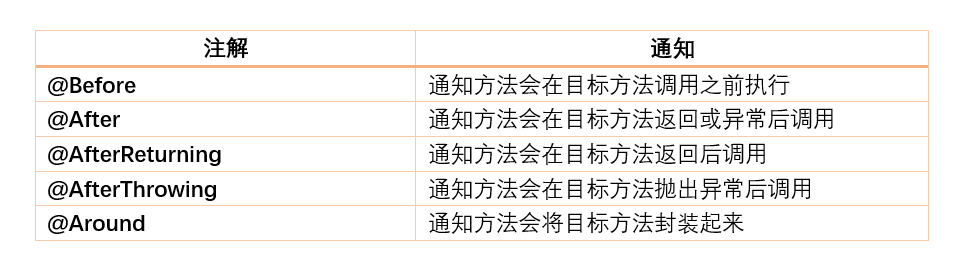

# Spring


# 系统架构


## 1. 入门案例

**（1）四个核心一个依赖**：

- 导入Spring5的核心 jar：`Beans、Core、Context、Expression`

- 导入一个依赖 jar：`commons-logging`

```xml
<!-- 1: spring 的四个核心包 -->
<dependency>
    <groupId>org.springframework</groupId>
    <artifactId>spring-beans</artifactId>
    <version>5.2.6.RELEASE</version>
</dependency>

<dependency>
    <groupId>org.springframework</groupId>
    <artifactId>spring-core</artifactId>
    <version>5.2.6.RELEASE</version>
</dependency>

<dependency>
    <groupId>org.springframework</groupId>
    <artifactId>spring-context</artifactId>
    <version>5.2.6.RELEASE</version>
</dependency>

<dependency>
    <groupId>org.springframework</groupId>
    <artifactId>spring-expression</artifactId>
    <version>5.2.6.RELEASE</version>
</dependency>

<!-- 2: 依赖日志包 -->
<dependency>
    <groupId>commons-logging</groupId>
    <artifactId>commons-logging</artifactId>
    <version>1.1.1</version>
</dependency>
```


**（2）创建测试类**。

```java
@Data
@NoArgsConstructor
@AllArgsConstructor
public class User {
    static {
        System.out.println("loading user....");
    }
    private String username;
    private String password;
}
```


**（3）创建Spring配置文件**：在 `classPath` 下创建 spring-config.xml（名字可以随便起）。

```xml
<?xml version="1.0" encoding="UTF-8"?>
<beans xmlns="http://www.springframework.org/schema/beans"
       xmlns:xsi="http://www.w3.org/2001/XMLSchema-instance"
       xsi:schemaLocation="http://www.springframework.org/schema/beans http://www.springframework.org/schema/beans/spring-beans.xsd">
  
    <!-- 将 User 类加入到 IoC 容器 -->
    <!-- id：bean的名字; class: User类的全限定类名 -->
    <bean id="user" class="com.ymy.spring5.User">
        <property name="username" value="lisi"></property>
        <property name="password" value="123"></property>
    </bean>
</beans>
```


**（4）测试代码**。

```java
@Test
void test1() {
    // 1: 加载 spring 配置文件
    // ApplicationContext 是 BeanFactory 的子接口
    ApplicationContext applicationContext = new ClassPathXmlApplicationContext("classpath:bean1.xml");

    // 2: 获取配置重创建的对象
    // 等价于按照 bean 的名字和类型, 从容器重取出 bean
    User user = applicationContext.getBean("user", User.class);

    // 3: 调用方法
    System.out.println(user);
}
```

```java
// 测试结果
loading user....
User(username=lisi, password=123)
```


## 2. IoC容器

### 2.1. IoC实现

**Spring 提供 IoC 容器两种实现方式**：

- `BeanFactory`：Spring 内部的使用接口，不提供给开发人员使用。
  - 加载 spring 配置文件的时候不会创建对象，getBean() 要使用对象的时候才会创建对象。
- `ApplicationContext`：该接口是 `BeanFactory` 的子接口，面向开发人员进行使用。
  - 加载 spring 配置文件的时候就会创建对象。


### 2.2. XML管理bean

**（1）基于无参构造器创建对象**。

```xml
<?xml version="1.0" encoding="UTF-8"?>
<beans xmlns="http://www.springframework.org/schema/beans"
       xmlns:xsi="http://www.w3.org/2001/XMLSchema-instance"
       xsi:schemaLocation="http://www.springframework.org/schema/beans http://www.springframework.org/schema/beans/spring-beans.xsd">
    
    <!-- 将 User 类加入到 IoC 容器 -->
    <!-- id：bean的名字; class: User类的全限定类名 -->
    <!-- 基于无参构造器来创建对象 -->
    <bean id="user" class="com.ymy.spring5.User"></bean>
</beans>
```


**（2）注入属性：依赖注入**。

```xml
<bean id="user" class="com.ymy.spring5.User">
    <!-- 通过 set 方法注入 -->
    <property name="username" value="lisi"></property>
    <property name="password" value="123"></property>
</bean>
```

```xml
<bean id="user" class="com.ymy.spring5.User">
    <!-- 通过有参构造器注入 --> 
    <constructor-arg name="username" value="abc"></constructor-arg>
    <constructor-arg name="password" value="123"></constructor-arg>
</bean>
```

```xml
<bean id="userMapper" class="com.ymy.spring5.UserMapper"></bean>
<bean id="userService" class="com.ymy.spring5.UserService">
	<!-- ref 注入外部 bean -->   
    <property name="userMapper" ref="userMapper"></property>
</bean>
```


# 6. AOP

​	面向切面的编程（Aspect-Oriented Programming，AOP） 是一种编程范式，旨在通过允许横切关注点的分离，提高模块化。AOP要实现的是在我们写的代码的基础上进行一定的包装，如在方法执行前、或执行后、或是在执行中出现异常后这些地方进行拦截处理或叫做增强处理。 AOP允许开发者将横切关注点（跨越多个模块的共同逻辑）与主要业务逻辑分离，以便更有效地管理和重用切面逻辑

​	AOP最早是AOP联盟的组织提出的，指定的一套规范。在AOP中，两个主要的实现框架是 AspectJ 和 Spring AOP

**基本概念**

- 连接点（Jointpoint） ：表示需要在程序中插入横切关注点的扩展点，连接点可能是类初始化、方法执行、方法调用、字段调用或处理异常等等，Spring只支持方法执行连接点，在AOP中表示为在哪里干；
- 切入点（Pointcut） ： 选择一组相关连接点的模式，即可以认为连接点的集合，Spring支持perl5正则表达式和AspectJ切入点模式，Spring默认使用AspectJ语法，在AOP中表示为在哪里干的集合；
- 通知（Advice） ：在连接点上执行的行为，通知提供了在AOP中需要在切入点所选择的连接点处进行扩展现有行为的手段；包括前置
- 通知（before advice）、后置通知(after advice)、环绕通知（around advice），在Spring中通过代理模式实现AOP，并通过拦截器模式以环绕连接点的拦截器链织入通知；在AOP中表示为干什么；
- 方面/切面（Aspect） ：横切关注点的模块化，比如上边提到的日志组件。可以认为是通知、引入和切入点的组合；在Spring中可以使用Schema和@AspectJ方式进行组织实现；在AOP中表示为在哪干和干什么集合；
- 引入（inter-type declaration） ：也称为内部类型声明，为已有的类添加额外新的字段或方法，Spring允许引入新的接口（必须对应一个实现）到所有被代理对象（目标对象）, 在AOP中表示为干什么（引入什么） ；
- 目标对象（Target Object） ：需要被织入横切关注点的对象，即该对象是切入点选择的对象，需要被通知的对象，从而也可称为被通知对象；由于Spring AOP 通过代理模式实现，从而这个对象永远是被代理对象，在AOP中表示为对谁干；
- 织入（Weaving） ：把切面连接到其它的应用程序类型或者对象上，并创建一个被通知的对象。这些可以在编译时（例如使用AspectJ编译器），类加载时和运行时完成。Spring和其他纯Java AOP框架一样，在运行时完成织入。在AOP中表示为怎么实现的；
- AOP代理（AOP Proxy） ：AOP框架使用代理模式创建的对象，从而实现在连接点处插入通知（即应用切面），就是通过代理来对目标对象应用切面。在Spring中，AOP代理可以用JDK动态代理或CGLIB代理实现，而通过拦截器模型应用切面。在AOP中表示为怎么实现的一种典型方式；


## 6.1. 通知注解



> 面试题：
>
> - AOP的全部通知顺序，SpringBoot 1或SpringBoot 2对AOP执行顺序的影响?
> - 在使用AOP的过程中碰到的坑？


## 6.2. 构造切面

```java
// 目标类
@Component
public class Calculate {
    public int division(int x, int y) {
        return x / y;
    }
}

// 切面类
@Aspect
@Component
public class CalculateAspect {

    @Pointcut("execution(public * com.ymy.Calculate.*(..))")
    public void cutPoint() {
    }

    @Before("cutPoint()")
    public void before() {
        System.out.println("before...");
    }

    @After("cutPoint()")
    public void after() {
        System.out.println("after..");
    }

    @Around("cutPoint()")
    public Object around(ProceedingJoinPoint pjp) throws Throwable {
        String methodName = point.getSignature().getName();
        List<Object> args = Arrays.asList(point.getArgs());
      
        System.out.println("around...before");
        Object ret = pjp.proceed();
        System.out.println("方法执行结果==>" + ret);
        System.out.println("around...after");
        return ret;
    }

    @AfterReturning("cutPoint()")
    public void afterReturning() {
        System.out.println("afterReturning...");
    }

    @AfterThrowing("cutPoint()")
    public void afterThrowing() {
        System.out.println("afterThrowing");
    }
}
```


## 6.3. 测试

### 6.3.1. Spring4

**测试结果**：

```java
// 1. 正常情况
around...before
before...
方法执行结果==>3
around...after
after..
afterReturning...
    
// 2. 异常情况    
around...before
before...
after..
afterThrowing
```


**总结**：

```java
try {
    @Before
    method.invoke(obj, args);
    @AfterReturning // return 
} catch() {
    @AfterThrowing
} finally {
    @After
}
```

- **正常执行**：@Before（前置通知）===> @After（后置通知）===> @AfterReturning（正常返回）。
- **异常执行**：@Before（前置通知）===> @After（后置通知）===>  @AfterThrowing（方法异常）。


### 6.3.2. Spring5

```java
// 1. 正常情况
around...before
before...
afterReturning...
after..
around...after

// 2. 异常情况
around...before
before...
afterThrowing
after..
```


# 7. 循环依赖

> **循环依赖**：多个 bean 之间相互依赖，形成了一个闭环。
>
> 比如：A依赖于B、B依赖于C、C依赖于A。

```java
// 产生循环依赖的异常
BeanCurrentlyInCreationException: 
Error creating bean with name 'rememberMeServices': Requested bean is currently in creation: Is there an unresolvable circular reference?
```


