# SpringBoot 常用注解


- Spring Web MVC

- Spring Bean

- Spring Dependency Inject 

-  Bean Scops 

- 容器配置注解

  - @Autowired
  - @Primary
  - @PostConstruct与@PreDestroy
  - @Qualifier

- Spring Boot

  

  企业开发项目SpringBoot已经是必备框架了，其中注解是开发中的小工具（谁处可见哦），用好了开发效率大大提升，当然用错了也会引入缺陷。

------

## 一、Spring Web MVC

**@RequestMapping**

@RequestMapping注解的主要用途是将Web请求与请求处理类中的方法进行映射。Spring MVC和Spring WebFlux都通过`RquestMappingHandlerMapping`和`RequestMappingHndlerAdapter`两个类来提供对@RequestMapping注解的支持。

`@RequestMapping`注解对请求处理类中的请求处理方法进行标注；`@RequestMapping`注解拥有以下的六个配置属性：

- `value`:映射的请求URL或者其别名
- `method`:兼容HTTP的方法名
- `params`:根据HTTP参数的存在、缺省或值对请求进行过滤
- `header`:根据HTTP Header的存在、缺省或值对请求进行过滤
- `consume`:设定在HTTP请求正文中允许使用的媒体类型
- `product`:在HTTP响应体中允许使用的媒体类型

提示：在使用@RequestMapping之前，请求处理类还需要使用@Controller或@RestController进行标记

下面是使用@RequestMapping的两个示例：

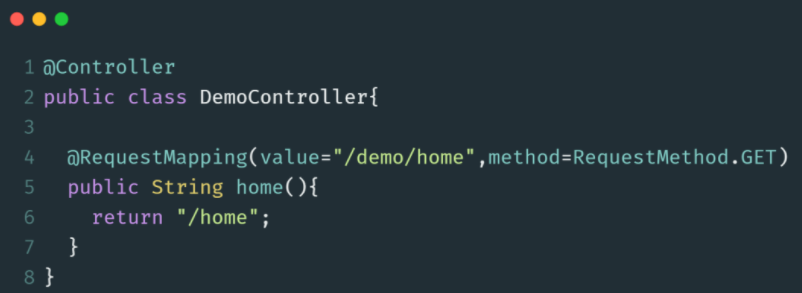

@RequestMapping还可以对类进行标记，这样类中的处理方法在映射请求路径时，会自动将类上@RequestMapping设置的value拼接到方法中映射路径之前，如下：

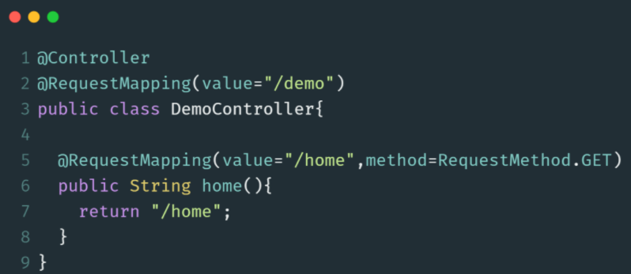

**@RequestBody**

@RequestBody在处理请求方法的参数列表中使用，它可以将请求主体中的参数绑定到一个对象中，请求主体参数是通过`HttpMessageConverter`传递的，根据请求主体中的参数名与对象的属性名进行匹配并绑定值。此外，还可以通过@Valid注解对请求主体中的参数进行校验。

下面是一个使用`@RequestBody`的示例：

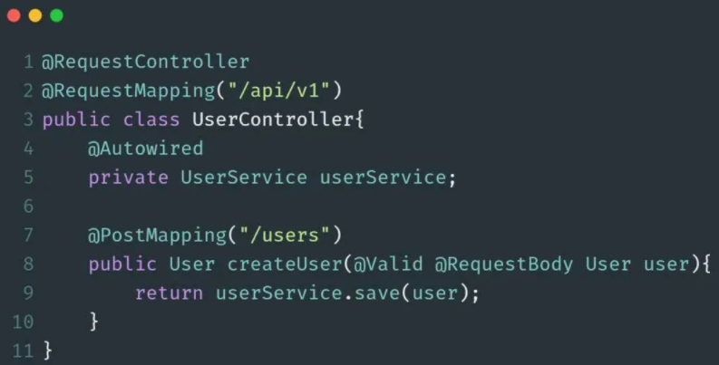

**@GetMapping**

`@GetMapping`注解用于处理HTTP GET请求，并将请求映射到具体的处理方法中。具体来说，@GetMapping是一个组合注解，它相当于是`@RequestMapping(method=RequestMethod.GET)`的快捷方式。

下面是`@GetMapping`的一个使用示例：

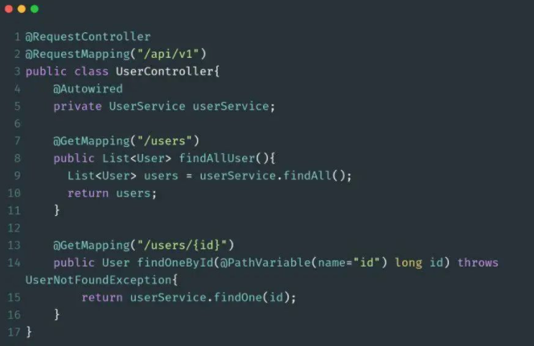

**@PostMapping**

`@PostMapping`注解用于处理HTTP POST请求，并将请求映射到具体的处理方法中。@PostMapping与@GetMapping一样，也是一个组合注解，它相当于是`@RequestMapping(method=HttpMethod.POST)`的快捷方式。

下面是使用`@PostMapping`的一个示例：

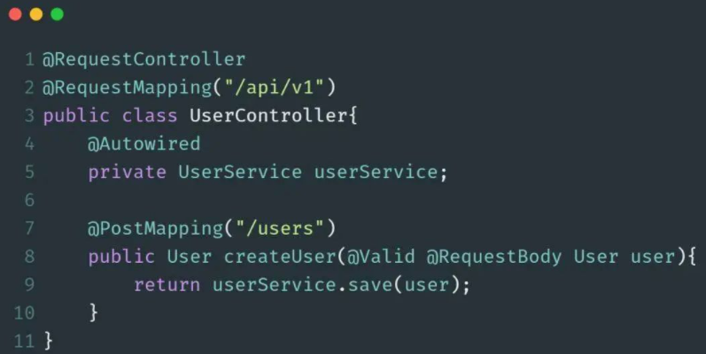

**@PutMapping**

`@PutMapping`注解用于处理HTTP PUT请求，并将请求映射到具体的处理方法中，@PutMapping是一个组合注解，相当于是`@RequestMapping(method=HttpMethod.PUT)`的快捷方式。

下面是使用`@PutMapping`的一个示例：

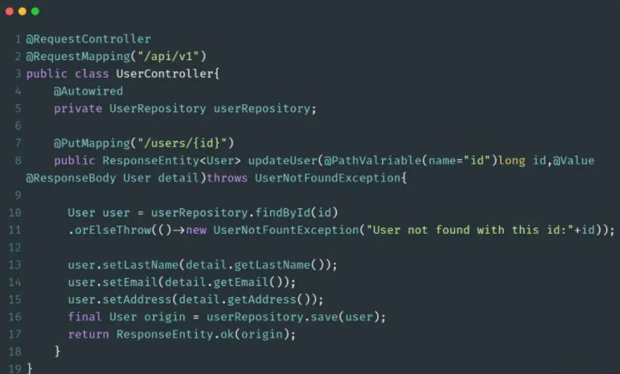

**@DeleteMapping**

`@DeleteMapping`注解用于处理HTTP DELETE请求，并将请求映射到删除方法中。@DeleteMapping是一个组合注解，它相当于是`@RequestMapping(method=HttpMethod.DELETE)`的快捷方式。

下面是使用`@DeleteMapping`的一个示例：

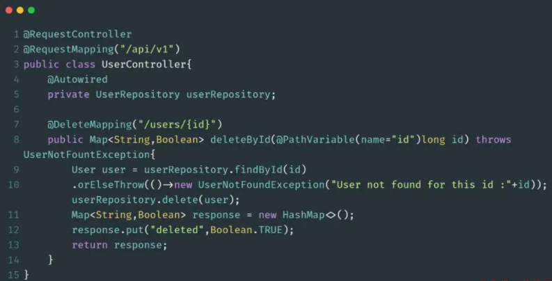

**@PatchMapping**

`@PatchMapping`注解用于处理HTTP PATCH请求，并将请求映射到对应的处理方法中。@PatchMapping相当于是`@RequestMapping(method=HttpMethod.PATCH)`的快捷方式。

下面是一个简单的示例：

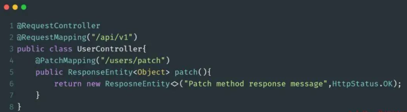

**@ControllerAdvice**

`@ControllerAdvice`是@Component注解的一个延伸注解，Spring会自动扫描并检测被@ControllerAdvice所标注的类。`@ControllerAdvice`需要和`@ExceptionHandler`、`@InitBinder`以及`@ModelAttribute`注解搭配使用，主要是用来处理控制器所抛出的异常信息。

首先，需要定义一个被`@ControllerAdvice`所标注的类，在该类中，定义一个用于处理具体异常的方法，并使用@ExceptionHandler注解进行标记。

此外，在有必要的时候，可以使用`@InitBinder`在类中进行全局的配置，还可以使用@ModelAttribute配置与视图相关的参数。使用`@ControllerAdvice`注解，就可以快速的创建统一的，自定义的异常处理类。

下面是一个使用`@ControllerAdvice`的示例代码：

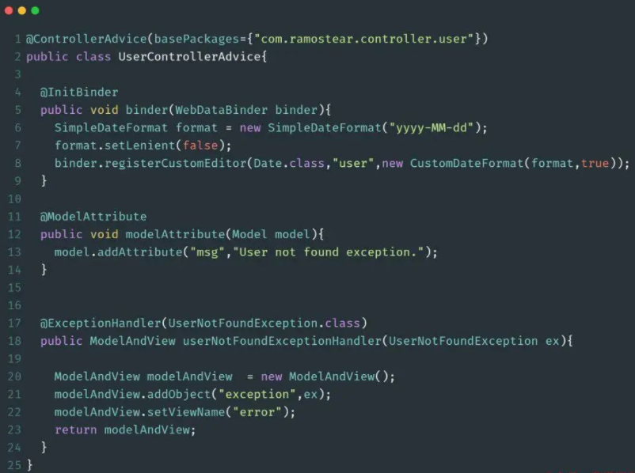

**@ResponseBody**

`@ResponseBody`会自动将控制器中方法的返回值写入到HTTP响应中。特别的，`@ResponseBody`注解只能用在被`@Controller`注解标记的类中。如果在被`@RestController`标记的类中，则方法不需要使用`@ResponseBody`注解进行标注。`@RestController`相当于是`@Controller`和`@ResponseBody`的组合注解。

下面是使用该注解的一个示例

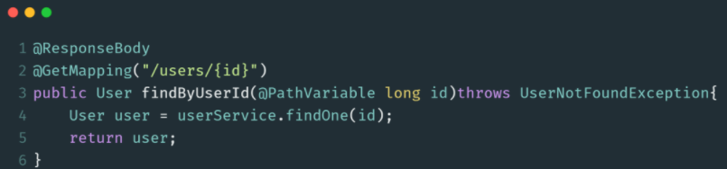

**@ExceptionHandler**

`@ExceptionHander`注解用于标注处理特定类型异常类所抛出异常的方法。当控制器中的方法抛出异常时，Spring会自动捕获异常，并将捕获的异常信息传递给被`@ExceptionHandler`标注的方法。

下面是使用该注解的一个示例：

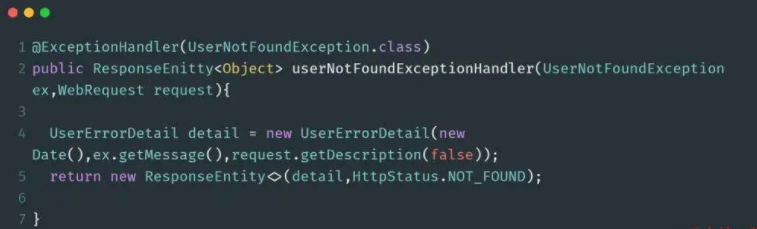

**@ResponseStatus**

`@ResponseStatus`注解可以标注请求处理方法。使用此注解，可以指定响应所需要的HTTP STATUS。特别地，可以使用HttpStauts类对该注解的value属性进行赋值。

下面是使用`@ResponseStatus`注解的一个示例：

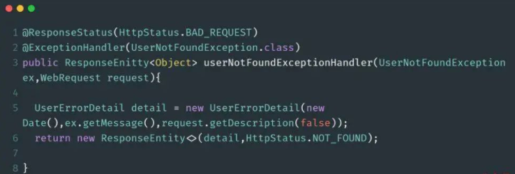

**@PathVariable**

`@PathVariable`注解是将方法中的参数绑定到请求URI中的模板变量上。可以通过`@RequestMapping`注解来指定URI的模板变量，然后使用`@PathVariable`注解将方法中的参数绑定到模板变量上。

特别地，`@PathVariable`注解允许使用value或name属性来给参数取一个别名。下面是使用此注解的一个示例：

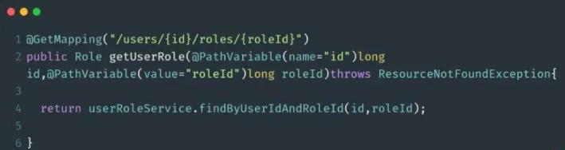

模板变量名需要使用`{ }`进行包裹，如果方法的参数名与URI模板变量名一致，则在`@PathVariable`中就可以省略别名的定义。

下面是一个简写的示例：

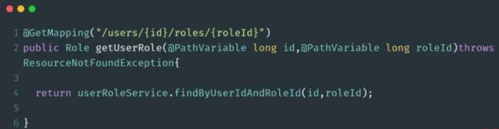

提示：如果参数是一个非必须的，可选的项，则可以在`@PathVariable`中设置`require = false`

**@RequestParam**

`@RequestParam`注解用于将方法的参数与Web请求的传递的参数进行绑定。使用`@RequestParam`可以轻松的访问HTTP请求参数的值。

下面是使用该注解的代码示例：

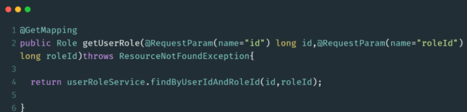

该注解的其他属性配置与`@PathVariable`的配置相同，特别的，如果传递的参数为空，还可以通过defaultValue设置一个默认值。示例代码如下：

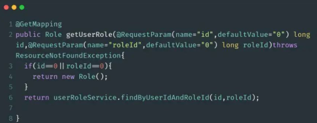

**@Controller**

`@Controller`是`@Component`注解的一个延伸，Spring 会自动扫描并配置被该注解标注的类。此注解用于标注Spring MVC的控制器。下面是使用此注解的示例代码：

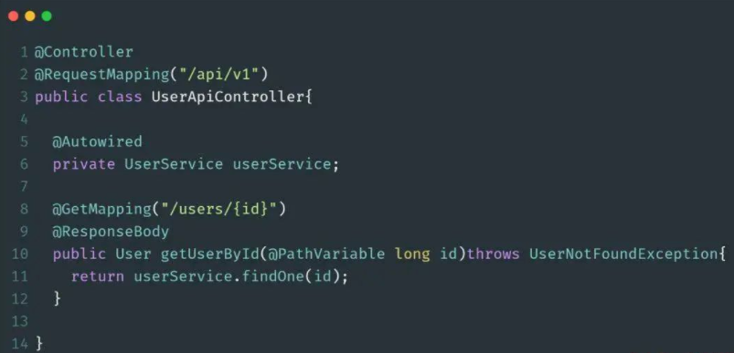

**@RestController**

`@RestController`是在Spring 4.0开始引入的，这是一个特定的控制器注解。此注解相当于`@Controller`和`@ResponseBody`的快捷方式。当使用此注解时，不需要再在方法上使用`@ResponseBody`注解。

下面是使用此注解的示例代码：

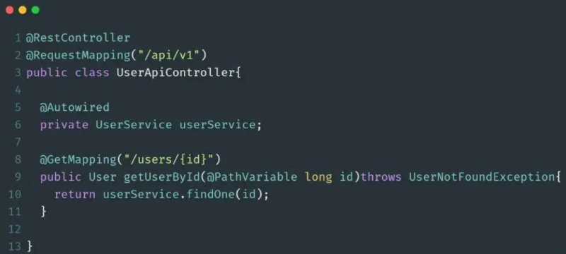


**@ModelAttribute**

通过此注解，可以通过模型索引名称来访问已经存在于控制器中的model。下面是使用此注解的一个简单示例：

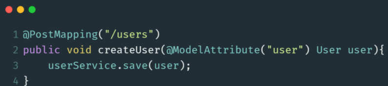

与`@PathVariable`和`@RequestParam`注解一样，如果参数名与模型具有相同的名字，则不必指定索引名称，简写示例如下：

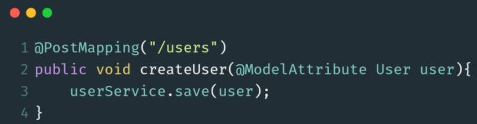

特别地，如果使用`@ModelAttribute`对方法进行标注，Spring会将方法的返回值绑定到具体的Model上。示例如下：

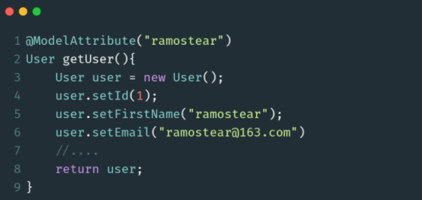

在Spring调用具体的处理方法之前，被`@ModelAttribute`注解标注的所有方法都将被执行。

**@CrossOrigin**

`@CrossOrigin`注解将为请求处理类或请求处理方法提供跨域调用支持。如果将此注解标注类，那么类中的所有方法都将获得支持跨域的能力。使用此注解的好处是可以微调跨域行为。使用此注解的示例如下：

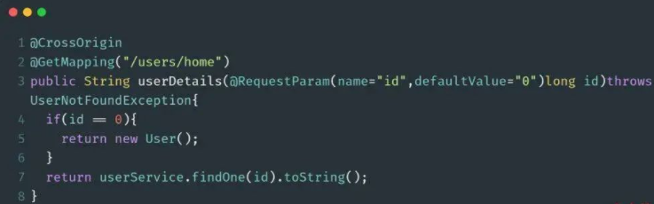

**@InitBinder**

`@InitBinder`注解用于标注初始化**WebDataBinider** 的方法，该方法用于对Http请求传递的表单数据进行处理，如时间格式化、字符串处理等。下面是使用此注解的示例：

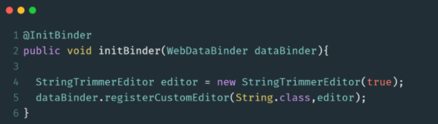


## 二、Spring Bean 注解

在本小节中，主要列举与Spring Bean相关的4个注解以及它们的使用方式。

**@ComponentScan**

`@ComponentScan`注解用于配置Spring需要扫描的被组件注解注释的类所在的包。可以通过配置其basePackages属性或者value属性来配置需要扫描的包路径。value属性是basePackages的别名。

**@Component**

@Component注解用于标注一个普通的组件类，它没有明确的业务范围，只是通知Spring被此注解的类需要被纳入到Spring Bean容器中并进行管理。此注解的使用示例如下：

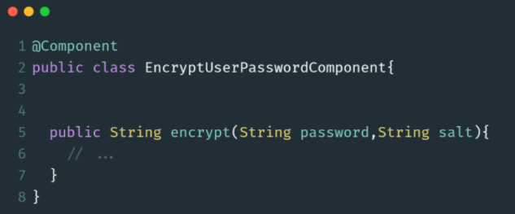

**@Service**

`@Service`注解是`@Component`的一个延伸（特例），它用于标注业务逻辑类。与`@Component`注解一样，被此注解标注的类，会自动被Spring所管理。下面是使用`@Service`注解的示例：

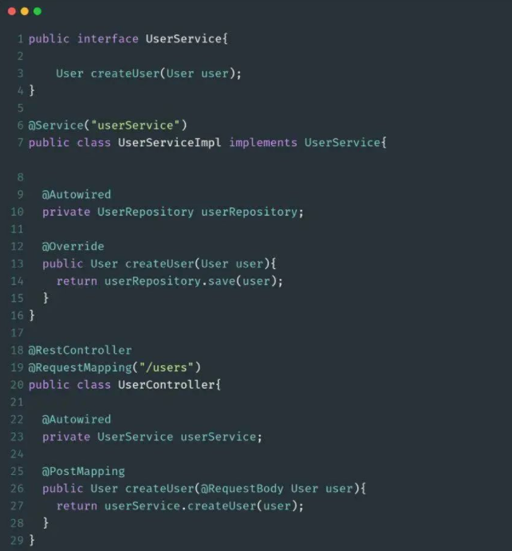

**@Repository**

`@Repository`注解也是`@Component`注解的延伸，与`@Component`注解一样，被此注解标注的类会被Spring自动管理起来，`@Repository`注解用于标注DAO层的数据持久化类。此注解的用法如下：


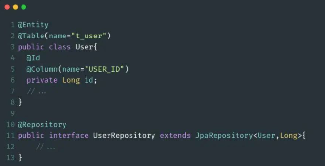


## 三、Spring Dependency Inject

**@DependsOn**

`@DependsOn`注解可以配置Spring IoC容器在初始化一个Bean之前，先初始化其他的Bean对象。下面是此注解使用示例代码：

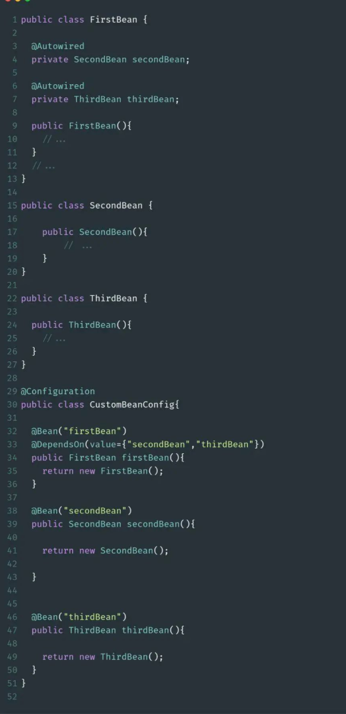

**@Bean**

@Bean注解主要的作用是告知Spring，被此注解所标注的类将需要纳入到Bean管理工厂中。@Bean注解的用法很简单，在这里，着重介绍@Bean注解中`initMethod`和`destroyMethod`的用法。示例如下：

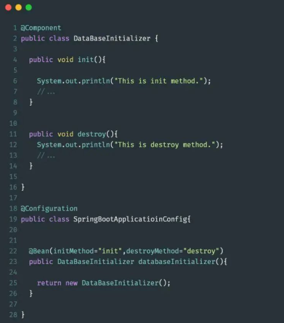


## 四、Bean Scops 注解

**@Scope**

@Scope注解可以用来定义@Component标注的类的作用范围以及@Bean所标记的类的作用范围。@Scope所限定的作用范围有：`singleton`、`prototype`、`request`、`session`、`globalSession`或者其他的自定义范围。这里以prototype为例子进行讲解。

当一个Spring Bean被声明为prototype（原型模式）时，在每次需要使用到该类的时候，Spring IoC容器都会初始化一个新的改类的实例。在定义一个Bean时，可以设置Bean的scope属性为`prototype：scope=“prototype”`,也可以使用@Scope注解设置，如下：

```java
@Scope(value=ConfigurableBeanFactory.SCOPE_PROPTOTYPE)
```

下面将给出两种不同的方式来使用@Scope注解，示例代码如下：

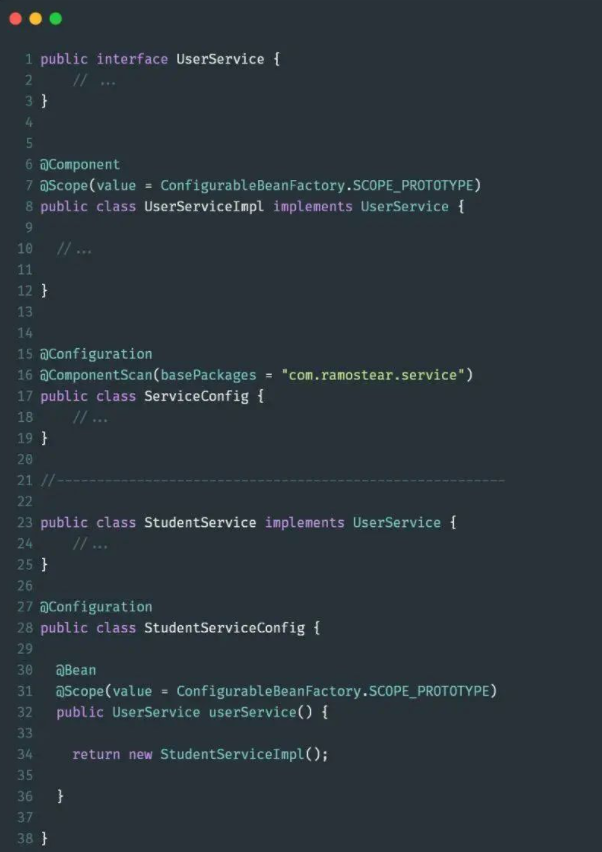

**@Scope 单例模式**

当@Scope的作用范围设置成Singleton时，被此注解所标注的类只会被Spring IoC容器初始化一次。在默认情况下，Spring IoC容器所初始化的类实例都为singleton。同样的原理，此情形也有两种配置方式，示例代码如下：

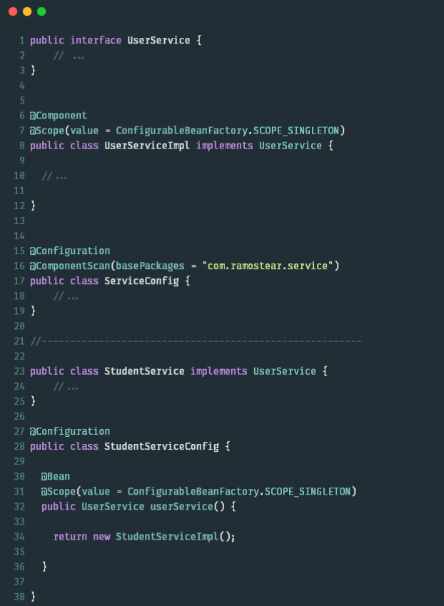


## 五、容器配置注解

### @Autowired

@Autowired注解用于标记Spring将要解析和注入的依赖项。此注解可以作用在构造函数、字段和setter方法上。

**作用于构造函数**

下面是@Autowired注解标注构造函数的使用示例：

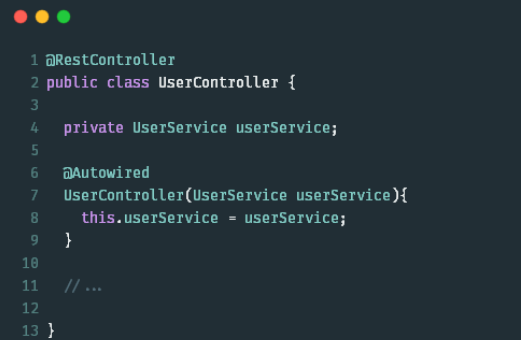

**作用于setter方法**

下面是@Autowired注解标注setter方法的示例代码：

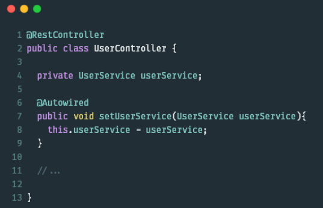

**作用于字段**

@Autowired注解标注字段是最简单的，只需要在对应的字段上加入此注解即可，示例代码如下：

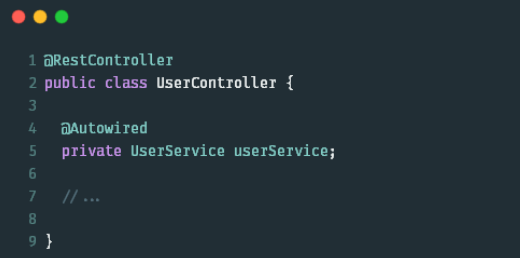

### @Primary

当系统中需要配置多个具有相同类型的bean时，@Primary可以定义这些Bean的优先级。下面将给出一个实例代码来说明这一特性：

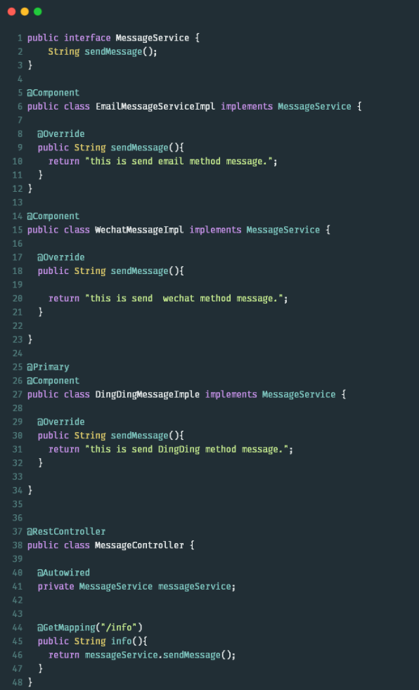

输出结果：

```
this is send DingDing method message.
```

### @PostConstruct与@PreDestroy

值得注意的是，这两个注解不属于Spring,它们是源于JSR-250中的两个注解，位于`common-annotations.jar`中。@PostConstruct注解用于标注在Bean被Spring初始化之前需要执行的方法。@PreDestroy注解用于标注Bean被销毁前需要执行的方法。下面是具体的示例代码：

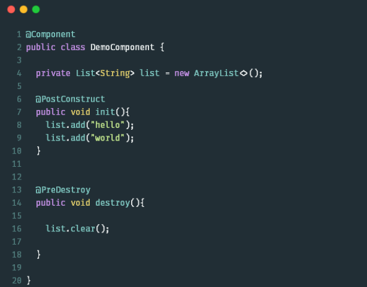

### @Qualifier

当系统中存在同一类型的多个Bean时，@Autowired在进行依赖注入的时候就不知道该选择哪一个实现类进行注入。此时，可以使用@Qualifier注解来微调，帮助@Autowired选择正确的依赖项。下面是一个关于此注解的代码示例：

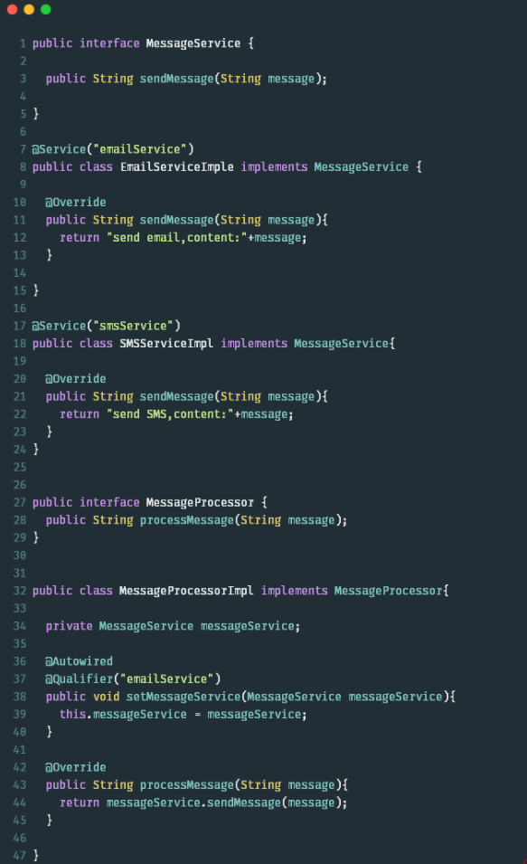


## 六、Spring Boot注解

### **@SpringBootApplication**

`@SpringBootApplication`注解是一个快捷的配置注解，在被它标注的类中，可以定义一个或多个Bean，并自动触发自动配置Bean和自动扫描组件。此注解相当于`@Configuration`、`@EnableAutoConfiguration`和`@ComponentScan`的组合。

在Spring Boot应用程序的主类中，就使用了此注解。示例代码如下：

```java
@SpringBootApplication
public class Application{
    public static void main(String [] args){
        SpringApplication.run(Application.class,args);
    }
}
```

### **@EnableAutoConfiguration**

@EnableAutoConfiguration注解用于通知Spring，根据当前类路径下引入的依赖包，自动配置与这些依赖包相关的配置项。

**@ConditionalOnClass与@ConditionalOnMissingClass**

这两个注解属于类条件注解，它们根据是否存在某个类作为判断依据来决定是否要执行某些配置。下面是一个简单的示例代码：

```java
@Configuration
@ConditionalOnClass(DataSource.class)
class MySQLAutoConfiguration {
    //...
}
```

**@ConditionalOnBean与@ConditionalOnMissingBean**

这两个注解属于对象条件注解，根据是否存在某个对象作为依据来决定是否要执行某些配置方法。示例代码如下：

```java
@Bean
@ConditionalOnBean(name="dataSource")
LocalContainerEntityManagerFactoryBean entityManagerFactory(){
        //...
        }
@Bean
@ConditionalOnMissingBean
public MyBean myBean(){
        //...
        }
```

### **@ConditionalOnProperty**

@ConditionalOnProperty注解会根据Spring配置文件中的配置项是否满足配置要求，从而决定是否要执行被其标注的方法。示例代码如下：

```java
@Bean
@ConditionalOnProperty(name="alipay",havingValue="on")
Alipay alipay(){
        return new Alipay();
        }
```

**### @ConditionalOnResource**

此注解用于检测当某个配置文件存在使，则触发被其标注的方法，下面是使用此注解的代码示例：

```java
@ConditionalOnResource(resources = "classpath:website.properties")
Properties addWebsiteProperties(){
        //...
        }
```

**@ConditionalOnWebApplication与@ConditionalOnNotWebApplication**

这两个注解用于判断当前的应用程序是否是Web应用程序。如果当前应用是Web应用程序，则使用Spring WebApplicationContext,并定义其会话的生命周期。下面是一个简单的示例：

```java
@ConditionalOnWebApplication
HealthCheckController healthCheckController(){
        //...
        }
```

### **@ConditionalExpression**

此注解可以让控制更细粒度的基于表达式的配置条件限制。当表达式满足某个条件或者表达式为真的时候，将会执行被此注解标注的方法。

```java
@Bean
@ConditionalException("${localstore} && ${local == 'true'}")
LocalFileStore store(){
        //...
        }
```

### @Conditional

@Conditional注解可以控制更为复杂的配置条件。在Spring内置的条件控制注解不满足应用需求的时候，可以使用此注解定义自定义的控制条件，以达到自定义的要求。下面是使用该注解的简单示例：

```java
@Conditioanl(CustomConditioanl.class)
CustomProperties addCustomProperties(){
        //...
        }
```


### Cache

缓存可以通过将经常访问的数据存储在内存中，减少底层数据源如数据库的压力，从而有效提高系统的性能和稳定性。我想大家的项目中或多或少都有使用过，项目也不例外，但是最近在review公司的代码的时候写的很蠢且low, 大致写法如下：

```java
public User getById(String id) {
 User user = cache.getUser();
    if(user != null) {
        return user;
    }
    // 从数据库获取
    user = loadFromDB(id);
    cahce.put(id, user);
 return user;
}
```


#### @EnableCaching

现在大部分项目都是是SpringBoot项目，可以在启动类添加注解`@EnableCaching`来开启缓存功能

```java
@SpringBootApplication
@EnableCaching
public class SpringCacheApp {

    public static void main(String[] args) {
        SpringApplication.run(Cache.class, args);
    }
}
```

既然要能使用缓存，就需要有一个缓存管理器Bean，默认情况下，`@EnableCaching` 将注册一个`ConcurrentMapCacheManager`的Bean，不需要单独的 bean 声明。`ConcurrentMapCacheManage`r将值存储在`ConcurrentHashMap`的实例中，这是缓存机制的最简单的线程安全实现

#### 自定义缓存管理器

```xml
<dependency>
  <groupId>org.springframework.boot</groupId>
  <artifactId>spring-boot-starter-data-redis</artifactId>
</dependency>
```

Redis 缓存管理器

```java
@Configuration
@EnableCaching
public class CacheConfig {

    @Bean
    public RedisConnectionFactory redisConnectionFactory() {
        return new LettuceConnectionFactory();
    }

    @Bean
    public CacheManager cacheManager() {
        RedisCacheConfiguration redisCacheConfiguration = RedisCacheConfiguration.defaultCacheConfig()
            .disableCachingNullValues()
            .serializeValuesWith(SerializationPair.fromSerializer(new GenericJackson2JsonRedisSerializer()));

        RedisCacheManager redisCacheManager = RedisCacheManager.builder(redisConnectionFactory())
            .cacheDefaults(redisCacheConfiguration)
            .build();

        return redisCacheManager;
    }
}
```

可以使用`@Cacheable`、`@CachePut` 或`@CacheEvict` 注解来操作缓存


#### @Cacheable

该注解可以将方法运行的结果进行缓存，在缓存时效内再次调用该方法时不会调用方法本身，而是直接从缓存获取结果并返回给调用方

| 属性名             | 描述                                                         |
| ------------------ | ------------------------------------------------------------ |
| value / cacheNames | 指定缓存的名称，Spring Cache 使用 CacheManage 管理多个缓存组件 Cache，这里的 Cache 组件就是根据该名称进行文分的，它负责对缓存执行真正的 CRUD 操作 |
| key                | 缓存数据时 Key的值，默认是使用方法参数的值，可以便用 SpEL 表达式计算 Key 的值 |
| keyGenerator       | 缓存 Key的生成策略，它和 key 届性互斥使用 (只能二选一)       |
| cacheManager       | 指定缓存管理器 (如 ConcurrentHashMap、 Redis等)              |
| cacheResolver      | 作用和 cacheManager 属性一样，两者只能二选一                 |
| condition          | 指定缓存的条件(满足什么条件才缓存)，可用 SpEL 表达式(如 #id>1，表示当入参id大于时才缓存) |
| unless             | 否定缓存，即满足 unless 指定的条件时，方法的结果不进行缓存，使用 unless 时可以在调用的方法获取到结果之后再进行判断 (如 #result == null，表示如果结果为 null 时不缓存) |
| sync               | 是否使用异步模式进行缓存，默认值是 false                     |

```java
@Service
public class MyService {

    @Autowired
    private MyRepository repository;

    @Cacheable(value = "myCache", key = "#id")
    public MyEntity getEntityById(Long id) {
        return repository.findById(id).orElse(null);
    }
}
```

`@Cacheable` 注解用于缓存 `getEntityById()`方法的结果，该方法根据其 `ID` 从数据库中检索 MyEntity 对象

#### @CachePut

使用 `@CachePut` 注解标注的方法，在执行前不会去检查缓存中是否存在之前执行过的结果，而是每次都会执行该方法，并将执行结果以键值对的形式写入指定的缓存中。`@CachePut` 注解一般用于更新缓存数据，相当于缓存使用的是写模式中的双写模式

```java
@Service
public class MyService {

    @Autowired
    private MyRepository repository;

    @CachePut(value = "myCache", key = "#entity.id")
    public void saveEntity(MyEntity entity) {
        repository.save(entity);
    }
}
```


#### @CacheEvict

`@CacheEvict` 注解的方法在被调用时，会从缓存中移除已存储的数据。`@CacheEvict` 注解一般用于删除缓存数据，相当于缓存使用的是写模式中的失效模式

| 属性名             | 描述                                                         |
| ------------------ | ------------------------------------------------------------ |
| value / cacheNames | 缓存的名称                                                   |
| key                | 缓存的键                                                     |
| allEntries         | 是否根据缓存名称清空所有缓存数据，默认值为 false ，当值指定为 true 时，Spring Cache 将忽略注解上指定的key 属性 |
| beforelnvocation   | 是否在方法执行之前就清空缓存，默认值为 false                 |

```java
@Service
public class MyService {

    @Autowired
    private MyRepository repository;

     @CacheEvict(value = "myCache", key = "#id")
    public void deleteEntityById(Long id) {
        repository.deleteById(id);
    }
}
```


#### @Caching

`@Caching` 注解用于在一个方法或者类上，同时指定多个 Spring Cache 相关的注解

| 属性名    | 描述                      |
| --------- | ------------------------- |
| cacheable | 用于指定 @Cacheable 注解  |
| put       | 用于指定 @CachePut 注解   |
| evict     | 用于指定 @CacheEvict 注解 |

`@Caching`注解中的`evict`属性指定在调用方法 `saveEntity` 时失效两个缓存

```java
@Service
public class MyService {

    @Autowired
    private MyRepository repository;

    @Cacheable(value = "myCache", key = "#id")
    public MyEntity getEntityById(Long id) {
        return repository.findById(id).orElse(null);
    }

    @Caching(evict = {
        @CacheEvict(value = "myCache", key = "#entity.id"),
        @CacheEvict(value = "otherCache", key = "#entity.id")
    })
    public void saveEntity(MyEntity entity) {
        repository.save(entity);
    }
}
```

调用`getEntityById`方法时，Spring会先检查结果是否已经缓存在`myCache`缓存中。如果是，`Spring` 将返回缓存的结果而不是执行该方法。如果结果尚未缓存，Spring 将执行该方法并将结果缓存在 `myCache` 缓存中。方法执行后，Spring会根据`@CacheEvict`注解从`otherCache`缓存中移除缓存结果

```java
@Service
public class MyService {

    @Caching(
        cacheable = {
            @Cacheable(value = "myCache", key = "#id")
        },
        evict = {
            @CacheEvict(value = "otherCache", key = "#id")
        }
    )
    public MyEntity getEntityById(Long id) {
        return repository.findById(id).orElse(null);
    }
}
```

​	调用`saveData`方法时，Spring会根据`@CacheEvict`注解先从`otherCache`缓存中移除数据。然后，Spring 将执行该方法并将结果保存到数据库或外部 API

​	方法执行后，Spring 会根据`@CachePut`注解将结果添加到 `myCache`、`myOtherCache` 和 `myThirdCache` 缓存中。Spring 还将根据`@Cacheable`注解检查结果是否已缓存在 `myFourthCache` 和 `myFifthCache` 缓存中。如果结果尚未缓存，Spring 会将结果缓存在适当的缓存中。如果结果已经被缓存，Spring 将返回缓存的结果，而不是再次执行该方法

```java
@Service
public class MyService {

    @Caching(
        put = {
            @CachePut(value = "myCache", key = "#result.id"),
            @CachePut(value = "myOtherCache", key = "#result.id"),
            @CachePut(value = "myThirdCache", key = "#result.name")
        },
        evict = {
            @CacheEvict(value = "otherCache", key = "#id")
        },
        cacheable = {
            @Cacheable(value = "myFourthCache", key = "#id"),
            @Cacheable(value = "myFifthCache", key = "#result.id")
        }
    )
    public MyEntity saveData(Long id, String name) {
        // Code to save data to a database or external API
        MyEntity entity = new MyEntity(id, name);
        return entity;
    }
}
```


#### @CacheConfig

`@CacheConfig` 注解，可以将一些缓存配置简化到类级别的一个地方，这样就不必多次声明相关值

```java
@CacheConfig(cacheNames={"myCache"})
@Service
public class MyService {

    @Autowired
    private MyRepository repository;

    @Cacheable(key = "#id")
    public MyEntity getEntityById(Long id) {
        return repository.findById(id).orElse(null);
    }

    @CachePut(key = "#entity.id")
    public void saveEntity(MyEntity entity) {
        repository.save(entity);
    }

    @CacheEvict(key = "#id")
    public void deleteEntityById(Long id) {
        repository.deleteById(id);
    }
}
```


#### Condition & Unless

- `condition`作用：指定缓存的条件（满足什么条件才缓存），可用 `SpEL` 表达式（如 `#id>0`，表示当入参 id 大于 0 时才缓存）
- `unless`作用 : 否定缓存，即满足 `unless` 指定的条件时，方法的结果不进行缓存，使用 `unless` 时可以在调用的方法获取到结果之后再进行判断（如 #result == null，表示如果结果为 null 时不缓存）

```java
//when id >10, the @CachePut works. 
@CachePut(key = "#entity.id", condition="#entity.id > 10")
public void saveEntity(MyEntity entity) {
 repository.save(entity);
}

//when result != null, the @CachePut works.
@CachePut(key = "#id", condition="#result == null")
public void saveEntity1(MyEntity entity) {
 repository.save(entity);
}
```


#### 清理全部缓存

通过`allEntries`、`beforeInvocation`属性可以来清除全部缓存数据，不过`allEntries`是方法调用后清理，`beforeInvocation`是方法调用前清理

```java
//方法调用完成之后，清理所有缓存
@CacheEvict(value="myCache",allEntries=true)
public void delectAll() {
    repository.deleteAll();
}

//方法调用之前，清除所有缓存
@CacheEvict(value="myCache",beforeInvocation=true)
public void delectAll() {
    repository.deleteAll();
}
```


#### SpEL表达式

| 类型       | 运算符                                           |
| ---------- | ------------------------------------------------ |
| 关系       | <、>，<=，>=，==，!=、lt，gt，le，ge，eq，ne     |
| 算术       | 十、-，*，1，%，^                                |
| 逻辑       | &&，\|\|，!，and，or，not， between， instanceof |
| 条件       | ?: (ternary)，?: (elvis)                         |
| 正则表达式 | matches                                          |
| 其他类型   | ?.，?[...], ![..],..., $[...]                    |

**Spring Cache 可用的变量**

| 名称          | 位置     | 描述                                                         | 示例                 |
| ------------- | -------- | ------------------------------------------------------------ | -------------------- |
| methodName    | 根 对象  | 调用的方法的名称                                             | #root.methodName     |
| method        | 根 对象  | 正在调用的方法                                               | #root.method.name    |
| target        | 根 对象  | 正在调用的目标对象                                           | #root.target         |
| targetClass   | 根 对象  | 调用的目标的类                                               | #root.targetClass    |
| args          | 根 对象  | 用于调用目标的参数(作为数组)                                 | #root.args[0]        |
| caches        | 根 对象  | 正在调用的方法使用的缓存列表 (如@Cacheable(value=["cache1""cache2”}))，则有两个缓存) | #root.caches[0].name |
| argument name | 评估背景 | 方法参数名，可以直接使用 #参数名 ，也可以使用 #pe 或 #a 的形式， 代表参数的索引 | #iban、#a0、#p0      |
| result        | 评估背景 | 方法执行后的返回值，仅当方法执行之后的判断有效，如 unless、 cache put、cache evict (当 beforeInvocation = false) 的表达式 | result               |


#### Practice

通过`Spring`缓存注解可以快速优雅地在我们项目中实现缓存的操作，但是在双写模式或者失效模式下，可能会出现缓存数据一致性问题（读取到脏数据），`Spring Cache` 暂时没办法解决

- 只缓存经常读取的数据：缓存可以显着提高性能，但只缓存经常访问的数据很重要。很少或从不访问的缓存数据会占用宝贵的内存资源，从而导致性能问题
- 根据应用程序的特定需求选择合适的缓存提供程序和策略。`SpringBoot` 支持多种缓存提供程序，包括 `Ehcache`、`Hazelcast` 和 `Redis`
- 使用缓存时请注意潜在的线程安全问题。对缓存的并发访问可能会导致数据不一致或不正确，因此选择线程安全的缓存提供程序并在必要时使用适当的同步机制非常重要
- 避免过度缓存。缓存对于提高性能很有用，但过多的缓存实际上会消耗宝贵的内存资源，从而损害性能。在缓存频繁使用的数据和允许垃圾收集不常用的数据之间取得平衡很重要
- 使用适当的缓存逐出策略。使用缓存时，重要的是定义适当的缓存逐出策略以确保在必要时从缓存中删除旧的或陈旧的数据
- 使用适当的缓存键设计。缓存键对于每个数据项都应该是唯一的，并且应该考虑可能影响缓存数据的任何相关参数，例如用户 ID、时间或位置
- 常规数据（读多写少、即时性与一致性要求不高的数据）完全可以使用 Spring Cache，至于写模式下缓存数据一致性问题的解决，只要缓存数据有设置过期时间就足够了
- 特殊数据（读多写多、即时性与一致性要求非常高的数据），不能使用 Spring Cache，建议考虑特殊的设计（例如使用 Cancal 中间件等）


