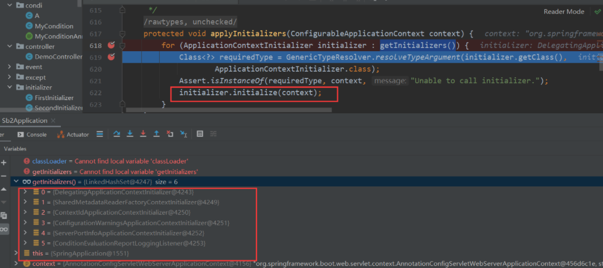

# 系统初始化加载机制

在spirngboot的包中我们可以看到META-INF下有个spring.factories文件里面有许多类，这些类都会在springboot启动的时候进行初始化。我们自己在封装工具包的时候也是这样做的，在spring.factories把需要初始化的类配置到这里。


那么它是怎么把这些[类加载](https://so.csdn.net/so/search?q=类加载&spm=1001.2101.3001.7020)到spirng容器中的呢，下面我们通过跟踪源码的方式来看下。

以下内容基于SpringBoot：2.1.7.RELEASE

### 系统初始化加载机制

springboot都有一个run方法，它会先创建一个SpringApplication对象，在进行构造SpringApplication对象的时候我们可以看看它做了啥

```java

	@SuppressWarnings({ "unchecked", "rawtypes" })
	public SpringApplication(ResourceLoader resourceLoader, Class<?>... primarySources) {
		this.resourceLoader = resourceLoader;
		Assert.notNull(primarySources, "PrimarySources must not be null");
		this.primarySources = new LinkedHashSet<>(Arrays.asList(primarySources));
		this.webApplicationType = WebApplicationType.deduceFromClasspath();
		this.bootstrapRegistryInitializers = new ArrayList<>(
				getSpringFactoriesInstances(BootstrapRegistryInitializer.class));
		// 设置初始化器 ApplicationContextInitializer的子类
		setInitializers((Collection) getSpringFactoriesInstances(ApplicationContextInitializer.class));
		// 设置监听器 ApplicationListener的子类
		setListeners((Collection) getSpringFactoriesInstances(ApplicationListener.class));
		this.mainApplicationClass = deduceMainApplicationClass();
	}
```

getSpringFactoriesInstances方法


SpringFactoriesLoader类的loadSpringFactories方法里面读取META-INF/spring.factories里面的配置文件放到Map里面，一个(抽象类|接口)可以有多个实现类所以这里用`List<String>`作为value。


然后执行createSpringFactoriesInstances方法，通过BeanUtils工具类去创建对象


最后通过@Order(数字)里面的数字排序，数字越小优先级越高，越早执行

```java
AnnotationAwareOrderComparator.sort(instances);
```


### SpringFactoriesLoader作用总结

- 一:框架内部使用的通用工厂加载机制
- 二:从classpath下多个jar包特定的位置读取文件并初始化类（META-INF/spring.factories）
- 三:文件内容必须是kv形式，即properties类型
- 四:key是全限定名(抽象类|接口)、value是实现，多个实现用,分隔

### ApplicationContextInitializer

- 上下文刷新即refresh方法前调用
- 用来编码设置一些属性变量通常用在web环境中
- 可以通过order接口进行排序

```java
/**
 * Callback interface for initializing a Spring {@link ConfigurableApplicationContext}
 * prior to being {@linkplain ConfigurableApplicationContext#refresh() refreshed}.
 *
 * <p>Typically used within web applications that require some programmatic initialization
 * of the application context. For example, registering property sources or activating
 * profiles against the {@linkplain ConfigurableApplicationContext#getEnvironment()
 * context's environment}. See {@code ContextLoader} and {@code FrameworkServlet} support
 * for declaring a "contextInitializerClasses" context-param and init-param, respectively.
 *
 * <p>{@code ApplicationContextInitializer} processors are encouraged to detect
 * whether Spring's {@link org.springframework.core.Ordered Ordered} interface has been
 * implemented or if the @{@link org.springframework.core.annotation.Order Order}
 * annotation is present and to sort instances accordingly if so prior to invocation.
 *
 * @author Chris Beams
 * @since 3.1
 * @param <C> the application context type
 * @see org.springframework.web.context.ContextLoader#customizeContext
 * @see org.springframework.web.context.ContextLoader#CONTEXT_INITIALIZER_CLASSES_PARAM
 * @see org.springframework.web.servlet.FrameworkServlet#setContextInitializerClasses
 * @see org.springframework.web.servlet.FrameworkServlet#applyInitializers
 */
public interface ApplicationContextInitializer<C extends ConfigurableApplicationContext> {

	/**
	 * Initialize the given application context.
	 * @param applicationContext the application to configure
	 */
	void initialize(C applicationContext);

}
```


ApplicationContextInitializer中的initialize方法是什么时候执行的呢？我们接着往下看run方法。ApplicationContextInitializer的注释介绍是在refresh前执行。

```java
public ConfigurableApplicationContext run(String... args) {
        StopWatch stopWatch = new StopWatch();
        stopWatch.start();
        ConfigurableApplicationContext context = null;
        Collection<SpringBootExceptionReporter> exceptionReporters = new ArrayList<>();
        configureHeadlessProperty();
      //获取所有的listener，并启动
        SpringApplicationRunListeners listeners = getRunListeners(args);
        listeners.starting();
        try {
            ApplicationArguments applicationArguments = new DefaultApplicationArguments(
                    args);
        //环境准备
            ConfigurableEnvironment environment = prepareEnvironment(listeners,
                    applicationArguments);
        //设置需要忽略的bean
            configureIgnoreBeanInfo(environment);
        //打印banner
            Banner printedBanner = printBanner(environment);
       //初始化context
            context = createApplicationContext();
            exceptionReporters = getSpringFactoriesInstances(
                    SpringBootExceptionReporter.class,
                    new Class[] { ConfigurableApplicationContext.class }, context);
            //准备应用上下文
            prepareContext(context, environment, listeners, applicationArguments,
                    printedBanner);
            //刷新应用上下文
            refreshContext(context);
            afterRefresh(context, applicationArguments);
            stopWatch.stop();
            if (this.logStartupInfo) {
                new StartupInfoLogger(this.mainApplicationClass)
                        .logStarted(getApplicationLog(), stopWatch);
            }
            listeners.started(context);
            callRunners(context, applicationArguments);
        }
        catch (Throwable ex) {
            handleRunFailure(context, ex, exceptionReporters, listeners);
            throw new IllegalStateException(ex);
        }

        try {
            listeners.running(context);
        }
        catch (Throwable ex) {
            handleRunFailure(context, ex, exceptionReporters, null);
            throw new IllegalStateException(ex);
        }
        return context;
    }
```


既然它说是在刷新之前，那我们就看看准备的时候干了些什么吧

```java
private void prepareContext(ConfigurableApplicationContext context,
        ConfigurableEnvironment environment, SpringApplicationRunListeners listeners,
        ApplicationArguments applicationArguments, Banner printedBanner) {
    // 设置上下文的environment
    context.setEnvironment(environment);
    // 应用上下文后处理
    postProcessApplicationContext(context);
    // 在context refresh之前，对其应用ApplicationContextInitializer
    applyInitializers(context);
    // 上下文准备（目前是空实现，可用于拓展）
    listeners.contextPrepared(context);
    // 打印启动日志和启动应用的Profile
    if (this.logStartupInfo) {
        logStartupInfo(context.getParent() == null);
        logStartupProfileInfo(context);
    }

    // Add boot specific singleton beans
    context.getBeanFactory().registerSingleton("springApplicationArguments",
            applicationArguments);                                // 向beanFactory注册单例bean：命令行参数bean
    if (printedBanner != null) {
        // 向beanFactory注册单例bean：banner bean
        context.getBeanFactory().registerSingleton("springBootBanner", printedBanner);
    }

    // Load the sources
    Set<Object> sources = getAllSources();                        // 获取全部资源，其实就一个：SpringApplication的primarySources属性
    Assert.notEmpty(sources, "Sources must not be empty");        // 断言资源是否为空
    // 将bean加载到应用上下文中
    load(context, sources.toArray(new Object[0]));
    // 向上下文中添加ApplicationListener，并广播ApplicationPreparedEvent事件
    listeners.contextLoaded(context);
}
```

答案就在applyInitializers里面，`getInitializers()`就是获取创建SpringApplication对象时的`private List<ApplicationContextInitializer<?>> initializers`变量。




### 系统初始化的三种方式

- 第一种就是在META-INF/spring.factories中配置我们自定义的系统初始化器
- 第二种是实现ApplicationContextInitialize接口后，在SpringApplication类创建后通过`addInitializers(new 初始化类)`设置进去
- 第三种是实现ApplicationContextInitialize接口后，在application.properties内填写`context.initializer.classes=xxxxInitializer`

第三种的优先级最高，因为springboot在加载系统初始化器时会先加载 DelegatingApplicationContextInitializer类，因为它的order是0。而它所做的事情就是去加载context.initializer.classes下面的实现类，实现类的order就没有用了。另外两种方式则是按照order值的大小进行先后执行的顺序。


# 初始化加载数据的方法

## 1、使用@PostConstruct注解

```java
@PostConstruct
public void postConstructDemo(){
	// 执行相关业务
	System.out.println("PostConstruct初始化数据");
}
```

## 2、实现InitializingBean接口

```java
@Component
public class InitializingBeanDemo implements InitializingBean {
    @Override
    public void afterPropertiesSet() throws Exception {
        // 执行相关业务
        System.out.println("InitializingBeanDemo初始化数据");
    }
}
```

## 3、使用@Bean注解的initMethod执行初始化方法

```java
@Bean(initMethod = "init")
public InitMethodDemo initMethodTest(){
	return new InitMethodDemo();
}
 
public class InitMethodDemo {
    public void init(){
        // 执行相关业务
        System.out.println("InitMethodDemo初始化数据");
    }
}
```

## 4、实现CommandLineRunner 接口

```java
@Component
public class CommandLineRunnerDemo implements CommandLineRunner {
 
    @Override
    public void run(String... args) throws Exception {
        // 执行相关业务
        System.out.println("CommandLineRunnerDemo初始化数据");
    }
}
```

## 5、实现ApplicationRunner 接口

```java
@Component
public class ApplicationRunnerDemo implements ApplicationRunner {
    @Override
    public void run(ApplicationArguments args) throws Exception {
        // 执行相关业务
        System.out.println("ApplicationRunnerDemo初始化数据");
    }
}
```

## 6、实现ApplicationListener接口

```java
@Component
public class ApplicationListenerDemo implements ApplicationListener<ApplicationStartedEvent>, Ordered {
 
    @Override
    public void onApplicationEvent(ApplicationStartedEvent applicationStartedEvent) {
        // 执行相关业务
        System.out.println("ApplicationListenerDemo初始化数据");
    }
 
    @Override
    public int getOrder() {
        return LOWEST_PRECEDENCE;
    }
}
```

