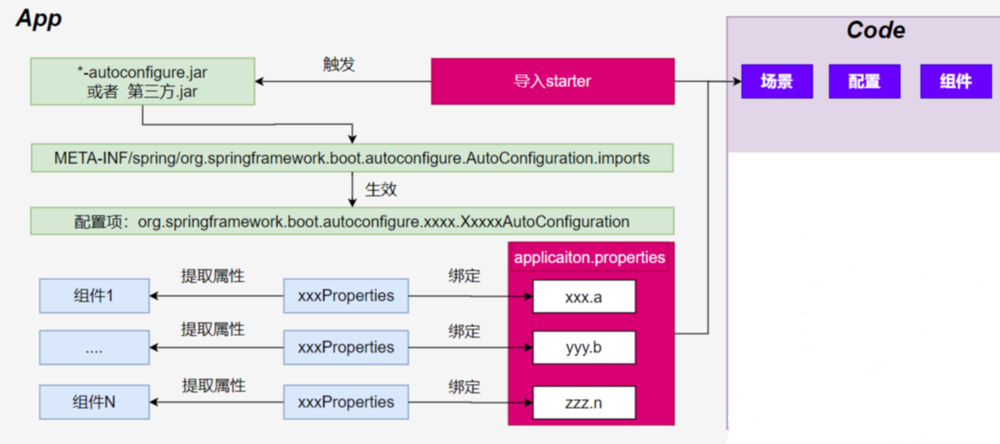

# Spring Boot 3

**特性：**

- 快速创建独立 Spring 应用

- SSM：导包、写配置、启动运行

- 直接嵌入Tomcat、Jetty or Undertow（无需部署 war 包）【Servlet容器】

- linux  java tomcat mysql： war 放到 tomcat 的 webapps下
- jar： java环境；  java -jar

- **重点**：提供可选的starter，简化应用**整合**

- **场景启动器**（starter）：web、json、邮件、oss（对象存储）、异步、定时任务、缓存 ...
- 导包一堆，控制好版本
- 为每一种场景准备了一个依赖； **web-starter、mybatis-starter**

- **重点：**按需自动配置 Spring 以及 第三方库

- 如果这些场景我要使用（生效） 这个场景的所有配置都会自动配置好
- **约定大于配置**：每个场景都有很多默认配置
- 自定义：配置文件中修改几项就可以

- 提供生产级特性：如 监控指标、健康检查、外部化配置等

- 监控指标、健康检查（k8s）、外部化配置

- 无代码生成、无xml

总结：简化开发，简化配置，简化整合，简化部署，简化监控，简化运维

> `pom.xml`：https://docs.spring.io/spring-boot/docs/current/reference/html/using.html#using.build-systems.starters

> `application.properties`：https://docs.spring.io/spring-boot/docs/current/reference/html/application-properties.html#appendix.application-properties

**Reference**：https://www.bilibili.com/video/BV1Es4y1q7Bf

**Code**：https://gitee.com/leifengyang/spring-boot-3

