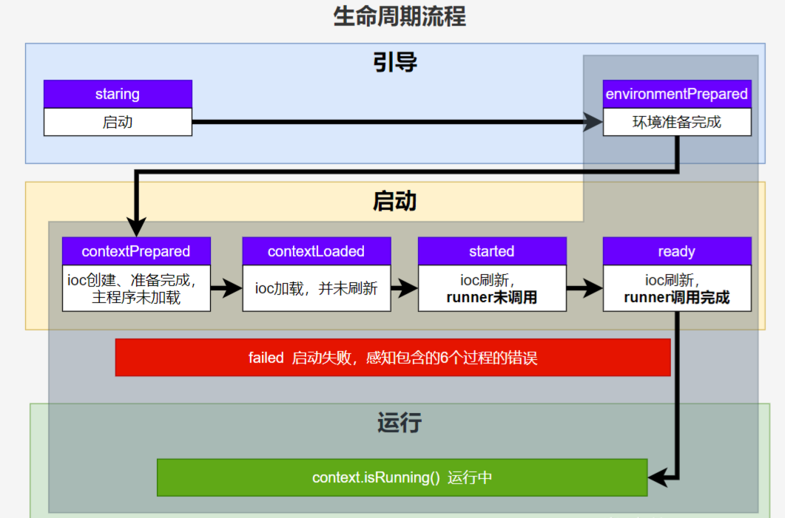
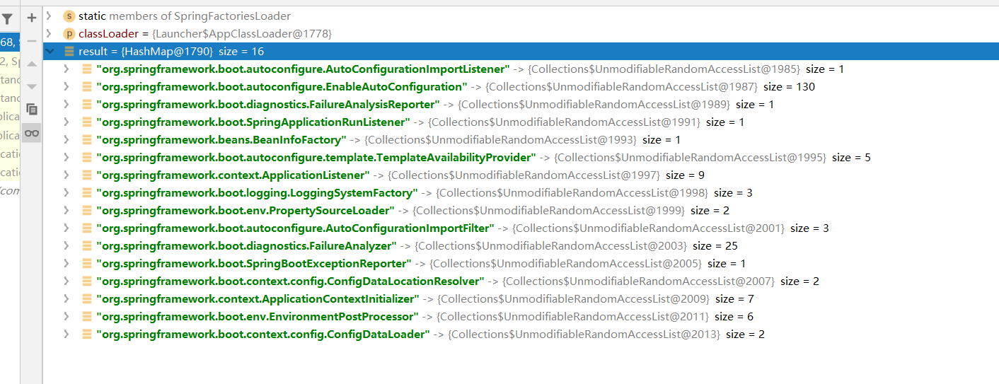
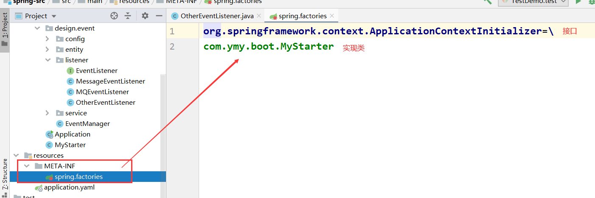
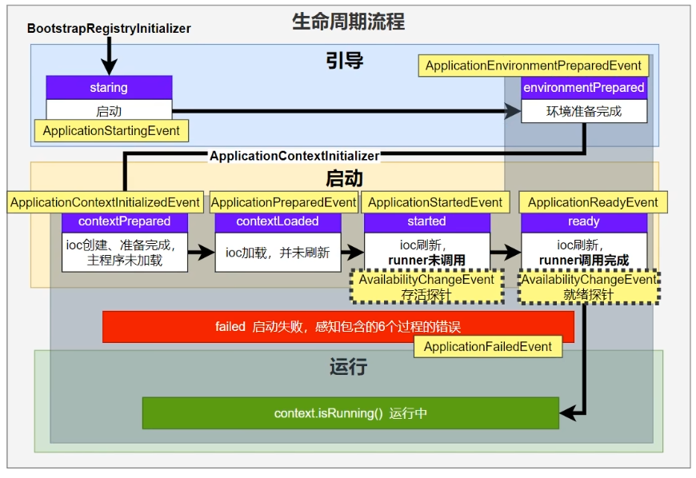
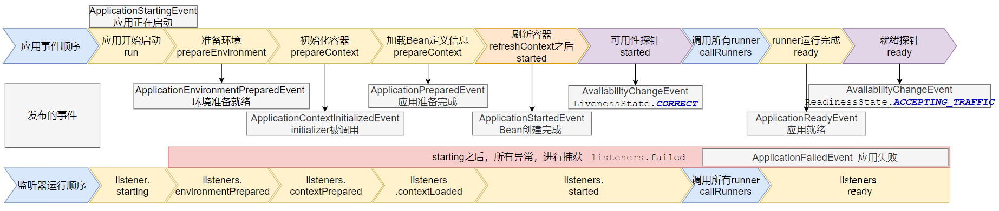
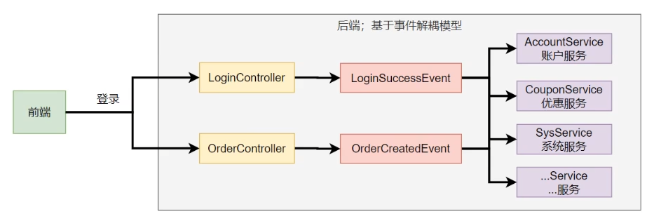

# SpringBoot 启动流程




1. new SpringApplication

```java
// 1. 主启动类
@SpringBootApplication
public class Application {
    public static void main(String[] args) {
        SpringApplication.run(Application.class, args);
    }
}

// 2. SpringApplication.run(Class, String... args) 做了两件事
// 2.1: 创建 SpringApplication 对象。
// 2.2: 调用 SpringApplication 的 run(String... args)方法

// 3: 创建 SpringApplication 对象

// SpringApplication的构造器
public SpringApplication(ResourceLoader resourceLoader, Class<?>... primarySources) {
    // primarySouces 就是我们主启动类的类名
    this.primarySources = new LinkedHashSet<>(Arrays.asList(primarySources));
    
    // 标识是 Servlet 应用
    this.webApplicationType = WebApplicationType.deduceFromClasspath();
    
    // getSpringFactoriesInstances() 
    // 1:从META-INF/spring.factories中拿到Initializers和Listeners的全限定类名
    // 2:利用反射实例化对象
    // 3:将Initializers和Listeners设置到 SpringApplication 的属性中（setxxx） 
    setInitializers((Collection) getSpringFactoriesInstances(Ap xtInitializer.class));
    setListeners((Collection) getSpringFactoriesInstances(ApplicationListener.class));
    
    // 获得主启动类
    this.mainApplicationClass = deduceMainApplicationClass();
}
```

> **getSpringFactoriesInstances(Class<?> type) 解析**：
>
> 1、第一次调用时，从META-INF/spring.factories配置文件中获取所有的全限定类名，然后放到Map中。之后再调用，就直接看Map是否为null就行了，Map存在直接从Map中拿就行。
>
> 2、从Map中获取 Initialize 和 Listener 的全限定类名，并通过反射创建实例。
>
> 3、将反射创建的实例，设置到 SpringApplication 的属性中。

下图就是 `META-INF/spring.factories` 中的全限定类名，存储到 Map 中。




我们在 classpath 下 自定义一个 `META-INF/spring.factories` 然后自定义一个对应的类，该类也会自动加入到 IoC 容器中。 



2. run

```java
// 1.1 中的 new SpringApplication() 就是这里
// 接下来运行 run(String... args)
// run() 方法会运行spring应用，创建和刷新一个新的 ApplicationContext
public static ConfigurableApplicationContext run(Class<?>[] primarySources, String[] args) {
    return new SpringApplication(primarySources).run(args); // (1)
}

// 1.2. (1) 中的 run() 方法
public ConfigurableApplicationContext run(String... args) {
    // 启动计时器
    StopWatch stopWatch = new StopWatch();
    stopWatch.start();
    
    DefaultBootstrapContext bootstrapContext = createBootstrapContext();
    
    // ApplicationContext 上下文
    // environment、beanFactory...等信息都存在这里
    ConfigurableApplicationContext context = null;
    configureHeadlessProperty();
    
    // 获得监听器(listeners)
    SpringApplicationRunListeners listeners = getRunListeners(args);
    
    // 触发应用启动的事件，会调用监听器，相应的监听器会处理该事件
    listeners.starting(bootstrapContext, this.mainApplicationClass);
    try {
        ApplicationArguments applicationArguments = new DefaultApplicationArguments(args);
        
        // 获得应用运行环境
        ConfigurableEnvironment environment = prepareEnvironment(listeners, bootstrapContext, applicationArguments);
       
        // 配置是否忽略Bean信息
        // application.properties中spring.beaninfo.ignore=true默认
        configureIgnoreBeanInfo(environment);
        
        // 打印 Banner 图
        Banner printedBanner = printBanner(environment);
        
        // 创建 ApplicationContext
        // context中包含了 DefaultListableBeanFactory
        context = createApplicationContext();
        context.setApplicationStartup(this.applicationStartup);
        
        // 在 ApplicationContext 中设置一系列属性
        // load the sources 包括主启动类(primarySource)，加载到BeanFactory中
        // 加载 beans 到应用程序的上下文
        prepareContext(bootstrapContext, context, environment, listeners, applicationArguments, printedBanner);
        
        // 超级重要！！
        // 整合 Spring, 重要~ 可以结合 Spring 的流程图看了
        // 设置 BeanFactory 的属性
        // 调用 BeanFactoryPostProcessor
        // 完成 BeanFactory 的初始化 ==> 创建所有非懒加载的单例对象
        // 处理各种注解@Configuration @ComponentScan @Import等注解
        refreshContext(context);
        
        
        afterRefresh(context, applicationArguments);
        
        // 启动完成
        stopWatch.stop();
        if (this.logStartupInfo) {
            new StartupInfoLogger(this.mainApplicationClass).logStarted(getApplicationLog(), stopWatch);
        }
        
        // 发布应用启动完成的事件，触发对应的监听器
        listeners.started(context);
        callRunners(context, applicationArguments);
    }
    catch (Throwable ex) {
        handleRunFailure(context, ex, listeners);
        throw new IllegalStateException(ex);
    }

    try {
        listeners.running(context);
    }
    catch (Throwable ex) {
        handleRunFailure(context, ex, null);
        throw new IllegalStateException(ex);
    }
    return context;
}
```

3. 流程图


## 事件和监听器

回调监听器

- `BootstrapRegistryInitializer`：    **感知特定阶段：**感知**引导初始化**

  - `META-INF/spring.factories`

  - 创建引导上下文`bootstrapContext`的时候触发。

  - `application.addBootstrapRegistryInitializer()`;

  - 场景：`进行密钥校对授权。

- ApplicationContextInitializer：   **感知特定阶段：** 感知ioc容器初始化

  - `META-INF/spring.factories`

  - application.addInitializers();

- **ApplicationListener：    感知全阶段：基于事件机制，感知事件。 一旦到了哪个阶段可以做别的事**

  - `@Bean`或`@EventListener`： `事件驱动`

  - `SpringApplication.addListeners(…)`或 `SpringApplicationBuilder.listeners(…)`

  - `META-INF/spring.factories`

- **SpringApplicationRunListener：       感知全阶段生命周期 + 各种阶段都能自定义操作； 功能更完善。**
  - `META-INF/spring.factories`

- **ApplicationRunner:          感知特定阶段：感知应用就绪Ready。卡死应用，就不会就绪**
  - `@Bean`

- **CommandLineRunner：   感知特定阶段：感知应用就绪Ready。卡死应用，就不会就绪**
  - `@Bean`


## 完整触发流程

**9 大事件** 触发顺序&时机

1. `ApplicationStartingEvent`：应用启动但未做任何事情, 除过注册listeners and initializers.
2. `ApplicationEnvironmentPreparedEvent`：  Environment 准备好，但context 未创建.
3. `ApplicationContextInitializedEvent`: ApplicationContext 准备好，ApplicationContextInitializers 调用，但是任何bean未加载
4. `ApplicationPreparedEvent`： 容器刷新之前，bean定义信息加载
5. `ApplicationStartedEvent`： 容器刷新完成， runner未调用

=========以下就开始插入了**探针机制**============

1. `AvailabilityChangeEvent`： `LivenessState.CORRECT`应用存活； **存活探针**
2. `ApplicationReadyEvent`: 任何runner被调用
3. `AvailabilityChangeEvent`：`ReadinessState.ACCEPTING_TRAFFIC`**就绪探针**，可以接请求
4.  `ApplicationFailedEvent `：启动出错



应用事件发送顺序如下：



> 感知应用是否**存活**了：可能植物状态，虽然活着但是不能处理请求
> 应用是否**就绪**了：能响应请求，说明确实活的比较好


## 事件驱动开发

**应用启动过程生命周期事件感知（9大事件）**、**应用运行中事件感知（无数种）**。

- **事件发布**：`ApplicationEventPublisherAware`或`注入：ApplicationEventMulticaster`
- **事件监听**：`组件 + @EventListener`




# **容器启动流程**


## **运行机制**


## 事件驱动模型

