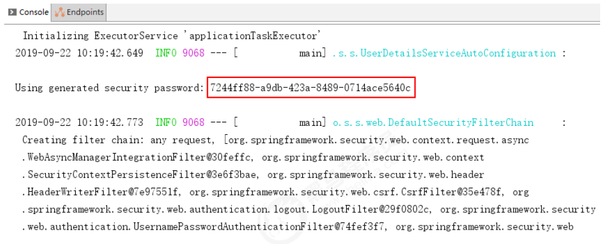
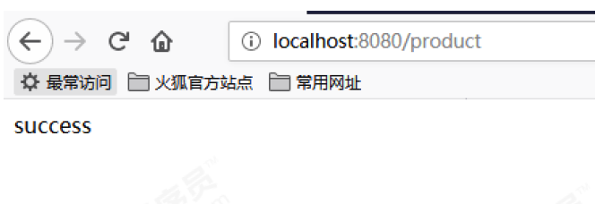
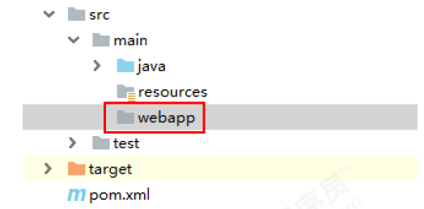
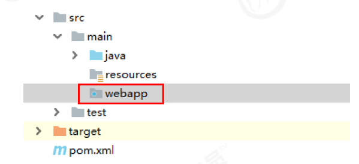
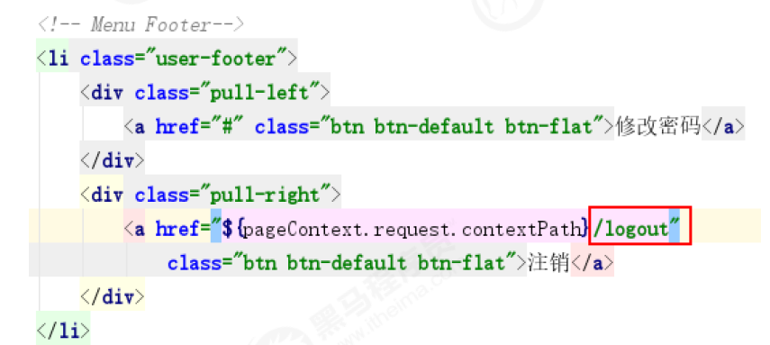
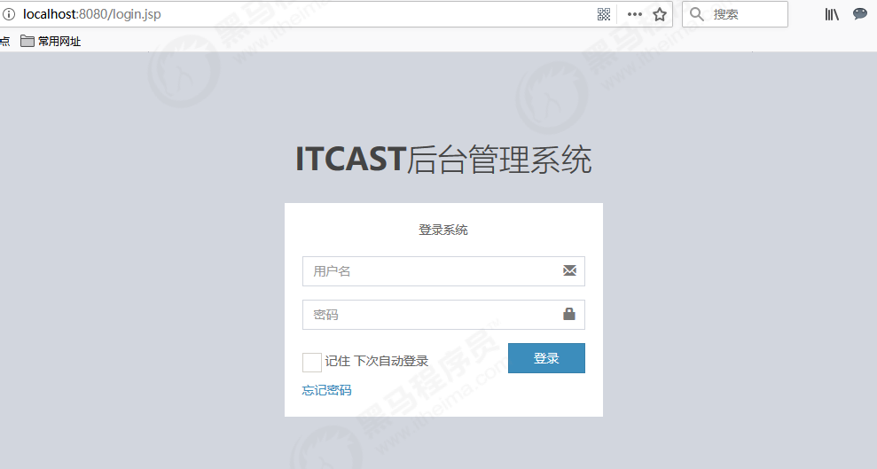
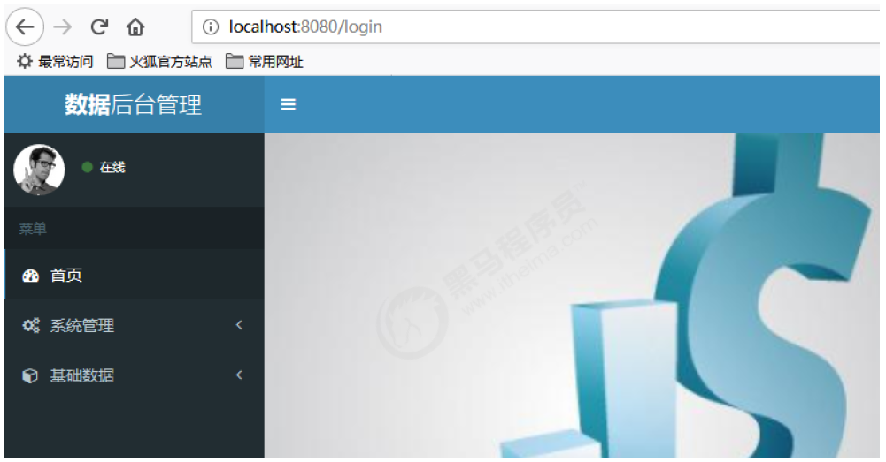
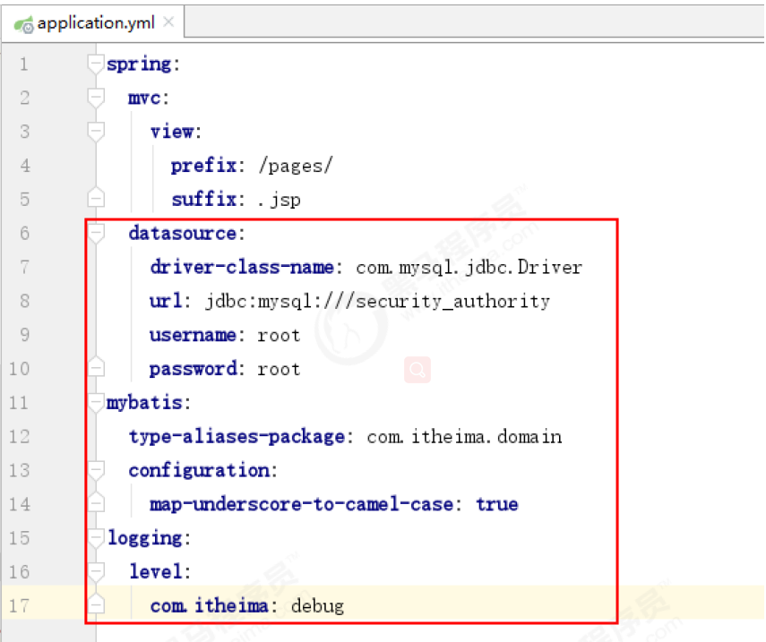
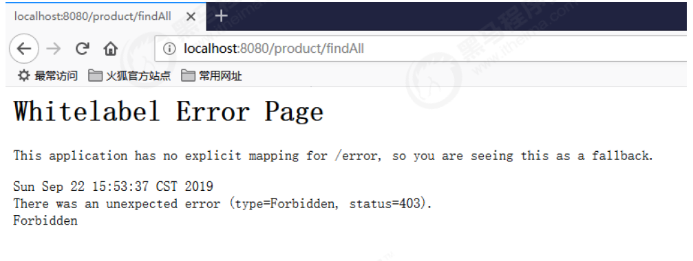

# SpringSecurity在单机环境下使用

## 技术选型

SpringBoot2.1.3，SpringSecurity，MySQL，mybatis，jsp

## 初步整合认证第一版

### 创建工程并导入jar包

先只导入SpringBoot

```xml
<parent>
    <groupId>org.springframework.boot</groupId>
    <artifactId>spring-boot-starter-parent</artifactId>
    <version>2.1.3.RELEASE</version>
    <relativePath/>
</parent>

<dependencies>
    <dependency>
    <groupId>org.springframework.boot</groupId>
    <artifactId>spring-boot-starter-web</artifactId>
    </dependency>
</dependencies>
```

### 提供处理器

```java
@Controller
@RequestMapping("/product")
public class ProductController {
    @RequestMapping
    @ResponseBody
	public String hello(){
    	return "success";
    }
}
```

### 编写启动类

```java
@SpringBootApplication
public class SecurityApplication {
    public static void main(String[] args) {
    	SpringApplication.run(SecurityApplication.class, args);
    }
}
```

### 测试效果

使用SpringBoot内置tomcat启动项目，即可访问处理器。


### 加入SpringSecurity的jar包

```xml
<dependency>
    <groupId>org.springframework.boot</groupId>
    <artifactId>spring-boot-starter-security</artifactId>
</dependency>
```

### 重启再次测试

SpringBoot已经为SpringSecurity提供了默认配置，默认所有资源都必须认证通过才能访问。


那么问题来了！此刻并没有连接数据库，也并未在内存中指定认证用户，如何认证呢？

其实SpringBoot已经提供了默认用户名user，密码在项目启动时随机生成，如图：



认证通过后可以继续访问处理器资源：



## 整合认证第二版

加入jsp，使用自定义认证页面

### 说明

SpringBoot官方是不推荐在SpringBoot中使用jsp的，那么到底可以使用吗？答案是肯定的！

不过需要导入tomcat插件启动项目，不能再用SpringBoot默认tomcat了。

我们不能 通过启动类的方式来进行启动了，因为它会不识别Jsp页面，必须导入jar包，然后更换方法

### 导入SpringBoot的tomcat启动插件jar包

```xml
<dependency>
    <groupId>org.springframework.boot</groupId>
    <artifactId>spring-boot-starter-tomcat</artifactId>
</dependency>
<dependency>
    <groupId>org.apache.tomcat.embed</groupId>
    <artifactId>tomcat-embed-jasper</artifactId>
</dependency>
```

### 加入jsp页面等静态资源

在src/main目录下创建webapp目录



这时webapp目录并不能正常使用，因为只有web工程才有webapp目录，在pom文件中修改项目为web工程


这时webapp目录，可以正常使用了！



导入第一天案例中静态资源，注意WEB-INF就不用了哈！


修改login.jsp中认证的url地址


修改header.jsp中退出登录的url地址



### 提供SpringSecurity配置类

```java
@Configuration
@EnableWebSecurity
@EnableGlobalMethodSecurity(securedEnabled=true)
public class WebSecurityConfig extends WebSecurityConfigurerAdapter {

    @Autowired
    private UserService userService;

    @Bean
    public BCryptPasswordEncoder passwordEncoder(){
        return new BCryptPasswordEncoder();
    }

    //指定认证对象的来源
    public void configure(AuthenticationManagerBuilder auth) throws Exception {
        auth.userDetailsService(userService).passwordEncoder(passwordEncoder());
    }
    //SpringSecurity配置信息
    public void configure(HttpSecurity http) throws Exception {
        http.authorizeRequests()
                .antMatchers("/login.jsp", "failer.jsp", "/css/**", "/img/**", "/plugins/**").permitAll()
                .antMatchers("/product").hasAnyRole("USER")
                .anyRequest().authenticated()
                .and()
                .formLogin()
                .loginPage("/login.jsp")
                .loginProcessingUrl("/login")
                .successForwardUrl("/index.jsp")
                .failureForwardUrl("/failer.jsp")
                .and()
                .logout()
                .logoutSuccessUrl("/logout")
                .invalidateHttpSession(true)
                .logoutSuccessUrl("/login.jsp")
                .and()
                .csrf()
                .disable();
    }
}
```

### 修改产品处理器

有页面了，就跳转一个真的吧！

```java
@Controller
@RequestMapping("/product")
public class ProductController {
    @RequestMapping("/findAll")
    public String findAll(){
	    return "product-list";
    }
}
```

### 配置视图解析器


### 使用tomcat插件启动项目


### 测试效果

自定义的认证页面



认证成功页面



## 整合认证第三版【数据库认证】

### 数据库环境准备

依然使用security_authority数据库，sql语句在第一天资料里。

### 导入数据库操作相关jar包

```xml
<!--MySQL驱动包-->
<dependency>
    <groupId>mysql</groupId>
    <artifactId>mysql-connector-java</artifactId>
    <version>5.1.47</version>
</dependency>
<!--springboot启动类-->
<dependency>
    <groupId>tk.mybatis</groupId>
    <artifactId>mapper-spring-boot-starter</artifactId>
    <version>2.1.5</version>
</dependency>
<!--导入通用Mapper-->
<dependency>
    <groupId>tk.mybatis</groupId>
    <artifactId>mapper-spring-boot-starter</artifactId>
    <version>2.1.5</version>
</dependency>
```

### 在配置文件中添加数据库操作相关配置



### 在启动类上添加扫描dao接口包注解


### 创建用户pojo对象

这里直接实现SpringSecurity的用户对象接口，并添加角色集合私有属性。注意接口属性都要标记不参与json的处理

```java
@Data
public class SysRole implements GrantedAuthority {

    private Integer id;
    private String roleName;
    private String roleDesc;
}
```


### 创建角色pojo对象

这里直接使用SpringSecurity的角色规范，我们实现UserDetails的类型

```java
@Data
public class SysUser implements UserDetails {

    private Integer id;
    private String username;
    private String password;
    private Integer status;
    private List<SysRole> roles;
    
    @JsonIgnore
    @Override
    public Collection<? extends GrantedAuthority> getAuthorities() {
        return roles;
    }

    @Override
    public String getPassword() {
        return password;
    }

    @Override
    public String getUsername() {
        return username;
    }

    @JsonIgnore
    @Override
    public boolean isAccountNonExpired() {
        return true;
    }

    @JsonIgnore
    @Override
    public boolean isAccountNonLocked() {
        return true;
    }

    @JsonIgnore
    @Override
    public boolean isCredentialsNonExpired() {
        return true;
    }

    @JsonIgnore
    @Override
    public boolean isEnabled() {
        return true;
    }
}
```

### 提供角色mapper接口

```java
public interface RoleMapper extends Mapper<SysRole> {
    @Select("SELECT r.id, r.role_name roleName, r.role_desc roleDesc " +
    "FROM sys_role r, sys_user_role ur " +
    "WHERE r.id=ur.rid AND ur.uid=#{uid}")
    public List<SysRole> findByUid(Integer uid);
}
```

### 提供用户mapper接口

这里就用到了Mybatis的一对多进行操作

```java
public interface UserMapper extends Mapper<SysUser> {

    @Select("select * from sys_user where username = #{username}")
    @Results({
            @Result(id = true, property = "id", column = "id"),
            @Result(property = "roles", column = "id", javaType = List.class,
                many = @Many(select = "com.itheima.mapper.RoleMapper.findByUid"))
    })
    public SysUser findByName(String username);
}
```

### 提供认证service接口

```java
@Service
@Transactional
public class UserServiceImpl implements UserService {
    @Autowired
    private UserMapper userMapper;
    @Override
    public UserDetails loadUserByUsername(String s) throws UsernameNotFoundException {
    	return userMapper.findByUsername(s);
    }
}
```

### 在启动类中把加密对象放入IOC容器

```java
@SpringBootApplication
@MapperScan("com.itheima.mapper")
public class SecurityApplication {
    public static void main(String[] args) {
    	SpringApplication.run(SecurityApplication.class, args);
    }
    @Bean
    public BCryptPasswordEncoder passwordEncoder(){
    	return new BCryptPasswordEncoder();
    }
}
```

### 修改配置类

```java
@Configuration
@EnableWebSecurity
@EnableGlobalMethodSecurity(securedEnabled=true)
public class WebSecurityConfig extends WebSecurityConfigurerAdapter {

    @Autowired
    private UserService userService;

    @Bean
    public BCryptPasswordEncoder passwordEncoder(){
        return new BCryptPasswordEncoder();
    }

    //指定认证对象的来源
    public void configure(AuthenticationManagerBuilder auth) throws Exception {
        auth.userDetailsService(userService).passwordEncoder(passwordEncoder());
    }
    //SpringSecurity配置信息
    public void configure(HttpSecurity http) throws Exception {
        http.authorizeRequests()
                .antMatchers("/login.jsp", "failer.jsp", "/css/**", "/img/**", "/plugins/**").permitAll()
                .antMatchers("/product").hasAnyRole("USER")
                .anyRequest().authenticated()
                .and()
                .formLogin()
                .loginPage("/login.jsp")
                .loginProcessingUrl("/login")
                .successForwardUrl("/index.jsp")
                .failureForwardUrl("/failer.jsp")
                .and()
                .logout()
                .logoutSuccessUrl("/logout")
                .invalidateHttpSession(true)
                .logoutSuccessUrl("/login.jsp")
                .and()
                .csrf()
                .disable();
    }
}
```

大功告成尽管测试，注意还是用插件启动项目，使用数据库表中的用户名和密码。

### 整合实现授权功能

在启动类上添加开启方法级的授权注解


### 在产品处理器类上添加注解

要求产品列表功能必须具有ROLE_ADMIN角色才能访问！


### 重启项目测试

再次访问产品列表发现权限不足



### 指定自定义异常页面

编写异常处理器拦截403异常

```java
@ControllerAdvice
public class HandleControllerException {
    @ExceptionHandler(RuntimeException.class)
    public String exceptionHandler(RuntimeException e){
    	if(e instanceof AccessDeniedException){
            //如果是权限不足异常，则跳转到权限不足页面！
            return "redirect:/403.jsp";
    	}
        //其余的异常都到500页面！
        return "redirect:/500.jsp";
    }
}
```

再次测试产品列表就可以到自定义异常页面了


