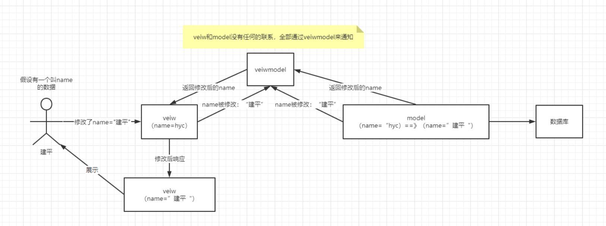
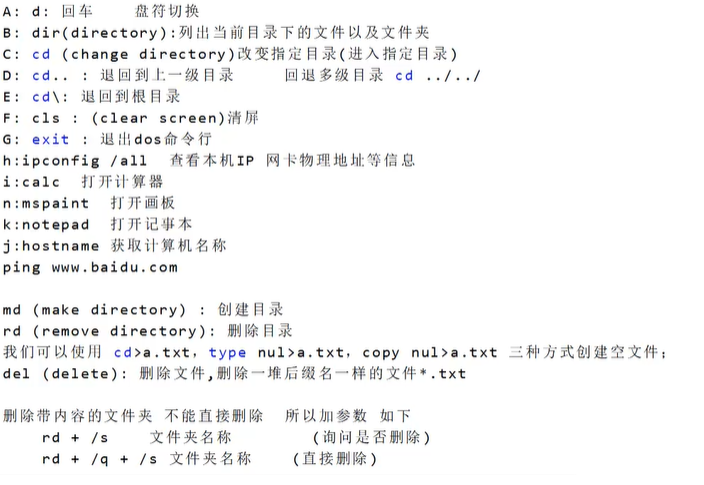

# vue

冲冲冲，美好的新的一天~

## 1、什么是 vue.js

Vue (读音 /vjuː/，类似于 **view**) 是一套用于构建用户界面的**渐进式框架**。

与其它大型框架不同的是，Vue 被设计为可以自底向上逐层应用。Vue 的核心库只关注视图层，不仅易于上手，还便于与第三方库或既有项目整合。另一方面，当与[现代化的工具链](https://cn.vuejs.org/v2/guide/single-file-components.html)以及各种[支持类库](https://github.com/vuejs/awesome-vue#libraries--plugins)结合使用时，Vue 也完全能够为复杂的单页应用提供驱动。

### 1.1、 Vue的优点：

- 在有[HTML](https://baike.baidu.com/item/HTML/97049)，[CSS](https://baike.baidu.com/item/CSS/5457)，[JavaScript](https://baike.baidu.com/item/JavaScript/321142)的基础上，快速上手。
- 简单小巧的核心，渐进式技术栈，足以应付任何规模的应用。
- 20kb min+gzip 运行大小、超快虚拟 [DOM](https://baike.baidu.com/item/DOM/50288) 、最省心的优化 
- 简单轻巧，功能强大，拥有非常容易上手的 API；
- 可组件化 和 响应式设计；
- 实现数据与结构分离，高性能，易于浏览器的加载速度；
- MVVM 模式，数据双向绑定，减少了 DOM 操作，将更多精力放在数据和业务逻辑上。

虚拟dom和数据双向绑定

### 1.2、mvvm框架

MVVM是对mvc和mvp两种模式的进一步改进的模式

view：视图层(UI用户界面)

ViewModel：业务逻辑层（一切 js 可视为业务逻辑）,及时修改，及时编译

Model：数据层（存储数据及对数据的处理如增删改查）

- MVVM将数据双向（data-binding）绑定作为核心思想，view和model之间没有练习
- 他们通过ViewModel这个桥梁进行交互。
- Model和Veiw之间是双向的，只要二者有一个发生变化，veiwmodel就会使另一个跟着发生同样的变化，

流程图：



### vue七大常用对象：

- el属性
- - 用来指示vue编译器从什么地方开始解析 vue的语法，可以说是一个占位符。
- data属性
- - 用来组织从view中抽象出来的属性，可以说将视图的数据抽象出来存放在data中。
- template属性
- - 用来设置模板，会替换页面元素，包括占位符。
- methods属性
- - 放置页面中的业务逻辑，js方法一般都放置在methods中
- render属性
- - 创建真正的Virtual Dom
- computed属性
- - 用来计算
- watch属性
- - watch:function(new,old){}
  - 监听data中数据的变化
  - 两个参数，一个返回新值，一个返回旧值，

## 2、vue的基础语法

### 2.1、v-if

语法：

- v-if
- v-else-if
- v-else

1. `<h1 v-if="type==='A'">A</h1>`
2. `<h1 v-else-if="type==='B '">B</h1>`
3. `<h1 v-else>c</h1>`

可以根据条件来异步更新数据

```
<script>    
	var vm  = new Vue({        
		el:"#hello-vue",        
		data:{           
			type : "A"        
		}    
	});
</script>
```

### 2.2、v-for

语法：

- v-for

1. `<div id="hello-vue">`
2. `<li v-for="(item,index) in items">`
3. `    { {item.message} }--- { {index} }`
4. `</li>`
5. `</div>`

根据使用了的v-for的js

1. `<script>`
2. `    var vm  = new Vue({`
3. `        el:"#hello-vue",`
4. `        data:{`
5. `            items:[`
6. `                {message:'hyc玩vue'},`
7. `                {message: 'hyc玩后端'},`
8. `                {message: 'hyc运维'}`
9. `                ]`
10. `        }`
11. `    });`
12. `</script>`


## 3、双向绑定

**Vue.js是一个MVVM框架，即是数据双向绑定，当数据变化的时候视图也跟着变化，视图变化的时候，数据也跟着变化。**

### 3.1、v-model

#### v-model是什么

v-model就是vue的双向绑定的指令，能将页面上控件输入的值同步更新到相关绑定的data属性，也会在更新data绑定属性时候，更新页面上输入控件的值。

#### 为什么使用v-model

v-model作为双向绑定指令也是vue两大核心功能之一，使用非常方便，提高前端开发效率。在view层，model层相互需要数据交互，即可使用v-model。

v-model主要提供了两个功能，view层输入值影响data的属性值，data属性值发生改变会更新view层的数值变化。

其核心就是，一方面modal层通过defineProperty来劫持每个属性，一旦监听到变化通过相关的页面元素更新。另一方面通过编译模板文件，为控件的v-model绑定input事件，从而页面输入能实时更新相关data属性值。


### 新建Vue步骤：

1. 需要下载 node.js 与 npm  / cnpm

2. 输入 node -v 与 npm -v  查看是否下载成功

3. cnpm install vur-cli -g 安装 

4. vue list  查看可以创建的项目

5. cnpm init webpack <项目名>    （一直NO）

6. 初始化运行    

   cd <项目名> 

   npm install

   npm run dev




### 安装webpack

1. npm install webpack -g
2. npm install webpack-cli -g
3. webpack -v  查看版本
4. 在项目中 webpack 打包  (需要编写webpack.config.js 文件)

### 在项目中安装vue-router 

1. 在项目中 npm install vue-router --save-dev
2. 同时  npm audit fix  (有错输入)


# *hash和history模式*

> Vue-Router有两种模式：hash模式和history模式。默认的路由模式是hash模式。

## 1、hash模式

hash模式是开发中**默认的模式**，也称作**锚点**，它的**URL带着一个#**，例如：www.abc.com/#/vue，它的hash值就是#/vue。

### 特点：

- hash值会出现在URL里面，但是**不会出现在HTTP请求中**，对后端没有影响。所以改变hash值不会重新加载页面。
- 这种模式的浏览器支持度很好，低版本的IE浏览器也支持这种模式。
- hash路由被称为是前端路由，已经成为SPA（单页面应用）的标配。

### 原理：

hash模式的主要原理就是onhashchange()事件：

```javascript
window.onhashchange = function(event){
	console.log(event.oldURL, event.newURL);
	let hash = location.hash.slice(1);
}
```

使用onhashchange()事件的好处就是，在页面的hash值发生变化时，无需向后端发起请求，window就可以监听事件的改变，并按规则加载相应的代码。除此之外，hash值变化对应的URL都会被浏览器记录下来，这样浏览器就能实现页面的前进和后退。虽然是没有请求后端服务器，但是页面的hash值和对应的URL关联起来了。

### 获取页面hash变化的方法：

**（1）监听$route的变化：**

```javascript
// 监听,当路由发生变化的时候执行
watch: {
  $route: {
    handler: function(val, oldVal){
      console.log(val);
    },
    // 深度观察监听
    deep: true
  }
},
```

**（2）通过window.location.hash读取#值：**
window.location.hash 的值可读可写，读取来判断状态是否改变，写入时可以在不重载网页的前提下，添加一条历史访问记录。

## 2、history模式

history模式**直接指向history对象**，它表示当前窗口的浏览历史，history对象保存了当前窗口访问过的所有页面网址。URL中**没有#**，它使用的是传统的路由分发模式，即用户在输入一个URL时，服务器会接收这个请求，并解析这个URL，然后做出相应的逻辑处理。

### 特点：

- 当使用history模式时，URL就像这样：hhh.com/user/id。相比hash模式更加好看。
- 虽然history模式不需要#。但是，它也有自己的缺点，就是在刷新页面的时候，如果没有相应的路由或资源，就会刷出404来。

history api可以分为两大部分，**切换历史状态** 和 **修改历史状态**：

**修改历史状态：**
包括了 HTML5 History Interface 中新增的 pushState() 和 replaceState() 方法，这两个方法应用于浏览器的历史记录栈，提供了对历史记录进行修改的功能。只是当他们进行修改时，虽然修改了url，但浏览器不会立即向后端发送请求。如果要做到改变url但又不刷新页面的效果，就需要前端用上这两个API。

**切换历史状态：**
包括forward()、back()、go()三个方法，对应浏览器的前进，后退，跳转操作。

### 配置：

想要设置成history模式，就要进行以下的配置（后端也要进行配置）：

```javascript
const router = new VueRouter({
  mode: 'history',
  routes: [...]
})
```

## 3、两者对比

调用 history.pushState() 相比于直接修改 hash，存在以下优势:

- pushState() 设置的新 URL 可以是与当前 URL 同源的任意 URL；而 hash 只可修改 # 后面的部分，因此只能设置与当前 URL 同文档的 URL。
- pushState() 设置的新 URL 可以与当前 URL 一模一样，这样也会把记录添加到栈中；而 hash 设置的新值必须与原来不一样才会触发动作将记录添加到栈中。
- pushState() 通过 stateObject 参数可以添加任意类型的数据到记录中；而 hash 只可添加短字符串。
- pushState() 可额外设置 title 属性供后续使用。
- hash模式下，仅hash符号之前的url会被包含在请求中，后端如果没有做到对路由的全覆盖，也不会返回404错误；history模式下，前端的url必须和实际向后端发起请求的url一致，如果没有对用的路由处理，将返回404错误。

## 4、总结

- hash模式URL上带有#，仅 hash 符号之前的内容会被包含在请求中，如 www.hhh.com，因此对于后端来说，即使没有做到对路由的全覆盖，也不会返回 404 错误。
- hash模式URL上没有#，前端的 URL 必须和实际向后端发起请求的 URL 一致，如 www.hhh.com/user/id。如果后端缺少对 /use/id 的路由处理，将返回 404 错误。