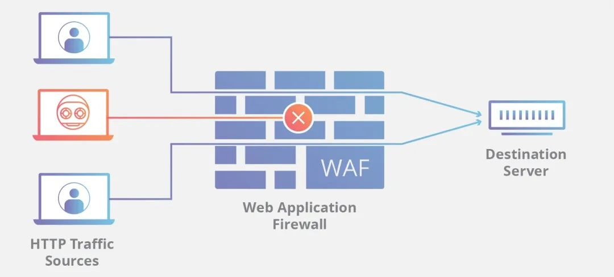

# WAF


## 简介

​	WAF 是 Web 应用防火墙（Web Application Firewall）的缩写，也就是我们俗称的网站防火墙。它可以**保护网站不被黑客所攻击**，通常以 Web 网关的形式存在，作为反向代理接入。WAF 可以识别常见的 Web 攻击并实施阻断，比如：SQL 注入、跨站脚本攻击（XSS）、跨站请求伪造（CSRF）、服务端请求伪造（SSRF）、WebShell 上传与通信等等。



> GitHub：https://github.com/chaitin/safeline

​	底层基于 Nginx 的 Web 网关，作为反向代理接入网络，清洗来自黑客的恶意流量，保护你的网站不受黑客攻击。雷池拥有友好的 Web 界面。


## 部署

雷池采用容器化部署的方式，服务由多个 Docker 容器组成，支持**简单方便的一条龙安装脚本**。只要服务器能联网，执行安装脚本后，自动拉取镜像、初始化配置文件、启动服务一气呵成。

### 1 一条命令安装

直接使用在线安装脚本

```
bash -c "$(curl -fsSLk https://waf-ce.chaitin.cn/release/latest/setup.sh)"
```

### 2 克隆仓库安装

克隆仓库后，执行 `setup.sh`  脚本即可安装

```
git clone git@github.com:chaitin/safeline.git
cd safeline
bash ./setup.sh
```

### 3 安装成功

整个安装过程对新手十分友好，提示词为中文、自动安装 Docker 等，只需按照提示一路向下即可

```
  ____             __          _       _
 / ___|    __ _   / _|   ___  | |     (_)  _ __     ___
 \___ \   / _` | | |_   / _ \ | |     | | | '_ \   / _ \
  ___) | | (_| | |  _| |  __/ | |___  | | | | | | |  __/
 |____/   \__,_| |_|    \___| |_____| |_| |_| |_|  \___|

[SafeLine] 脚本调用方式确认正常
[SafeLine] 缺少 Docker 环境
[SafeLine] 是否需要自动安装 Docker (Y/n)
# Executing docker install script, commit: xxx
...
[SafeLine] 雷池安装目录 (留空则为 '/data/safeline'):
[SafeLine] 目录 '/data/safeline' 当前剩余存储空间为 47G ，雷池至少需要 5G，是否确定 (Y/n)
[SafeLine] 创建安装目录 '/data/safeline' 成功
...
[SafeLine] 雷池 WAF 社区版安装成功，请访问以下地址访问控制台
[SafeLine] https://0.0.0.0:9443/  # 安装成功
```

安装完成后，根据提示访问本地的 Web 服务端口即可开始使用


##  Capability

​	Web 攻击检测能力由语义分析算法驱动，不同于通用的语义分析，雷池的自动机引擎 `yanshi` 可以支持对片段语法进行分析，对 HTTP 请求参数进行自动化递归解码，提取请求参数中的攻击片段，并通过攻击打分模型对参数中的攻击代码进行识别，最终判定 HTTP 请求是否为恶意攻击，具备对通用攻击的防护能力，也具备泛化识别能力，可以实现无规则检测 `0 Day` 攻击

​	**集成了基于恶意 IP 情报、客户端指纹、鼠标键盘行为识别、访问频率限制的人机验证算法，可用来对抗爬虫、对抗扫描、对抗 CC 攻击**。

​	支持通过可视化页面配置网站的访问控制黑白名单，允许匹配源 IP、路径、域名、Header、Body 等条件。

​	基于 HTTP 流量自动识别 Web 资源，从而生成 API 画像持续统计和分析。采用动态基线和预测分析技术分析异常访问行为，精准识别操作正常但请求异常的攻击行为，从正常行为中检测出异常流量。