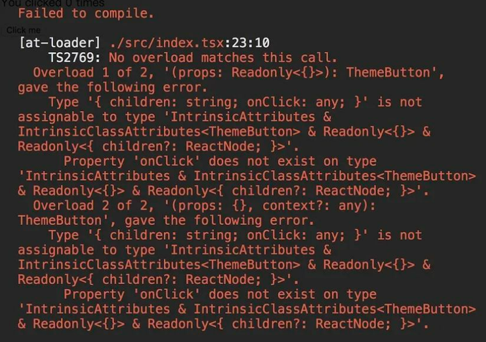
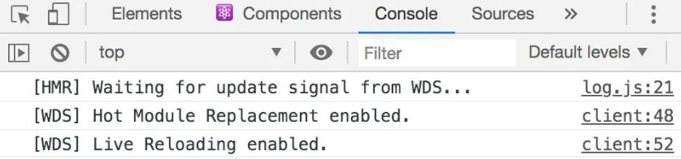
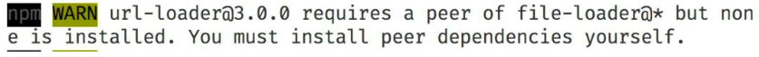
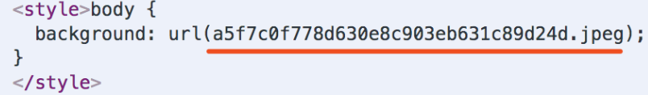
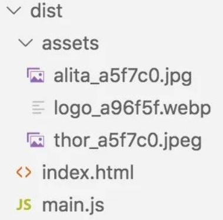
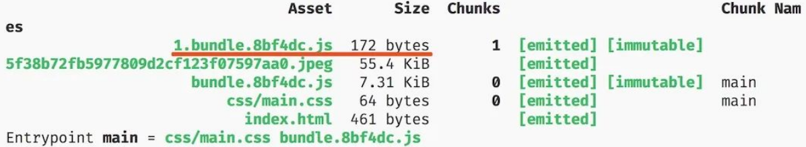

# Webpack

`webpack` 是一个现代 `JavaScript` 应用程序的静态模块打包器，当 `webpack` 处理应用程序时，会递归构建一个依赖关系图，其中包含应用程序需要的每个模块，然后将这些模块打包成一个或多个 `bundle`。

## 1. webpack 的核心概念

- entry: 入口
- output: 输出
- loader: 模块转换器，用于把模块原内容按照需求转换成新内容
- 插件(plugins): 扩展插件，在webpack构建流程中的特定时机注入扩展逻辑来改变构建结果或做你想要做的事情

## 2. 初始化项目

新建一个文件夹，如: `webpack-first` 

使用 `npm init -y` 进行初始化(也可以使用 `yarn`)

要使用 `webpack`，那么必然需要安装 `webpack`、`webpack-cli`：

```
npm install webpack webpack-cli -D
```

鉴于前端技术变更迅速，祭出本篇文章基于 `webpack` 的版本号:

```
├── webpack@4.41.5 
└── webpack-cli@3.3.10 
```

从 `wepack V4.0.0` 开始， `webpack` 是开箱即用的，在不引入任何配置文件的情况下就可以使用

新建 `src/index.js` 文件，我们在文件中随便写点什么:

```
//index.js
class Animal {
    constructor(name) {
        this.name = name;
    }
    getName() {
        return this.name;
    }
}

const dog = new Animal('dog');
```

使用 `npx webpack --mode=development` 进行构建，默认是 `production` 模式，我们为了更清楚得查看打包后的代码，使用 `development` 模式。

可以看到项目下多了个 `dist` 目录，里面有一个打包出来的文件 `main.js`。

`webpack` 有默认的配置，如默认的入口文件是 `./src`，默认打包到`dist/main.js`。更多的默认配置可以查看: `node_modules/webpack/lib/WebpackOptionsDefaulter.js`。

查看 `dist/main.js` 文件，可以看到，`src/index.js` 并没有被转义为低版本的代码，这显然不是我们想要的。

```js
{
    "./src/index.js":
        (function (module, exports) {

            eval("class Animal {\n    constructor(name) {\n        this.name = name;\n    }\n    getName() {\n        return this.name;\n    }\n}\n\nconst dog = new Animal('dog');\n\n//# sourceURL=webpack:///./src/index.js?");

        })
}
```

## 3. 将JS转义为低版本

前面我们说了 `webpack` 的四个核心概念，其中之一就是 `loader`，`loader` 用于对源代码进行转换，这正是我们现在所需要的。

将JS代码向低版本转换，我们需要使用 `babel-loader`

#### babel-loader

首先安装一下 `babel-loader`

```
npm install babel-loader -D
```

此外，我们还需要配置 `babel`，为此我们安装一下以下依赖:

```js
npm install @babel/core @babel/preset-env @babel/plugin-transform-runtime -D

npm install @babel/runtime @babel/runtime-corejs3
```

对babel7配置不熟悉的小伙伴，可以阅读一下这篇文章: 不可错过的 Babel7 知识

新建 `webpack.config.js`，如下:

```
// webpack.config.js
module.exports = {
    module: {
        rules: [
            {
                test: /\.jsx?$/,
                use: ['babel-loader'],
                exclude: /node_modules/          //排除 node_modules 目录
            }
        ]
    }
}
```

建议给 `loader` 指定 `include` 或是 `exclude`，指定其中一个即可，因为 `node_modules` 目录通常不需要我们去编译，排除后，有效提升编译效率。

这里，我们可以在 `.babelrc` 中编写 `babel` 的配置，也可以在 `webpack.config.js` 中进行配置。

#### 创建一个 .babelrc

配置如下：

```
{
    "presets": ["@babel/preset-env"],
    "plugins": [
        [
            "@babel/plugin-transform-runtime",
            {
                "corejs": 3
            }
        ]
    ]
}
```

现在，我们重新执行  `npx webpack --mode=development`，查看 `dist/main.js`，会发现已经被编译成了低版本的JS代码。

#### 在webpack中配置 babel

```
//webpack.config.js
module.exports = {
    // mode: 'development',
    module: {
        rules: [
            {
                test: /\.jsx?$/,
                use: {
                    loader: 'babel-loader',
                    options: {
                        presets: ["@babel/preset-env"],
                        plugins: [
                            [
                                "@babel/plugin-transform-runtime",
                                {
                                    "corejs": 3
                                }
                            ]
                        ]
                    }
                },
                exclude: /node_modules/
            }
        ]
    }
}
```

这里有几点需要说明：

- `loader` 需要配置在 `module.rules` 中，`rules` 是一个数组。
- `loader` 的格式为:

```
{
    test: /\.jsx?$/,//匹配规则
    use: 'babel-loader'
}
```

或者也可以像下面这样:

```
//适用于只有一个 loader 的情况
{
    test: /\.jsx?$/,
    loader: 'babel-loader',
    options: {
        //...
    }
}
```

`test` 字段是匹配规则，针对符合规则的文件进行处理。

`use` 字段有几种写法

- 可以是一个字符串，例如上面的 `use: 'babel-loader'`
- `use` 字段可以是一个数组，例如处理CSS文件时，`use: ['style-loader', 'css-loader']`
- `use` 数组的每一项既可以是字符串也可以是一个对象，当我们需要在`webpack` 的配置文件中对 `loader` 进行配置，就需要将其编写为一个对象，并且在此对象的 `options` 字段中进行配置，如：

```
rules: [
    {
        test: /\.jsx?$/,
        use: {
            loader: 'babel-loader',
            options: {
                presets: ["@babel/preset-env"]
            }
        },
        exclude: /node_modules/
    }
]
```

上面我们说了如何将`JS`的代码编译成向下兼容的代码，当然你可以还需要一些其它的 `babel` 的插件和预设，例如 `@babel/preset-react`，`@babel/plugin-proposal-optional-chaining` 等，不过，`babel` 的配置并非本文的重点，我们继续往下。

不要说细心的小伙伴了，即使是粗心的小伙伴肯定也发现了，我们在使用 `webpack` 进行打包的时候，一直运行的都是 `npx webpack --mode=development` 是否可以将 `mode` 配置在 `webpack.config.js` 中呢？显然是可以的。

## 4. mode

将 `mode` 增加到 `webpack.config.js` 中

```
module.exports = {
    //....
    mode: "development",
    module: {
        //...
    }
}
```

`mode` 配置项，告知 `webpack` 使用相应模式的内置优化。

`mode` 配置项，支持以下两个配置:

- `development`：将 `process.env.NODE_ENV` 的值设置为 `development`，启用 `NamedChunksPlugin` 和 `NamedModulesPlugin`
- `production`：将 `process.env.NODE_ENV` 的值设置为 `production`，启用 `FlagDependencyUsagePlugin`, `FlagIncludedChunksPlugin`, `ModuleConcatenationPlugin`, `NoEmitOnErrorsPlugin`, `OccurrenceOrderPlugin`, `SideEffectsFlagPlugin` 和 `UglifyJsPlugin`

现在，我们之间使用 `npx webpack` 进行编译即可！

## 5. 在浏览器中查看页面

搞了这么久，还不能在浏览器中查看页面，这显然不能忍！

查看页面，难免就需要 `html` 文件，有小伙伴可能知道，有时我们会指定打包文件中带有 `hash`，那么每次生成的 `js` 文件名会有所不同，总不能让我们每次都人工去修改 `html`，这样不是显得我们很蠢嘛 ~

我们可以使用 `html-webpack-plugin` 插件来帮助我们完成这些事情。

首先，安装一下插件:

```
npm install html-webpack-plugin -D 
```

新建 `public` 目录，并在其中新建一个 `index.html` 文件( 文件内容使用 `html:5` 快捷生成即可)

修改 `webpack.config.js` 文件。

```
//首先引入插件
const HtmlWebpackPlugin = require('html-webpack-plugin');
module.exports = {
    //...
    plugins: [
        new HtmlWebpackPlugin({
            template: './public/index.html',
            filename: 'index.html', //打包后的文件名
            minify: {
                removeAttributeQuotes: false, //是否删除属性的双引号
                collapseWhitespace: false, //是否折叠空白
            },
            // hash: true //是否加上hash，默认是 false
        })
    ]
}
```

此时执行 `npx webpack`，可以看到 `dist` 目录下新增了 `index.html` 文件，并且其中自动插入了 `<script>` 脚本，引入的是我们打包之后的 js 文件。

这里要多说一点点东西，`HtmlWebpackPlugin` 还为我们提供了一个 `config` 的配置，这个配置可以说是非常有用了。

#### html-webpack-plugin 的 config 的妙用

有时候，我们的脚手架不仅仅给自己使用，也许还提供给其它业务使用，`html` 文件的可配置性可能很重要，比如：你公司有专门的部门提供M页的公共头部/公共尾部，埋点`jssdk`以及分享的`jssdk`等等，但不是每个业务都需要这些内容。

一个功能可能对应多个 `js` 或者是 `css` 文件，如果每次都是业务自行修改 `public/index.html` 文件，也挺麻烦的。首先他们得搞清楚每个功能需要引入的文件，然后才能对 `index.html` 进行修改。

此时我们可以增加一个配置文件，业务通过设置 `true` 或 `false` 来选出自己需要的功能，我们再根据配置文件的内容，为每个业务生成相应的 `html` 文件。

首先，我们在 `public` 目录下新增一个 `config.js` ，将其内容设置为:

```js
// public/config.js 除了以下的配置之外，这里面还可以有许多其他配置，例如,pulicPath 的路径等等
module.exports = {
    dev: {
        template: {
            title: '你好',
            header: false,
            footer: false
        }
    },
    build: {
        template: {
            title: '你好才怪',
            header: true,
            footer: false
        }
    }
}
```

现在，我们修改下我们的 `webpack.config.js`:

```
//webpack.config.js
const HtmlWebpackPlugin = require('html-webpack-plugin');
const isDev = process.env.NODE_ENV === 'development';
const config = require('./public/config')[isDev ? 'dev' : 'build'];

modue.exports = {
    //...
    mode: isDev ? 'development' : 'production'
    plugins: [
        new HtmlWebpackPlugin({
            template: './public/index.html',
            filename: 'index.html', //打包后的文件名
            config: config.template
        })
    ]
}
```

相应的，我们需要修改下我们的 `public/index.html` 文件(嵌入的`js`和`css`并不存在，仅作为示意)：

```html
<!DOCTYPE html>
<html lang="en">
<head>
    <meta charset="UTF-8">
    <meta name="viewport" content="width=device-width, initial-scale=1.0">
    <meta http-equiv="X-UA-Compatible" content="ie=edge">
    <% if(htmlWebpackPlugin.options.config.header) { %>
    <link rel="stylesheet" type="text/css" href="//common/css/header.css">
    <% } %>
    <title><%= (htmlWebpackPlugin.options.config.title) %></title>
</head>

<body>
</body> 
<% if(htmlWebpackPlugin.options.config.header) { %>
<script src="//common/header.min.js" type="text/javascript"></script> 
<% } %>
</html>
```

`process.env` 中默认并没有 `NODE_ENV`，这里配置下我们的 `package.json` 的 `scripts`.

```js
{
    "scripts": {
        "dev": "NODE_ENV=development webpack",
        "build": "NODE_ENV=production webpack"
    }
}
```

然后我们运行 `npm run dev` 和 运行 `npm run build` ，对比下 `dist/index.html` ，可以看到 `npm run build`，生成的 `index.html` 文件中引入了对应的 `css` 和 `js`。并且对应的 `title` 内容也不一样。

你说这里是不是非得是用 `NODE_ENV` 去判断？当然不是咯，你写 `aaa=1` ，`aaa=2` 都行（当然啦，`webpack.config.js` 和 `scripts` 都需要进行相应修改），但是可能会被后面接手的人打死。

#### 如何在浏览器中实时展示效果

装依赖:

```
npm install webpack-dev-server -D
```

修改下咱们的 `package.json` 文件的 `scripts`：

```
"scripts": {
    "dev": "NODE_ENV=development webpack-dev-server",
    "build": "NODE_ENV=production webpack"
},
```

在控制台执行 `npm run dev`，启动正常，页面上啥也没有，修改下我们的`JS`代码，往页面中增加点内容，正常刷新(也就是说不需要进行任何配置就可以使用了)。

在配置了 `html-webpack-plugin` 的情况下， `contentBase` 不会起任何作用

可以在 `webpack.config.js` 中进行 `webpack-dev-server` 的其它配置，例如指定端口号，设置浏览器控制台消息，是否压缩等等:

```
//webpack.config.js
module.exports = {
    //...
    devServer: {
        port: '3000', //默认是8080
        quiet: false, //默认不启用
        inline: true, //默认开启 inline 模式，如果设置为false,开启 iframe 模式
        stats: "errors-only", //终端仅打印 error
        overlay: false, //默认不启用
        clientLogLevel: "silent", //日志等级
        compress: true //是否启用 gzip 压缩
    }
}
```

- 启用 `quiet` 后，除了初始启动信息之外的任何内容都不会被打印到控制台。这也意味着来自 `webpack` 的错误或警告在控制台不可见 ———— 我是不会开启这个的，看不到错误日志，还敲个锤子！
- `stats`: "errors-only" ， 终端中仅打印出 `error`，注意当启用了 `quiet` 或者是 `noInfo` 时，此属性不起作用。 ————— 这个属性个人觉得很有用，尤其是我们启用了 `eslint` 或者使用 `TS`进行开发的时候，太多的编译信息在终端中，会干扰到我们。
- 启用 `overlay` 后，当编译出错时，会在浏览器窗口全屏输出错误，默认是关闭的。



- `clientLogLevel`: 当使用内联模式时，在浏览器的控制台将显示消息，如：在重新加载之前，在一个错误之前，或者模块热替换启用时。如果你不喜欢看这些信息，可以将其设置为 `silent` (`none` 即将被移除)。



本篇文章不是为了细说 `webpack-dev-server` 的配置，所以这里就不多说了。关于 `webpack-dev-server` 更多的配置可以查看官方文档。

细心的小伙伴可能发现了一个小问题，我们在`src/index.js`中增加一句 `console.log('aaa')`：

```
class Animal {
    constructor(name) {
        this.name = name;
    }
    getName() {
        return this.name;
    }
}

const dog = new Animal('dog');
console.log('aaa');
```

然后通过 `npm run dev` 查看效果，会发现：


这显然不是我们源码中对应的行号，点进去的话，会发现代码是被编译后的，我当前的代码非常简单，还能看出来，项目代码复杂后，“亲妈”看编译后都费劲，这不利于我们开发调试，不是我们想要的，我们肯定还是希望能够直接对应到源码的。

## 6. devtool

`devtool` 中的一些设置，可以帮助我们将编译后的代码映射回原始源代码。不同的值会明显影响到构建和重新构建的速度。

对我而言，能够定位到源码的行即可，因此，综合构建速度，在开发模式下，我设置的 `devtool` 的值是 `cheap-module-eval-source-map`。

```
//webpack.config.js
module.exports = {
    devtool: 'cheap-module-eval-source-map' //开发环境下使用
}
```

生产环境可以使用 `none` 或者是 `source-map`，使用 `source-map` 最终会单独打包出一个 `.map` 文件，我们可以根据报错信息和此 `map` 文件，进行错误解析，定位到源代码。

`source-map` 和 `hidden-source-map` 都会打包生成单独的 `.map` 文件，区别在于，`source-map` 会在打包出的js文件中增加一个引用注释，以便开发工具知道在哪里可以找到它。`hidden-source-map` 则不会在打包的js中增加引用注释。

但是我们一般不会直接将 `.map` 文件部署到CDN，因为会直接映射到源码，更希望将`.map` 文件传到错误解析系统，然后根据上报的错误信息，直接解析到出错的源码位置。

不过报错信息中只有行号，而没有列号。如果有行列号，那么可以通过`sourcemap` 来解析出错位置。只有行号，根本无法解析，不知道大家的生产环境是如何做的？怎么上报错误信息至错误解析系统进行解析。如有好的方案，请赐教。

还可以设置其他的devtool值，你可以使用不同的值，构建对比差异。

现在我们已经说了 `html`、`js` 了，并且也可以在浏览器中实时看到效果了，现在就不得不说页面开发三巨头之一的 `css` 

## 7. 如何处理样式文件呢

`webpack` 不能直接处理 `css`，需要借助 `loader`。如果是 `.css`，我们需要的 `loader` 通常有： `style-loader`、`css-loader`，考虑到兼容性问题，还需要 `postcss-loader`，而如果是 `less` 或者是 `sass` 的话，还需要 `less-loader` 和 `sass-loader`，这里配置一下 `less` 和 `css` 文件(`sass` 的话，使用 `sass-loader`即可):

先安装一下需要使用的依赖:

```js
npm install style-loader less-loader css-loader postcss-loader autoprefixer less -D

//webpack.config.js
module.exports = {
    //...
    module: {
        rules: [
            {
                test: /\.(le|c)ss$/,
                use: ['style-loader', 'css-loader', {
                    loader: 'postcss-loader',
                    options: {
                        plugins: function () {
                            return [
                                require('autoprefixer')({
                                    "overrideBrowserslist": [
                                        ">0.25%",
                                        "not dead"
                                    ]
                                })
                            ]
                        }
                    }
                }, 'less-loader'],
                exclude: /node_modules/
            }
        ]
    }
}
```

测试一下，新建一个 `less` 文件，`src/index.less`:

```
//src/index.less
@color: red;
body{
    background: @color;
    transition: all 2s;
}
```

再在入口文件中引入此 `less`:

```
//src/index.js
import './index.less';
```

我们修改了配置文件，重新启动一下服务: `npm run dev`。可以看到页面的背景色变成了红色。

简单说一下上面的配置：

- `style-loader` 动态创建 `style` 标签，将 `css` 插入到 `head` 中.
- `css-loader` 负责处理 `@import` 等语句。
- `postcss-loader` 和 `autoprefixer`，自动生成浏览器兼容性前缀 —— 2020了，应该没人去自己徒手去写浏览器前缀了吧
- `less-loader` 负责处理编译 `.less` 文件,将其转为 `css`

这里，我们之间在 `webpack.config.js` 写了 `autoprefixer` 需要兼容的浏览器，仅是为了方便展示。推荐大家在根目录下创建 `.browserslistrc`，将对应的规则写在此文件中，除了 `autoprefixer` 使用外，`@babel/preset-env`、`stylelint`、`eslint-plugin-conmpat` 等都可以共用。

**注意：** 

```
loader` 的执行顺序是从右向左执行的，也就是后面的 `loader` 先执行，上面 `loader` 的执行顺序为: `less-loader` ---> `postcss-loader` ---> `css-loader` ---> `style-loader
```

当然，`loader` 其实还有一个参数，可以修改优先级，`enforce` 参数，其值可以为: `pre`(优先执行) 或 `post` (滞后执行)。

现在，我们已经可以处理 `.less` 文件啦，`.css` 文件只需要修改匹配规则，删除 `less-loader` 即可。

现在的一切看起来都很完美，但是假设我们的文件中使用了本地的图片，例如:

```
body{
    backgroud: url('../images/thor.png');
}
```

你就会发现，报错啦，那么我们要怎么处理图片或是本地的一些其它资源文件呢。不用想，肯定又需要 `loader` 出马了。

## 8. 图片/字体文件处理

我们可以使用 `url-loader` 或者 `file-loader` 来处理本地的资源文件。`url-loader` 和 `file-loader` 的功能类似，但是 `url-loader` 可以指定在文件大小小于指定的限制时，返回 `DataURL`，因此，个人会优先选择使用 `url-loader`。

首先安装依赖:

```
npm install url-loader -D
```



安装 `url-loader` 的时候，控制台会提示你，还需要安装下 `file-loader`，听人家的话安装下就行(新版 `npm` 不会自动安装 `peerDependencies`)：

```
npm install file-loader -D
```

在 `webpack.config.js` 中进行配置：

```js
//webpack.config.js
module.exports = {
    //...
    modules: {
        rules: [
            {
                test: /\.(png|jpg|gif|jpeg|webp|svg|eot|ttf|woff|woff2)$/,
                use: [
                    {
                        loader: 'url-loader',
                        options: {
                            limit: 10240, //10K
                            esModule: false 
                        }
                    }
                ],
                exclude: /node_modules/
            }
        ]
    }
}
```

此处设置 `limit` 的值大小为 10240，即资源大小小于 `10K` 时，将资源转换为 `base64`，超过 10K，将图片拷贝到 `dist` 目录。`esModule` 设置为 `false`，否则，`` 会出现 ``

将资源转换为 `base64` 可以减少网络请求次数，但是 `base64` 数据较大，如果太多的资源是 `base64`，会导致加载变慢，因此设置 `limit` 值时，需要二者兼顾。

默认情况下，生成的文件的文件名就是文件内容的 `MD5` 哈希值并会保留所引用资源的原始扩展名，例如我上面的图片(thor.jpeg)对应的文件名如下：



当然，你也可以通过 `options` 参数进行修改。

```
//....
use: [
    {
        loader: 'url-loader',
        options: {
            limit: 10240, //10K
            esModule: false,
            name: '[name]_[hash:6].[ext]'
        }
    }
]
```

重新编译，在浏览器中审查元素，可以看到图片名变成了: `thor_a5f7c0.jpeg`。

当本地资源较多时，我们有时会希望它们能打包在一个文件夹下，这也很简单，我们只需要在 `url-loader` 的 `options` 中指定 `outpath`，如: `outputPath: 'assets'`，构建出的目录如下:



更多的 `url-loader` 配置可以查看官方文档

到了这里，有点**岁月静好**的感觉了。


不过还没完，如果你在 `public/index.html` 文件中，使用本地的图片，例如，我们修改一下 `public/index.html`：

```

```

重启本地服务，虽然，控制台不会报错，但是你会发现，浏览器中根本加载不出这张图片，Why？

因为构建之后，通过相对路径压根找不着这张图片呀。

## 9. 处理 html 中的本地图片

安装 `html-withimg-loader` 来解决！

```
npm install html-withimg-loader -D
```

修改 `webpack.config.js`：

```js
module.exports = {
    //...
    module: {
        rules: [
            {
                test: /.html$/,
                use: 'html-withimg-loader'
            }
        ]
    }
}
```

然后在我们的 `html` 中引入一张文件测试一下（图片地址自己写咯，这里只是示意）:

```
<!-- index.html -->

```

重启本地服务，图片并没能加载，审查元素的话，会发现图片的地址显示的是 `{"default":"assets/thor_a5f7c0.jpeg"}`。


我当前 `file-loader` 的版本是 5.0.2，5版本之后，需要增加 `esModule` 属性：

```js
//webpack.config.js
module.exports = {
    //...
    modules: {
        rules: [
            {
                test: /\.(png|jpg|gif|jpeg|webp|svg|eot|ttf|woff|woff2)$/,
                use: [
                    {
                        loader: 'url-loader',
                        options: {
                            limit: 10240, //10K
                            esModule: false
                        }
                    }
                ]
            }
        ]
    }
}
```

再重启本地服务，就搞定啦。

话说使用 `html-withimg-loader` 处理图片之后，`html` 中就不能使用 `vm`, `ejs` 的模板了，如果想继续在 `html` 中使用 `<% if(htmlWebpackPlugin.options.config.header) { %>` 这样的语法，但是呢，又希望能使用本地图片，可不可以？

删除`html`的`loader`，像下面这样编写图片的地址就可以啦。

```
<!-- index.html -->
" />
```

图片加载OK啦，并且 `<% %>` 语法也可以正常使用，吼吼吼~~~

虽然，`webpack` 的默认配置很好用，但是有的时候，我们会有一些其它需要啦，例如，我们不止一个入口文件，这时候，该怎么办呢？

## 10. 入口配置

入口的字段为: `entry`

```
//webpack.config.js
module.exports = {
    entry: './src/index.js' //webpack的默认配置
}
```

`entry` 的值可以是一个字符串，一个数组或是一个对象。

字符串的情况无需多说，就是以对应的文件为入口。

为数组时，表示有“多个主入口”，想要多个依赖文件一起注入时，会这样配置。例如:

```
entry: [
    './src/polyfills.js',
    './src/index.js'
]
```

`polyfills.js` 文件中可能只是简单的引入了一些 `polyfill`，例如 `babel-polyfill`，`whatwg-fetch` 等，需要在最前面被引入（我在 webpack2 时这样配置过）。

## 11. 出口配置

配置 `output` 选项可以控制 `webpack` 如何输出编译文件

```js
const path = require('path');
module.exports = {
    entry: './src/index.js',
    output: {
        path: path.resolve(__dirname, 'dist'), //必须是绝对路径
        filename: 'bundle.js',
        publicPath: '/' //通常是CDN地址
    }
}
```

例如，你最终编译出来的代码部署在 CDN 上，资源的地址为: 'https://AAA/BBB/YourProject/XXX'，那么可以将生产的 `publicPath` 配置为: `//AAA/BBB/`。

编译时，可以不配置，或者配置为 `/`。可以在我们之前提及的 `config.js` 中指定 `publicPath`（`config.js` 中区分了 `dev` 和 `public`）， 当然还可以区分不同的环境指定配置文件来设置，或者是根据 `isDev` 字段来设置。

除此之外呢，考虑到CDN缓存的问题，我们一般会给文件名加上 `hash`.

```
//webpack.config.js
module.exports = {
    output: {
        path: path.resolve(__dirname, 'dist'), //必须是绝对路径
        filename: 'bundle.[hash].js',
        publicPath: '/' //通常是CDN地址
    }
}
```

如果你觉得 `hash` 串太长的话，还可以指定长度，例如 `bundle.[hash:6].js`。使用 `npm run build` 打包看看吧。

> 注意：
>
> 每次文件修改后，重新打包，导致 `dist` 目录下的文件越来越多。每次打包前，都先清空一下目录就好啦。

## 12. 每次打包前清空dist目录

反正我是懒得手动去清理的，只要你足够懒，你总是会找到好办法的，懒人推动科技进步。

这里，我们需要插件: `clean-webpack-plugin`

安装依赖:

```
npm install clean-webpack-plugin -D
```

以前，`clean-webpack-plugin` 是默认导出的，现在不是，所以引用的时候，需要注意一下。另外，现在构造函数接受的参数是一个对象，可缺省。

```js
//webpack.config.js
const { CleanWebpackPlugin } = require('clean-webpack-plugin');

module.exports = {
    //...
    plugins: [
        //不需要传参数喔，它可以找到 outputPath
        new CleanWebpackPlugin() 
    ]
}
```

现在你再修改文件，重现构建，生成的`hash`值和之前`dist`中的不一样，但是因为每次 `clean-webpack-plugin` 都会帮我们先清空一波 `dist` 目录，所以不会出现太多文件。

**希望`dist`目录下某个文件夹不被清空**

有些时候，我们并不希望整个 `dist` 目录都被清空，比如，我们不希望，每次打包的时候，都删除 `dll` 目录，以及 `dll` 目录下的文件或子目录，该怎么办呢？

`clean-webpack-plugin` 为我们提供了参数 `cleanOnceBeforeBuildPatterns`。

```js
//webpack.config.js
module.exports = {
    //...
    plugins: [
        new CleanWebpackPlugin({
            cleanOnceBeforeBuildPatterns:['**/*', '!dll', '!dll/**'] //不删除dll目录下的文件
        })
    ]
}
```

此外，`clean-webpack-plugin` 还有一些其它的配置，不过我使用的不多，大家可以查看`clean-webpack-plugin`

至此，我们算是完成了一个基础配置。但是这不够完美，或者说有些时候，我们还会有一些其它的需求。

## 13. 静态资源拷贝

有些时候，我们需要使用已有的JS文件、CSS文件（本地文件），但是不需要 webpack 编译。例如，我们在 public/index.html 中引入了 public 目录下的 js 或 css 文件。这个时候，如果直接打包，那么在构建出来之后，肯定是找不到对应的 js / css 了。

```markdown
# public 目录结构

├── public
    ├── config.js
    ├── index.html
    ├── js
    │   ├── base.js
    │   └── other.js
    └── login.html
```

在，我们在 index.html 中引入了 `./js/base.js`

```html
<!-- index.html -->
<script src="./js/base.js"></script>
```

这时候，我们 `npm run dev`，会发现有找不到该资源文件的报错信息。

对于这个问题，我们可以手动将其拷贝至构建目录，然后在配置 CleanWebpackPlugin 时，注意不要清空对应的文件或文件夹即可，但是如若这个静态文件时不时的还会修改下，那么依赖于手动拷贝，是很容易出问题的。

不要过于相信自己的记性，依赖于手动拷贝的方式，大多数人应该都有过忘记拷贝的经历，你要是说你从来没忘过。


幸运的是，webpack 为我们这些记性不好又爱偷懒的人提供了好用的插件 CopyWebpackPlugin，它的作用就是将单个文件或整个目录复制到构建目录。

首先安装一下依赖：

```shell
npm install copy-webpack-plugin -D
```

修改配置(当前，需要做的是将 public/js 目录拷贝至 dist/js 目录)

```js
//webpack.config.js
const CopyWebpackPlugin = require('copy-webpack-plugin');
module.exports = {
    //...
    plugins: [
        new CopyWebpackPlugin([
            {
                from: 'public/js/*.js',
                to: path.resolve(__dirname, 'dist', 'js'),
                flatten: true,
            },
            //还可以继续配置其它要拷贝的文件
        ])
    ]
}
```

此时，重新执行 `npm run dev`，报错信息已经消失。

这里说一下 flatten 这个参数，设置为 true，那么它只会拷贝文件，而不会把文件夹路径都拷贝上，大家可以不设置 flatten 时，看下构建结果。

另外，如果我们要拷贝一个目录下的很多文件，但是想过滤掉某个或某些文件，那么 CopyWebpackPlugin 还为我们提供了 ignore 参数。

```js
//webpack.config.js
const CopyWebpackPlugin = require('copy-webpack-plugin');
module.exports = {
    //...
    plugins: [
        new CopyWebpackPlugin([
            {
                from: 'public/js/*.js',
                to: path.resolve(__dirname, 'dist', 'js'),
                flatten: true,
            }
        ], {
            ignore: ['other.js']
        })
    ]
}
```

例如，这里我们忽略掉 js 目录下的 other.js 文件，使用 npm run build 构建，可以看到 dist/js 下不会出现 other.js 文件。 CopyWebpackPlugin 还提供了很多其它的参数，如果当前的配置不能满足你，可以查阅文档进一步修改配置。

## 14. ProvidePlugin

ProvidePlugin 在我看来，是为懒人准备的，不过也别过度使用，毕竟全局变量不是什么“好东西”。ProvidePlugin 的作用就是不需要 import 或 require 就可以在项目中到处使用。

ProvidePlugin 是 webpack 的内置插件，使用方式如下：

```js
new webpack.ProvidePlugin({
  identifier1: 'module1',
  identifier2: ['module2', 'property2']
});
```

默认寻找路径是当前文件夹 ./** 和 node_modules，当然啦，你可以指定全路径。

React 大家都知道的，使用的时候，要在每个文件中引入 React，不然立刻抛错给你看。还有就是 jquery, lodash 这样的库，可能在多个文件中使用，但是懒得每次都引入，好嘛，一起来偷个懒，修改下 webpack 的配置:

```js
const webpack = require('webpack');
module.exports = {
    //...
    plugins: [
        new webpack.ProvidePlugin({
            React: 'react',
            Component: ['react', 'Component'],
            Vue: ['vue/dist/vue.esm.js', 'default'],
            $: 'jquery',
            _map: ['lodash', 'map']
        })
    ]
}
```

这样配置之后，你就可以在项目中随心所欲的使用 `$`、`_map`了，并且写 React 组件时，也不需要 import React 和 Component 了，如果你想的话，你还可以把 React 的 Hooks 都配置在这里。

另外呢，Vue 的配置后面多了一个 default，这是因为 vue.esm.js 中使用的是 export default 导出的，对于这种，必须要指定 default。React 使用的是 module.exports 导出的，因此不要写 default。

另外，就是如果你项目启动了 eslint 的话，记得修改下 eslint 的配置文件，增加以下配置：

```json
{
    "globals": {
        "React": true,
        "Vue": true,
        //....
    }
}
```

当然啦，偷懒要有个度，你要是配一大堆全局变量，最终可能会给自己带来麻烦，对自己配置的全局变量一定要负责到底。

## 15. 抽离 CSS

CSS打包我们前面已经说过了，不过呢，有些时候，我们可能会有抽离CSS的需求，即将CSS文件单独打包，这可能是因为打包成一个JS文件太大，影响加载速度，也有可能是为了缓存(例如，只有JS部分有改动)，还有可能就是“我高兴”：我想抽离就抽离，谁也管不着。

不管你是因为什么原因要抽离CSS，只要你有需求，我们就可以去实现。

首先，安装 loader:

```shell
npm install mini-css-extract-plugin -D
```

- mini-css-extract-plugin 和 extract-text-webpack-plugin 相比:

  - 异步加载

  - 不会重复编译(性能更好)

  - 更容易使用

  - 只适用CSS

修改我们的配置文件：

```js
//webpack.config.js
const MiniCssExtractPlugin = require('mini-css-extract-plugin');
module.exports = {
    plugins: [
        new MiniCssExtractPlugin({
            filename: 'css/[name].css' //个人习惯将css文件放在单独目录下
        })
    ],
    module: {
        rules: [
            {
                test: /\.(le|c)ss$/,
                use: [
                    MiniCssExtractPlugin.loader, //替换之前的 style-loader
                    'css-loader', {
                        loader: 'postcss-loader',
                        options: {
                            plugins: function () {
                                return [
                                    require('autoprefixer')({
                                        "overrideBrowserslist": [
                                            "defaults"
                                        ]
                                    })
                                ]
                            }
                        }
                    }, 'less-loader'
                ],
                exclude: /node_modules/
            }
        ]
    }
}
```

现在，我们重新编译：`npm run build`，目录结构如下所示:

```js
├── dist
│   ├── assets
│   │   ├── alita_e09b5c.jpg
│   │   └── thor_e09b5c.jpeg
│   ├── css
│   │   ├── index.css
│   │   └── index.css.map
│   ├── bundle.fb6d0c.js
│   ├── bundle.fb6d0c.js.map
│   └── index.html
```

前面说了最好新建一个 `.browserslistrc` 文件，这样可以多个 loader 共享配置，所以，动手在根目录下新建文件 (`.browserslistrc`)，内容如下（你可以根据自己项目需求，修改为其它的配置）:

> last 2 version
>
> 0.25%
>
> not dead

修改 webpack.config.js：

```js
//webpack.config.js
const MiniCssExtractPlugin = require('mini-css-extract-plugin');
module.exports = {
    //...
    plugins: [
        new MiniCssExtractPlugin({
            filename: 'css/[name].css' 
        })
    ],
    module: {
        rules: [
            {
                test: /\.(c|le)ss$/,
                use: [
                    MiniCssExtractPlugin.loader,
                    'css-loader', {
                        loader: 'postcss-loader',
                        options: {
                            plugins: function () {
                                return [
                                    require('autoprefixer')()
                                ]
                            }
                        }
                    }, 'less-loader'
                ],
                exclude: /node_modules/
            },
        ]
    }
}
```

要测试自己的 `.browserlistrc` 有没有生效也很简单，直接将文件内容修改为 `last 1 Chrome versions` ，然后对比修改前后的构建出的结果，就能看出来啦。

可以查看更多[`browserslistrc`]配置项(https://github.com/browserslist/browserslist)

更多配置项，可以查看`mini-css-extract-plugin` 文档

**将抽离出来的css文件进行压缩**

> 使用 mini-css-extract-plugin，CSS 文件默认不会被压缩，如果想要压缩，需要配置 `optimization`，首先安装 `optimize-css-assets-webpack-plugin`.

```shell
npm install optimize-css-assets-webpack-plugin -D
```

修改webpack配置：

```js
//webpack.config.js
const OptimizeCssPlugin = require('optimize-css-assets-webpack-plugin');

module.exports = {
    entry: './src/index.js',
    //....
    plugins: [
        new OptimizeCssPlugin()
    ],
}
```

注意，这里将 `OptimizeCssPlugin` 直接配置在 `plugins `里面，那么 js 和 css 都能够正常压缩，如果你将这个配置在 `optimization`，那么需要再配置一下 js 的压缩(开发环境下不需要去做CSS的压缩，因此后面记得将其放到 `webpack.config.prod.js` 中哈)

配置完之后，测试的时候发现，抽离之后，修改 css 文件时，第一次页面会刷新，但是第二次页面不会刷新 —— 好嘛，我平时的业务中用不着抽离 css，这个问题搁置了好多天(准确来说是忘记了)。

 `MiniCssExtractPlugin.loader` 对应的 option 设置，我们再次修改下对应的 `rule`

```js
module.exports = {
    rules: [
        {
            test: /\.(c|le)ss$/,
            use: [
                {
                    loader: MiniCssExtractPlugin.loader,
                    options: {
                        hmr: isDev,
                        reloadAll: true,
                    }
                },
                //...
            ],
            exclude: /node_modules/
        }
    ]
}
```

## 16. 按需加载
很多时候我们不需要一次性加载所有的JS文件，而应该在不同阶段去加载所需要的代码。webpack内置了强大的分割代码的功能可以实现按需加载。

比如，我们在点击了某个按钮之后，才需要使用使用对应的JS文件中的代码，需要使用 import() 语法：

```js
document.getElementById('btn').onclick = function() {
    import('./handle').then(fn => fn.default());
}
```

要支持 import() 语法，需要增加 babel 的配置，安装依赖:

```shell
npm install @babel/plugin-syntax-dynamic-import -D
```

修改`.babelrc` 的配置

```js
{
    "presets": ["@babel/preset-env"],
    "plugins": [
        [
            "@babel/plugin-transform-runtime",
            {
                "corejs": 3
            }
        ],
        "@babel/plugin-syntax-dynamic-import"
    ]
}
```

`npm run build` 进行构建，构建结果如下：




webpack 遇到 import(****) 这样的语法的时候，会这样处理：

- 以 **** 为入口新生成一个 Chunk

- 当代码执行到 import 所在的语句时，才会加载该 Chunk 所对应的文件（如这里的1.bundle.8bf4dc.js）

大家可以在浏览器中的控制台中，在 Network 的 Tab页 查看文件加载的情况，只有点击之后，才会加载对应的 JS 。


## 17. 热更新
首先配置 `devServer `的 hot 为 true

并且在 plugins 中增加 `new webpack.HotModuleReplacementPlugin()`

```js
//webpack.config.js
const webpack = require('webpack');
module.exports = {
    //....
    devServer: {
        hot: true
    },
    plugins: [
        new webpack.HotModuleReplacementPlugin() //热更新插件
    ]
}
```

我们配置了 `HotModuleReplacementPlugin` 之后，会发现，此时我们修改代码，仍然是整个页面都会刷新。不希望整个页面都刷新，还需要修改入口文件：

- 在入口文件中新增：

- ```js
  if(module && module.hot) {
      module.hot.accept()
  }
  ```

此时，再修改代码，不会造成整个页面的刷新。

## 18. 多页应用打包
有时，我们的应用不一定是一个单页应用，而是一个多页应用，那么如何使用 webpack 进行打包呢。为了生成目录看起来清晰，不生成单独的 map 文件。

```js
//webpack.config.js
const path = require('path');
const HtmlWebpackPlugin = require('html-webpack-plugin');
module.exports = {
    entry: {
        index: './src/index.js',
        login: './src/login.js'
    },
    output: {
        path: path.resolve(__dirname, 'dist'),
        filename: '[name].[hash:6].js'
    },
    //...
    plugins: [
        new HtmlWebpackPlugin({
            template: './public/index.html',
            filename: 'index.html' //打包后的文件名
        }),
        new HtmlWebpackPlugin({
            template: './public/login.html',
            filename: 'login.html' //打包后的文件名
        }),
    ]
}
```

如果需要配置多个 `HtmlWebpackPlugin`，那么 `filename `字段不可缺省，否则默认生成的都是 index.html，如果你希望 `html` 的文件名中也带有 `hash`，那么直接修改 `fliename `字段即可

例如: `filename: 'login.[hash:6].html'`

生成目录如下:

```markdown
.
├── dist
│   ├── 2.463ccf.js
│   ├── assets
│   │   └── thor_e09b5c.jpeg
│   ├── css
│   │   ├── index.css
│   │   └── login.css
│   ├── index.463ccf.js
│   ├── index.html
│   ├── js
│   │   └── base.js
│   ├── login.463ccf.js
│   └── login.html
```

看起来，似乎是OK了，不过呢，查看 index.html 和 login.html 会发现，都同时引入了 index.f7d21a.js 和 login.f7d21a.js，通常这不是我们想要的，我们希望，index.html 中只引入 index.f7d21a.js，login.html 只引入 login.f7d21a.js。

HtmlWebpackPlugin 提供了一个 chunks 的参数，可以接受一个数组，配置此参数仅会将数组中指定的js引入到html文件中，此外，如果你需要引入多个JS文件，仅有少数不想引入，还可以指定 excludeChunks 参数，它接受一个数组。

```js
//webpack.config.js
module.exports = {
    //...
    plugins: [
        new HtmlWebpackPlugin({
            template: './public/index.html',
            filename: 'index.html', //打包后的文件名
            chunks: ['index']
        }),
        new HtmlWebpackPlugin({
            template: './public/login.html',
            filename: 'login.html', //打包后的文件名
            chunks: ['login']
        }),
    ]
}
```

执行 npm run build，可以看到 index.html 中仅引入了 index 的 JS 文件，而 login.html 中也仅引入了 login 的 JS 文件，符合我们的预期。

## 19. resolve 配置
`resolve` 配置 `webpack `如何寻找模块所对应的文件。webpack 内置 JavaScript 模块化语法解析功能，默认会采用模块化标准里约定好的规则去寻找，但你可以根据自己的需要修改默认的规则。

- modules

`resolve.modules` 配置 `webpack `去哪些目录下寻找第三方模块，默认情况下，只会去 node_modules 下寻找，如果你我们项目中某个文件夹下的模块经常被导入，不希望写很长的路径，那么就可以通过配置 `resolve.modules `来简化。

```js
//webpack.config.js
module.exports = {
    //....
    resolve: {
        modules: ['./src/components', 'node_modules'] //从左到右依次查找
    }
}
```

这样配置之后，我们 `import Dialog from 'dialog'`，会去寻找 `./src/components/dialog`，不再需要使用相对路径导入。如果在 `./src/components` 下找不到的话，就会到 `node_modules` 下寻找。

- alias

`resolve.alias` 配置项通过别名把原导入路径映射成一个新的导入路径，例如：

```js
//webpack.config.js
module.exports = {
    //....
    resolve: {
        alias: {
            'react-native': '@my/react-native-web' //这个包名是我随便写的哈
        }
    }
}
```

例如，我们有一个依赖 `@my/react-native-web` 可以实现 react-native 转 web。我们代码一般下面这样:

```js
import { View, ListView, StyleSheet, Animated } from 'react-native';
```

配置了别名之后，在转 web 时，会从 `@my/react-native-web` 寻找对应的依赖。

当然啦，如果某个依赖的名字太长了，你也可以给它配置一个短一点的别名，这样用起来比较爽，尤其是带有 scope 的包。

- extensions

适配多端的项目中，可能会出现 `.web.js`, `.wx.js`，例如在转web的项目中，我们希望首先找 `.web.js`，如果没有，再找 `.js`。我们可以这样配置:

```js
//webpack.config.js
module.exports = {
    //....
    resolve: {
        extensions: ['web.js', '.js'] //当然，你还可以配置 .json, .css
    }
}
```

首先寻找` ../dialog.web.js` ，如果不存在的话，再寻找 `../dialog.js`。这在适配多端的代码中非常有用，否则，你就需要根据不同的平台去引入文件(以牺牲了速度为代价)。

```js
import dialog from '../dialog';
```

当然，配置 `extensions`，我们就可以缺省文件后缀，在导入语句没带文件后缀时，会自动带上extensions 中配置的后缀后，去尝试访问文件是否存在，因此要将高频的后缀放在前面，并且数组不要太长，减少尝试次数。如果没有配置 extensions，默认只会找对对应的js文件。

- enforceExtension

如果配置了 `resolve.enforceExtension` 为 true，那么导入语句不能缺省文件后缀。

- mainFields

有一些第三方模块会提供多份代码，例如 `bootstrap`，可以查看 bootstrap 的 `package.json` 文件：

```json
{
    "style": "dist/css/bootstrap.css",
    "sass": "scss/bootstrap.scss",
    "main": "dist/js/bootstrap",
}
```

`resolve.mainFields` 默认配置是 `['browser', 'main']`，即首先找对应依赖 package.json 中的 brower 字段，如果没有，找 main 字段。

如：`import 'bootstrap' `默认情况下，找得是对应的依赖的 package.json 的 main 字段指定的文件，即 `dist/js/bootstrap`。

假设我们希望，`import 'bootsrap'` 默认去找 css 文件的话，可以配置 `resolve.mainFields` 为:

```js
//webpack.config.js
module.exports = {
    //....
    resolve: {
        mainFields: ['style', 'main'] 
    }
}
```


## 20. 区分不同的环境
目前为止我们 webpack 的配置，都定义在了 webpack.config.js 中，对于需要区分是开发环境还是生产环境的情况，我们根据 `process.env.NODE_ENV` 去进行了区分配置，但是配置文件中如果有多处需要区分环境的配置，这种显然不是一个好办法。

更好的做法是创建多个配置文件，如: `webpack.base.js`、`webpack.dev.js`、`webpack.prod.js`

- webpack.base.js 定义公共的配置
- webpack.dev.js：定义开发环境的配置
- webpack.prod.js：定义生产环境的配置

webpack-merge 专为 `webpack `设计，提供了一个 `merge` 函数，用于连接数组，合并对象。

```shell
npm install webpack-merge -D
```

```js
const merge = require('webpack-merge');
merge({
    devtool: 'cheap-module-eval-source-map',
    module: {
        rules: [
            {a: 1}
        ]
    },
    plugins: [1,2,3]
}, {
    devtool: 'none',
    mode: "production",
    module: {
        rules: [
            {a: 2},
            {b: 1}
        ]
    },
    plugins: [4,5,6],
});
//合并后的结果为
{
    devtool: 'none',
    mode: "production",
    module: {
        rules: [
            {a: 1},
            {a: 2},
            {b: 1}
        ]
    },
    plugins: [1,2,3,4,5,6]
}
```

`webpack.config.base.js` 中是通用的 webpack 配置，以 `webpack.config.dev.js` 为例，如下：

```js
//webpack.config.dev.js
const merge = require('webpack-merge');
const baseWebpackConfig = require('./webpack.config.base');

module.exports = merge(baseWebpackConfig, {
    mode: 'development'
    //...其它的一些配置
});
```

然后修改我们的 package.json，指定对应的 config 文件：

```js
//package.json
{
    "scripts": {
        "dev": "cross-env NODE_ENV=development webpack-dev-server --config=webpack.config.dev.js",
        "build": "cross-env NODE_ENV=production webpack --config=webpack.config.prod.js"
    },
}
```

你可以使用 merge 合并，也可以使用 merge.smart 合并，merge.smart 在合并loader时，会将同一匹配规则的进行合并，webpack-merge 的说明文档中给出了详细的示例。

## 21. 定义环境变量
很多时候，我们在开发环境中会使用预发环境或者是本地的域名，生产环境中使用线上域名，我们可以在 webpack 定义环境变量，然后在代码中使用。

使用 `webpack` 内置插件 `DefinePlugin `来定义环境变量。

`DefinePlugin `中的每个键，是一个标识符.

- 如果 value 是一个字符串，会被当做 code 片段
- 如果 value 不是一个字符串，会被stringify
- 如果 value 是一个对象，正常对象定义即可
- 如果 key 中有 typeof，它只针对 typeof 调用定义

```js
//webpack.config.dev.js
const webpack = require('webpack');
module.exports = {
    plugins: [
        new webpack.DefinePlugin({
            DEV: JSON.stringify('dev'), //字符串
            FLAG: 'true' //FLAG 是个布尔类型
        })
    ]
}
//index.js
if(DEV === 'dev') {
    //开发环境
}else {
    //生产环境
}
```


## 22. 利用webpack解决跨域问题

假设前端在3000端口，服务端在4000端口，我们通过 webpack 配置的方式去实现跨域。

首先，我们在本地创建一个 server.js：

```js
let express = require('express');

let app = express();

app.get('/api/user', (req, res) => {
    res.json({name: '刘小夕'});
});

app.listen(4000);
```

执行代码(run code)，现在我们可以在浏览器中访问到此接口: http://localhost:4000/api/user

在 index.js 中请求 `/api/user`，修改 index.js 如下:

```js
//需要将 localhost:3000 转发到 localhost:4000（服务端） 端口
fetch("/api/user")
    .then(response => response.json())
    .then(data => console.log(data))
    .catch(err => console.log(err));
```

我们希望通过配置代理的方式，去访问 4000 的接口。

**配置代理**
修改 webpack 配置:

```js
//webpack.config.js
module.exports = {
    //...
    devServer: {
        proxy: {
            "/api": "http://localhost:4000"
        }
    }
}
```

重新执行 `npm run dev`，可以看到控制台打印出来了 {name: "刘小夕"}，实现了跨域。

大多情况，后端提供的接口并不包含  `/api`，即：`/user`，`/info`、`/list` 等，配置代理时，我们不可能罗列出每一个`api`

修改我们的服务端代码，并重新执行。

```js
//server.js
let express = require('express');

let app = express();

app.get('/user', (req, res) => {
    res.json({name: '刘小夕'});
});

app.listen(4000);
```

尽管后端的接口并不包含 `/api`，我们在请求后端接口时，仍然以 `/api` 开头，在配置代理时，去掉 `/api`，修改配置:

```js
//webpack.config.js
module.exports = {
    //...
    devServer: {
        proxy: {
            '/api': {
                target: 'http://localhost:4000',
                pathRewrite: {
                    '/api': ''
                }
            }
        }
    }
}
```

重新执行 npm run dev，在浏览器中访问： http://localhost:3000/，控制台中也打印出了{name: "刘小夕"}，跨域成功

## 23. 前端模拟数据

简单数据模拟

```js
module.exports = {
    devServer: {
        before(app) {
            app.get('/user', (req, res) => {
                res.json({name: '刘小夕'})
            })
        }
    }
}
```

在 `src/index.js` 中直接请求 `/user` 接口。

```js
fetch("user")
    .then(response => response.json())
    .then(data => console.log(data))
    .catch(err => console.log(err));
```

**使用 mocker-api mock 数据接口**

`mocker-api` 为 REST API 创建模拟 API。在没有实际 REST API 服务器的情况下测试应用程序时，它会很有用。

- 安装 mocker-api

```shell
npm install mocker-api -D
```

在项目中新建mock文件夹，新建 mocker.js.文件，文件如下:

```js
module.exports = {
    'GET /user': {name: '刘小夕'},
    'POST /login/account': (req, res) => {
        const { password, username } = req.body
        if (password === '888888' && username === 'admin') {
            return res.send({
                status: 'ok',
                code: 0,
                token: 'sdfsdfsdfdsf',
                data: { id: 1, name: '刘小夕' }
            })
        } else {
            return res.send({ status: 'error', code: 403 })
        }
    }
}
```

- 修改 webpack.config.base.js:

```js
const apiMocker = require('mocker-api');
module.export = {
    //...
    devServer: {
        before(app){
            apiMocker(app, path.resolve('./mock/mocker.js'))
        }
    }
}
```

这样，我们就可以直接在代码中像请求后端接口一样对mock数据进行请求。

重启 npm run dev，可以看到，控制台成功打印出来 {name: '刘小夕'}

我们再修改下 src/index.js，检查下POST接口是否成功

```js
//src/index.js
fetch("/login/account", {
    method: "POST",
    headers: {
        'Accept': 'application/json',
        'Content-Type': 'application/json'
    },
    body: JSON.stringify({
        username: "admin",
        password: "888888"
    })
})
    .then(response => response.json())
    .then(data => console.log(data))
    .catch(err => console.log(err));
```

可以在控制台中看到接口返回的成功的数据。
